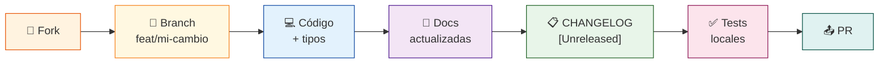

# 🤝 Guía de contribución

> **Cómo aportar a ChofyAI Studio: entorno, flujo y estándares.**

[](https://github.com/vladimiracunadev-create/chofyai-studio/pulls)
[](https://www.conventionalcommits.org/)

¡Gracias por tu interés en contribuir! Este documento explica cómo preparar el entorno, el flujo de trabajo esperado y cómo añadir soporte para una nueva herramienta.

---

## 📋 Requisitos previos

| Herramienta | Versión mínima | Notas |
|:---|:---:|:---|
| 🍎 macOS | `13 Ventura` | Apple Silicon requerido para uso real |
| 🛠️ Xcode CLT | reciente | `xcode-select --install` |
| 🦀 Rust + cargo | `1.76+` | Instalado vía `rustup` |
| 📦 Node.js | `22 LTS` | Recomendado: `nvm` |
| 📥 npm | `10+` | Incluido con Node.js |
| ⚡ Tauri CLI | `v2` | `cargo install tauri-cli` |

> [!NOTE]
> Los builds de `.app` / `.dmg` **requieren un Mac real**. El desarrollo del frontend puede hacerse en cualquier sistema con `npm run dev:web`.

---

## 🚀 Preparar el entorno de desarrollo

```bash
# 1️⃣ Clonar el repositorio
git clone https://github.com/vladimiracunadev-create/chofyai-studio.git
cd chofyai-studio

# 2️⃣ Verificar requisitos (solo macOS)
bash scripts/mac/bootstrap.sh

# 3️⃣ Instalar dependencias del frontend
npm install

# 4️⃣ Modo web (sin Rust, solo para UI)
npm run dev:web

# 5️⃣ App de escritorio completa (requiere macOS + Rust)
npm run tauri:dev
```

---

## 🔄 Flujo de trabajo



1. **🍴 Crea un fork** del repositorio y trabaja sobre una rama descriptiva:

   ```bash
   git checkout -b feat/nombre-de-tu-cambio
   ```

2. **💻 Escribe código limpio**: TypeScript tipado, Rust con manejo de errores explícito.
3. **📝 Actualiza la documentación** relevante en `docs/` si tu cambio afecta arquitectura, tools o scripts.
4. **📋 Actualiza `CHANGELOG.md`** en la sección `[Unreleased]` describiendo tu cambio.
5. **📤 Abre un Pull Request** con una descripción clara del problema y la solución.

---

## 🛠️ Añadir una nueva herramienta

ChofyAI Studio usa manifests YAML en `apps/` para declarar herramientas. El proceso completo:

### 1️⃣ Crear el manifest

Crea `apps/tu-herramienta.yaml` siguiendo la especificación en [`docs/MANIFEST_SPEC.md`](docs/MANIFEST_SPEC.md).

### 2️⃣ Crear el script de instalación

Crea `scripts/mac/install-tu-herramienta.sh` con:

- ✅ verificación de `studio_home`
- 📥 clonación o descarga de la herramienta
- 🐍 creación de entorno (`venv` o similar)
- 📋 registro del resultado en el log de la herramienta

### 3️⃣ Declarar el `installed_if`

Define en el manifest al menos una condición de instalación real (ruta de archivo o binario que debe existir).

### 4️⃣ Probar localmente

```bash
npm run tauri:dev
# Verificar que la tool aparece, el check de instalación funciona
# y los botones de instalar/iniciar responden correctamente
```

### 5️⃣ Documentar

Añade la herramienta a [`docs/TOOLS.md`](docs/TOOLS.md) con su rol, script, checks de instalación y observaciones relevantes.

---

## 📐 Convenciones

### 📝 Commits — Conventional Commits

```text
feat: añadir integración de Bark TTS
fix: corregir detección de puerto ocupado en whisper.cpp
docs: actualizar MANIFEST_SPEC con campo optional_port
chore: actualizar dependencias npm
```

### ⚛️ TypeScript

- ✅ Usa tipos explícitos; evita `any`.
- ✅ Los comandos Tauri deben estar tipados en `src/types.ts`.

### 📜 Scripts Bash

- ✅ Siempre checar `CHOFYAI_STUDIO_HOME` antes de operar (vía `common.sh::resolve_studio_home`).
- ✅ Redirigir stdout/stderr al log de la herramienta.
- ✅ Usar `set -euo pipefail` al inicio del script.
- ✅ Probar en disco externo no-APFS — los `._*` no deben aparecer en el árbol del repo.

---

## 🐛 Reportar bugs

Usa la plantilla en `.github/ISSUE_TEMPLATE/bug_report.md`. Incluye:

- 🍎 versión del OS y chip (M1/M2/M3/M4)
- 💻 comando exacto que falló
- 📋 contenido del log relevante (en `studio_home/logs/<tool_id>.log`)

---

## 💛 Código de conducta

Tratar a todos los colaboradores con respeto. Discusiones técnicas con argumentos, sin descalificaciones personales.
