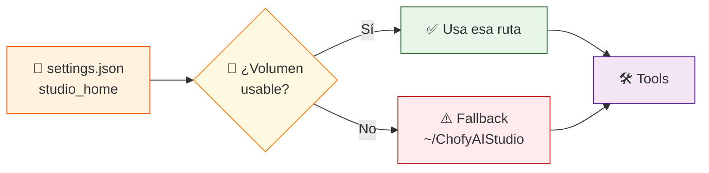

# 🚀 ChofyAI Studio · Quickstart

> **Arrancar el orquestador en 3 pasos.**

[](docs/INSTALL_MAC.md)
[](https://tauri.app)

---

## 0️⃣ Requisitos del sistema

```bash
brew install node@22 cmake ffmpeg git python@3.11 uv
xcode-select --install                                    # toolchain Apple
curl --proto '=https' --tlsv1.2 -sSf https://sh.rustup.rs | sh   # Rust
```

> [!TIP]
> **`uv` es opcional pero recomendado** — acelera 10-100× la instalación de herramientas Python (Qwen3-TTS, FaceFusion, AceForge, ComfyUI). Si no lo instalas, los scripts caen a `python -m venv` + `pip` clásico sin problema. **uv y pip coexisten — uno no anula al otro.**

---

## 1️⃣ Arrancar localhost (modo desarrollo)

```bash
cd chofyai-studio
npm install
npm run tauri:dev
```

Esto arranca **Vite** en `http://localhost:1420` + ventana **Tauri** con backend Rust.

> [!WARNING]
> `npm run dev:web` abre solo la UI sin backend Tauri. Los botones de instalar/iniciar/detener **no funcionan** en ese modo.

---

## 2️⃣ Configurar Studio Home

| Forma | Ventaja |
|:---|:---|
| 👋 **Onboarding wizard** (primer arranque) | 4 pasos guiados, detecta volumen externo y sugiere sparsebundle si exFAT |
| ⚙️ **Settings UI** (`⌘,` o sidebar) | Selector visual de volúmenes con espacio libre y permisos. Un clic basta. |
| 🖱️ **Selector de la UI** | Lista volúmenes con espacio libre y permisos. Un clic basta. |
| 📝 **Editar `storage/state/settings.json`** | Control total para entornos automatizados |
| 🤷 **No hacer nada** | Si tu path no es escribible, fallback automático a `~/ChofyAIStudio` |

> [!IMPORTANT]
> Si tu disco externo es **exFAT/HFS+/NTFS**, los wheels Python fallarán por archivos AppleDouble (`._*`). Crea una imagen APFS sparsebundle — receta en [`docs/INSTALL_MAC.md` § Disco externo no-APFS](docs/INSTALL_MAC.md#-disco-externo-no-apfs).

---

## ⌨️ Atajos clave

| Atajo | Acción |
|:---|:---|
| `⌘K` | Paleta de comandos (instalar/iniciar/parar/ver UI/logs/modelos) |
| `⌘,` | Settings |
| `⌘/` | Help · catálogo de atajos |
| `⌘R` | Refrescar tools y stats |
| `⌘L` | Logs del último tool tocado |
| `⌘B` | Toggle tema (dark/light/system) |
| `Esc` | Cerrar modal/panel actual |

---

## 💾 Disco externo + fallback al disco principal



ChofyAI elige `studio_home` en este orden:

1. **`studio_home`** declarado en `settings.json` (dev) o en `~/Library/Application Support/.../state/settings.json` (empaquetada).
2. Si la ruta apunta a un **volumen desmontado o sin permisos**, cae a `~/ChofyAIStudio`.
3. La barra inferior muestra `⚠ Usando fallback` cuando aplica.

---

## 📍 Zona de módulos / reubicación

Cada herramienta vive por defecto en `studio_home/tools/<id>`. La UI permite mover cada módulo:

| Operación | Comportamiento |
|:---|:---|
| 📍 **Mover** | Sugiere `studio_home/modules/<id>` o acepta cualquier ruta absoluta |
| 🔄 Mismo volumen | `rename` instantáneo |
| 🌉 Cross-device | Copia recursiva (incluye symlinks) + borrado |
| 💾 Persistencia | Guarda override en `settings.json → tool_overrides` |
| ↺ **Reset ruta** | Quita el override (no mueve archivos) |

---

## 📦 Generar el `.app` (ad-hoc, sin firma Apple)

```bash
npm run tauri:build:app
```

Resultado:

```text
/tmp/chofyai-target/release/bundle/macos/ChofyAI Studio.app
```

Para usarlo en este equipo:

```bash
cp -R "/tmp/chofyai-target/release/bundle/macos/ChofyAI Studio.app" /Applications/
# Primer arranque: click derecho → Abrir
```

---

## ⚠️ Notas sobre disco externo no-APFS

Volúmenes en exFAT/HFS+ generan archivos AppleDouble (`._*`) que rompen `cargo build`. El repo ya mitiga esto:

- **`.cargo/config.toml`** apunta `target-dir` a `/tmp/chofyai-target` (siempre APFS).
- **`bash scripts/mac/clean-appledouble.sh`** borra los `._*` del árbol de fuentes si reaparecen.

> [!TIP]
> Si quieres una experiencia 100% limpia, formatea un volumen externo a APFS o crea una imagen APFS dentro del externo con `bash scripts/mac/mount-apfs.sh`.

---

## ⚡ uv como acelerador de instalaciones Python

| Sin uv | Con uv |
|:---|:---|
| `python -m venv` (~5 s) | `uv venv` (~0.5 s) |
| `pip install torch` (~60 s) | `uv pip install torch` (~5-10 s) |
| Resolución secuencial | Resolución paralela + caché global |

`common.sh` provee helpers que detectan `uv` y lo usan; si no está, caen a pip clásico:

```bash
# Helpers disponibles en cualquier install-*.sh
create_pyenv "$ENV_DIR" "$PYTHON_BIN"            # uv venv O python -m venv
pip_install "$ENV_DIR" torch torchvision         # uv pip install O pip install
py_install_requirements "$ENV_DIR" requirements.txt
```

Para desactivar uv puntualmente (forzar pip):

```bash
export CHOFYAI_DISABLE_UV=1
bash scripts/mac/install-comfyui.sh
```

---

## 🦀 Comandos backend disponibles (Tauri IPC)

| Comando | Descripción |
|:---|:---|
| `get_system_summary` | Studio home solicitado vs. efectivo + flag fallback |
| `get_system_stats` | 📊 CPU/RAM/disco/uptime (barra inferior) |
| `list_volume_candidates` | 🔍 Volúmenes para el selector |
| `save_studio_home` | Cambia studio_home (sin mover archivos) |
| `list_tools` | Manifests + estado de instalación |
| `install_tool` | Ejecuta script con streaming de progreso |
| `update_tool` | Re-ejecuta el script (git pull interno) |
| `start_tool` / `stop_tool` / `restart_tool` | 🎛️ Control de procesos |
| `health_check_tool` | 💚 PID + puerto TCP |
| `relocate_module` | 📍 Mueve directorio + registra override |
| `clear_module_override` | ↺ Quita override (no mueve archivos) |
| `open_tool_directory` | 📁 Abre Finder en la carpeta del tool |
| `open_tool_log` | 📋 Abre log con app por defecto |

---

## 🧭 Siguientes pasos

| 📌 Quiero… | 📖 Leer |
|:---|:---|
| Ver qué herramientas hay y cómo funcionan | [`docs/TOOLS.md`](docs/TOOLS.md) |
| Instalar dependencias del sistema | [`docs/INSTALL_MAC.md`](docs/INSTALL_MAC.md) |
| Entender la arquitectura | [`docs/architecture.md`](docs/architecture.md) |
| Añadir una herramienta nueva | [`docs/MANIFEST_SPEC.md`](docs/MANIFEST_SPEC.md) |
| Resolver un error | [`docs/TROUBLESHOOTING.md`](docs/TROUBLESHOOTING.md) |
| Ver qué viene en Fase 5+ | [`ROADMAP.md`](ROADMAP.md) |
