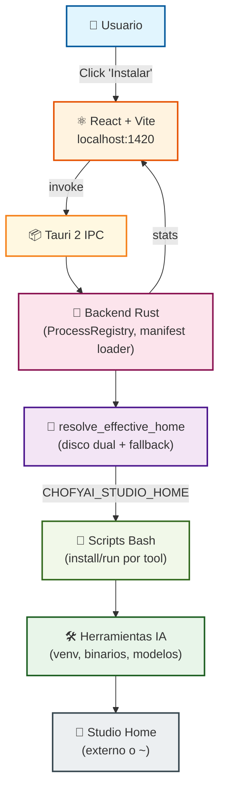
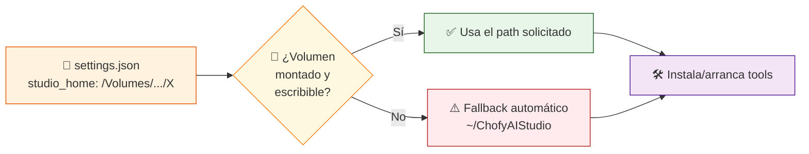

# 🎨 ChofyAI Studio

> **Launcher de escritorio local para macOS Apple Silicon — orquestador controlado de herramientas creativas de IA**

[](https://github.com/vladimiracunadev-create/chofyai-studio/actions/workflows/ci.yml)
[](LICENSE)
[](docs/INSTALL_MAC.md)
[](https://tauri.app)
[](https://www.rust-lang.org)
[](https://react.dev)
[](https://docs.astral.sh/uv/)
[](CHANGELOG.md)
[](docs/STATUS.md)
[](docs/STATUS.md)
[](docs/POSTMORTEM-2026-05-17.md)

> [!NOTE]
> ChofyAI Studio **no es** un launcher genérico al estilo Pinokio. Es un orquestador con un set acotado de herramientas creativas, instalación reproducible, control real de procesos y soporte dual de disco (externo + principal con fallback automático).

---

## 🎯 Qué resuelve

| Categoría | Herramienta | Estado | Puerto |
|:---:|:---|:---:|:---:|
| 🎤 **Voz / TTS** | [Qwen3-TTS](docs/TOOLS.md) | `✅ OPERATIVA` | `7860` |
| 🎙️ **ASR** | [whisper.cpp](docs/TOOLS.md) | `✅ OPERATIVA` | `8178` |
| 🎬 **Video / Cara** | [FaceFusion](docs/TOOLS.md) | `✅ OPERATIVA` | `7862` |
| 🎵 **Música** | [AceForge](docs/TOOLS.md) | `✅ OPERATIVA` | `5056` |
| 🖼️ **Imagen** | [ComfyUI](docs/TOOLS.md) | `✅ OPERATIVA` | `8188` |

> 5 herramientas integradas con scripts de instalación reproducibles, control de PID, health checks y reubicación a discos externos.

---

## 🏗️ Arquitectura



> Ver detalle por capas en [`docs/architecture.md`](docs/architecture.md) y decisiones de diseño en [`docs/decisions.md`](docs/decisions.md).

---

## ✨ Características clave

### 🛠 v0.5.1 (hardening de operatividad — 2026-05-17)

> Cierra 10 incidentes detectados al validar funcionalidad end-to-end. Marca
> el paso de release a **producto comercializable**: las 5 herramientas
> probadas con **inferencia real** (transcripción, generación de imagen,
> síntesis de voz, modelos ONNX cargados), no solo arranque HTTP.
> Ver [PORQUE-NO-FUNCIONABA](docs/PORQUE-NO-FUNCIONABA.md) (lenguaje claro)
> o [POSTMORTEM](docs/POSTMORTEM-2026-05-17.md) (detalle técnico).

| # | Mejora | Beneficio |
|:-:|:---|:---|
| 1 | 🧳 **Auto-mount del sparsebundle** | La app monta `ChofyAIStudio.sparsebundle` al arranque; nunca más "0/5 tools" por volumen desmontado |
| 2 | ✅ **Validación cruzada `installed_if`** | Pre-spawn y post-install: detecta instalaciones corruptas con mensaje claro |
| 3 | 🚪 **Pre-flight de puertos** | `start_tool` mata huérfanos antes del spawn — no más "el botón no hace nada tras un crash" |
| 4 | 🔧 **AceForge port 5056 → 7857** | Evita colisión con servicio `intecom-ps1` saturado por Chrome |
| 5 | 🧠 **ComfyUI symlinks correctos** | Los modelos descargados se ven en la UI a la primera (`input`/`output` singulares) |
| 6 | 🎬 **FaceFusion sin conda** | Install añade `--skip-conda` — funciona con venv/uv puro |
| 7 | 🧹 **CMakeCache cleanup** | whisper.cpp reinstala limpio aunque venga de una ruta vieja |
| 8 | 🪪 **UX sin localhost** | La cabecera del workspace ya no expone `http://127.0.0.1:PORT` al usuario final |

### 🎉 v0.5.0 (release)

| # | Pilar | Descripción |
|:-:|:---|:---|
| 1 | 👁 **Vista embebida** | "Ver UI" reemplaza la sección Herramientas con la UI de la tool seleccionada, manteniendo sidebar/topbar/statusbar — botón `← Herramientas` para volver |
| 2 | 📊 **Cola de instalación pro** | Parser de fases (Clonando · Compilando · Descargando · Instalando deps), barra animada %, MB/s, `⏱ MM:SS` y mini-terminal |
| 3 | ⌨️ **Atajos** | Paleta `⌘K` + 6 shortcuts globales (`⌘,` `⌘/` `⌘R` `⌘L` `⌘B` `⌘M` `⌘W`) + help panel completo |
| 4 | 🛒 **Marketplace MVP** | 10 tools curadas (Bark, RVC, MusicGen…) con import al manifest local |
| 5 | 🔗 **Workflows + Visual Builder** | YAML declarativo + drag & drop para componer pipelines |
| 6 | 🌐 **i18n ES/EN** | Hot-swap reactivo sin deps, ~85 keys |
| 7 | 🎨 **UI profesional** | Design tokens, tema dark/light/system, tarjetas con hover, sidebar agrupada con badges |
| 8 | 🛡 **Security workflow portable** | TruffleHog + npm/cargo audit + CodeQL + Dependabot, invocable vía `workflow_call` desde otros repos |
| 9 | 👻 **Procesos huérfanos** | Detección automática + adoptar/matar |
| 10 | 💥 **Crash log persistente** | ErrorBoundary escribe a `storage/state/crash.log` para post-mortem |
| 11 | 💾 **APFS sparsebundle** | Soporte oficial para discos externos exFAT/HFS+ |

### 🏗 Fase 4 (consolidada)

| # | Pilar | Descripción |
|:-:|:---|:---|
| 1 | 💾 **Disco dual** | `studio_home` solicitado vs. efectivo. Fallback automático a `~/ChofyAIStudio` si el volumen externo no está disponible |
| 2 | 🔍 **Selector de volúmenes** | Lista `~` y todos los `/Volumes/*` con espacio libre y permisos. Cambio con un clic |
| 3 | 📍 **Zona de módulos** | Reubica cualquier herramienta a una ruta absoluta arbitraria. Override persistente sin tocar manifests |
| 4 | 📊 **Stats en vivo** | Barra inferior con CPU, RAM, disco, App-uptime y load — refresco cada 3 s, sin dependencias extra |
| 5 | 🚀 **Instalación reproducible** | 5 scripts Bash con streaming de progreso por evento Tauri |
| 6 | ⏱️ **Cola secuencial** | Encola múltiples herramientas e instala una a una con barra de avance por ítem |
| 7 | 🛑 **Control de procesos** | Stop / Restart / Update con SIGTERM y `git pull` interno |
| 8 | 📦 **`.app` ad-hoc** | Build sin Apple Developer ID para uso personal — listo para distribución cuando consigas la firma |

---

## 🚀 Quickstart

### 0️⃣ Dependencias del sistema

```bash
brew install node@22 cmake ffmpeg python@3.10 python@3.11 uv git
xcode-select --install
curl --proto '=https' --tlsv1.2 -sSf https://sh.rustup.rs | sh
```

> Tabla completa de versiones verificadas en [`docs/INSTALL_MAC.md`](docs/INSTALL_MAC.md).

### 1️⃣ Clonar e instalar

```bash
git clone https://github.com/vladimiracunadev-create/chofyai-studio.git
cd chofyai-studio
npm install
```

### 2️⃣ Arrancar

```bash
npm run tauri:dev    # ✅ App escritorio completa (Rust activo, botones funcionales)
npm run dev:web      # 🌐 Solo UI en localhost:1420 (sin backend)
```

> Ver [`QUICKSTART.md`](QUICKSTART.md) para el flujo completo.

---

## 💾 Studio Home y resolución dual



Esquema completo de `storage/state/settings.json`:

```jsonc
{
  "studio_home": "/Volumes/ORICO/ChofyIA/ChofyAIStudio",
  "tool_overrides": {
    "comfyui": "/Volumes/Externo2/ComfyModels/source"
  },
  "fallback_home": null
}
```

> [!TIP]
> El `SystemSummary` expone `studio_home` (solicitado) + `studio_home_effective` + `using_fallback`. La barra inferior muestra `⚠ Usando fallback` cuando aplica.

---

## 📍 Zona de módulos / reubicación

Cada herramienta vive por defecto en `studio_home/tools/<id>`. La UI permite **moverla** a:

- **`studio_home/modules/<id>`** (sugerido al pulsar 📍 Mover).
- Cualquier otra ruta absoluta — útil para mover modelos pesados a otro volumen.

| Operación | Comportamiento |
|:---|:---|
| 🔄 Mismo volumen | `rename` instantáneo |
| 🌉 Cross-device | Copia recursiva (incluye symlinks) + borrado |
| 💾 Persistencia | `tool_overrides[<id>]` en `settings.json` |
| ↺ Reset | Quita el override (no mueve archivos) |

---

## 🧭 Por dónde empezar

| Perfil | Ruta recomendada | Qué encontrarás |
|:---|:---|:---|
| 🚀 **Quick start** | [`QUICKSTART.md`](QUICKSTART.md) | Arranque en 3 comandos |
| 🧭 **¿Qué falló y por qué?** | [`docs/PORQUE-NO-FUNCIONABA.md`](docs/PORQUE-NO-FUNCIONABA.md) | **Explicación en lenguaje claro** del hardening v0.5.1 (sin jerga) |
| 📑 **Postmortem técnico** | [`docs/POSTMORTEM-2026-05-17.md`](docs/POSTMORTEM-2026-05-17.md) | Los 10 incidentes con causa raíz y verificación |
| 🍎 **Instalación detallada** | [`docs/INSTALL_MAC.md`](docs/INSTALL_MAC.md) | Dependencias + workarounds disco externo |
| 🛠️ **Herramientas integradas** | [`docs/TOOLS.md`](docs/TOOLS.md) | Qué hace cada una y sus requisitos |
| 📋 **Estado real** | [`docs/STATUS.md`](docs/STATUS.md) | Qué funciona hoy y qué no |
| 🏗️ **Arquitectura** | [`docs/architecture.md`](docs/architecture.md) | Capas, IPC y decisiones |
| 📜 **Scripts** | [`docs/SCRIPTS_REFERENCE.md`](docs/SCRIPTS_REFERENCE.md) | Cada script paso a paso |
| 📐 **Manifest YAML** | [`docs/MANIFEST_SPEC.md`](docs/MANIFEST_SPEC.md) | Cómo declarar nuevas herramientas |
| 🩺 **Problemas comunes** | [`docs/TROUBLESHOOTING.md`](docs/TROUBLESHOOTING.md) | Errores y soluciones (18 entradas) |
| 📜 **Changelog** | [`CHANGELOG.md`](CHANGELOG.md) | Historial completo de versiones |
| 📦 **Empaquetado** | [`docs/packaging.md`](docs/packaging.md) | `.app` y `.dmg` |
| 🗺️ **Roadmap** | [`ROADMAP.md`](ROADMAP.md) | Qué viene en Fase 5+ |
| ☁️ **Migración a AWS** | [`docs/cloud/README.md`](docs/cloud/README.md) | Plan completo: arquitectura, servicios, costos y despliegue |
| 🛡️ **Workflow de seguridad** | [`docs/SECURITY_WORKFLOW.md`](docs/SECURITY_WORKFLOW.md) | TruffleHog + npm/cargo audit + CodeQL + Dependabot, portable a otros repos |
| ⌨️ **Atajos de teclado** | Sidebar `⌨️ Atajos` o `⌘/` | `⌘K` paleta, `⌘,` settings, `⌘R` refresh, `⌘L` logs, `⌘B` tema |

---

## 🧰 Stack técnico

| Capa | Tecnología | Versión |
|:---|:---|:---:|
| 🖥️ Desktop shell | Tauri | `2.11` |
| 🦀 Backend | Rust | `1.94+` |
| ⚛️ UI | React + TypeScript + Vite | `18` / `5` |
| 📜 Scripts | Bash + Python | `3.10/3.11` |
| ⚡ Python pkg mgr | uv (con fallback a pip) | `0.9+` |
| 📐 Manifests | YAML | — |

---

## 📂 Estructura del repositorio

```text
chofyai-studio/
├─ 📐 apps/                 # manifests YAML por herramienta
├─ 📚 docs/                 # documentación
├─ 🌐 public/               # assets estáticos
├─ 📜 scripts/mac/          # scripts operativos
├─ ⚛️ src/                  # frontend React/TS
├─ 🦀 src-tauri/            # backend Tauri/Rust
├─ 💾 storage/              # estado local + runtime
├─ ⚙️ .cargo/               # config target-dir → /tmp (workaround AppleDouble)
├─ 📋 package.json
└─ 📖 README.md
```

---

## 🛠️ Scripts útiles

```bash
bash scripts/mac/doctor.sh "/ruta/a/tu/studio_home"     # 🩺 Diagnóstico
bash scripts/mac/install-qwen3-tts.sh                   # 🎤 Instalar Qwen3-TTS
bash scripts/mac/install-whispercpp.sh                  # 🎙️ Instalar whisper.cpp
bash scripts/mac/install-facefusion.sh                  # 🎬 Instalar FaceFusion
bash scripts/mac/install-aceforge.sh                    # 🎵 Instalar AceForge
bash scripts/mac/install-comfyui.sh                     # 🖼️ Instalar ComfyUI
bash scripts/mac/cleanup-tool.sh "<studio_home>" "<id>" # 🧹 Limpiar herramienta
bash scripts/mac/clean-appledouble.sh                   # 🧼 Borrar ._* (volúmenes no-APFS)
```

---

## 📦 Empaquetado macOS

```bash
npm ci
npm run tauri:build:app   # Genera el .app
npm run tauri:build:dmg   # Genera el .dmg
npm run package:mac       # Pipeline completo
```

> [!IMPORTANT]
> El `target-dir` está redirigido a `/tmp/chofyai-target` por [`.cargo/config.toml`](.cargo/config.toml) para evitar archivos AppleDouble (`._*`) en volúmenes externos no-APFS que rompen la build de Tauri.

```text
/tmp/chofyai-target/release/bundle/macos/ChofyAI Studio.app
/tmp/chofyai-target/release/bundle/dmg/ChofyAI Studio_*.dmg
```

> Build ad-hoc (sin Apple Developer ID) funciona para uso personal en este equipo: click derecho → Abrir la primera vez. Para distribución pública ver [`docs/packaging.md`](docs/packaging.md).

---

## 🔄 CI / CD

| Workflow | Trigger | Función |
|:---|:---|:---|
| [`ci.yml`](.github/workflows/ci.yml) | push / PR a `main` | 🧹 Lint Markdown · 🔍 TypeScript typecheck · ✅ Validación YAML · 🔒 Secret scanning |
| [`release.yml`](.github/workflows/release.yml) | `workflow_dispatch` | 🏷️ Tag + GitHub Release con notas desde `CHANGELOG.md` |

---

## ☁️ Migración a la nube (AWS)

¿Quieres llevar ChofyAI Studio más allá de tu Mac? La carpeta [`docs/cloud/`](docs/cloud/README.md) contiene un plan completo para migrarlo a AWS:

| Documento | Contenido |
|:---|:---|
| 📘 [`AWS_MIGRATION.md`](docs/cloud/AWS_MIGRATION.md) | Visión global, fases y decisiones |
| 🏗️ [`AWS_ARCHITECTURE.md`](docs/cloud/AWS_ARCHITECTURE.md) | Arquitectura objetivo con diagramas |
| 🧰 [`AWS_SERVICES.md`](docs/cloud/AWS_SERVICES.md) | Mapa de servicios AWS y por qué |
| 💰 [`AWS_COSTS.md`](docs/cloud/AWS_COSTS.md) | Costos por escenario y palancas |
| 🔒 [`AWS_SECURITY.md`](docs/cloud/AWS_SECURITY.md) | IAM, redes, secretos, hardening |
| 🚀 [`AWS_STEP_BY_STEP.md`](docs/cloud/AWS_STEP_BY_STEP.md) | Despliegue hands-on con Terraform |

---

## 🤝 Contribuir

¿Añadir una herramienta, reportar un bug o proponer una mejora? Lee [`CONTRIBUTING.md`](CONTRIBUTING.md).

## 🛡️ Seguridad

- **Política de reporte**: [`SECURITY.md`](SECURITY.md) — disclosure responsable + alcance + tiempos de respuesta.
- **Workflow de seguridad CI**: [`docs/SECURITY_WORKFLOW.md`](docs/SECURITY_WORKFLOW.md) — TruffleHog + npm/cargo audit + CodeQL + Dependabot. Portable a otros repos vía `workflow_call`.
- **Auditoría local**:

  ```bash
  npm audit --omit=dev --audit-level=high
  cd src-tauri && cargo audit
  ```

## 📜 Licencia

[MIT](LICENSE) — Vladimir Acuña.
