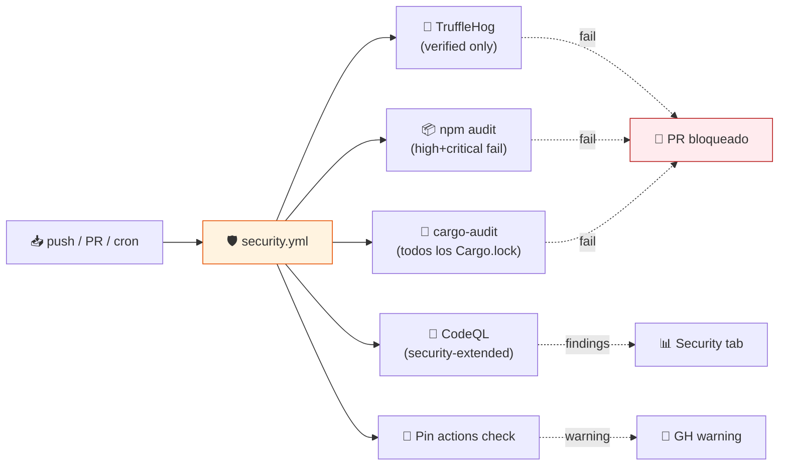

# 🛡️ Workflow de seguridad reutilizable

> **Plantilla portable que aplica el mismo estándar de seguridad a cualquier repositorio (incluyendo `trihorn-chat` y futuros proyectos).**

[](https://docs.github.com/en/code-security/code-scanning)
[](https://github.com/trufflesecurity/trufflehog)
[](#-cómo-portar-a-otros-repositorios)

---

## 🎯 Qué cubre



| Job | Frecuencia | Falla el PR si… |
|:---|:---:|:---|
| 🔐 **TruffleHog** secret scan | push + PR + cron lunes | encuentra credenciales **verificadas** |
| 📦 **npm audit** | push + PR (si hay `package-lock.json`) | hay vulnerabilidades `high` o `critical` |
| 🦀 **cargo audit** | push + PR (si hay `Cargo.lock`) | hay advisories activos en RustSec |
| 🔬 **CodeQL** JS/TS | push + PR (si hay `package.json`) | finding crítico en el código |
| 📌 **Pin actions check** | push + PR | (warning) si hay action no pinneada |

> [!IMPORTANT]
> El workflow **detecta automáticamente** qué corre vía `hashFiles(...)`. En un repo Python puro **no** ejecutará `npm audit` ni `cargo audit` — solo TruffleHog + CodeQL si aplica.

---

## 🚀 Cómo portar a otros repositorios

### Opción A — Copiar el archivo (rápido)

```bash
# Desde el repo destino (ej. trihorn-chat)
mkdir -p .github/workflows
curl -fsSL https://raw.githubusercontent.com/vladimiracunadev-create/chofyai-studio/main/.github/workflows/security.yml \
  -o .github/workflows/security.yml
git add .github/workflows/security.yml
git commit -m "ci(security): add reusable security workflow"
git push
```

Listo. La próxima vez que pushees a `main` o abras un PR, el workflow corre.

### Opción B — Reusable workflow (recomendado para varios repos)

Mejor opción si tienes 2+ repos: **publica el workflow una sola vez y referencia desde N repos** con `uses:`. Esto te permite actualizar la política de seguridad en un solo sitio y propagarla.

#### Paso 1: convertir `security.yml` en reusable

En este repo (`chofyai-studio`), añade `workflow_call:` al trigger:

```yaml
# .github/workflows/security.yml
on:
  push:
    branches: [main]
  pull_request:
    branches: [main]
  schedule:
    - cron: "0 6 * * 1"
  workflow_dispatch:
  workflow_call:    # ← habilita ser invocado por otros repos
```

#### Paso 2: invocarlo desde el repo cliente

En `trihorn-chat/.github/workflows/security.yml`:

```yaml
name: Security
on:
  push:
    branches: [main]
  pull_request:
    branches: [main]
  schedule:
    - cron: "0 6 * * 1"

jobs:
  security:
    uses: vladimiracunadev-create/chofyai-studio/.github/workflows/security.yml@main
    permissions:
      contents: read
      security-events: write
      actions: read
```

> [!TIP]
> Pinneando con `@<sha>` en lugar de `@main` consigues reproducibilidad total. La acción `actions/dependency-review-action` te avisa si alguien intenta despinearlo.

---

## 🔧 Configuración por repo

### Para `trihorn-chat` específicamente

Ese repo es probable que sea Node + algo de backend. Asegúrate de:

1. **Tener `package-lock.json` commiteado** (no solo `yarn.lock` ni `pnpm-lock.yaml`) o adapta el `if:` de `npm-audit` job.
2. **Habilitar CodeQL en Settings → Security**: si no, el job fallará con `Resource not accessible`.
3. **Permisos del token**: el repo necesita `Settings → Actions → General → Workflow permissions: Read and write permissions`.

### Si tu repo usa pnpm

Cambia el step de audit:

```yaml
- run: corepack enable && pnpm install --frozen-lockfile
- run: pnpm audit --prod --audit-level=high
```

### Si tu repo es Python (uv / poetry)

Reemplaza el job npm-audit con `pip-audit`:

```yaml
python-audit:
  runs-on: ubuntu-latest
  steps:
    - uses: actions/checkout@v4
    - uses: actions/setup-python@v5
      with: { python-version: "3.11" }
    - run: pip install pip-audit
    - run: pip-audit -r requirements.txt --strict
```

---

## ➕ Mejoras opcionales (por capas)

| Capa | Herramienta | Cuándo |
|:---|:---|:---|
| 🔐 SBOM | `anchore/sbom-action` | distribución pública |
| 🛡 Container scan | `aquasecurity/trivy-action` | si publicas imágenes Docker |
| 📋 SAST extra | `semgrep` con su acción oficial | reglas custom |
| 🚫 License check | `fossa-contrib/fossa-action` | compliance corporativo |
| 🧪 OSS Fuzz | `google/oss-fuzz-gen` | librerías expuestas |

---

## 🧰 Pre-commit hooks (local, complementario)

Para evitar pushes con secretos, instala:

```bash
brew install pre-commit detect-secrets
pre-commit install

# .pre-commit-config.yaml
cat > .pre-commit-config.yaml <<YAML
repos:
  - repo: https://github.com/Yelp/detect-secrets
    rev: v1.5.0
    hooks:
      - id: detect-secrets
        args: ["--baseline", ".secrets.baseline"]
  - repo: https://github.com/gitleaks/gitleaks
    rev: v8.21.0
    hooks:
      - id: gitleaks
YAML

detect-secrets scan > .secrets.baseline
git add .pre-commit-config.yaml .secrets.baseline
git commit -m "chore: pre-commit secret scanning"
```

---

## 📋 Checklist mínimo para un repo "secure-by-default"

- [ ] `security.yml` workflow activo
- [ ] CodeQL habilitado en Settings
- [ ] Branch protection en `main`: requiere checks de CI + security
- [ ] `Required reviewers` >= 1 en PRs
- [ ] `Dependabot` activo (`.github/dependabot.yml`)
- [ ] `SECURITY.md` con política de disclosure
- [ ] No hay secrets hardcoded (`grep -rE "AKIA|sk-[A-Za-z0-9]{20,}|github_pat_" .` debe estar limpio)
- [ ] `.gitignore` cubre `.env*`, `*.pem`, `secrets/`
- [ ] Pre-commit hooks instalados localmente (opcional pero recomendado)

---

## 🔗 Referencias

- [GitHub Code Scanning docs](https://docs.github.com/en/code-security/code-scanning)
- [CodeQL queries](https://github.com/github/codeql)
- [TruffleHog](https://github.com/trufflesecurity/trufflehog)
- [RustSec Advisory DB](https://rustsec.org/)
- [`SECURITY.md`](../SECURITY.md) — política específica de ChofyAI Studio
