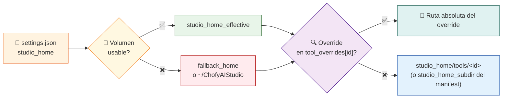
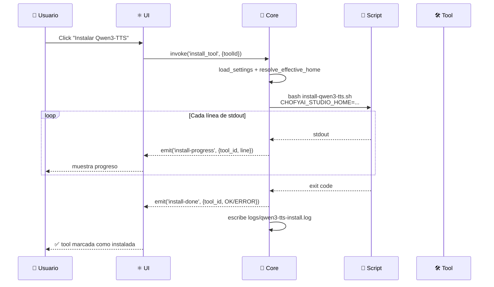

# 🏗️ Arquitectura

> **Capas, responsabilidades y flujos del orquestador (v0.5.0).**

[](https://tauri.app)
[](https://www.rust-lang.org)
[](https://react.dev)
[](../CHANGELOG.md)

---

## 🎯 1. Principio central

> **La app de escritorio _no_ debe ejecutar modelos dentro del proceso de UI.**

Sus responsabilidades:

- 🔍 Descubrir herramientas (lectura de manifests YAML)
- ✅ Validar instalación (`installed_if`)
- 📜 Orquestar scripts (bash con streaming de stdout)
- 🗺️ Centralizar rutas y logs (`studio_home` + `tool_overrides`)
- 🩺 Exponer diagnóstico (health checks + stats)

---

## 🧱 2. Capas

```mermaid
flowchart TD
    UI["⚛️ UI<br/>React + TS + Vite<br/>i18n ES/EN · ⌘K palette · modales"]
    Core["🦀 Core<br/>Tauri 2 + Rust<br/>30+ IPC commands"]
    Resolver["🧭 Resolver<br/>resolve_effective_home<br/>+ tool_overrides"]
    Registry["📋 ProcessRegistry<br/>Mutex + persistencia<br/>processes.json"]
    Scripts["📜 Scripts<br/>Bash por herramienta"]
    Tools["🛠️ Herramientas IA<br/>(venv · binarios · modelos)"]
    Storage["💾 Storage<br/>studio_home (sparsebundle APFS<br/>o SSD interno)"]
    Catalog["🛒 Catálogo<br/>marketplace/registry.yaml<br/>+ apps/*.yaml"]
    Workflows["🔗 Workflows<br/>workflows/*.yaml"]
    State["🧾 State<br/>storage/state/<br/>settings · processes · crash.log"]

    UI -->|invoke| Core
    UI -.iframe.->|http://127.0.0.1:port| Tools
    UI -.fetch.->|run workflow steps| Tools
    Core --> Resolver
    Core --> Registry
    Core -->|persist| State
    Core -->|read| Catalog
    Core -->|read/write| Workflows
    Core -->|spawn + stream stdout| Scripts
    Scripts -->|instala/arranca en| Storage
    Scripts -->|lanza proceso| Tools
    Tools -->|HTTP :puerto| UI
    Core -->|lee manifests + settings| Storage
    Core -->|stats: top/vm_stat/df| UI

    style UI fill:#fff3e0,stroke:#e65100,stroke-width:2px
    style Core fill:#fce4ec,stroke:#880e4f,stroke-width:2px
    style Resolver fill:#f3e5f5,stroke:#4a148c,stroke-width:2px
    style Registry fill:#e8eaf6,stroke:#1a237e,stroke-width:2px
    style Scripts fill:#f1f8e9,stroke:#33691e,stroke-width:2px
    style Tools fill:#e8f5e9,stroke:#1b5e20,stroke-width:2px
    style Storage fill:#eceff1,stroke:#37474f,stroke-width:2px
    style Catalog fill:#fff8e1,stroke:#f57f17,stroke-width:2px
    style Workflows fill:#e0f7fa,stroke:#006064,stroke-width:2px
    style State fill:#fff3e0,stroke:#e65100,stroke-width:2px
```

---

## 🧩 3. Componentes por capa

### ⚛️ UI (React + TypeScript)

#### Componentes nucleares

| Pieza | Responsabilidad |
|:---|:---|
| `App.tsx` | Estado global, listeners de eventos Tauri, atajos `⌘K`/`⌘,`/`⌘/`/`⌘R`/`⌘L`/`⌘B`/`⌘M`/`⌘W` |
| `StatusBar` | Barra inferior CPU/RAM/disco/uso-app/version, refresco 3 s, posicionada `left: 248px` |
| `HealthDot` | Indicador pulsante por tool con estado `starting` (60s tolerancia tras start) |
| `Toaster` | Toasts globales (info/success/warn/error) con auto-dismiss + helper `notify()` |
| `AppErrorBoundary` | Captura crashes React → toast + persiste a `crash.log` |
| `types.ts` | Contratos tipados con el backend, +`MarketplaceEntry`, `WorkflowDef`, `Toast`, `ModelEntry` |

#### Modales y paneles (cada uno reemplaza un card permanente del antiguo dashboard)

| Componente | Apertura | Función |
|:---|:---|:---|
| `Onboarding` | First-run o `👋 Tour` | Wizard 4 pasos con sparsebundle hint |
| `OverviewModal` | Sidebar `📋 Resumen` | App version, OS, studio_home, tools count, **stats con barras CPU/RAM/Disco** |
| `OrphansModal` | Sidebar `👻 Huérfanos` | Lista con `Adoptar`/`Matar` por proceso huérfano |
| `DoctorModal` | Sidebar `🩺 Doctor` | Ejecuta `scripts/mac/doctor.sh`, muestra output |
| `SettingsModal` | `⌘,` o sidebar `⚙️` | Selector de volúmenes (chips) + studio_home + overrides |
| `CommandPalette` | `⌘K` | Search de comandos por tool + acciones globales |
| `HelpPanel` | `⌘/` | Catálogo de atajos agrupados |
| `MarketplacePanel` | `⌘M` | Browse + import del registry curado |
| `WorkflowsPanel` | `⌘W` | Lista workflows + ejecutar/editar/borrar |
| `WorkflowBuilder` | `+ Nuevo workflow` | Editor visual con drag&drop de steps |
| `WorkflowRunner` | `▶` desde Workflows | Form dinámico de inputs + ejecución secuencial vía `fetch()` |
| `LogsViewer` | `📋` por tool | Panel inline con auto-refresh + filtro |
| `ModelsPanel` | `📦` por tool | Lista `<install_dir>/models` con borrado seguro |
| `PreInstallCheck` | Click `Instalar` | Modal con estimación + comparación con espacio libre |
| `UpdateChecker` | Mount | Banner si hay versión más nueva en GitHub Releases |

#### Vista embebida (workspace card)

Cuando `viewingTool != null`, la sección **Herramientas** se reemplaza por:

- Header tipo breadcrumb `← Herramientas / icon / nombre / url + acciones`
- `<iframe>` con la UI del tool ocupando el área principal (height `calc(100vh - 240px)`)
- Mantiene sidebar/topbar/statusbar del sistema visibles

#### i18n

| Pieza | Responsabilidad |
|:---|:---|
| `i18n.ts` | Type `Lang = 'es' \| 'en'`, dictionaries con ~85 keys, `t()`, hook `useT()`, persistencia `localStorage` |
| Listener pattern | Re-render reactivo al cambiar idioma sin recargar |

### 🦀 Core (Tauri 2 + Rust)

| Módulo | Responsabilidad |
|:---|:---|
| `lib.rs` | Builder Tauri + registro de comandos + `restore_registry` en setup |
| `system.rs` | 30+ comandos IPC, resolución de paths, ejecución de scripts, **persistencia PIDs** |
| `models.rs` | Structs serializables (`SystemSummary`, `ToolSummary` con `icon`, `SystemStats`, `OrphanPort`, `ModelEntry`, `MarketplaceEntry`) |
| `ProcessRegistry` | `Mutex<HashMap<id, pid>>` con persistencia a `processes.json` |

#### Comandos Tauri por dominio

| Dominio | Comandos |
|:---|:---|
| **Sistema** | `get_system_summary`, `get_system_stats`, `list_volume_candidates`, `save_studio_home`, `notify_macos`, `run_doctor` |
| **Tools** | `list_tools`, `install_tool`, `update_tool`, `start_tool`, `stop_tool`, `restart_tool`, `health_check_tool`, `open_tool_directory`, `open_tool_log` |
| **Estado** | `list_running_pids`, `read_tool_log`, `append_crash_log`, `read_crash_log` |
| **Modelos** | `list_tool_models`, `delete_tool_model` (con guarda anti-traversal) |
| **Huérfanos** | `list_orphan_ports`, `adopt_orphan`, `kill_orphan` |
| **Reubicación** | `relocate_module`, `clear_module_override` |
| **Marketplace** | `list_marketplace_tools`, `import_marketplace_tool` |
| **Workflows** | `list_workflows`, `save_workflow`, `delete_workflow` |

### 📜 Scripts (Bash)

| Script | Función |
|:---|:---|
| `common.sh` | `resolve_studio_home`, PATH Homebrew, helpers `create_pyenv` / `pip_install` con auto-detección uv ⚡ |
| `install-*.sh` | Clona/compila/configura cada herramienta |
| `doctor.sh` | Diagnóstico de entorno |
| `clean-appledouble.sh` | Limpia `._*` (volúmenes no-APFS) |

---

## 💾 4. Resolución de rutas



---

## 🔄 5. Flujo de instalación



---

## 🛒 6. Marketplace + Workflows (capas v0.5.0)

### Marketplace

```text
marketplace/
└─ registry.yaml      # 10 tools curadas — Bark, RVC, MusicGen…
```

| Comando Rust | Función |
|:---|:---|
| `list_marketplace_tools(app)` | Deserializa `registry.yaml` a `Vec<MarketplaceEntry>` |
| `import_marketplace_tool(id)` | Genera `apps/<id>.yaml` mínimo con notas/hint/repo embebidos como comentarios |

### Workflows

```text
workflows/
├─ transcribe-audio.yaml      # POST audio → whisper-server :8178
├─ comfyui-prompt.yaml        # POST workflow JSON → :8188
└─ audio-pipeline.yaml        # chain stub (audio → STT → LLM → TTS)
```

Schema:

```yaml
id: <id>
name: <display>
inputs:
  - { id, type: file|text, label, required, accept, default, placeholder }
steps:
  - id: <id>
    type: http|stub
    method: POST|GET
    url: http://127.0.0.1:<port>/...
    body_kind: multipart|json
    fields: { key: "{{inputs.X}}", ... }    # multipart
    body: |  { "...{{inputs.X}}..." }       # json
    output: { kind, from, label }
```

| Comando Rust | Función |
|:---|:---|
| `list_workflows(app)` | Lee `workflows/*.yaml` → `Vec<serde_json::Value>` |
| `save_workflow(id, yaml)` | Validación de id (`[a-zA-Z0-9_-]`) + parse YAML + escribe |
| `delete_workflow(id)` | Borra con guarda |

**Runner**: el frontend ejecuta los steps secuencialmente vía `fetch()` (no Rust HTTP client). Sustitución `{{inputs.X}}` en URL/fields/body. `__FILE__:<id>` para archivos en multipart.

---

## 🧾 7. Estado persistido en `storage/state/`

| Archivo | Contenido | Escritor |
|:---|:---|:---|
| `settings.json` | `studio_home`, `tool_overrides`, `fallback_home` | `save_studio_home`, `relocate_module`, `clear_module_override` |
| `processes.json` | `HashMap<tool_id, pid>` | `start_tool`/`stop_tool`/`restart_tool`/health-fail |
| `crash.log` | Append-only con timestamp Unix de errores UI | `AppErrorBoundary` vía `append_crash_log` |

**Restore al startup** (en `lib.rs::setup`): `restore_registry()` lee `processes.json` → filtra PIDs con `kill -0` → adopta los que siguen vivos. La UI muestra un toast "Procesos restaurados".

---

## 💾 8. Sparsebundle APFS sobre exFAT

**Problema**: discos externos formateados exFAT/HFS+ generan archivos `._*` (AppleDouble) que rompen la extracción de wheels Python (`numba`, `sympy`, `antlr4-python3-runtime`).

**Solución oficial**: imagen elástica APFS sparsebundle dentro del exFAT.

```bash
hdiutil create -size 100g -fs APFS -volname ChofyAIStudio \
  -type SPARSEBUNDLE /Volumes/Externo/ChofyAIStudio.sparsebundle
hdiutil attach /Volumes/Externo/ChofyAIStudio.sparsebundle \
  -mountpoint /Volumes/ChofyAIStudio -nobrowse
```

Resultado: `/Volumes/ChofyAIStudio` aparece como APFS nativo, los wheels funcionan, los datos físicamente viven en el disco externo.

Documentado en [`INSTALL_MAC.md` § Disco externo no-APFS](INSTALL_MAC.md#-disco-externo-no-apfs) y referenciado en `Onboarding` paso 1.

---

## 🛡 9. Seguridad y CI

| Workflow | Función |
|:---|:---|
| `.github/workflows/ci.yml` | Lint MD, typecheck TS, vitest, cargo test, validación YAML manifests |
| `.github/workflows/security.yml` | TruffleHog + npm audit + cargo audit + CodeQL + Pin actions check, **invocable por otros repos vía `workflow_call`** |
| `.github/workflows/release.yml` | Tag + GitHub Release con notas de CHANGELOG |
| `.github/dependabot.yml` | PRs semanales agrupados (npm, cargo, github-actions) |

Ver [`SECURITY_WORKFLOW.md`](SECURITY_WORKFLOW.md) para portar a otros repos.

---

## 📐 10. Reglas de diseño

- 💾 `studio_home` debe vivir en SSD interno o APFS (workaround disponible para no-APFS).
- 🏝️ Cada herramienta usa su propio subdirectorio.
- ✅ Estado **instalado** = condición explícita del manifest (`installed_if`).
- 🚫 Nunca confiar solo en un mensaje visual genérico.
- 📋 Cada herramienta debe tener al menos `install_script` y `installed_if` claros.

---

## 📐 11. Estado mínimo por manifest

```yaml
id: nombre-tool
name: Display Name
category: voice|asr|video|image|music|system
runtime: python|binary|node|mlx|mixed
install_script: scripts/mac/install-X.sh
run:
  command: "...comando para arrancar..."
installed_if:
  - rutas/relativas/que/deben/existir
default_port: 8888  # si aplica
```

> Ver detalle completo en [`MANIFEST_SPEC.md`](MANIFEST_SPEC.md).

---

## 🔮 12. Dirección futura

| Eje | De | A |
|:---|:---|:---|
| Procesos | `kill -TERM` directo | Supervisión + autorestart |
| Health | TCP port + PID | HTTP probe + métricas |
| Sidecars | bash | Tauri sidecars binarios |
| Empaquetado | Ad-hoc | Apple Developer ID + notarización |
| Catálogo | `marketplace/registry.yaml` local | Endpoint remoto + repo community-tools |
| Workflows | Frontend `fetch()` orchestrator | Backend orchestrator + step-result events |
| Workflow runner | Steps HTTP + stub | Steps con LLM, scripts arbitrarios, sandboxing |
| i18n | ES + EN hardcoded | Catálogo extensible + fallback dinámico |

> Ver [`../ROADMAP.md`](../ROADMAP.md) y [`decisions.md`](decisions.md).
