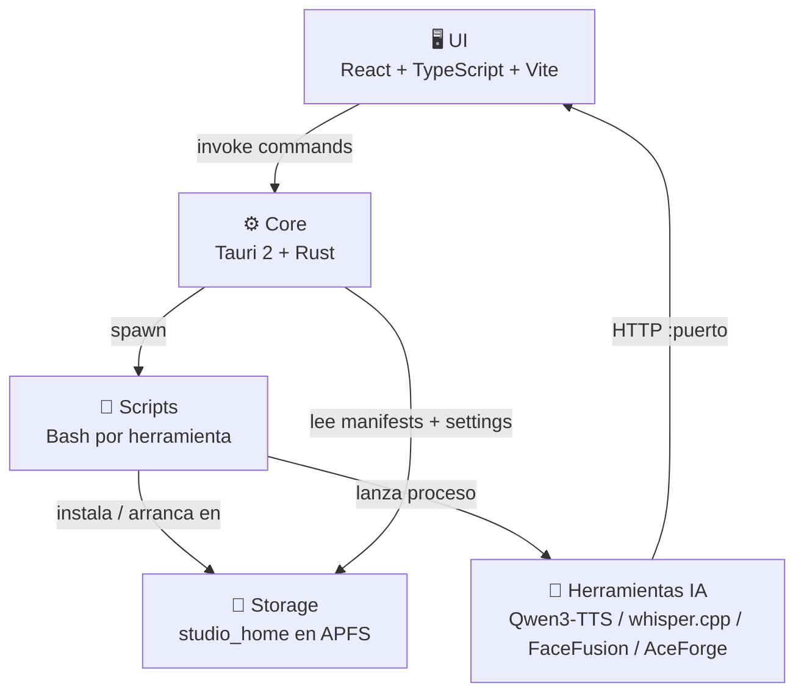

# Arquitectura propuesta

## 1. Principio central

La app de escritorio **no debe ejecutar modelos dentro del proceso de UI**.
Su responsabilidad es:

- descubrir herramientas
- validar instalación
- orquestar scripts
- centralizar rutas y logs
- exponer diagnóstico básico

## 2. Capas

### UI

- React + TypeScript
- Dashboard y panel básico de herramientas

### Core

- Tauri 2
- comandos Rust para settings, manifests y acciones de sistema

### Integraciones

- scripts Bash por herramienta
- `venv` o binarios externos cuando aplica
- rutas controladas dentro de `studio_home`

## 3. Reglas

- `studio_home` debe vivir en SSD interno o APFS.
- Cada herramienta usa su propio subdirectorio.
- Estado instalado = condición explícita del manifest.
- Nunca confiar solo en un mensaje visual genérico.
- Cada herramienta debe tener al menos script de instalación y criterio claro de instalado.

## 4. Estado mínimo por herramienta

- `id`
- `name`
- `category`
- `runtime`
- `install_script`
- `run.command`
- `installed_if`
- `default_port` si aplica

## 5. Dirección futura

La evolución natural del proyecto es pasar de scripts básicos a:
- control de procesos
- health checks
- sidecars más robustos
- empaquetado profesional
