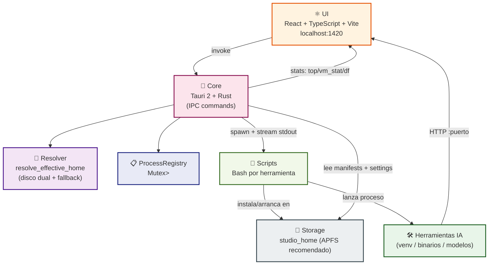
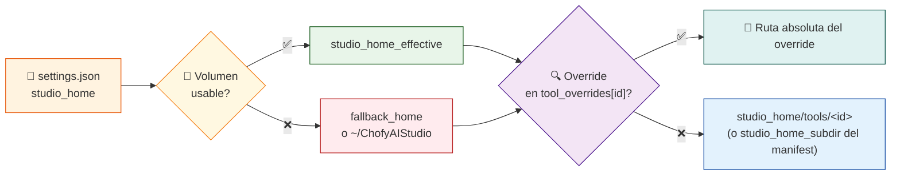
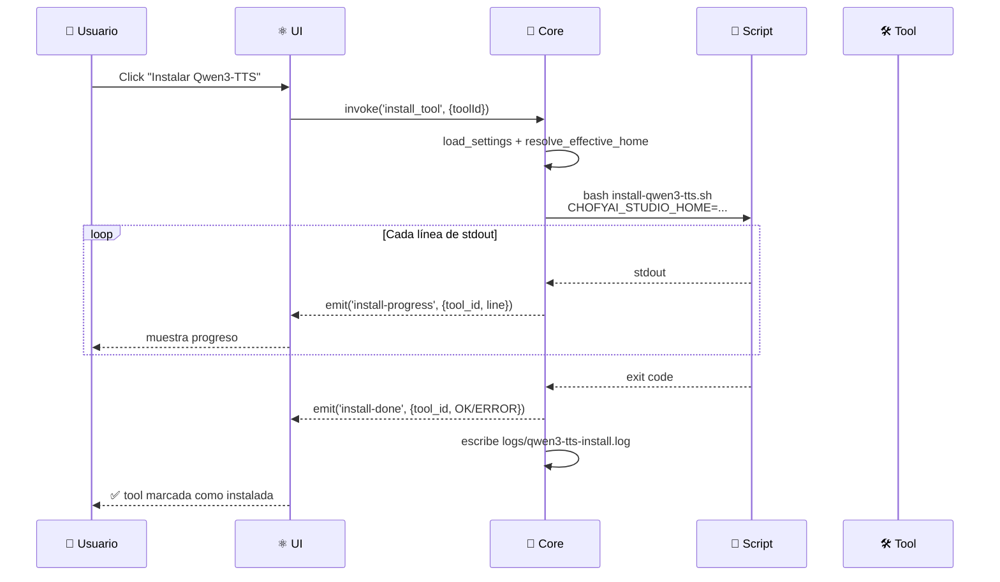

# 🏗️ Arquitectura

> **Capas, responsabilidades y flujos del orquestador.**

[](https://tauri.app)
[](https://www.rust-lang.org)
[](https://react.dev)

---

## 🎯 1. Principio central

> **La app de escritorio _no_ debe ejecutar modelos dentro del proceso de UI.**

Sus responsabilidades:

- 🔍 Descubrir herramientas (lectura de manifests YAML)
- ✅ Validar instalación (`installed_if`)
- 📜 Orquestar scripts (bash con streaming de stdout)
- 🗺️ Centralizar rutas y logs (`studio_home` + `tool_overrides`)
- 🩺 Exponer diagnóstico (health checks + stats)

---

## 🧱 2. Capas



---

## 🧩 3. Componentes por capa

### ⚛️ UI (React + TypeScript)

| Pieza | Responsabilidad |
|:---|:---|
| `App.tsx` | Estado global, listeners de eventos Tauri |
| `StatusBar` | Barra inferior con CPU/RAM/disco, refresco 3 s |
| `VolumePicker` | Selector de volúmenes con espacio libre |
| `HealthDot` | Indicador pulsante por tool |
| `types.ts` | Contratos tipados con el backend |

### 🦀 Core (Tauri 2 + Rust)

| Módulo | Responsabilidad |
|:---|:---|
| `lib.rs` | Builder Tauri + registro de comandos |
| `system.rs` | Comandos IPC, resolución de paths, ejecución de scripts |
| `models.rs` | Structs serializables (`SystemSummary`, `ToolSummary`, `SystemStats`, …) |
| `ProcessRegistry` | `Mutex<HashMap<id, pid>>` para tracking de procesos |

### 📜 Scripts (Bash)

| Script | Función |
|:---|:---|
| `common.sh` | `resolve_studio_home`, PATH para Homebrew |
| `install-*.sh` | Clona/compila/configura cada herramienta |
| `doctor.sh` | Diagnóstico de entorno |
| `clean-appledouble.sh` | Limpia `._*` (volúmenes no-APFS) |

---

## 💾 4. Resolución de rutas



---

## 🔄 5. Flujo de instalación



---

## 📐 6. Reglas de diseño

- 💾 `studio_home` debe vivir en SSD interno o APFS (workaround disponible para no-APFS).
- 🏝️ Cada herramienta usa su propio subdirectorio.
- ✅ Estado **instalado** = condición explícita del manifest (`installed_if`).
- 🚫 Nunca confiar solo en un mensaje visual genérico.
- 📋 Cada herramienta debe tener al menos `install_script` y `installed_if` claros.

---

## 📐 7. Estado mínimo por manifest

```yaml
id: nombre-tool
name: Display Name
category: voice|asr|video|image|music|system
runtime: python|binary|node|mlx|mixed
install_script: scripts/mac/install-X.sh
run:
  command: "...comando para arrancar..."
installed_if:
  - rutas/relativas/que/deben/existir
default_port: 8888  # si aplica
```

> Ver detalle completo en [`MANIFEST_SPEC.md`](MANIFEST_SPEC.md).

---

## 🔮 8. Dirección futura

| Eje | De | A |
|:---|:---|:---|
| Procesos | `kill -TERM` directo | Supervisión + autorestart |
| Health | TCP port + PID | HTTP probe + métricas |
| Sidecars | bash | Tauri sidecars binarios |
| Empaquetado | Ad-hoc | Apple Developer ID + notarización |
| Catálogo | 5 tools | Plugins externos por manifest |

> Ver [`../ROADMAP.md`](../ROADMAP.md) y [`decisions.md`](decisions.md).
