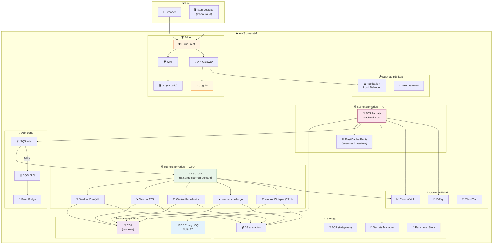
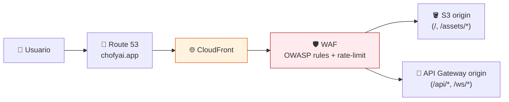
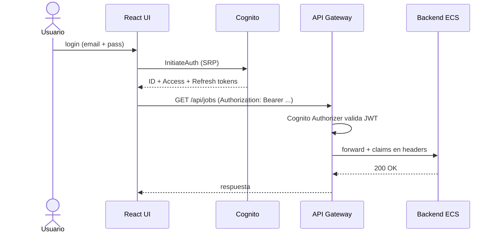
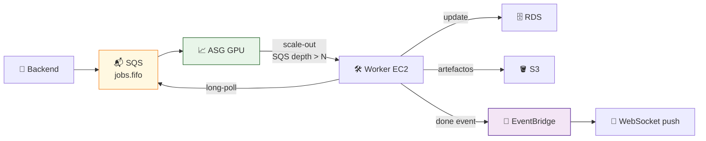
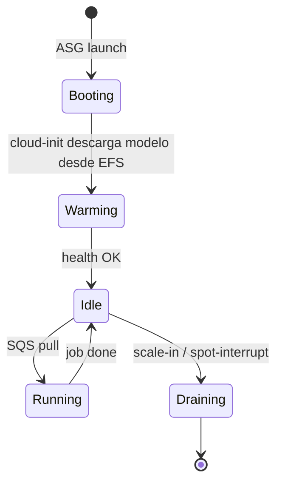
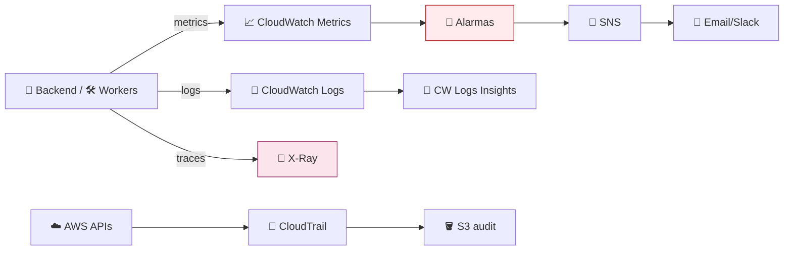

# 🏗️ Arquitectura Objetivo en AWS

> **Diseño detallado del sistema multi-tenant en AWS, capa por capa.**

---

## 🧭 1. Vista panorámica

---

## 🌐 2. Capa de red (VPC)

| Recurso | Detalle |
|:---|:---|
| **VPC** | `10.0.0.0/16` |
| **AZs** | 3 zonas (`us-east-1a/b/c`) |
| **Subnets públicas** | `10.0.0.0/24`, `10.0.1.0/24`, `10.0.2.0/24` |
| **Subnets privadas APP** | `10.0.10.0/24`, `10.0.11.0/24`, `10.0.12.0/24` |
| **Subnets privadas DATA** | `10.0.20.0/24`, `10.0.21.0/24`, `10.0.22.0/24` |
| **Subnets privadas GPU** | `10.0.30.0/24`, `10.0.31.0/24`, `10.0.32.0/24` |
| **NAT Gateway** | 1 por AZ (HA) o 1 único en dev |
| **VPC Endpoints** | S3 (Gateway) + ECR + Secrets Manager + CloudWatch (Interface) |

> [!TIP]
> Los **VPC endpoints** evitan cobros de NAT para tráfico hacia S3/ECR. En cargas con modelos grandes, ahorran ~30 % en transferencia.

---

## 🌍 3. Capa edge

| Componente | Configuración clave |
|:---|:---|
| **Route 53** | Hosted zone para dominio propio + alias a CloudFront |
| **CloudFront** | OAC para S3, cache TTL 1 año en `/assets/*`, 0 s en `/api/*` |
| **WAF** | Reglas managed: Core, Known Bad Inputs, IP reputation, Rate-limit 1000 req/5min |
| **ACM** | Certificado SSL gratuito en `us-east-1` (requisito de CloudFront) |

---

## 🔐 4. Capa de identidad

| Aspecto | Implementación |
|:---|:---|
| **User Pool** | Cognito con MFA opcional (TOTP) |
| **Grupos** | `admin`, `creator`, `viewer` |
| **Federación** | Google + GitHub OAuth (opcional) |
| **Tokens** | JWT de 1 h, refresh 30 días |

---

## 🦀 5. Capa de aplicación (backend)

### 5.1 Servicio ECS Fargate

| Setting | Valor |
|:---|:---|
| **Imagen** | Multi-stage Rust 1.94 → distroless (~25 MB) |
| **CPU/RAM** | 0.5 vCPU / 1 GB (mínimo); autoscale a 4 vCPU / 8 GB |
| **Réplicas** | min 2 (HA), max 10 |
| **Health check** | `GET /healthz` cada 15 s |
| **Deploy** | Rolling 50 % min healthy, circuit breaker activado |

### 5.2 API expuesta

| Endpoint | Método | Descripción |
|:---|:---:|:---|
| `/api/tools` | `GET` | Listar herramientas y estados |
| `/api/jobs` | `POST` | Encolar job (`{ tool, params }`) |
| `/api/jobs/:id` | `GET` | Estado y resultado |
| `/api/jobs/:id/logs` | `GET` | Stream logs CloudWatch |
| `/ws/jobs/:id` | `WS` | Push de progreso en tiempo real |
| `/api/storage/upload` | `POST` | Presigned URL S3 |

---

## 🧠 6. Capa de inferencia (workers GPU)

### 6.1 Patrón de despacho

### 6.2 Estrategia de instancias

| Tipo | Uso | Costo relativo |
|:---|:---|:---:|
| `g6.xlarge` On-Demand | Sesiones interactivas, prioridad alta | 1.0× |
| `g6.xlarge` Spot | Batch tolerante a interrupción | 0.35× |
| `g6.2xlarge` On-Demand | Modelos > 16 GB VRAM | 1.8× |
| `c7i.2xlarge` | Whisper.cpp (CPU) | 0.15× |

### 6.3 Ciclo de vida de un worker

---

## 💾 7. Capa de datos

| Servicio | Uso | Configuración |
|:---|:---|:---|
| **RDS PostgreSQL 16** | Estado: usuarios, jobs, settings, audit | `db.t4g.small` Multi-AZ, 20 GB gp3, snapshots 7 días |
| **ElastiCache Redis 7** | Sesiones, rate-limit, locks | `cache.t4g.micro`, sin réplica en dev |
| **EFS** | Modelos compartidos read-mostly (10–200 GB) | Elastic Throughput, lifecycle IA a 30 días |
| **S3 — UI** | Build estático del frontend | versionado, OAC, cache headers |
| **S3 — artefactos** | Inputs/outputs de jobs | lifecycle: Standard → IA (30d) → Glacier (180d) |
| **DynamoDB** *(opcional)* | Tabla `sessions_ws` con TTL | on-demand |
| **Secrets Manager** | DB pass, JWT signing, OAuth | rotación cada 90 días |
| **Parameter Store** | Config no sensible | tipo `String`/`StringList` |

---

## 📊 8. Disponibilidad y resiliencia

| Componente | Estrategia |
|:---|:---|
| ALB / API Gateway | Multi-AZ por defecto |
| ECS Fargate | min 2 réplicas en 2 AZ |
| RDS | Multi-AZ (failover ~60 s) |
| EFS | Regional (3 AZ) |
| Workers GPU | ASG cross-AZ + Spot diversificado |
| Backups | RDS snapshots + S3 versioning + AMI workers |
| DR | Snapshot cross-region semanal a `us-west-2` |

> SLA objetivo: **99.5 %** mensual (~3.6 h de caída/mes). Para 99.9 % se necesitan workers warm-pool y Aurora multi-region.

---

## 🔬 9. Observabilidad

| KPI | Umbral | Acción |
|:---|:---:|:---|
| `5xx_rate` backend | > 1 % en 5 min | PagerDuty + autoscale |
| `sqs_oldest_message_age` | > 300 s | scale-out workers |
| `gpu_utilization` | < 10 % por 15 min | scale-in |
| `rds_cpu` | > 80 % por 10 min | aviso, considerar upsize |
| `cost_anomaly` | desviación > 30 % | aviso a finanzas |

---

## 🔗 10. Siguientes lecturas

- [`AWS_SERVICES.md`](AWS_SERVICES.md) — qué hace cada servicio AWS aquí dibujado
- [`AWS_COSTS.md`](AWS_COSTS.md) — cuánto cuesta esta arquitectura
- [`AWS_STEP_BY_STEP.md`](AWS_STEP_BY_STEP.md) — desplegarla con Terraform
