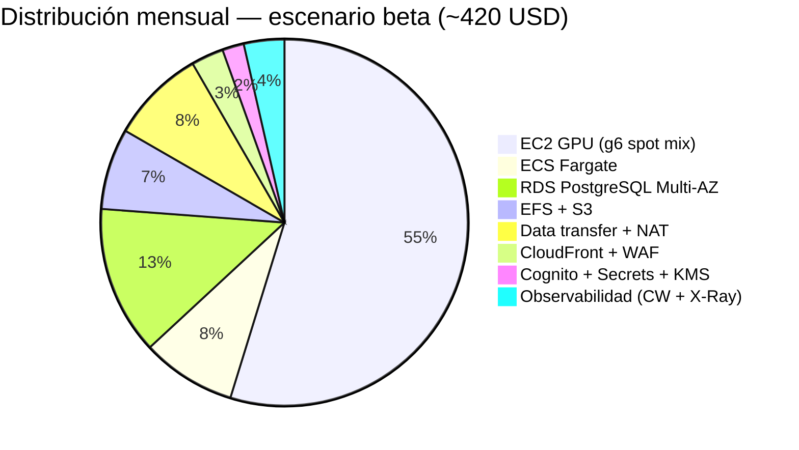
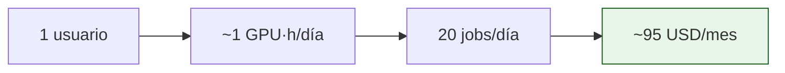

# 💰 Análisis de Costos en AWS

> **Modelos económicos, escenarios concretos y palancas de optimización para correr ChofyAI Studio en AWS.**

[](https://aws.amazon.com)
[](https://calculator.aws/)
[](https://aws.amazon.com/ec2/pricing/on-demand/)

> [!WARNING]
> Los precios mostrados son **estimaciones** referenciales en USD para `us-east-1`, válidas a 2026-Q1. Verifica siempre con [AWS Pricing Calculator](https://calculator.aws/) antes de comprometer presupuesto.

---

## 📊 1. Resumen ejecutivo

| Escenario | Usuarios activos | Jobs/día | GPU·h/día | Costo mensual |
|:---|:---:|:---:|:---:|:---:|
| 🟢 **Dev / Solo founder** | 1 | < 20 | 1 | **~95 USD** |
| 🟡 **Beta cerrada** | 10 | 200 | 6 | **~420 USD** |
| 🟠 **Producción pequeña** | 100 | 2 000 | 30 | **~1 850 USD** |
| 🔴 **Producción media** | 1 000 | 20 000 | 200 | **~9 400 USD** |

> El **driver dominante de costo** es siempre la GPU. Sin uso real, el piso fijo es ~50–60 USD/mes.

---

## 💸 2. Costo por servicio (escenario beta)



| # | Servicio | Configuración | USD/mes |
|:-:|:---|:---|:---:|
| 1 | EC2 `g6.xlarge` (mix Spot 70 % / OD 30 %) | 6 GPU·h/día × 30 | 230 |
| 2 | ECS Fargate (2× 0.5 vCPU / 1 GB siempre on) | 730 h | 35 |
| 3 | RDS `db.t4g.small` Multi-AZ + 20 GB gp3 | always-on | 55 |
| 4 | EFS Elastic (50 GB modelos) + S3 (100 GB) | mixto | 30 |
| 5 | NAT Gateway + transferencia salida | 1 NAT, ~50 GB egress | 35 |
| 6 | CloudFront 200 GB + WAF reglas managed | — | 12 |
| 7 | Cognito (10 MAU) + Secrets (5) + KMS (2 CMK) | — | 8 |
| 8 | CloudWatch Logs (10 GB) + Metrics + X-Ray | — | 15 |
|   | **Total** | | **~420** |

---

## 🧮 3. Detalle por servicio

### 3.1 EC2 GPU — el peso pesado

| Tipo | vCPU | GPU | RAM | USD/h On-Demand | USD/h Spot (típico) |
|:---|:---:|:---:|:---:|:---:|:---:|
| `g6.xlarge` | 4 | L4 24 GB | 16 GB | 0.805 | 0.30–0.40 |
| `g6.2xlarge` | 8 | L4 24 GB | 32 GB | 0.978 | 0.40–0.55 |
| `g6.4xlarge` | 16 | L4 24 GB | 64 GB | 1.323 | 0.55–0.75 |
| `g5.xlarge` (A10G) | 4 | A10G 24 GB | 16 GB | 1.006 | 0.40–0.55 |

> **Regla práctica**: cada hora real de inferencia GPU cuesta entre **0.30 USD (spot)** y **0.81 USD (on-demand)**. Saber cuántos minutos de GPU consume un job es clave para fijar precio al usuario.

### 3.2 Fargate

```text
costo = (vCPU·h × 0.04048) + (GB_RAM·h × 0.004445)
```

| Config | USD/h |
|:---|:---:|
| 0.25 vCPU + 0.5 GB | ~0.012 |
| 0.5 vCPU + 1 GB | ~0.024 |
| 1 vCPU + 2 GB | ~0.049 |
| 2 vCPU + 4 GB | ~0.098 |

### 3.3 RDS PostgreSQL

| Instancia | Single-AZ | Multi-AZ |
|:---|:---:|:---:|
| `db.t4g.micro` | ~13 USD/mes | ~26 |
| `db.t4g.small` | ~26 | ~52 |
| `db.t4g.medium` | ~53 | ~106 |
| `db.m7g.large` | ~120 | ~240 |

> Storage gp3: 0.115 USD/GB·mes. Backups gratis hasta el tamaño del cluster.

### 3.4 S3

| Clase | USD/GB·mes | Uso recomendado |
|:---|:---:|:---|
| Standard | 0.023 | activo (< 30 d) |
| Standard-IA | 0.0125 | acceso ocasional |
| Glacier IR | 0.004 | archivado consultable |
| Glacier Deep | 0.00099 | archivo legal |

> Lifecycle automático: artefactos a IA en 30 d → Glacier en 180 d ahorra > 80 % en blobs viejos.

### 3.5 EFS

| Clase | USD/GB·mes |
|:---|:---:|
| Standard | 0.30 |
| IA | 0.025 |
| Elastic Throughput (extra) | ~0.06/GB transferido |

### 3.6 CloudFront

| Concepto | USD |
|:---|:---:|
| Primeros 10 TB salida (NA/EU) | 0.085/GB |
| Requests HTTPS | 0.012/10 000 |

> **Ahorro clave**: cachear `/assets/*` con TTL alto baja > 90 % los hits al origen S3.

### 3.7 Data transfer y NAT — el "asesino silencioso"

| Concepto | USD |
|:---|:---:|
| NAT Gateway (por NAT) | 0.045/h ≈ 33/mes |
| Datos via NAT | 0.045/GB |
| Salida AWS → Internet (primer TB) | 0.09/GB |
| Inter-AZ | 0.01/GB |

> [!TIP]
> Los **VPC Endpoints** para S3 y ECR eliminan el costo de NAT en el tráfico de modelos e imágenes. **Habilitarlos desde día 1**.

---

## 🎯 4. Escenarios paso a paso

### 4.1 Solo founder (escenario 🟢)



| Concepto | USD/mes |
|:---|:---:|
| EC2 `g6.xlarge` Spot 1 h/día | ~10 |
| Fargate (1 réplica 0.25 vCPU) | ~10 |
| RDS `t4g.micro` single-AZ | ~13 |
| EFS 20 GB Standard | ~6 |
| S3 50 GB + CloudFront 50 GB | ~10 |
| NAT (1) | ~33 |
| Logs + Cognito + otros | ~13 |
| **Total** | **~95** |

### 4.2 Producción pequeña (🟠)

| Concepto | USD/mes |
|:---|:---:|
| EC2 GPU (mix spot, 30 GPU·h/día) | ~1 100 |
| Fargate (4 réplicas medianas) | ~110 |
| RDS `m7g.large` Multi-AZ + 100 GB | ~280 |
| EFS 200 GB | ~60 |
| S3 1 TB + lifecycle | ~25 |
| CloudFront 2 TB | ~170 |
| NAT (3 AZ) + transfer | ~100 |
| Observabilidad | ~50 |
| Otros | ~55 |
| **Total** | **~1 850** |

---

## 🪛 5. Palancas de optimización

| # | Palanca | Ahorro estimado | Esfuerzo |
|:-:|:---|:---:|:---:|
| 1 | **Spot diversificado** para workers GPU | 50–65 % en GPU | 🟢 bajo |
| 2 | **VPC Endpoints** S3/ECR/Secrets | 100 % NAT en ese tráfico | 🟢 bajo |
| 3 | **Lifecycle S3** Standard → IA → Glacier | 80 % en artefactos viejos | 🟢 bajo |
| 4 | **EFS IA tier** automático | 90 % en modelos fríos | 🟢 bajo |
| 5 | **Reserved Instances** RDS 1 año | 30–40 % | 🟡 medio (compromiso) |
| 6 | **Savings Plans Compute** Fargate + Lambda | 20–30 % | 🟡 medio |
| 7 | **Warm pools** ASG + cold-start tuning | mejora UX más que costo | 🟡 medio |
| 8 | **Graviton** (`t4g`, `m7g`, `c7g`) donde aplique | 15–20 % vs x86 | 🟢 bajo |
| 9 | **CloudFront cache** agresivo en `/assets` | 90 % hits cache | 🟢 bajo |
| 10 | **Cost Anomaly Detection** + Budgets con SNS | preventivo | 🟢 bajo |

---

## 🚨 6. Alarmas de presupuesto recomendadas

| Alarma | Umbral | Acción |
|:---|:---:|:---|
| Budget mensual `dev` | 100 USD (80 % aviso) | Email |
| Budget mensual `prod` | 2 000 USD (80 %) | Email + Slack |
| Cost Anomaly Detection | desviación > 30 % en servicio | SNS → Slack |
| Free Tier alerta | 85 % uso | Email |

---

## 📈 7. Modelo de pricing al usuario

> Sugerencia para sostener el negocio sin perder dinero:

| Plan | Precio/mes | Incluye | Margen objetivo |
|:---|:---:|:---|:---:|
| **Free** | 0 | 5 jobs/mes Whisper (CPU) | promo |
| **Creator** | 19 USD | 60 GPU·min + 10 GB storage | ~40 % |
| **Studio** | 79 USD | 300 GPU·min + 50 GB | ~50 % |
| **Pro** | 199 USD | 1 000 GPU·min + 200 GB | ~55 % |
| **Pay-as-you-go** | 0.04 USD/GPU·min + storage | sin compromiso | ~30 % |

---

## 🔗 Más

- [`AWS_MIGRATION.md`](AWS_MIGRATION.md) — visión general
- [`AWS_SERVICES.md`](AWS_SERVICES.md) — servicios y por qué
- [`AWS_STEP_BY_STEP.md`](AWS_STEP_BY_STEP.md) — desplegar
