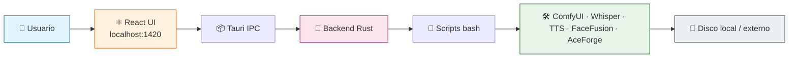
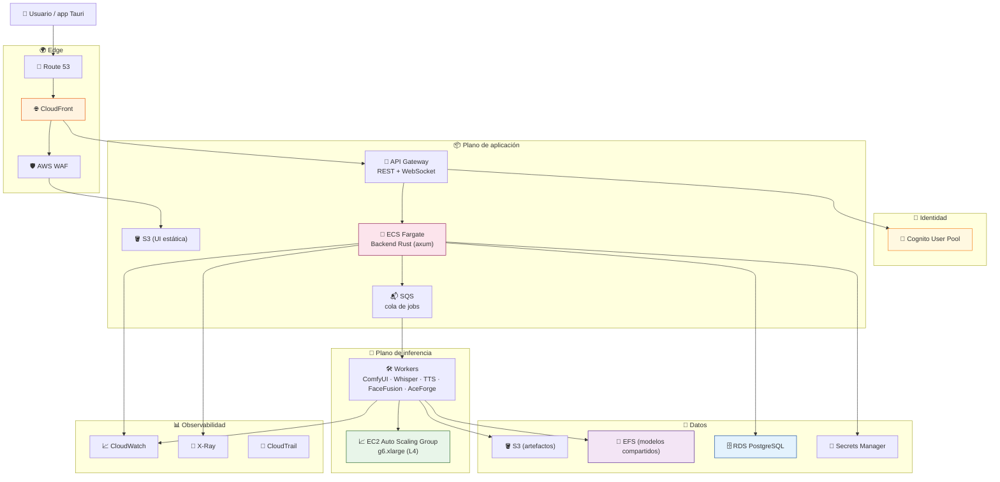
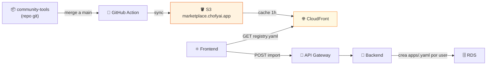
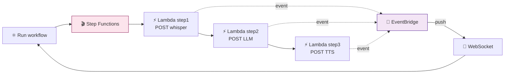
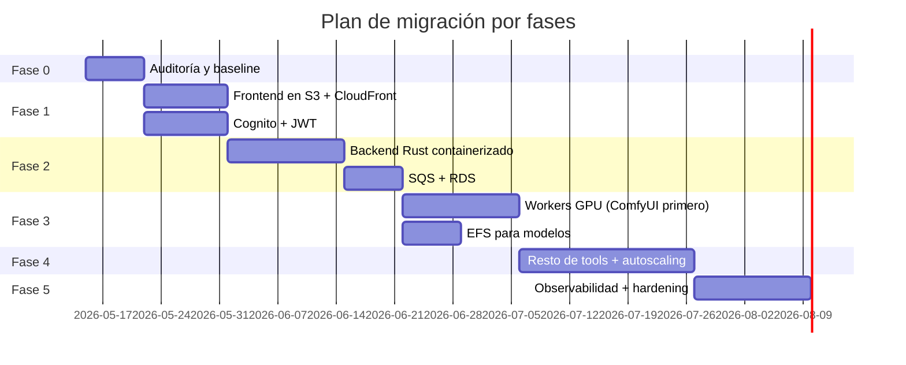

# ☁️ Migración de ChofyAI Studio a AWS

> **Guía maestra para migrar un launcher de escritorio macOS a una plataforma SaaS sobre AWS sin perder la filosofía de orquestación controlada.**

[-76B900?logo=nvidia&logoColor=white)](https://aws.amazon.com/ec2/instance-types/g6/)

---

## 🎯 1. Por qué migrar

ChofyAI Studio nació como un orquestador **local** para macOS Apple Silicon. Esto cubre el caso de un único creador con su Mac, pero limita:

| Limitación local | Necesidad cloud |
|:---|:---|
| 🖥️ Solo 1 usuario / 1 máquina | 👥 Compartir la plataforma con un equipo o vender acceso |
| 🍎 Atado a Apple Silicon (MPS, no CUDA) | 🟢 Acceso a GPUs NVIDIA L4/A10G/H100 |
| 💾 Modelos pesados duplicados por máquina | 📦 Modelos compartidos vía S3/EFS |
| 🛑 Si el Mac está apagado, no hay servicio | ⏱️ Disponibilidad 24/7 con auto-scaling |
| 🔌 Sin telemetría centralizada | 📊 CloudWatch + X-Ray para todo el stack |
| 🚫 Sin auditoría ni control de acceso | 🔒 IAM + Cognito + CloudTrail |

> [!IMPORTANT]
> La migración **no elimina** la app de escritorio. La estrategia es **dual**: el binario Tauri seguirá existiendo y podrá conectarse al backend cloud o trabajar 100 % local.

---

## 🏛️ 2. Arquitectura — antes vs después

### 2.1 Hoy (local)

### 2.2 Objetivo (AWS)

---

## 🧱 3. Componentes de migración

### 3.1 Frontend (React + Vite)

| Hoy | Cloud |
|:---|:---|
| Sirve dentro de Tauri WebView | Build estático en **S3** detrás de **CloudFront** |
| Llama a `invoke()` de Tauri | Llama a **API Gateway** (REST/WS) con JWT de Cognito |

**Cambios mínimos**: capa `src/api/client.ts` que abstraiga `invoke` vs `fetch`. Hoy ya hay una capa `tauriBridge` similar.

### 3.2 Backend Rust

| Hoy | Cloud |
|:---|:---|
| `tauri::command` síncrono | Servicio **axum** o **actix-web** containerizado |
| Lanza scripts bash locales | Encola jobs en **SQS**, los workers GPU consumen |
| `ProcessRegistry` en memoria | Estado en **RDS** + **DynamoDB** para sesiones |

### 3.3 Herramientas IA (workers GPU)

| Tool | Imagen base sugerida | Tipo de instancia | RAM GPU |
|:---|:---|:---:|:---:|
| 🖼️ ComfyUI | `nvidia/cuda:12.4-runtime-ubuntu22.04` | `g6.xlarge` | 24 GB L4 |
| 🎤 Qwen3-TTS | `pytorch/pytorch:2.4-cuda12.4` | `g6.xlarge` | 24 GB L4 |
| 🎙️ whisper.cpp | `ubuntu:22.04` (CPU OK) | `c7i.2xlarge` | — |
| 🎬 FaceFusion | `nvidia/cuda:12.4-runtime` | `g6.xlarge` | 24 GB L4 |
| 🎵 AceForge | `pytorch/pytorch:2.4-cuda12.4` | `g6.2xlarge` | 24 GB L4 |

> Cada worker se empaqueta como AMI o contenedor ECS sobre EC2 GPU. Usa **Spot** cuando el job sea reintentable y **On-Demand** para sesiones interactivas.

### 3.4 Almacenamiento dual → almacenamiento cloud

| Local | AWS | Justificación |
|:---|:---|:---|
| `studio_home/tools/<id>/models` | **EFS** (modo Elastic Throughput) | Compartido entre workers, montaje POSIX |
| `studio_home/tools/<id>/outputs` | **S3** (clase Standard → IA) | Lifecycle a Glacier a los 30 días |
| `storage/state/settings.json` | **DynamoDB** + **Secrets Manager** | Settings por usuario |
| `storage/state/processes.json` | **DynamoDB** (`sessions`) | PIDs por sesión, TTL |
| `storage/state/crash.log` | **CloudWatch Logs** + **Sentry** opcional | Error tracking |
| Logs de tools | **CloudWatch Logs** | Retención configurable |
| Sparsebundle APFS local | n/a — cloud nativo APFS-equivalente con EFS | — |

### 3.5 Marketplace de tools (nuevo en v0.5.0)

Hoy el catálogo curado vive en `marketplace/registry.yaml` empaquetado dentro del `.app`. En cloud:

| Aspecto | Cloud |
|:---|:---|
| 🪣 Hosting del catálogo | **S3** público con CloudFront (cache 1h, invalidate al actualizar) |
| 🔄 Versionado | Tags git en repo `community-tools` separado, S3 sirve `latest.yaml` y `v<N>.yaml` |
| 🔍 Indexación | **OpenSearch Serverless** para búsqueda full-text (cuando el catálogo crezca a >100 tools) |
| 📥 Import | Frontend hace `fetch()` directo a S3, valida schema, llama API Gateway → ECS para crear el manifest del usuario |
| 🛡 Validación | Lambda valida cada PR al repo `community-tools` con el schema antes de aceptar |

### 3.6 Workflows (chains entre tools, nuevo en v0.5.0)

#### Cambios relevantes desde la última revisión

Estos features quedaron implementados después de redactar este doc — la migración debe contemplarlos:

| Feature | Local | Cloud |
|---|---|---|
| 📥 **Descarga guiada de modelos** (`download_tool_model`) | spawnea `scripts/mac/download-hf-model.sh` con `huggingface-cli` | **Lambda** o **ECS task** que descarga a EFS compartido. Cache de modelos en S3 con presigned URLs para reusar entre tenants |
| ⚙️ **Settings de rutas avanzadas** (`models_dir`, `outputs_dir`, `cache_dir`) | env vars `CHOFYAI_MODELS_DIR/OUTPUTS_DIR/CACHE_DIR` inyectadas al spawn | Por-usuario en **DynamoDB**, mapeadas a prefijos S3 o subdirs EFS. Permite tiers (modelos compartidos vs privados) |
| 📢 **Release `.dmg` automatizado** | `macos-latest` hosted runner construye y adjunta al Release | No aplica directamente — el cliente cloud es web (no `.dmg`). Pero la lógica del workflow sirve si se mantiene una distribución desktop paralela |
| 🛂 **Notarización Apple** (pendiente) | Configurable con 6 secrets en GH Actions | No aplica al backend cloud |
| 📦 **Gestor de paquetes pnpm** | `pnpm-lock.yaml` con SHA-512 + `onlyBuiltDependencies` allowlist | Heredar en Lambdas/CDK: pnpm en lugar de npm. CodeBuild + ECR builds usan `pnpm install --frozen-lockfile` |

Los workflows YAML locales necesitan un orquestador en cloud. **AWS Step Functions** es la opción natural:

| Aspecto | Cloud |
|:---|:---|
| 📜 Definición | `workflows/*.yaml` por usuario en S3 (privado, KMS-encrypted) |
| 🎬 Runner | **Step Functions Standard** workflow generado a partir del YAML |
| 🔁 Steps tipo `http` | Lambda que hace POST al endpoint del tool worker |
| 🛑 Steps tipo `stub` | `Pass` state |
| 📊 Visibilidad | UI suscrita vía WebSocket a EventBridge events de la state machine |
| 💾 Resultados | S3 (artefactos) + DynamoDB (metadatos por step) |

> **Alternativa más simple** para MVP: el frontend cloud sigue ejecutando los steps con `fetch()` directo (igual que el desktop), Step Functions queda para v2.

---

## 🛤️ 4. Fases de migración

| Fase | Duración | Entregable | Reversible |
|:---:|:---:|:---|:---:|
| **0** | 1 sem | Inventario, métricas, runbooks actuales | ✅ |
| **1** | 2 sem | UI servida desde AWS, login Cognito funcional | ✅ |
| **2** | 3 sem | Backend cloud responde a la UI sin tocar GPUs | ✅ |
| **3** | 3 sem | Primer worker GPU (ComfyUI) corriendo en EC2 | ✅ |
| **4** | 3 sem | Las 5 tools migradas con autoscaling | ⚠️ parcial |
| **5** | 2 sem | Producción endurecida, alarmas, dashboards | ✅ |

---

## ⚖️ 5. Decisiones de diseño

### 5.1 ¿Por qué ECS Fargate y no EKS?

> El backend es **un solo servicio Rust**. Kubernetes sería overkill operacional. Si el sistema escala a 10+ microservicios, evaluar EKS en Fase 6.

### 5.2 ¿Por qué EC2 GPU y no SageMaker?

| Criterio | EC2 GPU | SageMaker |
|:---|:---:|:---:|
| Control total del entorno | ✅ | ⚠️ |
| Reuso de scripts bash actuales | ✅ | ❌ |
| Costo en cargas largas | ✅ | ❌ (premium) |
| Soporte de tools no-PyTorch (ComfyUI) | ✅ | ⚠️ |
| Endpoints listos para producción | ⚠️ | ✅ |

> Conclusión: **EC2 GPU autoescalado** se alinea con la filosofía actual. SageMaker queda como opción para servir modelos propios entrenados.

### 5.3 ¿Por qué SQS y no llamadas síncronas?

Las inferencias de imagen/video tardan **30 s – 5 min**. Una API síncrona sostiene conexiones largas y multiplica costos en API Gateway. **SQS + WebSocket** desacopla y permite reintentos.

### 5.4 ¿Región?

| Región | Latencia desde Chile | GPU L4 disponible | Precio relativo |
|:---|:---:|:---:|:---:|
| `us-east-1` (N. Virginia) | ~140 ms | ✅ | 1.0× (referencia) |
| `us-west-2` (Oregon) | ~180 ms | ✅ | 1.02× |
| `sa-east-1` (São Paulo) | ~80 ms | ⚠️ limitado | 1.35× |

> **Recomendación**: arrancar en `us-east-1` por catálogo de servicios y precio. Migrar a `sa-east-1` cuando GPU L4 esté disponible y la latencia sea crítica.

---

## 🚦 6. Criterios de éxito

| Métrica | Local hoy | Objetivo cloud |
|:---|:---:|:---:|
| ⏱️ TTFB UI | < 50 ms | < 200 ms (p95) |
| 🚀 Cold start worker | N/A | < 90 s |
| 💰 Costo por hora ociosa | 0 USD (Mac apagado) | < 0.20 USD |
| 📈 Concurrencia de jobs | 1 | ≥ 10 sin degradación |
| 🛡️ MTTR incidente | manual | < 15 min con runbooks |
| 🔁 Despliegue full | n/a | < 20 min con `terraform apply` |

---

## 🧩 7. Qué leer ahora

| Si quieres… | Ve a |
|:---|:---|
| 📐 Ver el dibujo grande con detalle | [`AWS_ARCHITECTURE.md`](AWS_ARCHITECTURE.md) |
| 🧰 Saber qué servicio AWS resuelve qué | [`AWS_SERVICES.md`](AWS_SERVICES.md) |
| 💵 Ver números concretos | [`AWS_COSTS.md`](AWS_COSTS.md) |
| 🔒 Entender el modelo de seguridad | [`AWS_SECURITY.md`](AWS_SECURITY.md) |
| 🚀 Desplegar con tus manos | [`AWS_STEP_BY_STEP.md`](AWS_STEP_BY_STEP.md) |

---

## 🔗 Referencias

- [AWS Well-Architected Framework](https://aws.amazon.com/architecture/well-architected/)
- [AWS Pricing Calculator](https://calculator.aws/)
- [Terraform AWS Provider](https://registry.terraform.io/providers/hashicorp/aws/latest/docs)
- [`../architecture.md`](../architecture.md) — arquitectura local
- [`../../ROADMAP.md`](../../ROADMAP.md) — roadmap del proyecto
