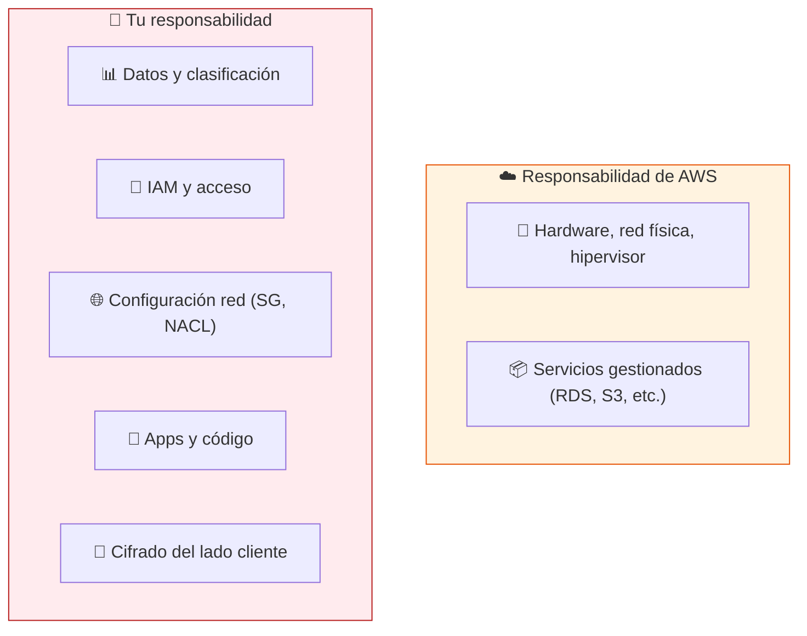
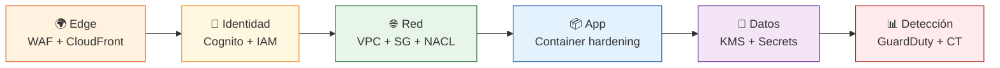
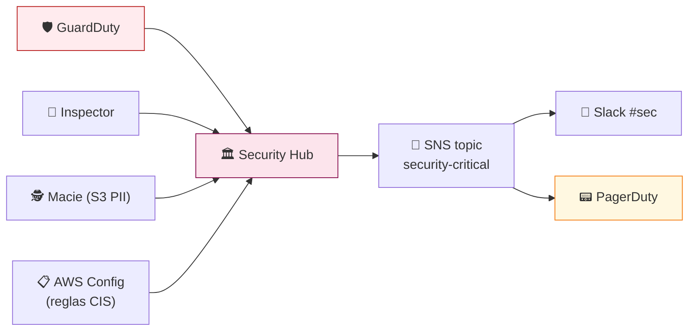

# 🔒 Seguridad y Cumplimiento en AWS

> **Modelo de seguridad por capas, controles obligatorios y prácticas de hardening para ChofyAI Studio en AWS.**

---

## 🛡️ 1. Modelo de responsabilidad compartida

> AWS protege la nube. **Tú proteges lo que pones en ella.**

---

## 🧩 2. Defensa en profundidad

---

## 🔑 3. Cifrado

| Recurso | En reposo | En tránsito |
|:---|:---|:---|
| RDS | KMS CMK (`aws/rds` o propia) | TLS obligatorio (`rds.force_ssl=1`) |
| S3 | SSE-KMS por bucket | HTTPS only via bucket policy |
| EFS | KMS al crear | TLS via mount helper |
| EBS (workers GPU) | KMS por defecto | n/a |
| Secrets Manager | KMS gestionado | TLS |
| CloudFront ↔ origen | — | TLS 1.2+ con SNI |
| ALB ↔ ECS | — | mTLS opcional con ACM Private CA |

> [!IMPORTANT]
> **Una CMK por entorno** (`dev`, `staging`, `prod`). Rotación anual automática activada.

---

## 👤 4. IAM — principio de menor privilegio

### 4.1 Roles principales

| Rol | Para | Permisos clave |
|:---|:---|:---|
| `chofy-fargate-task-role` | Backend Rust | `sqs:SendMessage`, `s3:PutObject` (prefijo `jobs/*`), `secretsmanager:GetSecretValue` |
| `chofy-worker-role` | EC2 GPU | `sqs:ReceiveMessage/DeleteMessage`, `s3:Get/Put`, `efs-client:*` |
| `chofy-deployer` | CI/CD (OIDC desde GitHub) | `ecr:Push`, `ecs:UpdateService`, scoped a recursos del proyecto |
| `chofy-readonly-ops` | Humanos on-call | `cloudwatch:*Read*`, `logs:Get*`, sin permisos de escritura |

### 4.2 Buenas prácticas

- ✅ **Sin claves estáticas** en CI: GitHub Actions ↔ AWS por **OIDC**.
- ✅ **MFA obligatorio** para todos los usuarios humanos.
- ✅ **Service Control Policies (SCP)** a nivel Organization (bloqueo de regiones, deny de `iam:DeleteRole` sin MFA).
- ✅ **Permission Boundaries** para roles creados por developers.
- ✅ Revisión trimestral con **IAM Access Analyzer**.

---

## 🌐 5. Red

| Control | Configuración |
|:---|:---|
| **VPC privada** | Workloads en subnets privadas, sólo ALB en públicas |
| **Security Groups** | Default deny, abrir solo puerto 443 desde ALB → ECS, 5432 desde ECS → RDS |
| **NACLs** | Stateless extra layer; deny RFC1918 cross-VPC |
| **VPC Flow Logs** | A CloudWatch + S3, 30 días de retención |
| **PrivateLink / VPC Endpoints** | S3, ECR, Secrets, KMS, CloudWatch — evita salir a Internet |
| **Egress controlado** | NAT solo desde subnets privadas; opcional `aws-network-firewall` |

---

## 🔍 6. Secretos

| Tipo | Servicio | Rotación |
|:---|:---|:---|
| Password DB | Secrets Manager | 30 días automática |
| JWT signing key | Secrets Manager | 90 días manual |
| OAuth client secrets | Secrets Manager | según provider |
| API keys de terceros | Secrets Manager | por proveedor |
| Config no sensible | Parameter Store (`String`) | n/a |

> **Nunca** en variables de entorno hardcoded. **Nunca** en repos. Pre-commit hooks con `detect-secrets` + GitHub Advanced Security activado.

---

## 🛡️ 7. Capa aplicación

| Práctica | Detalle |
|:---|:---|
| **Imagen distroless** | Backend Rust en `gcr.io/distroless/cc` o `scratch` |
| **Read-only rootfs** | `readonlyRootFilesystem: true` en task definition |
| **Non-root user** | `USER 65532` en Dockerfile |
| **Scan en ECR** | Activar enhanced scanning (Inspector) |
| **SBOM** | Generado por build, almacenado en S3 versionado |
| **Dependency pinning** | `Cargo.lock` y `package-lock.json` commiteados |
| **Cabeceras** | CSP estricta, `X-Content-Type-Options: nosniff`, HSTS preload |

---

## 🚨 8. Detección y respuesta

| Servicio | Qué detecta |
|:---|:---|
| **GuardDuty** | Tráfico C2, escaneos, credentials exfil |
| **Inspector** | CVEs en imágenes ECR y AMIs EC2 |
| **Macie** | PII expuesta en S3 |
| **Config** | Drift contra reglas CIS/PCI |
| **CloudTrail** | Auditoría de toda llamada AWS |

---

## 📋 9. Cumplimiento y baseline

| Estándar | Aplicabilidad | Servicios habilitadores |
|:---|:---|:---|
| **CIS AWS Foundations 1.5** | Mínimo recomendado | Config + Security Hub |
| **GDPR** | Si usuarios en UE | Cifrado + DPA AWS + región EU |
| **SOC 2 Type II** | Si vendes a empresas | Audit trail + IaC versionado |
| **PCI DSS** | Si tocas tarjetas | NO tocar tarjetas — usar Stripe |

> [!TIP]
> Para no entrar en alcance PCI, **delega cobros 100 % a Stripe Checkout/Elements** y nunca persistas PAN.

---

## ✅ 10. Checklist de hardening día 1

- [ ] Root account con MFA hardware y guardada en caja fuerte
- [ ] Organización AWS + cuentas separadas `dev`/`prod`
- [ ] CloudTrail multi-región a S3 versionado con MFA delete
- [ ] GuardDuty + Security Hub activos en todas las regiones
- [ ] Config rules CIS habilitadas
- [ ] IAM Identity Center (SSO) — sin usuarios IAM personales
- [ ] OIDC desde GitHub Actions (sin access keys en CI)
- [ ] Budgets con alarmas SNS a 50/80/100 %
- [ ] Backup plan AWS Backup para RDS y EFS
- [ ] Runbook de respuesta a incidente probado

---

## 🔗 Más

- [AWS Security Reference Architecture](https://docs.aws.amazon.com/prescriptive-guidance/latest/security-reference-architecture/welcome.html)
- [`AWS_MIGRATION.md`](AWS_MIGRATION.md) — visión general
- [`AWS_STEP_BY_STEP.md`](AWS_STEP_BY_STEP.md) — implementar controles
