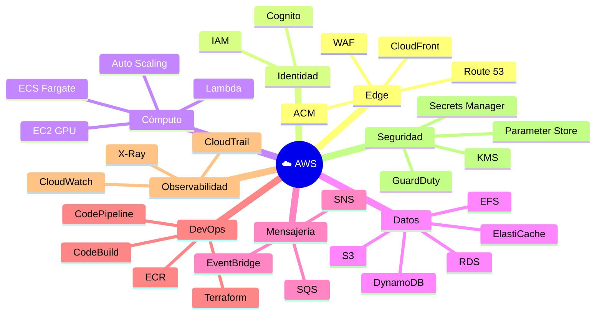

# 🧰 Servicios AWS Utilizados

> **Catálogo completo de los servicios AWS que componen la solución, qué resuelven y por qué se eligieron.**

---

## 🗂️ 1. Mapa por dominio

---

## 🌐 2. Edge y entrega

| Servicio | Rol | Por qué |
|:---|:---|:---|
| 🌐 **CloudFront** | CDN global para UI estática y caché de API | Reduce latencia mundial, ofrece TLS 1.3 e integración nativa con WAF y S3 OAC |
| 🧭 **Route 53** | DNS autoritativo + health checks | Registros alias gratuitos a CloudFront/ALB y health-based failover |
| 🔐 **ACM** | Certificados TLS gratuitos | Renovación automática, integración nativa con CloudFront/ALB |
| 🛡️ **WAF** | Firewall L7 | Bloqueo OWASP, rate-limit por IP, geo-blocking |

---

## 🔐 3. Identidad y acceso

| Servicio | Rol | Por qué |
|:---|:---|:---|
| 👤 **Amazon Cognito** | User Pool para autenticación de usuarios finales | OAuth 2.0 + OIDC out-of-the-box, MFA TOTP, federación social |
| 🛂 **AWS IAM** | Permisos para servicios y desarrolladores | Granularidad fina por recurso, roles con `AssumeRole`, condiciones |

> [!IMPORTANT]
> Cognito autentica **usuarios**. IAM autoriza **servicios y workloads**. No mezclar.

---

## 🧮 4. Cómputo

| Servicio | Rol | Justificación |
|:---|:---|:---|
| 🦀 **ECS Fargate** | Backend Rust sin gestionar VMs | Pago por vCPU·s + RAM·s, parches automáticos, integración con ALB y Service Connect |
| 🟢 **EC2 GPU (g6/g6e)** | Workers de inferencia | NVIDIA L4 (24 GB) optimizada para inferencia, mejor USD/TFLOP que A10G en su rango |
| 📈 **EC2 Auto Scaling** | Escalado del pool GPU según `SQS depth` | Política target-tracking, mezcla Spot + On-Demand |
| ⚡ **Lambda** | Tareas event-driven cortas (post-procesos, webhooks) | Pay-per-invocation, ideal para jobs < 15 min |

---

## 💾 5. Datos y almacenamiento

| Servicio | Rol | Notas |
|:---|:---|:---|
| 🗄️ **RDS PostgreSQL 16** | Base relacional para `users`, `jobs`, `audit` | Multi-AZ, snapshots automáticos, IAM auth |
| 🟥 **ElastiCache Redis 7** | Cache, sesiones, rate-limit | TTL ajustable, cluster mode opcional |
| 📁 **EFS** | NFS POSIX para modelos compartidos entre workers | Elastic Throughput, lifecycle a IA tras 30 d |
| 🪣 **S3 (Standard/IA/Glacier)** | UI estática + artefactos + audit logs | 11 nueves de durabilidad, lifecycle automático |
| ⚡ **DynamoDB** | Sesiones WebSocket con TTL | Latencia < 10 ms, on-demand billing |

---

## 📨 6. Mensajería y eventos

| Servicio | Rol | Por qué |
|:---|:---|:---|
| 📬 **SQS** | Cola de jobs entre backend y workers | Reintentos automáticos, DLQ, exactly-once via FIFO opcional |
| ☠️ **SQS DLQ** | Capturar mensajes no procesados tras N reintentos | Permite debug y reproceso manual |
| 🚌 **EventBridge** | Bus para eventos de negocio (`job.completed`, `user.signup`) | Routing por reglas, integra Lambdas y SaaS externos |
| 📣 **SNS** | Notificaciones a humanos (email/Slack) y fan-out | Tópicos por severidad |
| 🎬 **Step Functions** | Orquestador de **workflows** entre tools | Traduce el YAML local a state machine; Lambdas por step; visibilidad nativa |
| 🔍 **OpenSearch Serverless** *(futuro)* | Indexar **marketplace** + búsqueda | Cuando el catálogo curado supere ~100 tools |

---

## 🛠️ 7. DevOps y entrega

| Servicio | Rol | Por qué |
|:---|:---|:---|
| 🐳 **ECR** | Registro privado de imágenes Docker | Scan de vulnerabilidades, lifecycle, replicación cross-region |
| 🛠️ **CodeBuild** *(o GitHub Actions)* | Build CI de imágenes y bundle UI | Para mantener simplicidad recomendamos seguir con **GitHub Actions** + OIDC a AWS |
| 🚀 **CodePipeline** *(opcional)* | Orquestación CD multi-stage | Solo si CD se mueve dentro de AWS |
| 🧱 **CloudFormation / Terraform** | IaC | El proyecto adopta **Terraform** por portabilidad y multi-cloud futuro |

---

## 📊 8. Observabilidad y auditoría

| Servicio | Rol | Notas |
|:---|:---|:---|
| 📈 **CloudWatch Metrics** | Métricas de todo el stack | Custom metrics vía EMF |
| 📜 **CloudWatch Logs** | Logs centralizados | Retención por log group, exportable a S3 |
| 🔎 **CloudWatch Logs Insights** | Queries SQL-like sobre logs | Útil para post-mortems |
| 🔬 **X-Ray** | Tracing distribuido | Sampling 10 % en prod, 100 % en staging |
| 📜 **CloudTrail** | Auditoría de llamadas a la API de AWS | Trail multi-región a S3 versionado |
| 🛡️ **GuardDuty** | Detección de amenazas | Findings a SNS y Security Hub |

---

## 🔑 9. Seguridad y secretos

| Servicio | Rol | Notas |
|:---|:---|:---|
| 🔐 **Secrets Manager** | Credenciales DB, JWT keys, OAuth secrets | Rotación nativa para RDS |
| 📜 **Parameter Store** | Config no sensible | Gratis hasta 10k params |
| 🗝️ **KMS** | Cifrado en reposo (S3, RDS, EFS, EBS) | CMK por entorno; rotación anual automática |
| 🛡️ **GuardDuty** + **Security Hub** | Centralización de hallazgos | Score CIS/PCI |

---

## 📐 10. Mapeo: necesidad → servicio

| Necesidad ChofyAI | Servicio AWS |
|:---|:---|
| Servir UI a usuarios remotos | S3 + CloudFront |
| Reemplazar `tauri::invoke()` | API Gateway + ECS Fargate |
| Reemplazar `ProcessRegistry` | RDS + Redis |
| Reemplazar `processes.json` (PIDs persistidos) | DynamoDB con TTL |
| Reemplazar `crash.log` | CloudWatch Logs + Sentry opcional |
| Reemplazar scripts bash de `run` | SQS + EC2 GPU + cloud-init |
| Reemplazar `studio_home/models/` | EFS |
| Reemplazar `outputs/` | S3 + presigned URLs |
| Reemplazar logs locales | CloudWatch Logs |
| Reemplazar el botón "abrir herramienta" | WebSocket via API Gateway |
| Reemplazar **`marketplace/registry.yaml`** | S3 público con CloudFront + repo `community-tools` |
| Reemplazar **`workflows/*.yaml`** runner | Step Functions (orquestador) o frontend `fetch()` para MVP |
| Reemplazar **sparsebundle APFS** local | EFS (POSIX nativo, sin trampas de filesystem) |
| Reemplazar **detección de huérfanos** | ECS task health + CloudWatch alarms |
| Reemplazar **i18n local** | Mismo (es frontend puro, no necesita backend) |
| Reemplazar **security workflow CI** | Mismo workflow vía `workflow_call` desde el repo cloud |
| Multiusuario / roles | Cognito + IAM |
| Costo controlado | Spot + lifecycle + Cost Anomaly Detection |

---

## 🔗 Siguiente paso

- [`AWS_COSTS.md`](AWS_COSTS.md) — desglose de costos por servicio
- [`AWS_STEP_BY_STEP.md`](AWS_STEP_BY_STEP.md) — desplegar todo lo anterior
