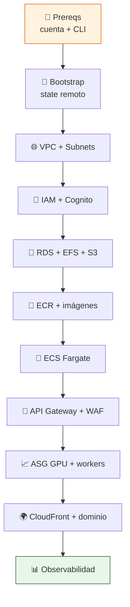
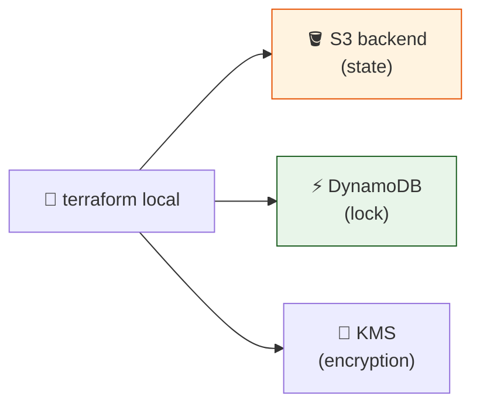
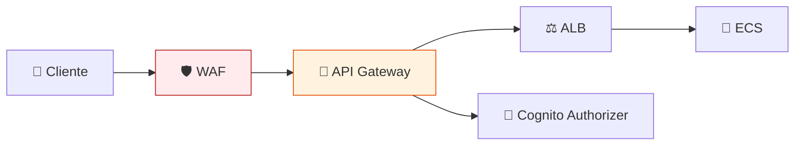

# 🚀 Despliegue Paso a Paso en AWS

> **Guía hands-on para llevar ChofyAI Studio desde cero hasta una instalación funcional en AWS usando Terraform y AWS CLI.**

[](https://aws.amazon.com)
[](https://www.terraform.io)
[](AWS_MIGRATION.md)
[](AWS_MIGRATION.md)

---

## 🗺️ 0. Mapa del despliegue



---

## 🔧 1. Prerrequisitos

### 1.1 Cuentas y herramientas

```bash
# AWS CLI v2
brew install awscli
aws --version  # >= 2.15

# Terraform
brew install terraform
terraform -version  # >= 1.9

# Otros
brew install jq gh
```

### 1.2 Configurar credenciales (modo SSO recomendado)

```bash
aws configure sso
# SSO start URL: https://<tu-org>.awsapps.com/start
# SSO region: us-east-1
# Default profile: chofy-dev
```

### 1.3 Verificación

```bash
aws sts get-caller-identity --profile chofy-dev
# debe devolver tu cuenta y un Arn de role
```

---

## 🧱 2. Bootstrap del estado remoto



### 2.1 Crear bucket y tabla de lock (una sola vez)

```bash
export AWS_PROFILE=chofy-dev
export AWS_REGION=us-east-1
export STATE_BUCKET="chofy-tf-state-$(aws sts get-caller-identity --query Account --output text)"

aws s3api create-bucket --bucket "$STATE_BUCKET" --region "$AWS_REGION"
aws s3api put-bucket-versioning --bucket "$STATE_BUCKET" \
  --versioning-configuration Status=Enabled
aws s3api put-bucket-encryption --bucket "$STATE_BUCKET" \
  --server-side-encryption-configuration \
  '{"Rules":[{"ApplyServerSideEncryptionByDefault":{"SSEAlgorithm":"AES256"}}]}'

aws dynamodb create-table \
  --table-name chofy-tf-locks \
  --attribute-definitions AttributeName=LockID,AttributeType=S \
  --key-schema AttributeName=LockID,KeyType=HASH \
  --billing-mode PAY_PER_REQUEST
```

### 2.2 Backend de Terraform

```hcl
# infra/backend.tf
terraform {
  required_version = ">= 1.9"
  backend "s3" {
    bucket         = "chofy-tf-state-XXXXXXXXXXXX"
    key            = "envs/dev/terraform.tfstate"
    region         = "us-east-1"
    dynamodb_table = "chofy-tf-locks"
    encrypt        = true
  }
  required_providers {
    aws = { source = "hashicorp/aws", version = "~> 5.70" }
  }
}

provider "aws" {
  region = "us-east-1"
  default_tags {
    tags = {
      Project     = "chofyai-studio"
      Environment = "dev"
      ManagedBy   = "terraform"
    }
  }
}
```

---

## 🌐 3. VPC y red

```hcl
# infra/network.tf
module "vpc" {
  source  = "terraform-aws-modules/vpc/aws"
  version = "~> 5.13"

  name = "chofy-dev"
  cidr = "10.0.0.0/16"

  azs             = ["us-east-1a", "us-east-1b", "us-east-1c"]
  public_subnets  = ["10.0.0.0/24", "10.0.1.0/24", "10.0.2.0/24"]
  private_subnets = ["10.0.10.0/24", "10.0.11.0/24", "10.0.12.0/24"]

  enable_nat_gateway     = true
  single_nat_gateway     = true   # dev: 1 NAT; prod: false (uno por AZ)
  enable_dns_hostnames   = true
  enable_flow_log        = true
  flow_log_destination_type = "cloud-watch-logs"
}

# VPC endpoints (gratis tráfico hacia S3/ECR)
resource "aws_vpc_endpoint" "s3" {
  vpc_id            = module.vpc.vpc_id
  service_name      = "com.amazonaws.us-east-1.s3"
  vpc_endpoint_type = "Gateway"
  route_table_ids   = module.vpc.private_route_table_ids
}
```

```bash
cd infra
terraform init
terraform apply -target=module.vpc -target=aws_vpc_endpoint.s3
```

---

## 🔐 4. Identidad

### 4.1 Cognito User Pool

```hcl
resource "aws_cognito_user_pool" "main" {
  name = "chofy-users-dev"
  password_policy {
    minimum_length    = 12
    require_lowercase = true
    require_numbers   = true
    require_symbols   = true
    require_uppercase = true
  }
  mfa_configuration = "OPTIONAL"
  software_token_mfa_configuration { enabled = true }
}

resource "aws_cognito_user_pool_client" "web" {
  name         = "web-spa"
  user_pool_id = aws_cognito_user_pool.main.id
  generate_secret = false
  allowed_oauth_flows  = ["code"]
  allowed_oauth_scopes = ["openid", "email", "profile"]
  callback_urls        = ["https://app.chofyai.dev/callback"]
}
```

---

## 💾 5. Datos

### 5.1 RDS PostgreSQL

```hcl
module "rds" {
  source  = "terraform-aws-modules/rds/aws"
  version = "~> 6.8"

  identifier             = "chofy-pg-dev"
  engine                 = "postgres"
  engine_version         = "16.4"
  instance_class         = "db.t4g.small"
  allocated_storage      = 20
  storage_encrypted      = true
  multi_az               = false  # true en prod
  db_name                = "chofy"
  username               = "chofy_admin"
  manage_master_user_password = true
  vpc_security_group_ids = [aws_security_group.rds.id]
  subnet_ids             = module.vpc.private_subnets
  backup_retention_period = 7
}
```

### 5.2 EFS para modelos

```hcl
resource "aws_efs_file_system" "models" {
  creation_token   = "chofy-models-dev"
  performance_mode = "generalPurpose"
  throughput_mode  = "elastic"
  encrypted        = true
  lifecycle_policy { transition_to_ia = "AFTER_30_DAYS" }
}
```

### 5.3 S3 buckets

```hcl
resource "aws_s3_bucket" "ui"        { bucket = "chofy-ui-dev-${data.aws_caller_identity.me.account_id}" }
resource "aws_s3_bucket" "artifacts" { bucket = "chofy-art-dev-${data.aws_caller_identity.me.account_id}" }

resource "aws_s3_bucket_public_access_block" "all" {
  for_each = toset([aws_s3_bucket.ui.id, aws_s3_bucket.artifacts.id])
  bucket   = each.value
  block_public_acls = true
  block_public_policy = true
  ignore_public_acls = true
  restrict_public_buckets = true
}
```

---

## 🐳 6. Imágenes y registro

### 6.1 Repositorios ECR

```bash
aws ecr create-repository --repository-name chofy/backend
aws ecr create-repository --repository-name chofy/worker-comfyui
aws ecr create-repository --repository-name chofy/worker-tts
```

### 6.2 Build y push (backend Rust)

```bash
ACCOUNT=$(aws sts get-caller-identity --query Account --output text)
REGISTRY="${ACCOUNT}.dkr.ecr.us-east-1.amazonaws.com"

aws ecr get-login-password --region us-east-1 \
  | docker login --username AWS --password-stdin "$REGISTRY"

docker buildx build \
  --platform linux/amd64 \
  -t "${REGISTRY}/chofy/backend:0.5.0-dev" \
  -f src-tauri/Dockerfile.api \
  --push .
```

> [!NOTE]
> El backend hoy es `tauri::command`. La fase 2 introduce un crate `chofy-api` (axum) que reusa la lógica de `ProcessRegistry` pero expone HTTP/WS.

---

## 🦀 7. Backend en ECS Fargate

```hcl
resource "aws_ecs_cluster" "main" {
  name = "chofy-dev"
  setting { name = "containerInsights" value = "enabled" }
}

resource "aws_ecs_task_definition" "backend" {
  family                   = "chofy-backend"
  network_mode             = "awsvpc"
  requires_compatibilities = ["FARGATE"]
  cpu                      = "512"
  memory                   = "1024"
  execution_role_arn       = aws_iam_role.task_exec.arn
  task_role_arn            = aws_iam_role.task.arn

  container_definitions = jsonencode([{
    name      = "backend"
    image     = "${aws_ecr_repository.backend.repository_url}:0.5.0-dev"
    essential = true
    portMappings = [{ containerPort = 8080, protocol = "tcp" }]
    healthCheck  = { command = ["CMD-SHELL","curl -fs http://localhost:8080/healthz || exit 1"] }
    logConfiguration = {
      logDriver = "awslogs"
      options = {
        awslogs-group         = aws_cloudwatch_log_group.backend.name
        awslogs-region        = "us-east-1"
        awslogs-stream-prefix = "ecs"
      }
    }
  }])
}
```

---

## 🚪 8. API Gateway + WAF



```hcl
resource "aws_apigatewayv2_api" "http" {
  name          = "chofy-api-dev"
  protocol_type = "HTTP"
}

resource "aws_apigatewayv2_authorizer" "cognito" {
  api_id           = aws_apigatewayv2_api.http.id
  authorizer_type  = "JWT"
  identity_sources = ["$request.header.Authorization"]
  jwt_configuration {
    audience = [aws_cognito_user_pool_client.web.id]
    issuer   = "https://cognito-idp.us-east-1.amazonaws.com/${aws_cognito_user_pool.main.id}"
  }
  name = "cognito-jwt"
}
```

---

## 📈 9. Workers GPU

### 9.1 AMI base

```bash
# Crear AMI con NVIDIA driver + Docker + agente del worker
# Usa AWS Deep Learning AMI como base:
aws ec2 describe-images --owners amazon \
  --filters "Name=name,Values=Deep Learning Base GPU AMI*Ubuntu*" \
  --query 'Images | sort_by(@, &CreationDate)[-1].ImageId'
```

### 9.2 Launch template + ASG

```hcl
resource "aws_launch_template" "gpu" {
  name_prefix   = "chofy-gpu-"
  image_id      = data.aws_ami.dl_gpu.id
  instance_type = "g6.xlarge"
  iam_instance_profile { name = aws_iam_instance_profile.worker.name }
  user_data = base64encode(templatefile("${path.module}/cloudinit/worker.sh", {
    queue_url   = aws_sqs_queue.jobs.url
    efs_dns     = aws_efs_file_system.models.dns_name
    region      = "us-east-1"
  }))
  block_device_mappings {
    device_name = "/dev/sda1"
    ebs { volume_size = 100, volume_type = "gp3", encrypted = true }
  }
}

resource "aws_autoscaling_group" "gpu" {
  name                = "chofy-gpu-asg"
  min_size            = 0
  max_size            = 5
  desired_capacity    = 0
  vpc_zone_identifier = module.vpc.private_subnets
  mixed_instances_policy {
    launch_template { launch_template_specification { launch_template_id = aws_launch_template.gpu.id } }
    instances_distribution {
      on_demand_base_capacity                  = 0
      on_demand_percentage_above_base_capacity = 30
      spot_allocation_strategy                 = "price-capacity-optimized"
    }
  }
  tag { key = "Name" value = "chofy-worker-gpu" propagate_at_launch = true }
}

resource "aws_autoscaling_policy" "scale_on_queue" {
  name                   = "scale-on-sqs-depth"
  autoscaling_group_name = aws_autoscaling_group.gpu.name
  policy_type            = "TargetTrackingScaling"
  target_tracking_configuration {
    customized_metric_specification {
      metric_name = "ApproximateNumberOfMessagesVisible"
      namespace   = "AWS/SQS"
      statistic   = "Average"
      dimensions { name = "QueueName" value = aws_sqs_queue.jobs.name }
    }
    target_value = 5
  }
}
```

### 9.3 cloud-init del worker (resumen)

```bash
#!/bin/bash
set -euo pipefail

mkdir -p /mnt/models
mount -t efs -o tls ${efs_dns}:/ /mnt/models
echo "${efs_dns}:/ /mnt/models efs _netdev,tls 0 0" >> /etc/fstab

docker login -u AWS -p "$(aws ecr get-login-password --region ${region})" \
  ${region}.dkr.ecr.${region}.amazonaws.com

docker run -d --gpus all --restart=always \
  -e SQS_URL=${queue_url} \
  -v /mnt/models:/models \
  ${region}.dkr.ecr.${region}.amazonaws.com/chofy/worker-comfyui:latest
```

---

## 🌍 10. Frontend en CloudFront

```bash
# Build de la UI
cd ../  # raíz del repo
pnpm install --frozen-lockfile
pnpm build:web

# Subir a S3
aws s3 sync dist/ "s3://chofy-ui-dev-${ACCOUNT}/" --delete \
  --cache-control "public,max-age=31536000,immutable" \
  --exclude "index.html"

aws s3 cp dist/index.html "s3://chofy-ui-dev-${ACCOUNT}/index.html" \
  --cache-control "no-cache"

# Invalidar CloudFront
aws cloudfront create-invalidation \
  --distribution-id "$DISTRIBUTION_ID" \
  --paths "/index.html"
```

---

## 📊 11. Observabilidad básica

```hcl
resource "aws_cloudwatch_log_group" "backend" {
  name              = "/chofy/dev/backend"
  retention_in_days = 30
}

resource "aws_cloudwatch_metric_alarm" "backend_5xx" {
  alarm_name          = "chofy-backend-5xx"
  comparison_operator = "GreaterThanThreshold"
  evaluation_periods  = 2
  metric_name         = "HTTPCode_Target_5XX_Count"
  namespace           = "AWS/ApplicationELB"
  period              = 60
  statistic           = "Sum"
  threshold           = 10
  alarm_actions       = [aws_sns_topic.alerts.arn]
}
```

---

## ✅ 12. Verificación

```bash
# Probar API
TOKEN=$(./scripts/cognito-login.sh)
curl -H "Authorization: Bearer $TOKEN" \
  https://api.chofyai.dev/api/tools | jq

# Encolar job
curl -X POST -H "Authorization: Bearer $TOKEN" \
  -d '{"tool":"comfyui","params":{"prompt":"a cat astronaut"}}' \
  https://api.chofyai.dev/api/jobs

# Ver workers escalando
watch "aws autoscaling describe-auto-scaling-groups \
  --auto-scaling-group-names chofy-gpu-asg \
  --query 'AutoScalingGroups[0].Instances'"
```

---

## 🧹 13. Teardown

```bash
# Drenar workers (puede tardar)
aws autoscaling update-auto-scaling-group \
  --auto-scaling-group-name chofy-gpu-asg --desired-capacity 0 --min-size 0

# Vaciar buckets antes de destroy
aws s3 rm "s3://chofy-art-dev-${ACCOUNT}" --recursive
aws s3 rm "s3://chofy-ui-dev-${ACCOUNT}" --recursive

terraform destroy
```

---

## 🆘 14. Troubleshooting

| Síntoma | Causa probable | Acción |
|:---|:---|:---|
| `terraform apply` cuelga en RDS | Multi-AZ tarda 10-15 min | esperar |
| Worker no escala | Política mira queue equivocada | revisar dimensión `QueueName` |
| `502` en API Gateway | Target group sin health | verificar `/healthz` y SG |
| EFS mount falla | Falta SG allow 2049 | añadir rule de NFS |
| Spot interrupciones frecuentes | Mix poco diversificado | añadir más tipos `g6.*`, `g5.*` |

---

## 🔗 Más

- [`AWS_MIGRATION.md`](AWS_MIGRATION.md) — visión general
- [`AWS_ARCHITECTURE.md`](AWS_ARCHITECTURE.md) — arquitectura completa
- [`AWS_SECURITY.md`](AWS_SECURITY.md) — controles antes de prod
- [`AWS_COSTS.md`](AWS_COSTS.md) — costos estimados
