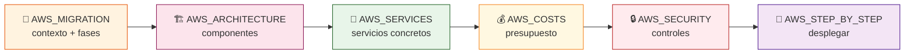

# ☁️ Migración a la Nube — Índice

> **Plan integral para llevar ChofyAI Studio desde un launcher de escritorio macOS a una plataforma SaaS multi-tenant sobre AWS.**

---

## 🎯 Objetivo

Transformar el launcher local (Tauri + Rust + React, 5 herramientas IA Python) en un servicio cloud que conserve la **filosofía de orquestación controlada** del proyecto, agregando:

- 👥 Multi-usuario con autenticación
- 🚀 GPU on-demand (sin invertir en hardware local)
- 📦 Modelos compartidos en almacenamiento elástico
- 📊 Observabilidad completa
- 💰 Pago por uso real

---

## 🗺️ Mapa de documentos

| # | Documento | Lectura | Para quién |
|:-:|:---|:---:|:---|
| 1 | 📘 [`AWS_MIGRATION.md`](AWS_MIGRATION.md) | 20 min | **Empezar aquí.** Visión global, fases, decisiones |
| 2 | 🏗️ [`AWS_ARCHITECTURE.md`](AWS_ARCHITECTURE.md) | 15 min | Arquitectura objetivo, diagramas, flujos |
| 3 | 🧰 [`AWS_SERVICES.md`](AWS_SERVICES.md) | 12 min | Mapa exhaustivo de servicios AWS y por qué |
| 4 | 🚀 [`AWS_STEP_BY_STEP.md`](AWS_STEP_BY_STEP.md) | 30 min | Despliegue hands-on con Terraform y CLI |
| 5 | 💰 [`AWS_COSTS.md`](AWS_COSTS.md) | 10 min | Modelos de costos, escenarios, optimizaciones |
| 6 | 🔒 [`AWS_SECURITY.md`](AWS_SECURITY.md) | 10 min | IAM, redes, secretos, hardening |

---

## 🧭 Flujo recomendado de lectura

---

## ⚡ TL;DR

| Aspecto | Local v0.5.0 | Cloud objetivo |
|:---|:---|:---|
| 🖥️ Frontend | Tauri WebView · React + TS · i18n ES/EN · ⌘K palette | S3 + CloudFront (la misma SPA) |
| 🦀 Backend | Rust local IPC · 30+ comandos | ECS Fargate (API REST/WS) |
| 🧠 Inferencia | Procesos locales | EC2 GPU (`g6.xlarge`) on-demand |
| 💾 Estado | `studio_home` + `processes.json` + `crash.log` | S3 + EFS + RDS + DynamoDB + CloudWatch |
| 🛒 Marketplace | `marketplace/registry.yaml` empaquetado | S3 público + CloudFront + repo `community-tools` |
| 🔗 Workflows | YAML local + frontend `fetch()` runner | Step Functions o mismo `fetch()` para MVP |
| 👻 Huérfanos | `lsof -iTCP` + adopt/kill | ECS task health + CloudWatch alarms |
| 🛡 Seguridad CI | `security.yml` portable con `workflow_call` | El mismo workflow invocado desde repo cloud |
| 💾 Discos externos | Sparsebundle APFS sobre exFAT | EFS (POSIX nativo) |
| 👤 Usuarios | 1 (el dueño del Mac) | N (Cognito multi-tenant) |
| 💵 Costo arranque | Hardware ya pagado | ~95 USD/mes mínimo |
| 🔁 Reversible | — | Sí, fases independientes |

---

## 🔗 Volver

- [`../../README.md`](../../README.md) — README principal del proyecto
- [`../architecture.md`](../architecture.md) — arquitectura local actual
- [`../../ROADMAP.md`](../../ROADMAP.md) — roadmap del proyecto
