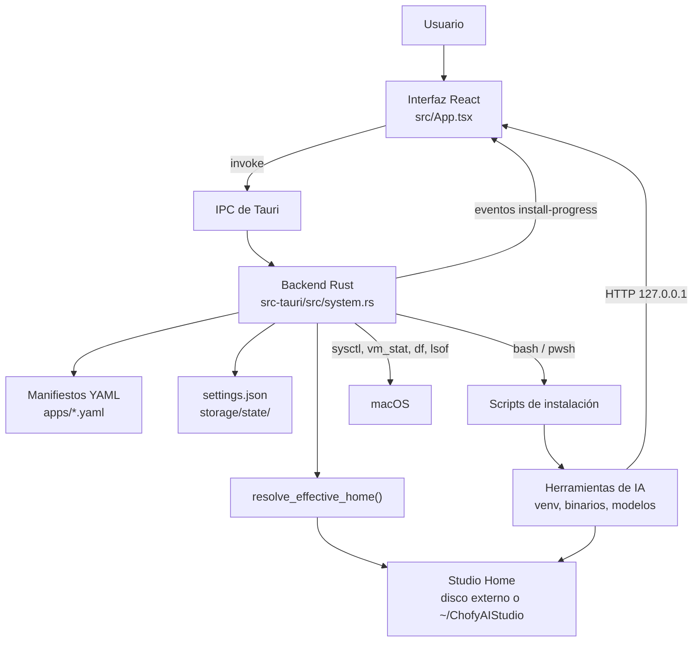

# 01 · Descripción general del sistema

> Estado: completo · Última revisión: 2026-08-27 · Versión analizada: 0.5.1 (commit f840055)

## 1. Qué es ChofyAI Studio

ChofyAI Studio es una **aplicación de escritorio** que instala, arranca, vigila y detiene
herramientas de inteligencia artificial que se ejecutan **en el propio computador del
usuario**, sin enviar datos a ningún servicio remoto durante la inferencia.

No es un modelo de IA ni una herramienta creativa por sí misma: es el **orquestador** que
se encarga del trabajo aburrido y frágil que hay alrededor de esas herramientas —
descargar el código, crear entornos de Python, compilar binarios, bajar modelos, elegir
puertos, lanzar procesos, guardar registros y volver a levantar todo tras un cierre
inesperado.

Evidencia en el repositorio:

- El backend registra 35 comandos en
  [`src-tauri/src/lib.rs`](../../src-tauri/src/lib.rs), todos orientados a instalar,
  ejecutar, inspeccionar o reubicar herramientas.
- Cada herramienta se describe en un manifiesto YAML de [`apps/`](../../apps/) y se
  instala con un script de [`scripts/mac/`](../../scripts/mac/) o
  [`scripts/win/`](../../scripts/win/).
- La interfaz completa vive en [`src/App.tsx`](../../src/App.tsx).

## 2. Qué problema resuelve

Instalar herramientas de IA locales en un Mac es, en la práctica, una cadena de pasos
manuales que falla con facilidad. El repositorio contiene la evidencia de esos fallos: el
postmortem [`../POSTMORTEM-2026-05-17.md`](../POSTMORTEM-2026-05-17.md) documenta diez
incidentes reales, y varios de ellos están hoy mitigados dentro del código.

| Problema real | Dónde se resolvió |
|:---|:---|
| Cada herramienta se instala distinto (venv, cmake, conda, uv) | `scripts/mac/common.sh` unifica detección de Python, creación de entorno e instalación de paquetes |
| Una instalación "termina bien" pero queda incompleta | Post-validación de `installed_if` al final de `run_install_script` en `src-tauri/src/system.rs` |
| Un proceso zombi ocupa el puerto y la herramienta "no abre" | Pre-flight de puerto en `start_tool`, más la detección de huérfanos de `list_orphan_ports` |
| El disco externo se desmonta y desaparecen todas las herramientas | `resolve_effective_home` intenta montar el `.sparsebundle` y, si no puede, cae a `~/ChofyAIStudio` |
| No se sabe qué está pasando durante una instalación larga | Eventos `install-progress` y el parser de fases `parseInstallLine` de `src/utils.ts` |
| Los modelos pesados no caben en el disco principal | `relocate_module` y los overrides `models_dir` / `outputs_dir` / `cache_dir` |

## 3. A quién está dirigido

| Perfil | Qué obtiene |
|:---|:---|
| Creador de contenido en Mac | Instala y usa voz, transcripción, imagen, música y video sin tocar la terminal |
| Usuario preocupado por la privacidad | Toda la inferencia ocurre en `127.0.0.1`; no hay cuenta ni telemetría en el código |
| Desarrollador que evalúa herramientas | Instalación reproducible y desechable, con logs y control de procesos |
| Usuario con disco externo | Soporte explícito de volúmenes externos, sparsebundle APFS y reubicación por herramienta |

No está dirigido a despliegues multiusuario ni a servidores: no hay autenticación, ni
roles, ni API remota. Véase [11 · Seguridad](11-security.md).

## 4. Herramientas integradas

Datos tomados de los cinco manifiestos de [`apps/`](../../apps/).

| Herramienta | Categoría | Runtime | Puerto | Plataformas declaradas |
|:---|:---|:---|:---:|:---|
| Qwen3-TTS | `voice` | `python` (MLX) | 7860 | `mac-arm64` |
| whisper.cpp | `asr` | `binary` | 8178 | `mac-arm64`, `win-x64`, `linux-x64` |
| FaceFusion | `video` | `python` | 7862 | `mac-arm64`, `win-x64`, `linux-x64` |
| AceForge | `music` | `python` | 7857 | `mac-arm64`, `win-x64`, `linux-x64` |
| ComfyUI | `image` | `python` | 8188 | `mac-arm64`, `win-x64`, `linux-x64` |

Aviso de precisión: que un manifiesto declare `win-x64` o `linux-x64` **no** significa que
esa plataforma esté validada. Los scripts de Linux referenciados
(`scripts/linux/install-*.sh`) **no existen** en el repositorio, y el propio manifiesto los
marca con un comentario `# TODO: pendiente`. Los de Windows existen en
[`scripts/win/`](../../scripts/win/) pero el `README.md` los describe como experimentales
sin validación de extremo a extremo. Detalle en
[15 · Riesgos y deuda técnica](15-risks-and-technical-debt.md).

## 5. Casos de uso principales

1. **Primera puesta en marcha**: el asistente `Onboarding` de `src/App.tsx` propone una
   ubicación de trabajo, comprueba el sistema de archivos y ofrece instalar whisper.cpp
   como primera herramienta.
2. **Instalar una herramienta**: tarjeta → botón *Instalar* → comprobación previa de
   espacio (`PreInstallCheck`) → ejecución del script con progreso en vivo.
3. **Instalar varias en lote**: cola secuencial (`addAllPendingToQueue` + `runQueue`), una
   herramienta a la vez para no saturar disco y red.
4. **Usar una herramienta**: *Iniciar* → health check → *Ver UI*, que embebe la interfaz
   web de la herramienta en un `iframe` dentro de la propia aplicación.
5. **Gestionar modelos**: listar lo que hay en disco, descargar los repositorios de Hugging
   Face declarados en el manifiesto y borrar los que sobran (`ModelsPanel`).
6. **Mover una herramienta de disco**: `relocate_module` traslada el directorio y registra
   un override persistente en `settings.json`.
7. **Recuperarse de un cierre forzado**: al arrancar se restauran los PID vivos y se
   detectan procesos huérfanos que ocupan puertos conocidos.
8. **Encadenar herramientas**: los workflows YAML de [`workflows/`](../../workflows/)
   describen pipelines HTTP; el constructor visual permite crear nuevos.
9. **Diagnosticar el entorno**: `run_doctor` ejecuta
   [`scripts/mac/doctor.sh`](../../scripts/mac/doctor.sh) y muestra la salida en la
   interfaz.

## 6. Actores del sistema

Sólo existe un tipo de usuario humano. El resto son actores técnicos.

| Actor | Rol |
|:---|:---|
| Usuario local | Único operador; tiene control total, sin roles ni permisos internos |
| Aplicación (WebView React) | Interfaz, estado de sesión, temporizadores y llamadas IPC |
| Backend Rust | Ejecuta acciones privilegiadas: procesos, disco, red local, utilidades del sistema |
| Scripts de shell | Instalan y actualizan cada herramienta |
| Herramientas de IA | Procesos independientes que sirven su propia interfaz HTTP en `127.0.0.1` |
| Servicios externos | GitHub, Hugging Face, PyPI, Homebrew: sólo durante instalación y descarga |

## 7. Flujo general de funcionamiento

Lectura del diagrama: la interfaz nunca toca el disco ni lanza procesos por su cuenta;
todo pasa por el backend Rust, que antes de cualquier operación resuelve dónde vive el
*Studio Home*. Los scripts de instalación reciben esa ruta por variable de entorno, y las
herramientas instaladas terminan sirviendo su propia interfaz web, que la aplicación
embebe. El único canal de vuelta hacia la interfaz son los valores de retorno de los
comandos y los eventos de progreso.

## 8. Entradas y salidas

### Entradas

- Acciones del usuario en la interfaz (instalar, arrancar, mover, borrar).
- Manifiestos YAML de `apps/`, catálogo `marketplace/registry.yaml` y workflows.
- `storage/state/settings.json` con la configuración persistida.
- Estado del sistema operativo: CPU, memoria, disco, volúmenes montados, puertos ocupados.
- Contenido descargado de internet durante la instalación (código y modelos).

### Salidas

- Árbol de directorios bajo el *Studio Home*: `tools/`, `models/`, `outputs/`, `cache/`,
  `logs/`, y `modules/` si se reubican herramientas.
- Registros: `<tool>-install.log`, `<tool>-run.log`, `<tool>-model-download.log` y
  `crash.log`.
- Estado persistido: `settings.json` y `processes.json`.
- Procesos en ejecución escuchando en `127.0.0.1`.
- Notificaciones nativas de macOS vía `osascript`.

## 9. Componentes más importantes

| Componente | Ubicación | Responsabilidad |
|:---|:---|:---|
| Resolutor de rutas | `resolve_effective_home` en `system.rs` | Decide dónde se instala y ejecuta todo; incluye auto-montaje y fallback |
| Cargador de manifiestos | `collect_manifests`, `RawManifest` | Convierte YAML en el catálogo de herramientas |
| Ejecutor de instalación | `run_install_script` | Lanza el script, transmite progreso y valida el resultado |
| Registro de procesos | `ProcessRegistry` + `processes.json` | Asocia herramienta ↔ PID y sobrevive a reinicios |
| Supervisión | `health_check_tool`, `list_orphan_ports` | Sabe qué está vivo y qué quedó suelto |
| Interfaz | `src/App.tsx` | Todo el estado de sesión, temporizadores y paneles |
| Parser de progreso | `parseInstallLine` en `src/utils.ts` | Traduce la salida cruda de git/cmake/pip a fases legibles |
| Generador de documentación | `scripts/docs/build-pdf.mjs` | Deriva los PDF de esta documentación |

## 10. Tecnologías y dependencias

| Capa | Tecnología | Versión declarada |
|:---|:---|:---|
| Shell de escritorio | Tauri 2 | `tauri = "2"` en `src-tauri/Cargo.toml` |
| Backend | Rust edición 2021 | Dependencias: `serde`, `serde_json`, `serde_yaml`, `thiserror`, `walkdir` |
| Interfaz | React 18 + TypeScript + Vite | `react ^18.3.1`, `typescript ^7.0.2`, `vite ^8.1.4` |
| Pruebas | Vitest y `cargo test` | `vitest ^4.1.10` |
| Gestor de paquetes | pnpm fijado por Corepack | `pnpm@10.29.3` |
| Scripts | Bash y PowerShell | `scripts/mac/`, `scripts/win/` |
| Manifiestos | YAML | `apps/`, `workflows/`, `marketplace/` |

Llama la atención lo corta que es la lista de dependencias de Rust: las estadísticas del
sistema se leen invocando utilidades de macOS en lugar de añadir una biblioteca. Es una
decisión deliberada, con la contrapartida de atar el código a macOS
(véase [15 · Riesgos](15-risks-and-technical-debt.md)).

## 11. Límites del sistema

Lo que ChofyAI Studio **no** hace, verificado en el código:

- No expone ningún servidor propio ni API remota.
- No tiene autenticación, cuentas, roles ni multiusuario.
- No ejecuta inferencia: eso lo hacen las herramientas que instala.
- No tiene base de datos; persiste en JSON, YAML y el árbol de ficheros
  ([07 · Base de datos y persistencia](07-database.md)).
- No hay telemetría ni analítica en el código analizado.
- No actualiza la aplicación automáticamente: `UpdateChecker` sólo consulta el último
  release en GitHub y avisa.
- No hay monitorización, alertas ni respaldo automatizado
  ([13 · Despliegue y operación](13-deployment-and-operations.md)).

## 12. Integraciones externas

| Servicio | Cuándo se usa | Qué se envía |
|:---|:---|:---|
| GitHub (git clone) | Instalación de cada herramienta | Nada del usuario; se descarga la rama por defecto |
| API de GitHub Releases | `UpdateChecker` al abrir la aplicación | Sólo la petición HTTP; no se envían datos locales |
| Hugging Face | Descarga de modelos declarados | Identificador del repositorio solicitado |
| PyPI (pip / uv) | Instalación de dependencias Python | Nombres de paquetes |
| Homebrew | Instalación de `ffmpeg` en dos scripts | Nada del usuario |
| jsDelivr | Sólo al generar los PDF de esta documentación | Nada del usuario |

Detalle completo, con URLs y formatos, en
[09 · APIs e integraciones](09-apis-and-integrations.md).

## 13. Estado observado del repositorio

- Versión declarada en `package.json` y `src-tauri/Cargo.toml`: **0.5.1**;
  `src-tauri/tauri.conf.json` y la constante `APP_VERSION` de `src/App.tsx` siguen en
  **0.5.0**. Es una discrepancia real, registrada como riesgo.
- Cinco herramientas integradas, todas con script de macOS; cuatro con script de Windows;
  ninguna con script de Linux pese a estar referenciado.
- Pruebas automatizadas: dos archivos en el frontend (`utils.test.ts`, `i18n.test.ts`) y
  cuatro pruebas en Rust dentro de `system.rs`. La interfaz no tiene pruebas.
- Integración continua con cinco trabajos en `ci.yml` y escaneo de seguridad semanal.
- Documentación previa abundante en [`../`](../), ahora complementada por este set.

## 14. El sistema explicado para una persona no técnica

Imagine que quiere usar en su computador varios programas de inteligencia artificial: uno
que convierte texto en voz, otro que transcribe audio, otro que genera imágenes, otro que
hace música y otro que trabaja con caras en video. Todos existen y son gratuitos, pero
cada uno se instala de una manera distinta, tarda mucho, ocupa muchos gigabytes y falla
por motivos difíciles de entender.

ChofyAI Studio es una aplicación con botones que hace todo eso por usted. Muestra una
tarjeta por cada programa, con un botón de *Instalar*. Al pulsarlo, la aplicación descarga
lo necesario y le va contando en qué paso va: descargando, compilando, instalando. Cuando
termina, el botón cambia a *Iniciar*, y al pulsarlo el programa se abre dentro de la misma
ventana, como si fuera una pestaña.

Tres detalles que la hacen distinta de simplemente seguir un tutorial:

1. **Todo ocurre en su computador.** Ni su voz, ni sus fotos, ni sus textos salen del
   equipo cuando usa las herramientas.
2. **Sabe dónde guardar las cosas.** Estos programas ocupan mucho espacio, así que puede
   elegir un disco externo. Si un día ese disco no está conectado, la aplicación se da
   cuenta, intenta montarlo sola y, si no puede, sigue funcionando con una carpeta del
   disco principal en vez de romperse.
3. **Limpia lo que queda mal.** Si algo se quedó a medias o un programa siguió corriendo
   tras cerrar la aplicación, lo detecta y le ofrece adoptarlo o cerrarlo.

Lo que la aplicación **no** hace: no crea la voz ni la imagen por sí misma —eso lo hacen
los programas que instala—, no guarda nada suyo en internet y no tiene usuarios ni
contraseñas: quien tenga acceso al computador tiene acceso a la aplicación.

## 15. Por dónde seguir

| Si busca… | Vaya a |
|:---|:---|
| Instalarlo y ejecutarlo | [02 · Instalación y ejecución](02-installation-and-execution.md) |
| Entender la arquitectura | [03 · Arquitectura](03-architecture.md) |
| Localizar un archivo o función | [04 · Mapa del código](04-code-map.md) |
| La firma exacta de algo | [05 · Referencia técnica](05-technical-reference.md) |
| Cómo funciona por dentro | [06 · Explicación profunda](06-deep-code-explanation.md) |
| Un resumen para decidir | [17 · Resumen ejecutivo](17-executive-summary.md) |
| Incorporarse al proyecto | [18 · Guía para nuevos desarrolladores](18-new-developer-guide.md) |
