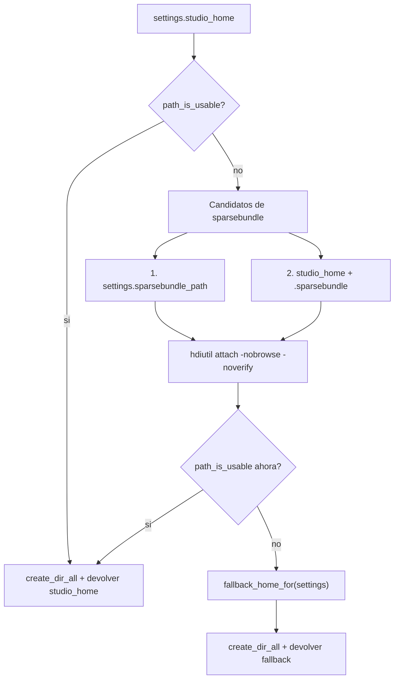

# 02 · Instalación y ejecución

> Estado: completo · Última revisión: 2026-08-27 · Versión analizada: 0.5.1 (commit f840055)

## Alcance de este documento

Este documento describe cómo preparar un equipo, instalar dependencias, configurar el
estado inicial, ejecutar el proyecto en desarrollo, empaquetarlo para producción, correr
las pruebas y generar la documentación en PDF.

Todo lo que aquí se afirma está contrastado contra el código del repositorio. Las fuentes
principales son:

- `../../package.json` (scripts, `packageManager`, dependencias)
- `../../src-tauri/src/system.rs` (resolución de rutas, variables de entorno, spawn de scripts)
- `../../src-tauri/src/models.rs` (estructura `AppSettings`)
- `../../scripts/mac/common.sh` (helpers compartidos por los instaladores)
- `../../scripts/mac/bootstrap.sh`, `../../scripts/mac/preflight-build.sh`, `../../scripts/mac/doctor.sh`
- `../../scripts/mac/build-release.sh`, `../../.cargo/config.toml`
- `../../scripts/docs/build-pdf.mjs`
- `../../.github/workflows/ci.yml` y `../../.github/workflows/release.yml`

Documentación previa del repositorio que se usa como referencia (y que se verifica, no se
copia): [`../REQUIREMENTS.md`](../REQUIREMENTS.md), [`../INSTALL_MAC.md`](../INSTALL_MAC.md),
[`../PACKAGE_MANAGER.md`](../PACKAGE_MANAGER.md), [`../TROUBLESHOOTING.md`](../TROUBLESHOOTING.md).

Documentos hermanos relacionados: [`03-architecture.md`](03-architecture.md),
[`07-database.md`](07-database.md), [`10-configuration.md`](10-configuration.md),
[`12-testing-and-quality.md`](12-testing-and-quality.md),
[`13-deployment-and-operations.md`](13-deployment-and-operations.md),
[`14-troubleshooting.md`](14-troubleshooting.md).

---

## 1. Requisitos previos

### 1.1 Plataforma soportada

La plataforma efectiva la determina en tiempo de compilación `current_platform_key()` en
`../../src-tauri/src/system.rs`:

```rust
pub fn current_platform_key() -> &'static str {
    if cfg!(target_os = "windows") {
        "win-x64"
    } else if cfg!(target_os = "macos") {
        if cfg!(target_arch = "aarch64") { "mac-arm64" } else { "mac-x64" }
    } else if cfg!(target_os = "linux") {
        "linux-x64"
    } else {
        "unknown"
    }
}
```

`get_system_summary` traduce esa clave a un nivel de soporte que la UI muestra:

| Clave de plataforma | `platform_support` | Origen |
|---|---|---|
| `mac-arm64` | `validated` | `get_system_summary` en `system.rs` |
| `win-x64` | `experimental` | `get_system_summary` en `system.rs` |
| `linux-x64` | `todo` | `get_system_summary` en `system.rs` |
| cualquier otra (incluye `mac-x64`) | `unsupported` | `get_system_summary` en `system.rs` |

Además, `platform_supported()` filtra cada manifiesto: si `apps/<id>.yaml` no declara el
campo `platforms`, la herramienta se asume **solo mac-arm64**. Todos los manifiestos
actuales de `../../apps/` declaran `platforms` explícitamente.

La versión mínima de macOS aparece declarada únicamente en el bundle:
`minimumSystemVersion: "13.0"` en `../../src-tauri/tauri.macos.conf.json`.

### 1.2 Cadena de herramientas para compilar el launcher

Estas son las dependencias que verifica `../../scripts/mac/preflight-build.sh` antes de
permitir un empaquetado:

| Requisito | Comprobación real en `preflight-build.sh` | Versión declarada en la documentación previa |
|---|---|---|
| Node.js | `command -v node` | 20 LTS+ (`../REQUIREMENTS.md`); CI usa `node-version: "20"` |
| pnpm | `command -v pnpm` | 10+; el pin exacto es `pnpm@10.29.3` en `packageManager` |
| Rust / Cargo | `command -v cargo` | 1.76+ según `../REQUIREMENTS.md` |
| Xcode Command Line Tools | `xcode-select -p` | «cualquier reciente» |

El script aborta con código 1 si falta cualquiera de los cuatro; si pasan, imprime las
versiones detectadas y `OK`.

Nota de verificación: `../../src-tauri/Cargo.toml` declara `edition = "2021"` pero **no**
declara `rust-version`, por lo que el mínimo 1.76 no es exigible por Cargo. La cifra
proviene de `../REQUIREMENTS.md` y no es verificable en el código. `../../package.json`
tampoco declara un campo `engines`, así que la versión de Node no se valida en
`pnpm install`; el único punto donde se fija es el `node-version: "20"` de los workflows.

### 1.3 Dependencias que necesitan las herramientas gestionadas

`../../scripts/mac/bootstrap.sh` distingue críticos de recomendados. Es el chequeo que
conviene correr antes de instalar herramientas desde la UI:

| Binario | Trato en `bootstrap.sh` | Para qué |
|---|---|---|
| `git` | crítico — `exit 1` si falta | clonado de repos de todas las herramientas |
| `python3` | crítico — `exit 1` si falta | entornos virtuales de las herramientas Python |
| `rustc` / `cargo` | advertencia | compilar el backend Tauri |
| `node` | advertencia | frontend y tooling |
| `pnpm` | advertencia, sugiere `corepack enable && corepack prepare pnpm@10 --activate` | gestor de paquetes único del repo |
| `uv` | informativo | acelera la creación de venvs; hay fallback a `pip` |
| `ffmpeg` | advertencia | FaceFusion y AceForge |
| `cmake` | advertencia | whisper.cpp |

`../../scripts/mac/install-qwen3-tts.sh` clona y crea el venv con `python3.10`, y
`../../apps/qwen3-tts.yaml` lo documenta en `notes`. `../../scripts/mac/install-comfyui.sh`
usa la detección genérica de `detect_python`, cuyo orden por defecto en
`../../scripts/mac/common.sh` es `python3.11 python3.10 python3.12 python3`.

### 1.4 Verificación automatizada del entorno

Hay tres scripts de diagnóstico, con propósitos distintos:

1. `bash scripts/mac/bootstrap.sh` — inventario de binarios del sistema. No recibe
   argumentos y nunca escribe en disco.
2. `bash scripts/mac/preflight-build.sh` — puerta de entrada del empaquetado. Falla duro.
   Es el primer paso de `../../scripts/mac/build-release.sh`.
3. `bash scripts/mac/doctor.sh "<ruta>"` — diagnóstico centrado en una ruta concreta:
   imprime el volumen (`df`), el espacio libre en GB (`df -g`), y la presencia de `git`,
   `python3`, `ffmpeg`, `cmake`, los `python3.1x` disponibles, `uv` y `cargo`. Si se omite
   el argumento, usa `$HOME/ChofyAIStudio`.

`doctor.sh` también es invocable desde la aplicación: el comando Tauri `run_doctor`
(`system.rs`) lo localiza vía `repo_root()` o, si la app está empaquetada, vía
`BaseDirectory::Resource`, lo ejecuta con `bash` y devuelve stdout + stderr concatenados.

---

## 2. Por qué pnpm y no npm

`../../package.json` fija el gestor:

```json
{
  "packageManager": "pnpm@10.29.3",
  "pnpm": {
    "onlyBuiltDependencies": ["esbuild"]
  }
}
```

Las dos claves son la parte verificable de la decisión documentada en
[`../PACKAGE_MANAGER.md`](../PACKAGE_MANAGER.md):

- `packageManager` es el pin que Corepack usa para descargar exactamente esa versión de
  pnpm. Los workflows `ci.yml`, `release.yml` y `security.yml` invocan
  `pnpm/action-setup@v4` **sin** parámetro `version`, con un comentario explícito de que
  la versión se lee de `package.json`. Es decir: el pin es efectivo también en CI.
- `pnpm.onlyBuiltDependencies` restringe la ejecución de scripts de ciclo de vida
  (`postinstall` y similares) a `esbuild`. Cualquier dependencia transitiva que intente
  ejecutar un script queda bloqueada sin necesidad de recordar `--ignore-scripts`.

`../../.npmrc` complementa el endurecimiento:

```ini
registry=https://registry.npmjs.org/
strict-peer-dependencies=false
resolution-mode=highest
audit-level=high
```

El motivo declarado del cambio es de superficie de ataque de cadena de suministro, no de
rendimiento. Consecuencia práctica para quien contribuye: **no usar `npm install`**. El
árbol de `node_modules` que produce npm es plano y permitiría importar dependencias no
declaradas, y no respetaría `onlyBuiltDependencies`.

Instalación del gestor:

```bash
corepack enable
corepack prepare pnpm@10 --activate
```

`../PACKAGE_MANAGER.md` desaconseja explícitamente `npm install -g pnpm`, porque la versión
global no coincidiría necesariamente con el pin.

Observación menor pero real: en `../../src/App.tsx` (línea 1874) el mensaje de bienvenida
del modo web todavía dice `npm run tauri:dev`. Es una cadena de UI desalineada con la
política de `pnpm`; no afecta al funcionamiento.

---

## 3. Instalación de dependencias

```bash
git clone https://github.com/vladimiracunadev-create/chofyai-studio.git
cd chofyai-studio
corepack enable && corepack prepare pnpm@10 --activate
pnpm install --frozen-lockfile
```

`--frozen-lockfile` es el modo que usan los tres workflows y
`../../scripts/mac/build-release.sh`. Falla si `../../pnpm-lock.yaml` no describe
exactamente el árbol que resolvería `../../package.json`, lo que impide que un
`pnpm install` local introduzca deriva silenciosa.

Las dependencias de Rust no requieren un paso aparte: `cargo` las resuelve desde
`../../src-tauri/Cargo.toml` y `../../src-tauri/Cargo.lock` en el primer `tauri dev` o
`tauri build`. El grafo directo del backend es deliberadamente corto:

| Crate | Uso verificable |
|---|---|
| `tauri` | runtime, comandos `#[tauri::command]`, `AppHandle`, `Emitter` |
| `serde` + `serde_json` | `AppSettings`, `processes.json`, respuestas a la UI |
| `serde_yaml` | parseo de `apps/*.yaml`, `marketplace/registry.yaml`, `workflows/*.yaml` |
| `walkdir` | recorrido de `apps/` y del árbol de modelos |
| `thiserror` | declarada en `Cargo.toml`; no se localizó ningún `derive(Error)` en `src-tauri/src/` — Requiere validación (posible dependencia sin uso) |

---

## 4. Variables de entorno que usa realmente el sistema

Esta tabla es el resultado de rastrear cada variable en el código, no de la documentación
previa. La columna «quién la inyecta» distingue las que la aplicación fija por su cuenta de
las que solo tienen sentido si el usuario las exporta a mano.

| Variable | Quién la inyecta | Quién la lee | Efecto verificado |
|---|---|---|---|
| `CHOFYAI_STUDIO_HOME` | Rust, en `run_install_script`, `download_tool_model`, `start_tool` y `restart_tool` de `system.rs` | `resolve_studio_home()` en `scripts/mac/common.sh`; `Resolve-StudioHome` en `scripts/win/common.ps1` | Raíz efectiva del Studio Home para el proceso hijo, ya resuelta por `resolve_effective_home` |
| `STUDIO_HOME` | nadie en el repositorio | `scripts/mac/common.sh` y `scripts/win/common.ps1` como alias secundario | Alias de compatibilidad; solo útil si se exporta manualmente |
| `CHOFYAI_MODELS_DIR` | Rust, en `apply_path_env` de `system.rs` | helper `resolve_models_dir()` en `common.sh`; `Resolve-ModelsDir` en `common.ps1` | Sobrescribe `<studio_home>/models` **para quien invoque el helper** |
| `CHOFYAI_OUTPUTS_DIR` | Rust, en `apply_path_env` | helper `resolve_outputs_dir()` / `Resolve-OutputsDir` | Sobrescribe `<studio_home>/outputs` en las mismas condiciones |
| `CHOFYAI_CACHE_DIR` | Rust, en `apply_path_env` | helper `resolve_cache_dir()` / `Resolve-CacheDir` | Sobrescribe `<studio_home>/cache` en las mismas condiciones |
| `CHOFYAI_DISABLE_UV` | nadie; se exporta a mano | `detect_uv()` en `common.sh`; `common.ps1` línea 63 | Con valor `1`, `detect_uv` devuelve fallo y los scripts caen a `python -m venv` + `pip` |
| `CHOFYAI_CHROME` | nadie; se exporta a mano | `findChrome()` en `scripts/docs/build-pdf.mjs` | Primer candidato de la lista de binarios de navegador para imprimir el PDF |
| `CHOFYAI_SKIP_MERMAID` | nadie; se exporta a mano | `ensureMermaid()` en `scripts/docs/build-pdf.mjs` | Con valor `1`, no se descarga ni inyecta `mermaid.min.js`; los diagramas salen como texto |
| `CARGO_TARGET_DIR` | el job `build-macos` de `.github/workflows/release.yml` | Cargo | Anula el `target-dir` de `.cargo/config.toml` en el runner alojado |
| `HOME` / `USERPROFILE` | el sistema operativo | `home_dir()` en `system.rs` | Base de `default_studio_home()`; si ninguna existe, `home_dir()` cae a `"."` |

Advertencia importante sobre las tres variables de rutas: **ningún script de instalación de
macOS invoca hoy `resolve_models_dir`, `resolve_outputs_dir` ni `resolve_cache_dir`**. Los
instaladores calculan sus rutas directamente (por ejemplo `MODELS_DIR="$INSTALL_DIR/models"`
en `../../scripts/mac/install-whispercpp.sh`, o `CACHE_DIR="$STUDIO_HOME/cache/aceforge"` en
`../../scripts/mac/install-aceforge.sh`). Lo mismo ocurre en Windows: `common.ps1` define
`Resolve-ModelsDir`/`Resolve-OutputsDir`/`Resolve-CacheDir` pero ningún `install-*.ps1` las
llama. Consecuencia: hoy las variables se inyectan pero no cambian el comportamiento de
ninguna instalación. Es una capacidad cableada a medias, no una configuración operativa.
El detalle completo está en [`10-configuration.md`](10-configuration.md).

---

## 5. Configuración inicial

### 5.1 El archivo `storage/state/settings.json`

En un árbol de trabajo (ejecución desde el repositorio) la configuración vive en
`../../storage/state/settings.json`. El contenido versionado en el commit analizado es:

```json
{
  "studio_home": "/Volumes/ChofyAIStudio",
  "tool_overrides": {},
  "fallback_home": null,
  "sparsebundle_path": "/Volumes/ORICO/ChofyIA/ChofyAIStudio.sparsebundle"
}
```

Los campos `models_dir`, `outputs_dir` y `cache_dir` están ausentes; no es un error, porque
en `AppSettings` (`../../src-tauri/src/models.rs`) todos los campos salvo `studio_home`
llevan `#[serde(default)]`. El esquema campo a campo está en
[`10-configuration.md`](10-configuration.md).

Para un equipo nuevo, lo mínimo funcional es:

```json
{
  "studio_home": "/Users/tuusuario/ChofyAIStudio",
  "tool_overrides": {}
}
```

### 5.2 Elección de `studio_home`

`resolve_effective_home()` en `../../src-tauri/src/system.rs` decide la ruta que se usa
realmente. El algoritmo es este:



Puntos que conviene entender antes de elegir una ruta:

- `path_is_usable()` no se limita a comprobar existencia: si el directorio existe, exige que
  sea escribible mediante `is_writable_dir()`, que escribe y borra un archivo sonda
  `.chofyai-write-probe`. Si no existe, sube por los ancestros hasta el primero montado y
  aplica la misma prueba.
- El montaje automático del sparsebundle se intenta con dos candidatos y en este orden:
  el valor explícito de `sparsebundle_path`, y luego la convención
  `<studio_home>.sparsebundle`.
- `fallback_home_for()` devuelve `settings.fallback_home` si no está vacío; si no, el valor
  de `default_studio_home()`, que es `home_dir().join("ChofyAIStudio")`.
- Cuando la ruta efectiva difiere de la solicitada, `get_system_summary` marca
  `using_fallback: true` y la UI lo señala.

Recomendación técnica sostenida por el código y por `../REQUIREMENTS.md`: usar APFS. Los
volúmenes exFAT/HFS+/NTFS generan archivos AppleDouble `._*` que rompen la instalación de
wheels de Python; el propio backend filtra esos nombres al listar modelos
(`list_tool_models` descarta entradas que empiezan por `._` y `.DS_Store`), lo que confirma
que el problema es real y recurrente.

### 5.3 Imagen APFS sparsebundle sobre un disco no-APFS

Procedimiento verificable contra `../../scripts/mac/mount-apfs.sh` y contra el auto-montaje
de `resolve_effective_home`:

```bash
EXT="/Volumes/MiDiscoExterno"
SBUNDLE="$EXT/ChofyAIStudio.sparsebundle"

hdiutil create -size 100g -fs APFS -volname ChofyAIStudio -type SPARSEBUNDLE "$SBUNDLE"
bash scripts/mac/mount-apfs.sh "$SBUNDLE" /Volumes/ChofyAIStudio
diskutil info /Volumes/ChofyAIStudio | grep "File System Personality"
```

`mount-apfs.sh` hace `hdiutil attach ... -nobrowse` y además crea
`"$MOUNT_PATH/studio_home"`. Ese subdirectorio **no** es el que espera el resto del sistema:
`settings.studio_home` debe apuntar al punto de montaje que se vaya a usar de verdad. Si se
apunta a `/Volumes/ChofyAIStudio`, el subdirectorio `studio_home/` queda simplemente sin uso.
Marcar como inconsistencia menor del script.

Para que la aplicación monte sola la imagen en arranques posteriores, `settings.json` debe
incluir `sparsebundle_path` con la ruta absoluta de la imagen; ese es exactamente el caso
que resuelve `resolve_effective_home`.

### 5.4 Árbol de directorios que crea el sistema

Las rutas se derivan de funciones concretas, no de convención:

| Ruta | Función que la construye | Cuándo se crea |
|---|---|---|
| `<studio_home>/tools/<tool_id>` | `manifest_install_dir()`, valor por defecto `tools/{id}` si el manifiesto no declara `studio_home_subdir` | al instalar la herramienta |
| `<studio_home>/logs` | `log_dir()` | en `run_install_script`, `start_tool` y `download_tool_model` |
| `<studio_home>/logs/<tool_id>-install.log` | `run_install_script` | al terminar una instalación |
| `<studio_home>/logs/<tool_id>-run.log` | `start_tool` | al arrancar una herramienta |
| `<studio_home>/logs/<tool_id>-model-download.log` | `download_tool_model` | al descargar un modelo |
| `<install_dir>/models` | `resolve_models_dir()` en `system.rs` | al listar o descargar modelos |
| `<studio_home>/models`, `/outputs`, `/cache` | `effective_models_dir()`, `effective_outputs_dir()`, `effective_cache_dir()` | solo si algo los usa; los scripts actuales crean sus propias variantes |

Preparación manual equivalente a lo que documenta [`../INSTALL_MAC.md`](../INSTALL_MAC.md):

```bash
mkdir -p /Users/tuusuario/ChofyAIStudio/{tools,logs,models,cache,outputs}
```

No es estrictamente necesario: `run_install_script` y `start_tool` hacen
`fs::create_dir_all` de lo que necesitan.

---

## 6. Creación y restauración del estado persistente

Este proyecto **no tiene motor de base de datos**. No hay SQLite, ni Postgres, ni ORM, ni
migraciones: `../../src-tauri/Cargo.toml` no declara ninguna dependencia de base de datos, y
no existe ningún directorio de migraciones en el árbol. La persistencia es un conjunto
pequeño de archivos y un árbol de directorios. El modelo de datos completo está en
[`07-database.md`](07-database.md); aquí se documenta solo cómo crearlo y restaurarlo.

### 6.1 Dónde vive el estado

`app_paths()` en `../../src-tauri/src/system.rs` decide la ubicación según el modo de
ejecución:

```rust
fn app_paths(app: &AppHandle) -> Result<AppPaths, String> {
    if let Some(root) = repo_root() {
        return Ok(AppPaths {
            apps_dir: root.join("apps"),
            settings_path: root.join("storage").join("state").join("settings.json"),
        });
    }
    let app_data_dir = app.path().app_data_dir().map_err(|e| e.to_string())?;
    Ok(AppPaths {
        apps_dir: resolve_resource_path(app, "apps")?,
        settings_path: app_data_dir.join("state").join("settings.json"),
    })
}
```

| Artefacto | Ruta en desarrollo | Ruta en aplicación empaquetada |
|---|---|---|
| `settings.json` | `storage/state/settings.json` del repositorio | `<app_data_dir>/state/settings.json` |
| `processes.json` | `storage/state/processes.json` | `<app_data_dir>/state/processes.json` |
| `crash.log` | `storage/state/crash.log` | `<app_data_dir>/state/crash.log` |
| manifiestos `apps/*.yaml` | `apps/` del repositorio | recurso del bundle |
| datos de las herramientas | `<studio_home>/…` | `<studio_home>/…` |

`processes.json` y `crash.log` se construyen a partir del padre de `settings_path`
(`processes_state_path()`), por lo que siempre acompañan al archivo de configuración.

El valor concreto de `app_data_dir` lo resuelve Tauri a partir del `identifier` de
`../../src-tauri/tauri.conf.json` (`cl.vladimiracuna.chofyai.studio`). La ruta exacta en
macOS es convención de Tauri y no está escrita en este repositorio: **Inferencia basada en
el código**.

### 6.2 Creación desde cero

No hace falta ningún comando de inicialización. `load_settings()` es tolerante:

```rust
fn load_settings(app: &AppHandle) -> Result<AppSettings, String> {
    let path = settings_path(app)?;
    if let Ok(contents) = fs::read_to_string(&path) {
        if let Ok(parsed) = serde_json::from_str::<AppSettings>(&contents) {
            return Ok(parsed);
        }
    }
    Ok(AppSettings { /* studio_home: default_studio_home(), resto vacío */ })
}
```

Si el archivo no existe o no parsea, se devuelven valores por defecto **sin escribir nada y
sin emitir error**. El archivo se materializa la primera vez que la UI llama a
`save_studio_home` o `save_path_settings`, que pasan por `save_settings_to_disk` →
`ensure_parent` → `fs::create_dir_all`.

El árbol de `studio_home` se crea de forma incremental: `resolve_effective_home` hace
`create_dir_all` de la raíz elegida, y cada instalación crea sus subdirectorios.

### 6.3 Restauración y respaldo

Al no haber base de datos, respaldar es copiar:

```bash
# Configuración y estado de la aplicación (desarrollo)
cp -a storage/state /ruta/de/respaldo/chofyai-state

# Datos pesados: herramientas, modelos, salidas y logs
rsync -a --delete "/Volumes/ChofyAIStudio/" /ruta/de/respaldo/studio-home/
```

Restaurar consiste en devolver `settings.json` a su sitio y volver a apuntar `studio_home`
a la ruta correcta. Dos matices comprobados en el código:

- Si el `studio_home` restaurado no está montado o no es escribible, el arranque no falla:
  cae al fallback y la UI marca `using_fallback`. Los datos no se pierden, simplemente no se
  ven hasta remontar el volumen.
- `restore_registry()` se ejecuta en el `setup` de `../../src-tauri/src/lib.rs`, lee
  `processes.json`, descarta con `pid_is_alive()` los PID que ya no existen y reescribe el
  archivo depurado. Es decir, un `processes.json` heredado de otra sesión o de otra máquina
  se limpia solo y no requiere intervención.

Si se prefiere partir de cero, basta con borrar `settings.json`, `processes.json` y
`crash.log`; la próxima ejecución regenera lo necesario.

### 6.4 Observación sobre el control de versiones

`../../.gitignore` ignora `storage/state/settings.local.json` y `storage/state/runtime/`,
pero **no** `storage/state/processes.json` ni `storage/state/crash.log`. Ejecutar la
aplicación desde el repositorio deja esos dos archivos como no rastreados. Es un detalle a
tener presente al preparar un commit; no afecta al funcionamiento.

---

## 7. Ejecución en desarrollo

### 7.1 Dos modos, una misma interfaz

```bash
pnpm dev:web     # solo frontend: vite
pnpm tauri:dev   # aplicación de escritorio completa: tauri dev
```

`../../vite.config.ts` fija el servidor de desarrollo:

```ts
server: {
  port: 1420,
  strictPort: true,
  host: '127.0.0.1',
}
```

`strictPort: true` significa que si el 1420 está ocupado, Vite falla en lugar de saltar a
otro puerto. Es deliberado: `../../src-tauri/tauri.conf.json` declara
`"devUrl": "http://localhost:1420"`, y un cambio de puerto dejaría la ventana de Tauri
apuntando a la nada.

`tauri dev` no arranca Vite por su cuenta: lo lanza a través de
`"beforeDevCommand": "pnpm dev:web"` de `tauri.conf.json`. Por eso `pnpm tauri:dev` levanta
ambos procesos.

### 7.2 Qué cambia entre los dos modos: `inTauri`

La diferencia funcional está concentrada en una única expresión de `../../src/App.tsx`:

```ts
const inTauri = typeof window !== 'undefined' && '__TAURI_INTERNALS__' in window;
```

`__TAURI_INTERNALS__` solo lo inyecta el runtime de Tauri en el contexto de la ventana
nativa. En `pnpm dev:web` la comprobación es falsa y el comportamiento observable es:

- La función de escucha de eventos (`App.tsx` línea 34) retorna inmediatamente, así que no
  se suscribe a `install-progress`, `install-done` ni a los eventos de descarga de modelos.
- El invocador de comandos (`App.tsx` línea 95) devuelve `null` sin llamar a nada, de modo
  que cada botón que dependa de un `#[tauri::command]` queda inerte.
- Los efectos de arranque y de refresco periódico (líneas 1920, 2060, 2076, 2083, 2119 y
  2155) retornan antes de hacer nada, incluidos el sondeo de estadísticas del sistema y el
  chequeo de salud de las herramientas.
- El mensaje de bienvenida cambia al texto de «Modo web (sin backend)».

Lo que sí funciona en modo web: maquetación, tema, idioma, `onboarding` y cualquier lógica
puramente de cliente. Es útil para iterar interfaz sin recompilar Rust, y es también el modo
en que los tests de Vitest ejercitan `utils.ts` e `i18n.ts`.

### 7.3 Nota sobre el `PATH`

`../../scripts/mac/common.sh` antepone rutas de Homebrew en su primera línea ejecutable:

```bash
export PATH="/opt/homebrew/bin:/opt/homebrew/sbin:/usr/local/bin:$HOME/.local/bin:$PATH"
```

El motivo declarado en el propio comentario es que Tauri lanza los scripts sin una shell
interactiva. Los procesos de ejecución de herramientas (`start_tool`, `restart_tool`) no
pasan por `common.sh`: usan `bash -lc <comando>` mediante `shell_inline_command()`, es decir
una *login shell*, que sí carga el perfil del usuario. Son dos mecanismos distintos para el
mismo problema.

---

## 8. Ejecución y empaquetado en producción

### 8.1 Scripts disponibles

| Comando | Definición en `package.json` | Resultado |
|---|---|---|
| `pnpm build:web` | `vite build` | frontend estático en `dist/` |
| `pnpm preview` | `vite preview` | sirve `dist/` para inspección |
| `pnpm tauri:build` | `tauri build` | bundles según `tauri.conf.json` (`app`, `dmg`) |
| `pnpm tauri:build:app` | `tauri build --bundles app` | solo `.app` |
| `pnpm tauri:build:dmg` | `tauri build --bundles dmg` | solo `.dmg` |
| `pnpm tauri:build:mac` | `tauri build --config src-tauri/tauri.macos.conf.json --bundles app,dmg` | `.app` + `.dmg` con la configuración macOS |
| `pnpm package:mac` | `bash scripts/mac/build-release.sh` | pipeline completo |
| `pnpm preflight:mac` | `bash scripts/mac/preflight-build.sh` | solo la verificación previa |

`tauri build` invoca `"beforeBuildCommand": "pnpm build:web"` por su cuenta, de modo que
`pnpm build:web` explícito solo hace falta si se quiere compilar el frontend por separado.

### 8.2 El pipeline de `build-release.sh`

`../../scripts/mac/build-release.sh` es corto y determinista:

1. Se sitúa en la raíz del repositorio (`cd "$ROOT_DIR"`).
2. Ejecuta `bash scripts/mac/preflight-build.sh`.
3. `pnpm install --frozen-lockfile`.
4. `pnpm build:web`.
5. `pnpm tauri:build:mac`.

### 8.3 `.cargo/config.toml` y el problema de los archivos AppleDouble

```toml
[build]
target-dir = "/tmp/chofyai-target"
```

El comentario del propio archivo explica la causa: en volúmenes que no son APFS, macOS crea
archivos sidecar `._*` (AppleDouble). Cuando esos archivos aparecen dentro del árbol que
Tauri lee — por ejemplo en `src-tauri/gen/schemas/` o en los TOML autogenerados de permisos
— el parseo falla con un error de UTF-8 inválido. Redirigir el directorio de compilación a
`/tmp` (siempre APFS) elimina la fuente principal del problema.

Consecuencias operativas verificadas:

- La salida real del empaquetado local queda en `/tmp/chofyai-target/release/bundle/…`, tal
  como documenta [`../INSTALL_MAC.md`](../INSTALL_MAC.md).
- Sin embargo, `build-release.sh` imprime al final `src-tauri/target/release/bundle/macos/`
  y `.../dmg/`. **Ese mensaje es incorrecto cuando `.cargo/config.toml` está activo**: las
  rutas anunciadas no contendrán los bundles. Es una discrepancia real entre script y
  configuración, no una ambigüedad de documentación.
- En CI el problema no existe: el job `build-macos` de `release.yml` exporta
  `CARGO_TARGET_DIR: ${{ github.workspace }}/src-tauri/target`, que tiene prioridad sobre
  `.cargo/config.toml`; por eso los pasos posteriores del workflow sí encuentran los bundles
  en `src-tauri/target/release/bundle/`.
- `/tmp/chofyai-target/` figura en `../../.gitignore`, lo cual es inocuo dado que la ruta es
  absoluta y queda fuera del árbol.

Para los archivos `._*` que ya estén en el árbol de fuentes existe
`../../scripts/mac/clean-appledouble.sh`, que borra recursivamente los `._*` excluyendo
`node_modules/` y `.git/`, e informa cuántos eliminó.

### 8.4 Firma, permisos y versión del bundle

- `../../src-tauri/Entitlements.plist` habilita `allow-jit`,
  `allow-unsigned-executable-memory` y `disable-library-validation`. Son los permisos que
  requieren los runtimes de Python y los backends acelerados que la aplicación lanza.
- `../../src-tauri/Info.plist` declara `NSHighResolutionCapable`,
  `NSSupportsAutomaticGraphicsSwitching` y la categoría `public.app-category.developer-tools`.
- `release.yml` produce un bundle **ad-hoc**, sin Developer ID. El texto de la release lo
  advierte y remite a `../NOTARIZATION.md`.
- Discrepancia de versión detectada: `../../package.json` y `../../src-tauri/Cargo.toml`
  declaran `0.5.1`, pero `../../src-tauri/tauri.conf.json` declara `"version": "0.5.0"`. La
  versión que la UI muestra proviene de `env!("CARGO_PKG_VERSION")` en `get_system_summary`,
  es decir `0.5.1`, mientras que el nombre del `.dmg` lo genera Tauri a partir de la versión
  de `tauri.conf.json`. El resultado es un artefacto llamado `0.5.0` que reporta ser `0.5.1`.

---

## 9. Ejecución de pruebas

### 9.1 Frontend

```bash
pnpm test        # vitest run
pnpm test:watch  # vitest
```

Detalles verificados:

- No existe archivo de configuración de Vitest ni bloque `test` en
  `../../vite.config.ts`. Se usa la configuración por defecto, cuyo entorno es Node.
- El entorno de navegador se declara por archivo: `../../src/i18n.test.ts` empieza con
  `// @vitest-environment jsdom`, porque `i18n.ts` accede a `localStorage`.
  `../../src/utils.test.ts` no lo necesita.
- `jsdom` y `@vitest/ui` están en `devDependencies`; `@vitest/ui` no tiene script asociado en
  `package.json` (se usaría con `pnpm exec vitest --ui`).
- La cobertura real es de dos módulos: `utils.ts` (`fmtBytes`, `fmtElapsed`,
  `parseInstallLine`) e `i18n.ts`. `App.tsx` no tiene pruebas.

### 9.2 Backend

```bash
pnpm test:rust   # cd src-tauri && cargo test
```

Las pruebas viven en el módulo `#[cfg(test)]` al final de
`../../src-tauri/src/system.rs`: `pid_alive_for_self_is_true`, `pid_alive_for_zero_is_false`,
`delete_model_rejects_path_traversal` y `read_disk_usage_returns_two_values`.

### 9.3 Diferencia con lo que ejecuta CI

El job `test-rust` de `../../.github/workflows/ci.yml` **no** usa el script de
`package.json`; corre directamente:

```bash
cargo test --no-default-features
```

sobre `working-directory: src-tauri`, en `ubuntu-latest`, tras instalar `libgtk-3-dev`,
`libwebkit2gtk-4.1-dev`, `libayatana-appindicator3-dev`, `librsvg2-dev` y `libsoup-3.0-dev`.
Dos observaciones:

- La bandera `--no-default-features` se aplica al paquete `chofyai_studio`, que **no declara
  una tabla `[features]`** en su `Cargo.toml`. Con `default` implícitamente vacío, la bandera
  no altera la compilación del crate local. Parece una salvaguarda defensiva heredada —
  Inferencia basada en el código.
- Las cuatro pruebas dependen de utilidades POSIX (`kill -0`, `df`) y por eso pasan en Linux
  aunque el objetivo del producto sea macOS. `pid_alive_for_zero_is_false` documenta en un
  comentario que se eligió el PID `999_999_999` en lugar de `0` precisamente por la semántica
  distinta de `kill -0 0` en Linux.

El resto de comprobaciones de CI (`typecheck` con `pnpm exec tsc --noEmit`, `Vitest`,
`markdownlint-cli2` y la validación de manifiestos con PyYAML) se describe en
[`12-testing-and-quality.md`](12-testing-and-quality.md).

---

## 10. Generación de la documentación en PDF

```bash
node scripts/docs/build-pdf.mjs          # todos los documentos
node scripts/docs/build-pdf.mjs 03       # solo los que empiecen por "03"
CHOFYAI_SKIP_MERMAID=1 node scripts/docs/build-pdf.mjs
CHOFYAI_CHROME="/Applications/Chromium.app/Contents/MacOS/Chromium" node scripts/docs/build-pdf.mjs
```

No hay script de `package.json` asociado: se invoca con `node` directamente.

Cómo funciona, según `../../scripts/docs/build-pdf.mjs`:

1. Lee los `.md` de `docs/system-documentation/`, descartando los que empiezan por `._`, y
   los filtra por el prefijo pasado como primer argumento.
2. Los convierte a HTML con un renderizador propio incluido en el archivo. El comentario de
   cabecera justifica la decisión: evitar añadir `marked` o `puppeteer` al `package.json`,
   que está fijado por razones de cadena de suministro.
3. Envuelve el HTML con portada, índice y estilos de impresión A4. El índice solo se emite si
   el documento tiene al menos cuatro encabezados de nivel 2.
4. Los bloques ` ```mermaid ` se emiten como `<pre class="mermaid">` y se renderizan con
   `mermaid@11.4.1`, descargado una vez desde jsDelivr y cacheado en
   `<tmpdir>/chofyai-docs-cache/mermaid.min.js`. Si no hay red ni caché, el script avisa y
   continúa: los diagramas quedan como texto. Es degradación, no error.
5. Imprime con Chrome en modo `--headless=new`, vigilando el tamaño del PDF de salida: dos
   lecturas consecutivas con el mismo tamaño mayor de 1 KB se consideran escritura
   terminada; el límite duro es de 60 segundos por documento.

Requisitos: Node 18 o superior, un navegador basado en Chromium instalado (o
`CHOFYAI_CHROME` apuntando al binario), y red la primera vez si se quieren diagramas.

Los metadatos de la portada se calculan en el momento: la versión sale de
`../../package.json` y el commit corto de `git rev-parse --short HEAD`, con
`'desconocida'` y cadena vacía como respaldos.

Salida: un PDF por Markdown, mismo nombre base, en `docs/system-documentation/pdf/`.

---

## 11. Errores frecuentes de instalación

Cada fila está contrastada contra el código que produce el síntoma. La guía extendida está
en [`14-troubleshooting.md`](14-troubleshooting.md) y en
[`../TROUBLESHOOTING.md`](../TROUBLESHOOTING.md).

| Síntoma | Causa verificada | Solución |
|---|---|---|
| `stream did not contain valid UTF-8` al compilar, sobre un archivo `._algo.toml` | Archivos AppleDouble en un volumen no-APFS; Cargo/Tauri los parsea como fuente | `bash scripts/mac/clean-appledouble.sh` y reintentar; `.cargo/config.toml` ya mueve `target-dir` a `/tmp/chofyai-target` |
| `pnpm install` falla con conflicto de lockfile | `--frozen-lockfile` detecta deriva entre `package.json` y `pnpm-lock.yaml` | Regenerar el lockfile con `pnpm install` sin la bandera y revisar el diff resultante |
| `pnpm: command not found` | Corepack no activado | `corepack enable && corepack prepare pnpm@10 --activate`; nunca `npm install -g pnpm` |
| `Preflight falló` sin más detalle | Falta `node`, `pnpm`, `cargo` o Xcode CLT — `preflight-build.sh` lista lo que falta antes de abortar | Instalar lo indicado; `xcode-select --install` para las CLT |
| Los botones de la UI no hacen nada | Se está en `pnpm dev:web`: `inTauri` es `false` y el invocador de comandos devuelve `null` | Usar `pnpm tauri:dev` |
| Todas las herramientas aparecen como no instaladas | El volumen de `studio_home` no está montado; `resolve_effective_home` cayó al fallback | Montar el volumen, o declarar `sparsebundle_path` en `settings.json` para el auto-montaje |
| Instalación de wheels que falla en `numba`, `sympy`, `markupsafe` | Sidecar `._*` en filesystem exFAT/HFS+/NTFS interpretado como entrada real del wheel | Migrar `studio_home` a APFS o a una imagen sparsebundle APFS |
| `<tool> no soporta la plataforma actual (…)` | `platform_supported()` no encontró la clave actual en `manifest.platforms` | Es esperado fuera de mac-arm64; ver `../PORTING_GUIDE.md` |
| `Instalación de X terminó pero faltan artefactos: …` | El script salió con código 0 pero la post-validación de `installed_if` en `run_install_script` encontró rutas ausentes | Abrir el log indicado en el mensaje, dentro de `<studio_home>/logs/` |
| `X no está instalado correctamente. Faltan: …` al pulsar Iniciar | `start_tool` valida `installed_if` antes del `spawn` | Reinstalar desde la interfaz |
| `No existe el helper: …download-hf-model.sh` | `script_path()` no encontró el script ni por `repo_root()` ni entre los recursos del bundle | Ejecutar desde la raíz del repositorio, o revisar la lista `bundle.resources` de `tauri.conf.json` |
| Un puerto sigue ocupado tras cerrar la aplicación | Proceso huérfano no registrado; `start_tool` mata al ocupante del puerto vía `lsof` antes de arrancar | Usar los comandos `list_orphan_ports` / `kill_orphan` desde la interfaz, o `lsof -i :<puerto>` |
| `No encontré Chrome/Chromium` al generar los PDF | `findChrome()` recorrió su lista de candidatos sin éxito | Instalar un navegador Chromium o exportar `CHOFYAI_CHROME` |
| Las instalaciones de Python van muy lentas | `uv` no está presente y los scripts usan `python -m venv` + `pip` | `brew install uv`; para forzar el camino clásico a propósito, `CHOFYAI_DISABLE_UV=1` |

---

## 12. Tabla de comandos verificables

Todos los comandos están definidos en `../../package.json`, en `../../scripts/` o en los
workflows; ninguno es una recomendación genérica.

| Comando | Qué hace | Definido en |
|---|---|---|
| `corepack enable && corepack prepare pnpm@10 --activate` | Activa la versión de pnpm fijada en `packageManager` | `../PACKAGE_MANAGER.md`, `bootstrap.sh` |
| `pnpm install --frozen-lockfile` | Instala dependencias sin permitir deriva del lockfile | `build-release.sh`, `ci.yml`, `release.yml` |
| `bash scripts/mac/bootstrap.sh` | Inventario de binarios del sistema con ✅/⚠️ por dependencia | `scripts/mac/bootstrap.sh` |
| `bash scripts/mac/preflight-build.sh` | Verifica `node`, `pnpm`, `cargo` y Xcode CLT; aborta si falta alguno | `scripts/mac/preflight-build.sh` |
| `pnpm preflight:mac` | Alias del anterior | `package.json` |
| `bash scripts/mac/doctor.sh "<ruta>"` | Diagnóstico de volumen, espacio y toolchain sobre una ruta concreta | `scripts/mac/doctor.sh` |
| `pnpm dev:web` | Vite en `127.0.0.1:1420`, sin backend | `package.json` |
| `pnpm tauri:dev` | Aplicación completa; lanza Vite vía `beforeDevCommand` | `package.json` |
| `pnpm build:web` | Compila el frontend a `dist/` | `package.json` |
| `pnpm tauri:build:app` | Genera solo el `.app` | `package.json` |
| `pnpm tauri:build:dmg` | Genera solo el `.dmg` | `package.json` |
| `pnpm tauri:build:mac` | `.app` + `.dmg` con `tauri.macos.conf.json` | `package.json` |
| `pnpm package:mac` | Pipeline completo: preflight, instalación, frontend y bundles | `package.json` → `scripts/mac/build-release.sh` |
| `bash scripts/mac/clean-appledouble.sh` | Borra los `._*` del árbol excluyendo `node_modules/` y `.git/` | `scripts/mac/clean-appledouble.sh` |
| `bash scripts/mac/mount-apfs.sh  [mountpoint]` | Monta una imagen sparsebundle con `hdiutil attach -nobrowse` | `scripts/mac/mount-apfs.sh` |
| `pnpm test` | Vitest en modo `run` | `package.json` |
| `pnpm test:watch` | Vitest en modo interactivo | `package.json` |
| `pnpm test:rust` | `cargo test` dentro de `src-tauri` | `package.json` |
| `pnpm exec tsc --noEmit` | Comprobación de tipos, igual que el job `typecheck` | `.github/workflows/ci.yml` |
| `pnpm audit --prod --audit-level high` | Auditoría de dependencias de producción | `.github/workflows/security.yml` |
| `node scripts/docs/build-pdf.mjs [prefijo]` | Genera los PDF de esta documentación | `scripts/docs/build-pdf.mjs` |
| `bash scripts/mac/install-<tool>.sh` | Instala una herramienta sin pasar por la interfaz | `scripts/mac/install-*.sh` |
| `bash scripts/mac/download-hf-model.sh <repo_id> <destino>` | Descarga un repositorio de Hugging Face a un directorio | `scripts/mac/download-hf-model.sh` |
