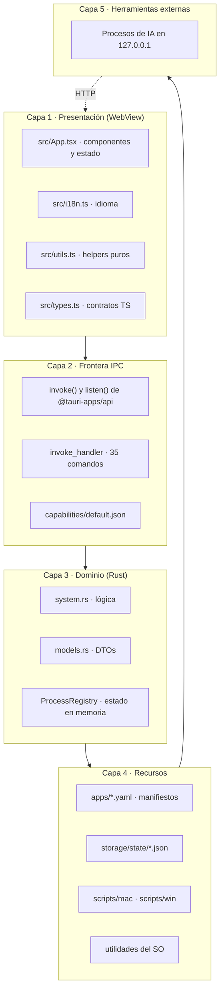
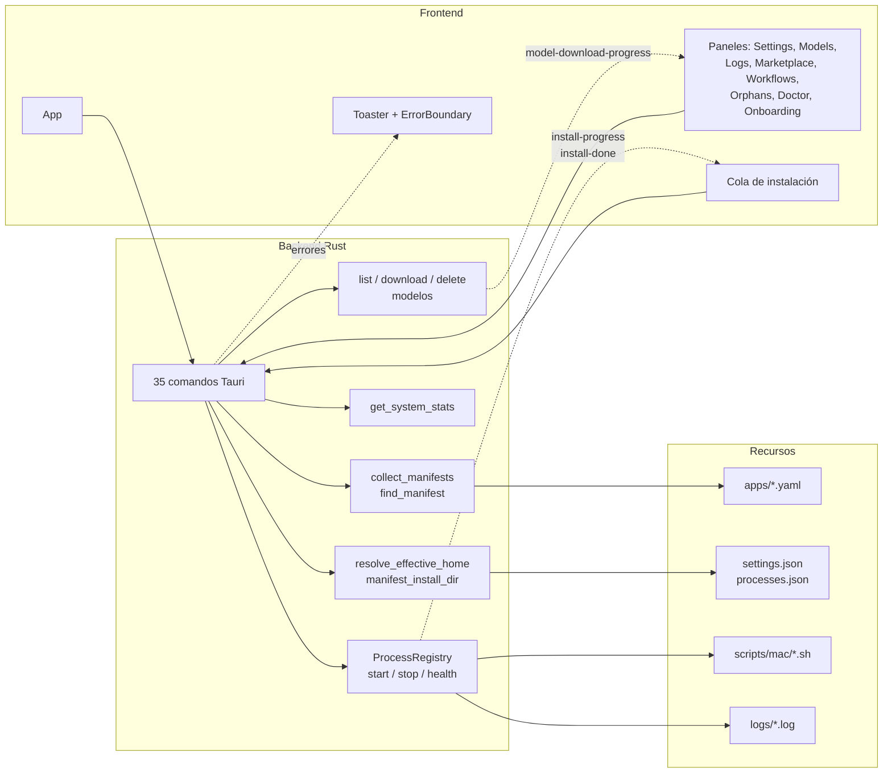
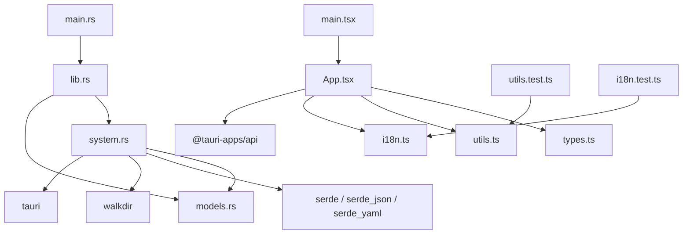
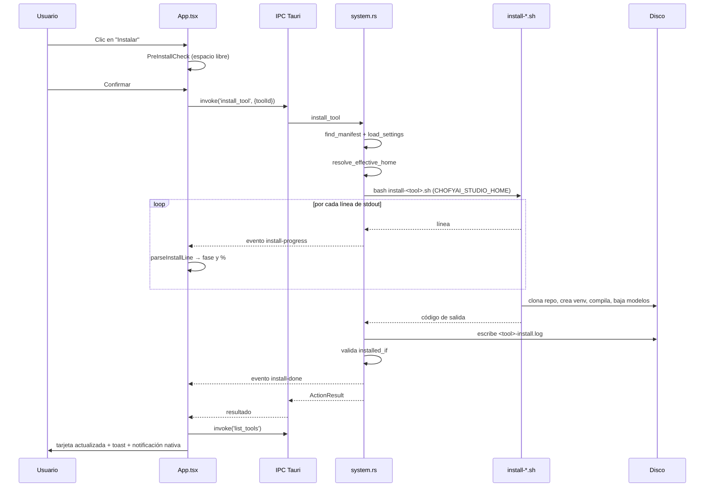
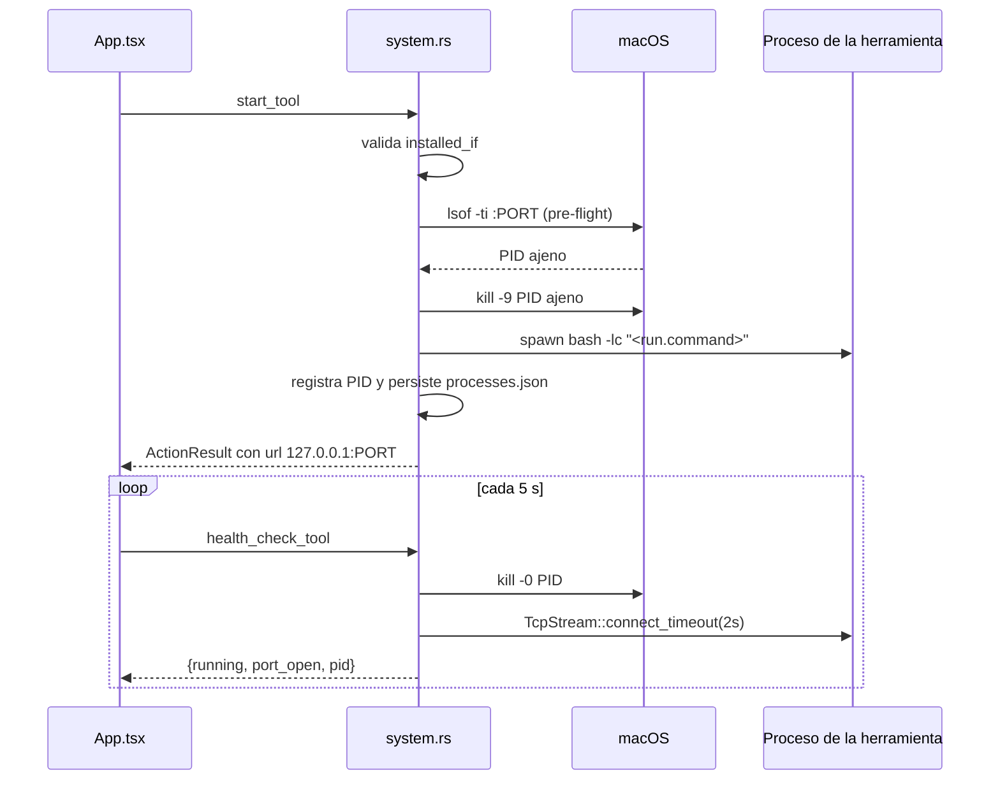
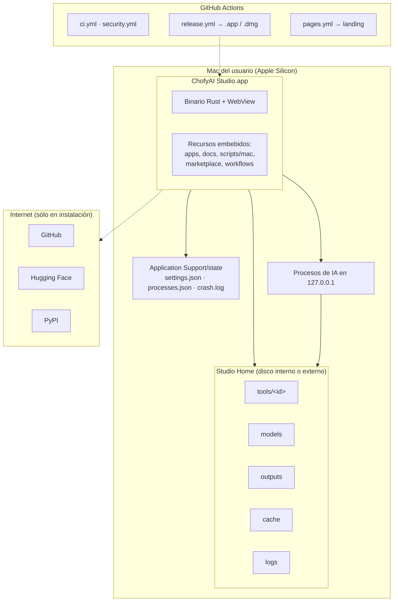
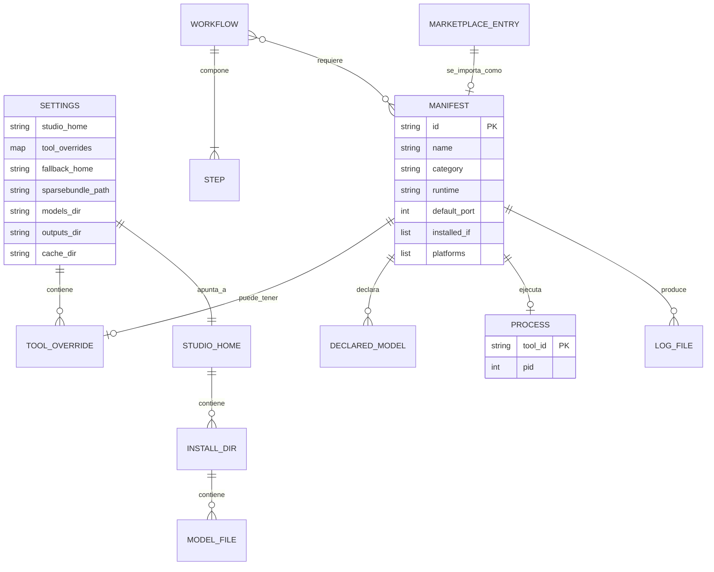

# 03 · Arquitectura

> Estado: completo · Última revisión: 2026-08-27 · Versión analizada: 0.5.1 (commit f840055)

## 1. Estilo arquitectónico

ChofyAI Studio es una **aplicación de escritorio monolítica con backend embebido**,
construida sobre Tauri 2. No hay microservicios, ni cliente-servidor remoto, ni base de
datos: hay un único proceso propietario que contiene un WebView con la interfaz y un
núcleo nativo en Rust, y a su alrededor una constelación de **procesos hijos** que son las
herramientas de IA.

Tres rasgos definen el estilo:

1. **Frontera de privilegio única.** La interfaz no puede tocar disco ni procesos: todo
   pasa por comandos declarados en `invoke_handler` de
   [`src-tauri/src/lib.rs`](../../src-tauri/src/lib.rs). Esa lista es, literalmente, la
   superficie completa de lo que la interfaz puede hacer.
2. **Orquestación por manifiesto.** Nada sobre una herramienta está codificado en Rust: su
   identidad, su script, su puerto y su criterio de "instalada" viven en un YAML de
   [`apps/`](../../apps/). Añadir una herramienta no requiere tocar el backend.
3. **Delegación al shell.** La instalación no se implementa en Rust sino en scripts Bash o
   PowerShell. Rust los lanza, transmite su salida y valida el resultado.

## 2. Capas

| Capa | Responsabilidad | No le corresponde |
|:---|:---|:---|
| Presentación | Renderizar estado, temporizadores, atajos, validación de formularios | Tocar disco, lanzar procesos, resolver rutas |
| Frontera IPC | Serializar, convertir `snake_case` ↔ `camelCase`, aplicar permisos | Contener lógica de negocio |
| Dominio | Resolver rutas, leer manifiestos, ejecutar y vigilar procesos, medir el sistema | Decidir presentación o idioma |
| Recursos | Guardar configuración y manifiestos, exponer utilidades del sistema | Conocer la interfaz |
| Herramientas externas | Ejecutar la inferencia y servir su propia interfaz | Conocer a ChofyAI Studio |

Nota de precisión: la separación entre capa 3 y 4 es conceptual. En el código, `system.rs`
mezcla lógica de dominio con acceso directo a disco y a comandos del sistema; no hay una
capa de repositorio ni de infraestructura separada. Está registrado en
[15 · Riesgos y deuda técnica](15-risks-and-technical-debt.md).

## 3. Diagrama de componentes

El diagrama muestra dos caminos de comunicación distintos: el **síncrono**, en el que la
interfaz invoca un comando y espera un `Result`, y el **asíncrono por eventos**, que
existe porque una instalación puede durar veinte minutos y el usuario necesita ver avance
antes de que el comando retorne.

## 4. Responsabilidad por módulo

| Módulo | Archivo | Qué encapsula |
|:---|:---|:---|
| Punto de entrada | `src-tauri/src/main.rs` | Sólo llama a `chofyai_studio::run()` |
| Arranque | `src-tauri/src/lib.rs` | Builder de Tauri, estado gestionado, restauración de PIDs, registro de comandos |
| DTOs | `src-tauri/src/models.rs` | `SystemSummary`, `ToolSummary`, `AppSettings`, `HealthResult`, `InstallEvent`, `VolumeCandidate`, `SystemStats` |
| Núcleo | `src-tauri/src/system.rs` | Todo lo demás: rutas, manifiestos, procesos, modelos, workflows, marketplace, estadísticas |
| Interfaz | `src/App.tsx` | Componente raíz y ~20 subcomponentes |
| Contratos | `src/types.ts` | Espejo TypeScript de los DTO de Rust |
| Utilidades puras | `src/utils.ts` | Formateo y parser de progreso, sin React ni Tauri (por eso son testeables) |
| Idioma | `src/i18n.ts` | Diccionarios ES/EN, sin dependencias externas |

## 5. Dependencias entre componentes

Puntos a destacar:

- El grafo no tiene ciclos y es deliberadamente plano: `system.rs` depende de `models.rs`,
  nunca al revés.
- `utils.ts` e `i18n.ts` no importan nada del proyecto: por eso son los únicos módulos con
  pruebas unitarias reales.
- `App.tsx` es el nodo con más responsabilidad de todo el sistema y no tiene pruebas.

## 6. Patrones de diseño identificados

| Patrón | Dónde | Para qué |
|:---|:---|:---|
| Registro de comandos | `invoke_handler` en `lib.rs` | Superficie explícita y auditable de la API interna |
| Objeto de transferencia (DTO) | `models.rs` ↔ `types.ts` | Contrato estable entre Rust y TypeScript |
| Manifiesto declarativo | `apps/*.yaml` + `RawManifest` | Añadir herramientas sin recompilar |
| Estrategia por plataforma | `resolve_install_script`, `resolve_run_command` | Un manifiesto, varios sistemas operativos |
| Fallback en cadena | `resolve_effective_home` | Sobrevivir a un volumen desmontado |
| Registro con persistencia | `ProcessRegistry` + `processes.json` | Recuperar procesos tras reiniciar la aplicación |
| Publicación de eventos | `app.emit("install-progress", …)` | Progreso en vivo de operaciones largas |
| Guardia de límites | `canonicalize` + `starts_with` en `delete_tool_model` | Impedir escapes de directorio |
| Boundary de errores | `AppErrorBoundary` en `App.tsx` | Que un fallo de render no deje la ventana en blanco |
| Degradación graciosa | `tauriInvoke` + `fallbackTools` | Que la interfaz siga siendo navegable sin backend |

## 7. Comunicación entre interfaz, lógica, datos e integraciones

### 7.1 Camino síncrono

La interfaz llama a `tauriInvoke<T>(cmd, args)`, un envoltorio definido en `App.tsx` que:

1. Devuelve `null` inmediatamente si no hay backend (`inTauri === false`).
2. Invoca el comando y devuelve su valor tipado.
3. Si el backend devuelve `Err(String)`, muestra un toast de error salvo que se pase
   `{ silent: true }` — usado en los sondeos periódicos para no inundar la pantalla.

Tauri convierte los nombres de parámetro: el comando Rust `start_tool(tool_id: String)` se
invoca desde TypeScript como `invoke('start_tool', { toolId })`. Esa conversión es una
fuente habitual de errores al añadir comandos nuevos.

### 7.2 Camino asíncrono

Cuatro eventos viajan de Rust a la interfaz:

| Evento | Emisor | Consumidor |
|:---|:---|:---|
| `install-progress` | Hilo lector de stdout en `run_install_script` | Cola de instalación, alimenta `parseInstallLine` |
| `install-done` | Final de `run_install_script` | Cola de instalación, toasts y notificación nativa |
| `model-download-progress` | Hilo lector en `download_tool_model` | `ModelsPanel` |
| `model-download-done` | Final de `download_tool_model` | `ModelsPanel` |

### 7.3 Camino HTTP directo

Cuando el usuario ejecuta un workflow o abre *Ver UI*, el WebView habla **directamente** por
HTTP con la herramienta local, sin pasar por Rust: `fetch` en `runWorkflowStep` y un
`<iframe src="http://127.0.0.1:PORT/">`. Es la única ruta en la que el frontend accede a
un recurso externo por su cuenta.

## 8. Procesos síncronos y asíncronos

| Operación | Naturaleza | Detalle |
|:---|:---|:---|
| `list_tools`, `get_system_summary`, `get_system_stats` | Síncrona y rápida | Lectura de disco y utilidades del SO |
| `install_tool`, `update_tool` | Síncrona **bloqueante** para el llamador, con eventos | El comando no retorna hasta que el script termina; el progreso llega por eventos |
| `download_tool_model` | Igual que la anterior | Puede tardar decenas de minutos |
| `start_tool`, `restart_tool` | Síncrona, pero deja un proceso vivo | Retorna en cuanto hace `spawn`; la salida va al log |
| `run_doctor` | Síncrona | Captura stdout y stderr completos |
| Sondeos del frontend | Asíncronos por temporizador | Estadísticas 3 s, salud 5 s, herramientas 8 s, huérfanos 60 s |

Consecuencia práctica: mientras una instalación está en curso, ese comando ocupa un hilo
del pool de Tauri, pero la interfaz sigue respondiendo porque el resto de comandos se
atienden en paralelo. La cola de instalación se serializa **en el frontend**
(`runQueue` recorre los ítems con `await`), no en el backend.

## 9. Manejo de estado

| Ámbito | Dónde vive | Persistencia |
|:---|:---|:---|
| Configuración del usuario | `settings.json` | Disco, escrito por `save_settings_to_disk` |
| Procesos activos | `ProcessRegistry` en memoria | Espejo en `processes.json` |
| Catálogo de herramientas | Recalculado en cada `list_tools` | Ninguna: siempre se releen los YAML |
| Estado de sesión de la interfaz | `useState` dentro de `App` | Ninguna |
| Preferencias de interfaz | `localStorage` | `chofyai_theme`, `chofyai_lang`, `chofyai_onboarding_done` |
| Registros y diagnóstico | Archivos de log y `crash.log` | Disco |

No hay gestor de estado global en el frontend (ni Redux, ni Zustand, ni Context): todo el
estado vive en el componente `App` y baja por props. Con más de veinte subcomponentes en un
solo archivo, es el principal punto de fricción de mantenimiento del proyecto.

## 10. Manejo de errores

El sistema tiene cuatro niveles de contención:

1. **Rust devuelve `Result<T, String>`.** Todos los comandos usan un `String` como error,
   no un tipo estructurado; el mensaje está pensado para mostrarse al usuario, en español y
   con la ruta del log cuando aplica. `thiserror` figura en `Cargo.toml` pero no se usa
   para definir un enum de error propio.
2. **`tauriInvoke` traduce el error a un toast** y devuelve `null`, de modo que el llamador
   nunca tiene que envolver en `try/catch`.
3. **`AppErrorBoundary`** captura excepciones de render, muestra una pantalla de
   recuperación y persiste el stack en `crash.log` vía `append_crash_log`.
4. **Los scripts usan `set -euo pipefail`** y terminan con un marcador
   `<TOOL>_INSTALL_OK`, de modo que un fallo intermedio aborta el script y se refleja en el
   código de salida.

Contrapartida documentada: hay bastantes errores deliberadamente silenciados con
`let _ = …` y `unwrap_or_default()` en rutas no críticas (persistencia del registro,
notificaciones, montaje del sparsebundle). Es una decisión de robustez, pero dificulta el
diagnóstico. Véase [15 · Riesgos](15-risks-and-technical-debt.md).

## 11. Autenticación y autorización

No existen. El único control de acceso efectivo es el del sistema operativo sobre la sesión
del usuario. Dentro de la aplicación, el modelo de permisos es el de Tauri:
[`src-tauri/capabilities/default.json`](../../src-tauri/capabilities/default.json) concede
`core:default` a la ventana `main`, y `"csp": null` en `tauri.conf.json` deja el WebView sin
política de contenido. Análisis completo en [11 · Seguridad](11-security.md).

## 12. Persistencia y caché

- **Persistencia**: ficheros JSON y YAML, más el árbol de `studio_home`. Sin transacciones
  y sin escritura atómica.
- **Caché de descargas**: `<studio_home>/cache`, con override por `cache_dir` y propagación
  a los scripts por `CHOFYAI_CACHE_DIR`. Qwen3-TTS además fija `HF_HOME` bajo esa ruta.
- **Sin caché en memoria**: los manifiestos se releen del disco en cada llamada. Con cinco
  archivos es irrelevante; con cientos dejaría de serlo.

## 13. Procesos en segundo plano

| Proceso | Dueño | Ciclo de vida |
|:---|:---|:---|
| Herramienta de IA | Rust (`spawn` en `start_tool`) | Vive hasta `stop_tool`, hasta que el usuario la mata, o indefinidamente si la aplicación se cierra |
| Hilo lector de stdout | Rust (`std::thread::spawn`) | Vive lo que dure el script de instalación |
| Sondeos del frontend | React (`setInterval`) | Vive lo que dure la ventana |

Detalle importante: **los procesos hijos no se matan al cerrar la aplicación**. Es
intencional —permite que una herramienta siga sirviendo— y es la razón de ser de
`restore_registry` y de la detección de huérfanos.

## 14. Diagrama de secuencia: instalar una herramienta

La secuencia deja ver la decisión de diseño más importante del flujo: la validación de
`installed_if` ocurre **después** de que el script diga que terminó bien. Un script puede
salir con código 0 y aun así haber dejado la instalación incompleta; el backend lo detecta
y convierte ese "éxito" en error con la ruta del log.

## 15. Diagrama de secuencia: arranque y salud

El pre-flight que mata al ocupante del puerto resuelve un problema real (procesos zombis
tras un cierre forzado), pero es agresivo: si otra aplicación del usuario ocupa ese puerto,
la mata sin preguntar. Está registrado como riesgo.

## 16. Diagrama de despliegue

Detalle relevante para operación: cuando la aplicación se ejecuta **desde el repositorio**,
`repo_root()` devuelve la raíz del proyecto y tanto los manifiestos como `settings.json` se
leen de allí. Cuando se ejecuta **desde el `.app`**, `repo_root()` devuelve `None`, los
manifiestos se leen de los recursos del bundle y el estado se guarda en el directorio de
datos de la aplicación. Es la misma binaria con dos comportamientos, y explica varias
diferencias entre desarrollo y producción.

## 17. Diagrama entidad-relación

El sistema no tiene base de datos, pero sus entidades persistidas sí tienen relaciones
estables. Se modelan aquí y se detallan en
[07 · Base de datos y persistencia](07-database.md).

Cardinalidades verificadas en el código: un manifiesto tiene **como máximo un** PID
registrado (`HashMap<String, u32>` con `tool_id` como clave), y **como máximo un** override
de ubicación. Un manifiesto puede declarar cero o más modelos (`models:`), y un workflow
puede requerir varias herramientas (`requires_tools`).

## 18. Decisiones arquitectónicas y sus contrapartidas

| Decisión | Beneficio | Contrapartida |
|:---|:---|:---|
| Tauri en vez de Electron | Binario pequeño, sin Chromium embebido, backend nativo | Depende del WebView del sistema; menos ejemplos y librerías |
| Manifiestos YAML | Extensible sin recompilar | El `run.command` del YAML se interpola en una shell |
| Instalación en Bash, no en Rust | Legible, depurable a mano, reutilizable fuera de la app | Duplica lógica de rutas entre Rust y Bash |
| Estadísticas con utilidades del SO | Cero dependencias nuevas | Atado a macOS pese a prometer Windows y Linux |
| Sin base de datos | Simplicidad, todo inspeccionable con un editor de texto | Sin transacciones ni escrituras atómicas |
| Procesos hijos que sobreviven al cierre | La herramienta sigue disponible | Requiere detección y adopción de huérfanos |
| Todo el frontend en `App.tsx` | Cero indirección al leer un flujo completo | 2766 líneas sin pruebas |

Las decisiones históricas del proyecto están además recogidas en
[`../decisions.md`](../decisions.md); este documento describe la arquitectura tal como está
implementada hoy, que es lo verificable.
