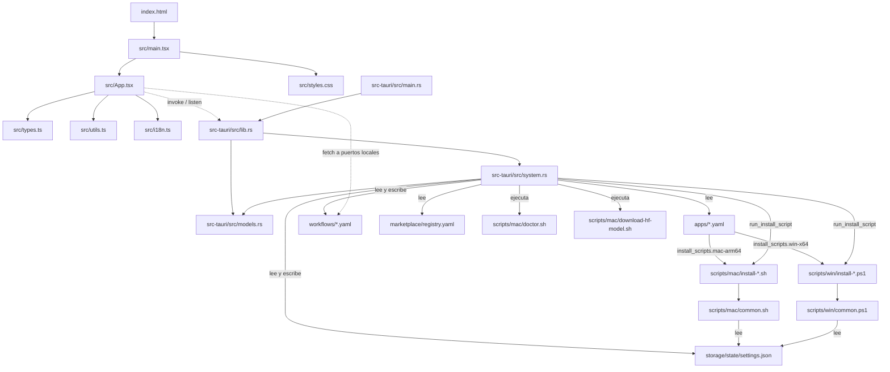

# 04 · Mapa del código

> Estado: completo · Última revisión: 2026-08-27 · Versión analizada: 0.5.1 (commit f840055)

## 1. Cómo leer este documento

Este documento es el inventario del repositorio `chofyai-studio`. Su objetivo es que
alguien que nunca ha abierto el código pueda localizar cualquier pieza sin leerlo:
qué directorio contiene qué, qué hace cada archivo, cuántas líneas tiene, en qué
estado aparente está y quién lo usa.

Convenciones usadas en las tablas:

- **Líneas**: recuento exacto de `wc -l` sobre el archivo en el commit analizado.
- **Estado aparente**:
  - `activo` — hay al menos una referencia real desde código, manifest o CI.
  - `legado` — sigue presente y funciona, pero existe un mecanismo más nuevo que lo
    reemplaza.
  - `duplicado` — su contenido está también en otro sitio.
  - `experimental` — declarado como no validado por el propio repositorio.
  - `no determinado` — no encontré referencias, pero tampoco evidencia de que sobre.
- Todas las afirmaciones citan archivo y símbolo. Lo que no pude comprobar aparece
  marcado como `Requiere validación`.

Los archivos `._*` que aparecen por todo el árbol son AppleDouble generados por macOS
sobre el volumen exFAT donde vive el repositorio; están ignorados en `.gitignore`,
`.markdownlintignore` y `.markdownlint-cli2.jsonc`, y `scripts/mac/clean-appledouble.sh`
existe únicamente para borrarlos. No se inventarían aquí.

## 2. Árbol de directorios (nivel 1 y 2)

Excluye `node_modules/`, `dist/`, `src-tauri/target/`, `src-tauri/gen/`,
`src-tauri/icons/` y los AppleDouble.

```text
chofyai-studio/
├── .cargo/                      Config de Cargo del repo
│   └── config.toml              Mueve target-dir a /tmp/chofyai-target (exFAT rompe la build)
├── .github/                     Automatización de GitHub
│   ├── ISSUE_TEMPLATE/          Plantillas de bug y feature
│   ├── dependabot.yml           Actualización de dependencias npm/cargo/actions
│   └── workflows/               ci.yml · security.yml · release.yml · pages.yml
├── apps/                        Manifests YAML de las 5 herramientas base
├── docs/                        Documentación previa del proyecto
│   ├── cloud/                   Estudio de migración a AWS (7 documentos)
│   └── system-documentation/    Documentación de sistema nueva (este set)
│       ├── assets/              Imágenes de la documentación (vacío en este commit)
│       └── pdf/                 Salida de scripts/docs/build-pdf.mjs (vacío en este commit)
├── landing/                     Sitio estático publicado en GitHub Pages
├── marketplace/                 registry.yaml — catálogo curado de tools importables
├── public/                      Assets estáticos de Vite (solo .gitkeep)
├── scripts/                     Todo lo que el backend o el humano ejecutan como shell
│   ├── docs/                    build-pdf.mjs — Markdown → PDF de esta documentación
│   ├── mac/                     Instaladores y utilidades macOS (bash)
│   └── win/                     Instaladores Windows (PowerShell, experimental)
├── src/                         Frontend React + TypeScript
├── src-tauri/                   Backend Rust y empaquetado Tauri 2
│   ├── capabilities/            default.json — permisos IPC de la ventana main
│   └── src/                     main.rs · lib.rs · models.rs · system.rs
├── storage/                     Estado persistente versionado
│   ├── manifests/               Vacío (solo .gitkeep)
│   ├── registry/                Vacío (solo .gitkeep)
│   └── state/                   settings.json — configuración del usuario
├── workflows/                   Pipelines declarativos YAML
├── index.html                   Punto de entrada de Vite
├── package.json                 Scripts npm y dependencias del frontend
├── tsconfig.json                Configuración TypeScript (strict, noEmit)
├── vite.config.ts               Vite en 127.0.0.1:1420 con strictPort
└── *.md                         README · CHANGELOG · ABOUT · ROADMAP · SECURITY · etc.
```

## 3. Inventario por directorio

### 3.1 Raíz del repositorio

| Ruta | Responsabilidad | Líneas | Estado |
| --- | --- | ---: | --- |
| [`package.json`](../../package.json) | Nombre, versión `0.5.1`, scripts `dev:web`/`build:web`/`tauri:*`/`test*`, deps React 18 y `@tauri-apps/api` 2.11 | 42 | activo |
| [`tsconfig.json`](../../tsconfig.json) | `strict: true`, `noEmit`, `jsx: react-jsx`, `include: ["src"]` | 22 | activo |
| [`vite.config.ts`](../../vite.config.ts) | Plugin React, puerto 1420 fijo, host `127.0.0.1`, `clearScreen: false` | 12 | activo |
| [`index.html`](../../index.html) | Shell HTML con `<div id="root">` y `<script src="/src/main.tsx">` | 11 | activo |
| [`pnpm-lock.yaml`](../../pnpm-lock.yaml) | Lockfile pnpm 10.29.3 | 1663 | activo |
| [`.gitignore`](../../.gitignore) | Ignora `node_modules`, `dist`, `._*`, `src-tauri/target`, `/tmp/chofyai-target`, `storage/state/runtime/` | 12 | activo |
| [`.markdownlint.json`](../../.markdownlint.json) | MD013/MD012/MD060 off, MD033 permitido, MD024 `siblings_only`, MD041 on | 10 | activo |
| [`.markdownlint-cli2.jsonc`](../../.markdownlint-cli2.jsonc) | Ignora `**/._*`, `node_modules`, `src-tauri/target` | 8 | activo |
| [`.markdownlintignore`](../../.markdownlintignore) | Mismo propósito que el anterior, sintaxis antigua | 5 | duplicado |
| [`.npmrc`](../../.npmrc) | Configuración de pnpm | 10 | activo |
| [`README.md`](../../README.md) | Documento principal de entrada | 395 | activo |
| [`CHANGELOG.md`](../../CHANGELOG.md) | Historial de versiones; leído por `release.yml` para las notas | 445 | activo |
| [`ABOUT.md`](../../ABOUT.md) | Descripción larga del proyecto | 187 | activo |
| [`ROADMAP.md`](../../ROADMAP.md) | Plan de versiones | 125 | activo |
| [`CONTRIBUTING.md`](../../CONTRIBUTING.md) | Guía de contribución | 170 | activo |
| [`SECURITY.md`](../../SECURITY.md) | Política de reporte de vulnerabilidades | 108 | activo |
| [`QUICKSTART.md`](../../QUICKSTART.md) | Arranque rápido | 194 | activo |
| [`LICENSE`](../../LICENSE) | MIT | 21 | activo |
| [`.cargo/config.toml`](../../.cargo/config.toml) | `[build] target-dir = "/tmp/chofyai-target"` | 6 | activo |

### 3.2 `src/` — frontend

| Ruta | Responsabilidad | Líneas | Estado |
| --- | --- | ---: | --- |
| [`src/App.tsx`](../../src/App.tsx) | Toda la UI: 21 componentes, 8 helpers de módulo y el componente raíz `App` | 2766 | activo |
| [`src/types.ts`](../../src/types.ts) | 21 tipos exportados que espejan los DTO serde del backend | 194 | activo |
| [`src/i18n.ts`](../../src/i18n.ts) | Diccionarios `es`/`en` y micro-runtime de traducción sin dependencias | 295 | activo |
| [`src/utils.ts`](../../src/utils.ts) | `fmtBytes`, `fmtElapsed`, `parseInstallLine` — helpers puros testables | 53 | activo |
| [`src/main.tsx`](../../src/main.tsx) | Monta `<App/>` en `#root` dentro de `React.StrictMode` | 10 | activo |
| [`src/styles.css`](../../src/styles.css) | Hoja de estilos única, con variables por `data-theme` | 2086 | activo |
| [`src/vite-env.d.ts`](../../src/vite-env.d.ts) | `/// <reference types="vite/client" />` | 1 | activo |
| [`src/utils.test.ts`](../../src/utils.test.ts) | Vitest sobre los tres helpers de `utils.ts` | 74 | activo |
| [`src/i18n.test.ts`](../../src/i18n.test.ts) | Vitest sobre `i18n.ts` con entorno jsdom | 58 | activo |

### 3.3 `src-tauri/` — backend y empaquetado

| Ruta | Responsabilidad | Líneas | Estado |
| --- | --- | ---: | --- |
| [`src-tauri/src/main.rs`](../../src-tauri/src/main.rs) | Binario: `windows_subsystem = "windows"` en release y llamada a `chofyai_studio::run()` | 5 | activo |
| [`src-tauri/src/lib.rs`](../../src-tauri/src/lib.rs) | `tauri::Builder`, `manage(ProcessRegistry)`, `setup` con `restore_registry` y `invoke_handler` con 35 comandos | 58 | activo |
| [`src-tauri/src/models.rs`](../../src-tauri/src/models.rs) | 7 DTO serde compartidos con el frontend | 117 | activo |
| [`src-tauri/src/system.rs`](../../src-tauri/src/system.rs) | Toda la lógica: manifests, procesos, rutas, stats, modelos, huérfanos, workflows, marketplace, doctor + `mod tests` | 2029 | activo |
| [`src-tauri/Cargo.toml`](../../src-tauri/Cargo.toml) | Crate `chofyai_studio` v0.5.1, edition 2021; deps `tauri 2`, `serde`, `serde_json`, `serde_yaml 0.9`, `thiserror`, `walkdir` | 22 | activo |
| [`src-tauri/Cargo.lock`](../../src-tauri/Cargo.lock) | Lockfile Rust, auditado por `cargo-audit` en `security.yml` | 4470 | activo |
| [`src-tauri/build.rs`](../../src-tauri/build.rs) | `tauri_build::build()` | 3 | activo |
| [`src-tauri/tauri.conf.json`](../../src-tauri/tauri.conf.json) | Config Tauri 2: versión `0.5.0`, identifier, ventana 1400x920, `csp: null`, bundle `app`+`dmg`, `resources` | 55 | activo |
| [`src-tauri/tauri.macos.conf.json`](../../src-tauri/tauri.macos.conf.json) | Overlay macOS: `minimumSystemVersion 13.0`, geometría del DMG | 24 | activo |
| [`src-tauri/capabilities/default.json`](../../src-tauri/capabilities/default.json) | Única capability: ventana `main`, permiso `core:default` | 9 | activo |
| [`src-tauri/Info.plist`](../../src-tauri/Info.plist) | `NSHighResolutionCapable`, categoría developer-tools | 12 | activo |
| [`src-tauri/Entitlements.plist`](../../src-tauri/Entitlements.plist) | JIT, memoria ejecutable sin firmar, library validation off | 12 | no determinado |
| `src-tauri/icons/` | 20 archivos de icono referenciados desde `bundle.icon` | — | activo |

`Entitlements.plist` no está referenciado desde ninguna configuración de Tauri; ver
la sección 10.

### 3.4 `apps/` — manifests de herramientas

| Ruta | Herramienta | Plataformas declaradas | Líneas | Estado |
| --- | --- | --- | ---: | --- |
| [`apps/qwen3-tts.yaml`](../../apps/qwen3-tts.yaml) | Qwen3-TTS (voz, puerto 7860) | `mac-arm64` | 33 | activo |
| [`apps/whispercpp.yaml`](../../apps/whispercpp.yaml) | whisper.cpp (ASR, puerto 8178) | mac, win, linux | 31 | activo |
| [`apps/facefusion.yaml`](../../apps/facefusion.yaml) | FaceFusion (video, puerto 7862) | mac, win, linux | 29 | activo |
| [`apps/comfyui.yaml`](../../apps/comfyui.yaml) | ComfyUI (imagen, puerto 8188) | mac, win, linux | 30 | activo |
| [`apps/aceforge.yaml`](../../apps/aceforge.yaml) | AceForge (música, puerto 7857) | mac, win, linux | 29 | activo |

### 3.5 `scripts/`

Detalle completo en la sección 6. Resumen de tamaño: `scripts/mac/` tiene 14 scripts
bash (884 líneas), `scripts/win/` tiene 5 scripts PowerShell (468 líneas) y
`scripts/docs/` tiene un único generador Node (539 líneas).

### 3.6 `workflows/`, `marketplace/` y `storage/`

| Ruta | Responsabilidad | Líneas | Estado |
| --- | --- | ---: | --- |
| [`workflows/transcribe-audio.yaml`](../../workflows/transcribe-audio.yaml) | Un paso HTTP contra `http://127.0.0.1:8178/inference` | 33 | activo |
| [`workflows/comfyui-prompt.yaml`](../../workflows/comfyui-prompt.yaml) | Un paso HTTP contra `http://127.0.0.1:8188/prompt` | 50 | activo |
| [`workflows/audio-pipeline.yaml`](../../workflows/audio-pipeline.yaml) | 3 pasos: 1 HTTP + 2 `stub` documentales | 61 | experimental |
| [`marketplace/registry.yaml`](../../marketplace/registry.yaml) | Catálogo de 10 tools importables | 149 | activo |
| [`storage/state/settings.json`](../../storage/state/settings.json) | `studio_home`, `tool_overrides`, `fallback_home`, `sparsebundle_path` | 6 | activo |
| `storage/state/.gitkeep` | Marcador del directorio | 0 | activo |
| `storage/manifests/.gitkeep` | Marcador de un directorio vacío | 0 | no determinado |
| `storage/registry/.gitkeep` | Marcador de un directorio vacío | 0 | no determinado |

### 3.7 `docs/` — documentación previa

| Ruta | Responsabilidad | Líneas | Estado |
| --- | --- | ---: | --- |
| [`docs/architecture.md`](../architecture.md) | Capas, diagramas Mermaid, tabla de módulos | 340 | legado |
| [`docs/TROUBLESHOOTING.md`](../TROUBLESHOOTING.md) | Catálogo de fallos y soluciones | 445 | activo |
| [`docs/POSTMORTEM-2026-05-17.md`](../POSTMORTEM-2026-05-17.md) | Postmortem del incidente de instalación | 539 | activo |
| [`docs/SCRIPTS_REFERENCE.md`](../SCRIPTS_REFERENCE.md) | Referencia de los scripts de instalación | 276 | activo |
| [`docs/decisions.md`](../decisions.md) | Registro de decisiones de arquitectura | 274 | activo |
| [`docs/INSTALL_MAC.md`](../INSTALL_MAC.md) | Instalación en macOS | 250 | activo |
| [`docs/REQUIREMENTS.md`](../REQUIREMENTS.md) | Requisitos funcionales y de sistema | 228 | activo |
| [`docs/SECURITY_WORKFLOW.md`](../SECURITY_WORKFLOW.md) | Documenta `security.yml` y su `workflow_call` | 206 | activo |
| [`docs/PORTING_GUIDE.md`](../PORTING_GUIDE.md) | Guía de portabilidad a Windows/Linux | 196 | activo |
| [`docs/TOOLS.md`](../TOOLS.md) | Ficha de cada herramienta soportada | 173 | activo |
| [`docs/PORQUE-NO-FUNCIONABA.md`](../PORQUE-NO-FUNCIONABA.md) | Diagnóstico histórico | 171 | legado |
| [`docs/STATUS.md`](../STATUS.md) | Estado del proyecto | 167 | activo |
| [`docs/MANIFEST_SPEC.md`](../MANIFEST_SPEC.md) | Especificación del formato de `apps/*.yaml` | 163 | activo |
| [`docs/packaging.md`](../packaging.md) | Empaquetado `.app`/`.dmg` | 155 | activo |
| [`docs/PACKAGE_MANAGER.md`](../PACKAGE_MANAGER.md) | Estrategia uv/pip | 150 | activo |
| [`docs/NOTARIZATION.md`](../NOTARIZATION.md) | Firma y notarización Apple | 139 | activo |
| [`docs/PROJECT_OVERVIEW.md`](../PROJECT_OVERVIEW.md) | Visión general | 88 | activo |
| [`docs/manifests.md`](../manifests.md) | Notas sobre manifests | 54 | duplicado |
| [`docs/aceforge-phase2.md`](../aceforge-phase2.md) | Plan fase 2 de AceForge | 46 | activo |
| [`docs/qwen3-tts-phase2.md`](../qwen3-tts-phase2.md) | Plan fase 2 de Qwen3-TTS | 36 | activo |
| [`docs/facefusion-phase2.md`](../facefusion-phase2.md) | Plan fase 2 de FaceFusion | 35 | activo |
| [`docs/whispercpp-phase2.md`](../whispercpp-phase2.md) | Plan fase 2 de whisper.cpp | 35 | activo |
| [`docs/cloud/`](../cloud/) | 7 documentos de estudio AWS (arquitectura, costos, migración, seguridad, servicios, paso a paso, README) | — | experimental |
| `docs/system-documentation/` | Este set de documentación; `assets/` y `pdf/` están vacíos en el commit analizado | — | activo |

`docs/manifests.md` (54 líneas) y `docs/MANIFEST_SPEC.md` (163 líneas) cubren el mismo
tema; el segundo es el más completo. Ver sección 10.

### 3.8 `.github/`

| Ruta | Responsabilidad | Líneas | Estado |
| --- | --- | ---: | --- |
| [`.github/workflows/ci.yml`](../../.github/workflows/ci.yml) | 6 jobs: `changes`, `lint-docs`, `typecheck`, `test-frontend`, `test-rust`, `validate-manifests` | 192 | activo |
| [`.github/workflows/security.yml`](../../.github/workflows/security.yml) | 5 jobs: TruffleHog, `pnpm audit`, `cargo audit`, CodeQL JS/TS, pinning de acciones | 170 | activo |
| [`.github/workflows/release.yml`](../../.github/workflows/release.yml) | 3 jobs: `prepare` (tag + notas de CHANGELOG), `build-macos` (`macos-latest`), `publish` | 194 | activo |
| [`.github/workflows/pages.yml`](../../.github/workflows/pages.yml) | Publica `landing/` en GitHub Pages sin build step | 53 | activo |
| [`.github/dependabot.yml`](../../.github/dependabot.yml) | Actualizaciones automáticas de dependencias | 33 | activo |
| [`.github/ISSUE_TEMPLATE/bug_report.md`](../../.github/ISSUE_TEMPLATE/bug_report.md) | Plantilla de bug | 51 | activo |
| [`.github/ISSUE_TEMPLATE/feature_request.md`](../../.github/ISSUE_TEMPLATE/feature_request.md) | Plantilla de feature | 36 | activo |

### 3.9 `landing/` y `public/`

| Ruta | Responsabilidad | Líneas | Estado |
| --- | --- | ---: | --- |
| [`landing/index.html`](../../landing/index.html) | Página estática con secciones `tools`, `platforms`, `stack`, `install`, `docs`, `about` | 454 | activo |
| [`landing/styles.css`](../../landing/styles.css) | Estilos del sitio | 577 | activo |
| [`landing/main.js`](../../landing/main.js) | Scroll-spy con `IntersectionObserver`, sin frameworks | 64 | activo |
| [`landing/brand.svg`](../../landing/brand.svg) | Logotipo | 50 | activo |
| `public/.gitkeep` | Directorio de assets estáticos de Vite, actualmente vacío | 0 | no determinado |

## 4. Inventario detallado del frontend

### 4.1 `src/App.tsx` — helpers y constantes de nivel de módulo

`App.tsx` importa `invoke` y `listen` de `@tauri-apps/api`, los helpers de
`./utils` y el runtime de `./i18n`. Todo lo demás está definido en el propio archivo.

| Símbolo | Línea | Responsabilidad | Entradas | Comandos Tauri | Quién lo usa |
| --- | ---: | --- | --- | --- | --- |
| `Toaster` (type) | 27 | Firma de la función de push de toasts | — | — | `pushToast`, `setToasterRef` |
| `pushToast` | 28 | Referencia mutable al emisor de toasts activo | — | — | `notify` |
| `setToasterRef` | 29 | Registra el emisor real cuando monta el componente `Toaster` | `fn: Toaster` | — | componente `Toaster` (1608) |
| `notify` | 30 | API pública de toasts; **exportada** del módulo | `kind`, `title`, `body?` | — | Todos los handlers y `tauriInvoke` |
| `notifyNative` | 33 | Notificación nativa de macOS; sale sin hacer nada fuera de Tauri | `title`, `body` | `notify_macos` (vía `invoke` directo) | Fin de instalación en cola y eventos `install-done` |
| `APP_VERSION` | 39 | Constante `'0.5.0'` hardcoded | — | — | `UpdateChecker`, cabecera de la UI |
| `ONBOARDING_KEY` | 41 | Clave `chofyai_onboarding_done` de `localStorage` | — | — | `App`, `Onboarding` |
| `THEME_KEY` | 42 | Clave `chofyai_theme` de `localStorage` | — | — | `App` |
| `Theme` (type) | 44 | `'dark' \| 'light' \| 'system'` | — | — | `applyTheme`, estado de `App` |
| `applyTheme` | 45 | Resuelve `system` vía `matchMedia` y escribe `root.dataset.theme` | `theme: Theme` | — | `App` (efectos de tema) |
| `Shortcut` (type) | 57 | `{ keys, label, group }` | — | — | `SHORTCUTS`, `HelpPanel` |
| `SHORTCUTS` | 58 | Catálogo de 11 atajos documentados | — | — | `HelpPanel` |
| `inTauri` | 73 | `'__TAURI_INTERNALS__' in window` | — | — | `tauriInvoke`, `notifyNative`, `App` |
| `fallbackTools` | 76 | 5 `ToolManifest` sintéticos para el modo web sin backend | — | — | Estado inicial de `tools` en `App` |
| `CATEGORY_LABEL` | 84 | Etiquetas ES por categoría de tool | — | — | Render de tarjetas en `App` |
| `tauriInvoke<T>` | 94 | Envoltorio de `invoke`: devuelve `null` fuera de Tauri y notifica el error salvo `opts.silent` | `cmd`, `args?`, `opts?` | Cualquiera | Prácticamente todos los componentes |
| `substituteVars` | 107 | Sustituye `{{ inputs.x }}` por el valor del formulario | `template`, `inputs` | — | `runWorkflowStep` |
| `StepResult` (type) | 111 | Estado de un paso de workflow | — | — | `WorkflowRunner` |
| `runWorkflowStep` | 113 | Ejecuta un paso: `http` con `fetch` (multipart o JSON) o `stub`; mide duración | paso, inputs, ficheros | Ninguno (usa `fetch` directo al puerto local) | `WorkflowRunner` |
| `BuilderInput` (type) | 500 | Input editable del constructor de workflows | — | — | `WorkflowBuilder`, `buildYaml` |
| `BuilderStep` (type) | 501 | Paso editable del constructor | — | — | `WorkflowBuilder`, `emptyStep`, `buildYaml` |
| `emptyStep` | 516 | Devuelve un `BuilderStep` con valores por defecto | — | — | `WorkflowBuilder` |
| `buildYaml` | 531 | Serializa metadatos + inputs + pasos a YAML de workflow | `meta`, `inputs`, `steps` | — | `WorkflowBuilder` (`useMemo`, línea 609) |
| `CATEGORY_EMOJI` | 832 | Emoji por categoría del marketplace | — | — | `MarketplacePanel` |
| `CmdAction` (type) | 1041 | Acción de la paleta `⌘K` | — | — | `CommandPalette`, `App` |
| `ReleaseInfo` (type) | 1573 | Subconjunto de la respuesta de la API de releases de GitHub | — | — | `UpdateChecker` |
| `OrphanPort` (type) | 1669 | Proceso huérfano detectado; duplica la struct Rust homónima | — | — | `OrphanBanner`, `OrphansModal`, `App` |
| `APP_STARTED_AT` | 1781 | `Date.now()` al cargar el módulo | — | — | `StatusBar` (uptime de la app) |

### 4.2 `src/App.tsx` — componentes

| Componente | Líneas | Responsabilidad | Props | Comandos Tauri | Montado desde |
| --- | ---: | --- | --- | --- | --- |
| `WorkflowRunner` | 172–292 | Formulario de inputs de un workflow y ejecución secuencial de sus pasos | `wf: WorkflowDef`, `onClose` | Ninguno directo; usa `fetch` vía `runWorkflowStep` | `App` (2340) cuando `runningWorkflow != null` |
| `OverviewModal` | 294–410 | Panel de resumen: CPU, memoria, disco, tools instaladas y activas | `open`, `onClose`, `summary`, `stats`, `tools`, `runningIds`, `message` | Ninguno (recibe datos ya cargados) | `App` (2342) |
| `OrphansModal` | 412–463 | Lista de procesos huérfanos con acciones adoptar/matar | `open`, `onClose`, `orphans`, `onResolved` | `adopt_orphan`, `kill_orphan` | `App` (2351) |
| `DoctorModal` | 465–498 | Ejecuta el diagnóstico y muestra su salida en texto plano | `open`, `onClose`, `studioHome` | `run_doctor` (silencioso) | `App` (2357) |
| `WorkflowBuilder` | 588–755 | Editor visual de workflows con reordenación drag-and-drop y vista previa del YAML | `open`, `onClose`, `onSaved` | `save_workflow` | `App` (2334) |
| `WorkflowsPanel` | 757–830 | Lista de workflows guardados, con lanzar/borrar/nuevo | `open`, `onClose`, `onRun`, `onNew` | `list_workflows`, `delete_workflow` | `App` (2328) |
| `MarketplacePanel` | 836–958 | Catálogo curado con buscador e importación de una entrada a `apps/` | `open`, `onClose`, `alreadyInstalledIds`, `onImported` | `list_marketplace_tools`, `import_marketplace_tool` | `App` (2322) |
| `HelpPanel` | 960–992 | Muestra `SHORTCUTS` agrupados por `group` | `open`, `onClose` | — | `App` (2321) |
| `PreInstallCheck` | 994–1039 | Confirmación previa a instalar: compara el espacio libre con una estimación por tool | `tool`, `freeBytes`, `onConfirm`, `onCancel` | — | `App` (2362) |
| `CommandPalette` | 1043–1101 | Paleta `⌘K`: filtra y ejecuta `CmdAction[]`, navegable con flechas | `open`, `onClose`, `actions` | — | `App` (2320) |
| `ModelsPanel` | 1103–1232 | Modelos en disco y modelos declarados en el manifest; descarga y borrado | `tool: ToolManifest`, `onClose` | `list_tool_models`, `list_declared_models`, `delete_tool_model`, `download_tool_model`; escucha `model-download-progress` y `model-download-done` | `App` (2571) |
| `SettingsModal` | 1234–1423 | Studio Home, overrides de `models`/`outputs`/`cache` y overrides por tool | `open`, `onClose`, `summary`, `volumes`, `onSaved`, `tools` | `get_effective_paths`, `save_studio_home`, `save_path_settings`, `clear_module_override` | `App` (2372) |
| `Onboarding` | 1425–1571 | Tour inicial multi-paso: elegir volumen, avisar de FS no APFS, instalar whisper.cpp | `onDone` | `get_system_summary`, `list_volume_candidates`, `list_tools`, `install_tool`, `save_studio_home` | `App` (2318) si no existe `ONBOARDING_KEY` |
| `UpdateChecker` | 1574–1606 | Consulta la API pública de releases de GitHub y muestra un banner si hay versión nueva | — | Ninguno; `fetch` a `api.github.com` | `App` (2319) |
| `Toaster` | 1608–1640 | Contenedor de toasts; se registra en `setToasterRef` al montar | — | — | `App` (2317) |
| `AppErrorBoundary` | 1642–1667 | Error boundary de clase; captura y muestra el fallo | `children` | `append_crash_log` (1650) | Envuelve todo el árbol de `App` (2316) |
| `OrphanBanner` | 1671–1709 | Aviso persistente arriba con acciones rápidas sobre huérfanos | `orphans`, `onResolved` | `adopt_orphan`, `kill_orphan` | Definido y usado dentro del árbol de `App` |
| `LogsViewer` | 1711–1763 | Visor de logs con auto-scroll y refresco periódico | `toolId`, `name`, `onClose` | `read_tool_log` (`lastLines: 500`) | `App` (2564) |
| `HealthDot` | 1765–1779 | Semáforo de estado de una tool | `health?`, `starting?` | — | Tarjeta de tool en `App` (2674) |
| `StatusBar` | 1783–1832 | Barra inferior: CPU, RAM, disco, load average, uptime del sistema y de la app | `stats`, `summary` | — | `App` (2763) |
| `VolumePicker` | 1834–1864 | Selector visual de volúmenes candidatos | `volumes`, `currentPath`, `onPick` | — | Sección de Studio Home dentro de `App` |
| `App` | 1866–2766 | Componente raíz: estado global, atajos, cola de instalación, listeners de eventos y todo el layout | — | Ver 4.3 | `src/main.tsx` |

### 4.3 `src/App.tsx` — el componente `App`

`App` (línea 1866) es el único export por defecto. Concentra 30 `useState`, 11
`useEffect` y 2 `useMemo`. Piezas relevantes:

- **Estado principal**: `summary`, `stats`, `tools` (inicializado con `fallbackTools`),
  `volumes`, `health`, `runningIds`, `queue`, `orphans`, `theme`, `lang` y una decena
  de banderas de apertura de modales (`showCmdK`, `showSettings`, `showMarket`,
  `showWorkflows`, `showBuilder`, `showOverview`, `showOrphans`, `showDoctor`…).
- **Carga de datos** (líneas 2004–2048): `reloadTools` → `list_tools`,
  `reloadSummary` → `get_system_summary`, `reloadVolumes` → `list_volume_candidates`,
  `reloadStats` → `get_system_stats`, `reloadOrphans` → `list_orphan_ports`
  (silencioso, cada 60 s desde el efecto de la línea 1919).
- **Listeners de eventos Tauri** (2082–2117): `install-progress` alimenta
  `progressRef` y `parseInstallLine`; `install-done` cierra el ítem de la cola y
  dispara `notifyNative`.
- **Sondeo de salud** (2118): recorre las tools instaladas llamando
  `health_check_tool` en modo silencioso. **Reconciliación de PIDs** (2154):
  `list_running_pids` para sincronizar `runningIds` con el registro del backend.
- **Handlers por tool** (2188–2292): `handleInstall`, `handleUpdate`, `handleStart`,
  `handleStop`, `handleRestart`, `handleOpenFolder`, `handleOpenLog` (que sólo abre
  el `LogsViewer` interno, no llama a `open_tool_log`), `handleRelocate` y
  `handleClearOverride`.
- **Cola de instalación** (`runQueue`, 2293): procesa los `QueueItem` en serie
  llamando `install_tool` por cada uno.
- **Atajos globales** (1942): `⌘K`, `⌘,`, `⌘/`, `⌘R`, `⌘B`, `⌘L`, `⌘M`, `⌘W` y `Esc`.
  La lista mostrada al usuario vive en `SHORTCUTS` (línea 58).
- **`cmdActions`** (1971): `useMemo` que construye las acciones de la paleta —
  7 globales más 1 a 7 por tool según esté instalada o no.

### 4.4 `src/types.ts`

21 tipos exportados. Correspondencia con el backend:

| Tipo TypeScript | DTO de Rust equivalente | Archivo Rust |
| --- | --- | --- |
| `ToolManifest` | `ToolSummary` | `models.rs` |
| `SystemSummary` | `SystemSummary` | `models.rs` |
| `AppSettings` | `AppSettings` | `models.rs` |
| `EffectivePaths` | `EffectivePaths` | `system.rs` (1474) |
| `ActionResult` | `ActionResult` | `system.rs` (838) |
| `HealthResult` | `HealthResult` | `models.rs` |
| `InstallEvent` | `InstallEvent` | `models.rs` |
| `VolumeCandidate` | `VolumeCandidate` | `models.rs` |
| `SystemStats` | `SystemStats` | `models.rs` |
| `MarketplaceEntry` | `MarketplaceEntry` | `system.rs` (475) |
| `ModelEntry` | `ModelEntry` | `system.rs` (74) |
| `DeclaredModel` | `DeclaredModel` | `system.rs` (172) |
| `ModelDownloadProgress` | Sin struct: `serde_json::json!` en `download_tool_model` (279) | `system.rs` |
| `ModelDownloadDone` | Sin struct: `serde_json::json!` en `download_tool_model` (307) | `system.rs` |
| `WorkflowInput`, `WorkflowStep`, `WorkflowDef` | Sin DTO: `list_workflows` devuelve `Vec<serde_json::Value>` con el YAML tal cual | `system.rs` (660) |
| `QueueStatus`, `QueueItem` | Sin equivalente — estado exclusivo de la UI | — |
| `ToastKind`, `Toast` | Sin equivalente — estado exclusivo de la UI | — |

El nombre del tipo `ToolManifest` no coincide con el de la struct Rust `ToolSummary`,
aunque los campos sí (`file_name`, `id`, `name`, `icon`, `category`, `runtime`,
`description`, `recommended`, `default_port`, `install_dir`, `install_script`,
`run_command`, `installed`, `installed_checks`, `missing_checks`, `relocated`).

`src/types.ts` **no** contiene el tipo `OrphanPort`: está declarado localmente en
`App.tsx` línea 1669 pese a que el backend expone la struct `OrphanPort` en
`system.rs` línea 329.

### 4.5 `src/utils.ts`

53 líneas, sin dependencias de React ni de Tauri. Exporta:

- `fmtBytes(b?: number | null): string` — formatea bytes a B/KB/MB/GB/TB; devuelve
  `'—'` para `0`, `null` o `undefined`.
- `fmtElapsed(ms: number): string` — convierte milisegundos a `m:ss`.
- `LineParse` (tipo) — `{ phase?, progressPct?, speed?, eta? }`.
- `parseInstallLine(prev: LineParse, line: string): LineParse` — máquina de
  reconocimiento sobre la salida de los instaladores: limpia códigos ANSI y detecta
  clonado git, `Receiving objects`, `Resolving deltas`, creación de venv, descarga de
  modelos, instalación de paquetes Python, progreso de cmake (`[ 42%]`), enlazado,
  líneas de progreso de `curl` y el marcador final `INSTALL_OK`.

Consumido por `App.tsx` (import en línea 90) y cubierto por `src/utils.test.ts`.

### 4.6 `src/i18n.ts`

295 líneas. Implementación mínima de i18n sin librerías externas.

- `Lang` = `'es' | 'en'`; `SUPPORTED_LANGS`; `DEFAULT_LANG = 'es'`.
- `dictionaries` (línea 16): dos diccionarios planos `clave → texto`, con prefijos
  `sidebar.`, `topbar.`, `cat.`, `btn.`, `section.`, entre otros.
- `STORAGE_KEY = 'chofyai_lang'` — el idioma se persiste en `localStorage`.
- `listeners` (254): `Set<() => void>` de suscriptores.
- `getLang()`, `setLang(l)`, `t(key, params?)` con interpolación `{n}`,
  `useT()` (hook que se resuscribe y fuerza re-render al cambiar idioma) y
  `knownKeys()` (usado por los tests para detectar claves faltantes).

### 4.7 `main.tsx`, `styles.css` y `vite-env.d.ts`

- `src/main.tsx` (10 líneas): monta `<App/>` en `#root` con `ReactDOM.createRoot`
  dentro de `React.StrictMode` e importa `./styles.css`.
- `src/styles.css` (2086 líneas): hoja única. Es el mayor archivo del frontend
  después de `App.tsx`. Los temas se aplican leyendo `root.dataset.theme`, que
  escribe `applyTheme` en `App.tsx` línea 45.
- `src/vite-env.d.ts` (1 línea): referencia de tipos de `vite/client`.

### 4.8 Tests del frontend

| Archivo | Cubre | Notas |
| --- | --- | --- |
| [`src/utils.test.ts`](../../src/utils.test.ts) | `fmtBytes`, `fmtElapsed`, `parseInstallLine` | Ejecutado por el job `test-frontend` de `ci.yml` |
| [`src/i18n.test.ts`](../../src/i18n.test.ts) | `DEFAULT_LANG`, `SUPPORTED_LANGS`, `getLang`, `setLang`, `t`, `knownKeys` | Declara `// @vitest-environment jsdom` en la primera línea |

No hay tests de componentes React ni de `App.tsx`.

## 5. Inventario detallado del backend

### 5.1 `main.rs` y `lib.rs`

`src-tauri/src/main.rs` (5 líneas) sólo activa `windows_subsystem = "windows"` fuera
de `debug_assertions` y llama a `chofyai_studio::run()`.

`src-tauri/src/lib.rs` (58 líneas) declara `mod models` y `mod system`, y define
`run()`:

1. `manage(ProcessRegistry(Mutex::new(HashMap::new())))` — inyecta el registro de PIDs
   como estado global.
2. `.setup(...)` — llama a `system::restore_registry(handle, &registry)` para releer
   `processes.json` y descartar PIDs muertos.
3. `.invoke_handler(tauri::generate_handler![...])` — registra **35** comandos.
4. `.run(tauri::generate_context!())`.

### 5.2 `models.rs` — DTO compartidos

7 structs, todas `Serialize` (las tres primeras además `Deserialize`):

| Struct | Campos | Uso |
| --- | --- | --- |
| `SystemSummary` | `app_name`, `app_version`, `os`, `arch`, `studio_home`, `studio_home_effective`, `using_fallback`, `settings_file`, `platform_key`, `platform_support` | Respuesta de `get_system_summary` |
| `ToolSummary` | `file_name`, `id`, `name`, `icon`, `category`, `runtime`, `description`, `recommended`, `default_port`, `install_dir`, `install_script`, `run_command`, `installed`, `installed_checks`, `missing_checks`, `relocated` | Elemento de `list_tools` |
| `AppSettings` | `studio_home`, `tool_overrides`, `fallback_home`, `sparsebundle_path`, `models_dir`, `outputs_dir`, `cache_dir` | Contenido de `storage/state/settings.json` |
| `HealthResult` | `tool_id`, `running`, `port_open`, `pid` | Respuesta de `health_check_tool` |
| `InstallEvent` | `tool_id`, `line` | Payload de los eventos `install-progress` e `install-done` |
| `VolumeCandidate` | `path`, `label`, `kind`, `mounted`, `writable`, `free_bytes`, `total_bytes` | Elemento de `list_volume_candidates` |
| `SystemStats` | `cpu_usage`, `cpu_cores`, `mem_used_bytes`, `mem_total_bytes`, `disk_free_bytes`, `disk_total_bytes`, `disk_path`, `uptime_secs`, `load_avg_1m` | Respuesta de `get_system_stats` |

`platform_key` y `platform_support` llevan `#[serde(default)]`, igual que los cuatro
últimos campos de `AppSettings`: los `settings.json` antiguos siguen deserializando.

### 5.3 `system.rs` — structs propias del módulo

| Struct | Línea | Visibilidad | Propósito |
| --- | ---: | --- | --- |
| `ProcessRegistry` | 21 | `pub` | Newtype sobre `Mutex<HashMap<String, u32>>`: `tool_id → PID` |
| `ModelEntry` | 74 | `pub` | Modelo presente en disco |
| `DeclaredModel` | 172 | `pub` | Modelo declarado en `manifest.models`, con `present` y `size_bytes` |
| `OrphanPort` | 329 | `pub` | Proceso escuchando en un puerto declarado sin estar registrado |
| `MarketplaceEntry` | 475 | `pub` | Entrada del catálogo curado |
| `MarketplaceFile` | 491 | privada | Envoltorio `{ tools: Vec<MarketplaceEntry> }` para deserializar `registry.yaml` |
| `RawManifest` | 738 | privada | Vista serde de `apps/*.yaml` |
| `RawRun` | 769 | privada | Bloque `run:` del manifest (`command` + `commands` por plataforma) |
| `ActionResult` | 838 | `pub` | Resultado uniforme: `ok`, `message`, `log_path`, `opened_url` |
| `AppPaths` | 846 | privada | `{ apps_dir, settings_path }` resueltos según modo repo o bundle |
| `EffectivePaths` | 1474 | `pub` | `studio_home`, `models_dir`, `outputs_dir`, `cache_dir` ya resueltos |

`RawManifest` sólo declara estos campos: `id`, `name`, `icon`, `category`, `runtime`,
`description`, `recommended`, `default_port`, `studio_home_subdir`, `install_script`,
`install_scripts`, `installed_if`, `run`, `platforms`, `models`. Cualquier otra clave
del YAML se descarta silenciosamente al deserializar.

### 5.4 Los 35 comandos Tauri

Todos viven en `src-tauri/src/system.rs` y están registrados en `lib.rs`.
La columna «Línea» apunta a la firma `pub fn`.

#### Bloque: registro de procesos

| Comando | Línea | Responsabilidad |
| --- | ---: | --- |
| `list_running_pids` | 66 | Devuelve el `HashMap<tool_id, pid>` vivo del `ProcessRegistry`. |
| `start_tool` | 1607 | Resuelve el `run_command` de la plataforma, lo lanza con el shell correspondiente, guarda el PID y persiste el registro. |
| `stop_tool` | 1708 | Envía la señal de terminación al PID registrado y lo elimina del registro. |
| `restart_tool` | 1738 | Encadena `stop_tool` y `start_tool` sobre la misma tool. |
| `health_check_tool` | 1794 | Comprueba si el PID sigue vivo y si el `default_port` acepta conexión TCP. |

#### Bloque: modelos

| Comando | Línea | Responsabilidad |
| --- | ---: | --- |
| `list_tool_models` | 92 | Recorre el directorio de modelos de la tool y devuelve `ModelEntry` por cada uno. |
| `delete_tool_model` | 142 | Borra un modelo por ruta relativa, rechazando cualquier ruta con `..`. |
| `list_declared_models` | 208 | Cruza `manifest.models` con lo que hay en disco y marca `present`/`size_bytes`. |
| `download_tool_model` | 234 | Valida que el `repo_id` esté declarado, lanza `scripts/mac/download-hf-model.sh` y emite `model-download-progress` / `model-download-done`. |

#### Bloque: huérfanos

| Comando | Línea | Responsabilidad |
| --- | ---: | --- |
| `list_orphan_ports` | 340 | Detecta procesos escuchando en puertos declarados por los manifests que la app no tiene registrados. |
| `adopt_orphan` | 399 | Añade un PID huérfano al `ProcessRegistry` y lo persiste. |
| `kill_orphan` | 423 | Termina un proceso huérfano sin adoptarlo. |

#### Bloque: crash log

| Comando | Línea | Responsabilidad |
| --- | ---: | --- |
| `append_crash_log` | 438 | Añade una entrada a `storage/state/crash.log`. |
| `read_crash_log` | 459 | Devuelve las últimas 200 entradas del crash log. |

#### Bloque: marketplace

| Comando | Línea | Responsabilidad |
| --- | ---: | --- |
| `list_marketplace_tools` | 496 | Lee `marketplace/registry.yaml` y devuelve sus entradas. |
| `import_marketplace_tool` | 520 | Genera un `apps/<id>.yaml` mínimo a partir de una entrada del catálogo. |

#### Bloque: workflows

| Comando | Línea | Responsabilidad |
| --- | ---: | --- |
| `list_workflows` | 660 | Lee `workflows/*.yaml` y los devuelve como `Vec<serde_json::Value>` sin tipar. |
| `save_workflow` | 594 | Valida el `id` y escribe el YAML recibido en `workflows/<id>.yaml`. |
| `delete_workflow` | 618 | Borra `workflows/<id>.yaml` previa validación del `id`. |

#### Bloque: doctor

| Comando | Línea | Responsabilidad |
| --- | ---: | --- |
| `run_doctor` | 635 | Ejecuta `scripts/mac/doctor.sh` sobre el `studio_home` indicado y devuelve su salida completa. |

#### Bloque: manifests y tools

| Comando | Línea | Responsabilidad |
| --- | ---: | --- |
| `list_tools` | 1522 | Recorre `apps/*.yaml`, resuelve rutas y `installed_if`, y devuelve `Vec<ToolSummary>`. |
| `install_tool` | 1571 | Ejecuta el instalador de la plataforma con streaming de stdout y post-validación de artefactos. |
| `update_tool` | 1579 | Reejecuta el mismo instalador sobre una instalación existente. |
| `open_tool_directory` | 1835 | Abre el directorio de instalación en el explorador del sistema. |
| `open_tool_log` | 1852 | Abre el archivo de log de la tool en la aplicación por defecto del sistema. |
| `read_tool_log` | 710 | Devuelve las últimas `last_lines` líneas de un log como texto. |

#### Bloque: rutas y volúmenes

| Comando | Línea | Responsabilidad |
| --- | ---: | --- |
| `get_system_summary` | 1397 | Nombre, versión, SO, arquitectura, `studio_home` solicitado y efectivo, bandera de fallback y clave de plataforma. |
| `save_studio_home` | 1425 | Persiste el nuevo `studio_home` en `settings.json` y devuelve los ajustes actualizados. |
| `save_path_settings` | 1440 | Guarda overrides de `models_dir`, `outputs_dir` y `cache_dir`; una cadena vacía limpia el override. |
| `get_effective_paths` | 1462 | Devuelve las cuatro rutas ya resueltas para mostrarlas en Settings. |
| `list_volume_candidates` | 1482 | Enumera `$HOME` y los volúmenes montados con etiqueta, escritura y espacio. |
| `relocate_module` | 1880 | Copia el directorio instalado de una tool a un destino absoluto y registra el override; falla si el destino existe y no está vacío. |
| `clear_module_override` | 1947 | Elimina el override de una tool sin mover archivos. |

#### Bloque: estadísticas y utilidades

| Comando | Línea | Responsabilidad |
| --- | ---: | --- |
| `get_system_stats` | 1977 | Devuelve `SystemStats` a partir de los lectores nativos del bloque de stats. |
| `notify_macos` | 692 | Muestra una notificación nativa del sistema. |

### 5.5 Funciones privadas relevantes de `system.rs`

El archivo está dividido por comentarios-banner. Estos son sus bloques y las funciones
no expuestas como comandos.

#### Registro de PIDs (líneas 19–72)

| Función | Línea | Responsabilidad |
| --- | ---: | --- |
| `processes_state_path` | 23 | Deriva la ruta de `processes.json` desde el directorio de `settings.json`. |
| `persist_registry` | 31 | Serializa el `HashMap` de PIDs a disco. |
| `restore_registry` | 40 | `pub`: relee `processes.json` al arrancar y descarta PIDs muertos. Invocada desde `lib.rs`. |

#### Modelos (74–328)

| Función | Línea | Responsabilidad |
| --- | ---: | --- |
| `resolve_models_dir` | 82 | Directorio de modelos de una tool, respetando el override global. |
| `safe_model_name` | 182 | Convierte un `repo_id` de Hugging Face en un nombre de carpeta seguro. |
| `dir_size` | 190 | Suma recursiva del tamaño de un directorio con `walkdir`. |

#### Workflows (575–690)

| Función | Línea | Responsabilidad |
| --- | ---: | --- |
| `workflows_dir` | 575 | Resuelve el directorio `workflows/` según modo repo o bundle. |
| `validate_workflow_id` | 582 | Rechaza identificadores que permitirían escribir fuera del directorio. |

#### Estructuras internas y plataforma (735–836)

| Función | Línea | Responsabilidad |
| --- | ---: | --- |
| `current_platform_key` | 778 | `pub`: devuelve `"mac-arm64"`, `"mac-x64"`, `"win-x64"`, `"linux-x64"` o `"unknown"`. |
| `resolve_install_script` | 792 | Prefiere `install_scripts[plataforma]`; cae a `install_script`. |
| `resolve_run_command` | 803 | Prefiere `run.commands[plataforma]`; cae a `run.command`. |
| `platform_supported` | 815 | `true` si la plataforma actual está en `manifest.platforms`; si el campo falta, sólo `mac-arm64`. |
| `script_shell` | 823 | `"pwsh"` en Windows, `"bash"` en el resto. |
| `shell_inline_command` | 829 | `-NoProfile -Command` en Windows, `-lc` en el resto. |

#### Helpers de rutas (851–1131)

| Función | Línea | Responsabilidad |
| --- | ---: | --- |
| `repo_root` | 853 | Detecta ejecución desde el repositorio comprobando que existan `apps/`, `scripts/` y `src-tauri/`. |
| `resolve_resource_path` | 867 | Resuelve una ruta relativa dentro de los recursos del bundle. |
| `app_paths` | 873 | Decide entre modo repo (rutas del checkout) y modo bundle (`Resource` + `app_data_dir`). |
| `settings_path` | 887 | Atajo a `app_paths(...).settings_path`. |
| `script_path` | 891 | Igual que el anterior para scripts. |
| `home_dir` | 898 | `$HOME`. |
| `default_studio_home` | 906 | `~/ChofyAIStudio`. |
| `fallback_home_for` | 910 | `settings.fallback_home` o el default. |
| `path_is_usable` | 919 | Existe, es directorio y es escribible. |
| `is_writable_dir` | 935 | Prueba de escritura real, no sólo permisos declarados. |
| `resolve_effective_home` | 952 | Núcleo de la resolución de rutas: si el `studio_home` pedido no es usable intenta montar el `.sparsebundle` con `hdiutil attach` y, si falla, cae a `fallback_home` o `~/ChofyAIStudio`. |
| `load_settings` | 984 | Lee y deserializa `settings.json`. |
| `effective_models_dir` | 1003 | Override o `<studio_home>/models`. |
| `effective_outputs_dir` | 1013 | Override o `<studio_home>/outputs`. |
| `effective_cache_dir` | 1023 | Override o `<studio_home>/cache`. |
| `apply_path_env` | 1034 | Inyecta `CHOFYAI_MODELS_DIR`, `CHOFYAI_OUTPUTS_DIR` y `CHOFYAI_CACHE_DIR` en el proceso hijo. |
| `save_settings_to_disk` | 1040 | Escribe `settings.json`. |
| `ensure_parent` | 1050 | `create_dir_all` del directorio padre. |
| `collect_manifests` | 1057 | Lee y deserializa todos los `apps/*.yaml`. |
| `find_manifest` | 1078 | Localiza el manifest de un `tool_id`. |
| `manifest_install_dir` | 1088 | Aplica `tool_overrides` sobre `studio_home_subdir`. |
| `log_dir` | 1107 | `<studio_home>/logs`. |
| `open_in_system` | 1111 | Abre una ruta con el manejador del sistema operativo. |
| `pid_is_alive` | 1124 | Comprueba si un PID sigue vivo. Cubierto por tests. |
| `run_install_script` | 1132 | Núcleo de la instalación: valida plataforma, resuelve el script, inyecta `CHOFYAI_STUDIO_HOME` y las variables de ruta, lanza el proceso, emite `install-progress` línea a línea desde un hilo, escribe `<tool>-install.log`, emite `install-done` y **post-valida `installed_if`** antes de declarar éxito. |

#### Stats del sistema (1264–1393)

| Función | Línea | Responsabilidad |
| --- | ---: | --- |
| `run_capture` | 1266 | Ejecuta un comando y captura su stdout. |
| `read_cpu_cores` | 1274 | Número de núcleos. |
| `read_mem_total` | 1280 | Memoria total. |
| `read_mem_used` | 1287 | Memoria en uso. |
| `parse_pages` | 1314 | Convierte páginas de memoria a bytes. |
| `read_cpu_usage` | 1319 | Uso de CPU en porcentaje. |
| `read_load_avg` | 1338 | Load average de 1 minuto. |
| `read_uptime` | 1349 | Uptime del sistema en segundos. |
| `read_disk_usage` | 1363 | Devuelve `(total, free)` de un path. Cubierto por tests. |
| `list_external_volumes` | 1381 | Enumera los volúmenes montados externos. |

#### Zona de módulos (1874–1973)

| Función | Línea | Responsabilidad |
| --- | ---: | --- |
| `copy_dir_recursive` | 1954 | Copia recursiva usada por `relocate_module`. |

Estas funciones no dependen de crates de sistema adicionales: el bloque de stats
está escrito sobre `Command` y lectura de ficheros, tal como declara su banner
(«sin dependencias extra»).

### 5.6 Tests del backend

`#[cfg(test)] mod tests` en `system.rs` línea 1997, con 4 pruebas:

| Test | Comprueba |
| --- | --- |
| `pid_alive_for_self_is_true` | `pid_is_alive(std::process::id())` es `true`. |
| `pid_alive_for_zero_is_false` | `pid_is_alive(999_999_999)` es `false`. |
| `delete_model_rejects_path_traversal` | Sólo valida la guarda lógica `contains("..")`, sin `AppHandle`. |
| `read_disk_usage_returns_two_values` | `total >= free` y `total > 0` sobre `/`. |

La cobertura real del backend es baja: 4 pruebas sobre 2029 líneas, y ninguna de
ellas ejercita comandos Tauri.

## 6. Inventario de scripts

### 6.1 `scripts/mac/`

Todos los instaladores siguen el mismo patrón de cabecera: resuelven `SCRIPT_DIR`,
`REPO_ROOT` y `SETTINGS_FILE`, hacen `source common.sh` y llaman a
`resolve_studio_home "$DEFAULT_HOME" "$SETTINGS_FILE"`.

| Script | Líneas | Qué hace | Quién lo invoca | Equivalente Windows |
| --- | ---: | --- | --- | --- |
| [`common.sh`](../../scripts/mac/common.sh) | 234 | Biblioteca compartida: `resolve_studio_home`, `detect_python`, `detect_uv`, `create_pyenv`, `pip_install`, `py_install_requirements` | `source` desde los 5 instaladores | Sí — `scripts/win/common.ps1` |
| [`install-qwen3-tts.sh`](../../scripts/mac/install-qwen3-tts.sh) | 74 | Instala Qwen3-TTS (launcher + app + venv Python 3.10) | Manifest `apps/qwen3-tts.yaml` (`install_script` e `install_scripts.mac-arm64`) → `run_install_script` | No — la tool es `mac-arm64` únicamente |
| [`install-whispercpp.sh`](../../scripts/mac/install-whispercpp.sh) | 60 | Clona y compila whisper.cpp con Metal, descarga `ggml-base.en.bin` | Manifest `apps/whispercpp.yaml` | Sí — `install-whispercpp.ps1` |
| [`install-facefusion.sh`](../../scripts/mac/install-facefusion.sh) | 69 | Clona FaceFusion y crea su entorno con ONNX Runtime/CoreML | Manifest `apps/facefusion.yaml` | Sí — `install-facefusion.ps1` |
| [`install-comfyui.sh`](../../scripts/mac/install-comfyui.sh) | 100 | Clona ComfyUI, crea `venv/` e instala Torch para MPS | Manifest `apps/comfyui.yaml` | Sí — `install-comfyui.ps1` |
| [`install-aceforge.sh`](../../scripts/mac/install-aceforge.sh) | 92 | Instala AceForge sobre ACE-Step | Manifest `apps/aceforge.yaml` | Sí — `install-aceforge.ps1` |
| [`download-hf-model.sh`](../../scripts/mac/download-hf-model.sh) | 70 | Descarga un repo de Hugging Face a un directorio destino; recibe `<repo_id> <target_dir>` | Backend: `download_tool_model` (`system.rs:249`, ruta hardcoded) | No |
| [`doctor.sh`](../../scripts/mac/doctor.sh) | 39 | Diagnóstico: volumen, espacio libre y comprobaciones sobre la ruta objetivo | Backend: `run_doctor` (`system.rs:637`, ruta hardcoded) | No |
| [`bootstrap.sh`](../../scripts/mac/bootstrap.sh) | 53 | Verifica el entorno macOS: `git` y `python3` obligatorios, resto recomendados | Humano (documentado en la guía de instalación) | No |
| [`preflight-build.sh`](../../scripts/mac/preflight-build.sh) | 34 | Comprueba que `node` y `pnpm` existan antes de compilar | `package.json` → `preflight:mac`; también desde `build-release.sh` | No |
| [`build-release.sh`](../../scripts/mac/build-release.sh) | 22 | Preflight, `pnpm install --frozen-lockfile`, build del frontend y bundle Tauri | `package.json` → `package:mac`; humano | No |
| [`clean-appledouble.sh`](../../scripts/mac/clean-appledouble.sh) | 10 | Borra los `._*` que rompen `cargo build` en volúmenes no APFS | Humano | No |
| [`cleanup-tool.sh`](../../scripts/mac/cleanup-tool.sh) | 13 | `rm -rf "$STUDIO_HOME/tools/$TOOL_ID"`; recibe `<studio_home> <tool_id>` | Humano — sin referencias desde el backend ni desde los manifests | No |
| [`mount-apfs.sh`](../../scripts/mac/mount-apfs.sh) | 14 | `hdiutil attach` de un `.sparsebundle` en un punto de montaje | Humano — el backend hace el `hdiutil attach` por su cuenta en `resolve_effective_home` | No |

### 6.2 `scripts/win/`

| Script | Líneas | Qué hace | Quién lo invoca | Equivalente macOS |
| --- | ---: | --- | --- | --- |
| [`common.ps1`](../../scripts/win/common.ps1) | 150 | `Resolve-StudioHome`, `Get-PythonBin`, `Get-UvBin`, `New-PyVenv`, `Install-PyPackages`, `Resolve-ModelsDir`/`OutputsDir`/`CacheDir` respetando las env vars `CHOFYAI_*` | Dot-source desde los 4 instaladores | Sí — `common.sh` |
| [`install-whispercpp.ps1`](../../scripts/win/install-whispercpp.ps1) | 92 | Instala whisper.cpp en Windows | Manifest `install_scripts.win-x64` | Sí |
| [`install-comfyui.ps1`](../../scripts/win/install-comfyui.ps1) | 98 | Detecta GPU NVIDIA y elige wheel de Torch (cu121 o CPU); modelo base SD 1.5 | Manifest `install_scripts.win-x64` | Sí |
| [`install-facefusion.ps1`](../../scripts/win/install-facefusion.ps1) | 59 | Instala FaceFusion con CUDA/DirectML | Manifest `install_scripts.win-x64` | Sí |
| [`install-aceforge.ps1`](../../scripts/win/install-aceforge.ps1) | 69 | Instala AceForge con Torch CUDA | Manifest `install_scripts.win-x64` | Sí |

Sin equivalente Windows: `doctor.sh`, `download-hf-model.sh`, `bootstrap.sh`,
`preflight-build.sh`, `build-release.sh`, `clean-appledouble.sh`, `cleanup-tool.sh`,
`mount-apfs.sh` e `install-qwen3-tts.sh`. Los dos primeros importan porque el backend
los invoca con la ruta `scripts/mac/...` escrita a mano, de modo que `run_doctor` y
`download_tool_model` no pueden funcionar en Windows tal como están.

### 6.3 `scripts/docs/`

| Script | Líneas | Qué hace | Quién lo invoca |
| --- | ---: | --- | --- |
| [`build-pdf.mjs`](../../scripts/docs/build-pdf.mjs) | 539 | Genera un PDF por cada Markdown de `docs/system-documentation/` en `pdf/`. Renderiza Markdown → HTML con un conversor propio (sin dependencias npm nuevas), deja los bloques ```mermaid como `<pre class="mermaid">` y los resuelve con `mermaid.min.js` cacheado en `os.tmpdir()/chofyai-docs-cache`, y luego imprime con Chrome headless. Acepta un prefijo como argumento (`node scripts/docs/build-pdf.mjs 03`) y respeta `CHOFYAI_CHROME` y `CHOFYAI_SKIP_MERMAID`. | Humano. No hay ningún script de `package.json` ni job de CI que lo llame. |

El script requiere red la primera vez para cachear `mermaid@11.4.1` desde jsDelivr;
después funciona sin conexión.

## 7. Datos declarativos: apps, workflows, marketplace y storage

### 7.1 `apps/*.yaml`

Estructura común: identidad (`id`, `name`, `icon`, `category`, `runtime`,
`description`), soporte (`platforms`, `recommended`, `default_port`), ubicación
(`studio_home_subdir`), instalación (`install_script` + `install_scripts`),
verificación (`installed_if`) y arranque (`run.command` + `run.commands`).

| Manifest | `installed_if` | Detalle |
| --- | --- | --- |
| `qwen3-tts.yaml` | `launcher/.git`, `app/env`, `app/models` | Único manifest con `models:` (3 repos `mlx-community/Qwen3-TTS-*`) y con bloques `healthcheck:`, `install:` y `notes:` |
| `whispercpp.yaml` | `source/.git`, `models/ggml-base.en.bin` | Comentario en el propio archivo declarando `install_script` como legacy |
| `facefusion.yaml` | `source/facefusion.py` | Comando Windows con `--execution-providers cuda` |
| `comfyui.yaml` | `source/main.py` | El venv se llama `venv/` en mac/linux y `env/` en Windows |
| `aceforge.yaml` | `source/.git` | — |

### 7.2 `workflows/*.yaml`

Cada workflow declara `id`, `name`, `category`, `emoji`, `description`,
`requires_tools`, `inputs` y `steps`. El frontend los interpreta en
`runWorkflowStep` (`App.tsx:113`): los pasos `type: http` se ejecutan con `fetch`
directamente contra el puerto local de la herramienta, y los `type: stub` sólo
documentan el patrón.

| Workflow | Pasos | Endpoints | Requiere |
| --- | --- | --- | --- |
| `transcribe-audio.yaml` | 1 HTTP (`transcribe`) | `http://127.0.0.1:8178/inference` | `whispercpp` |
| `comfyui-prompt.yaml` | 1 HTTP (`queue-prompt`) | `http://127.0.0.1:8188/prompt` | `comfyui` |
| `audio-pipeline.yaml` | 1 HTTP + 2 `stub` (`summarize`, `tts`) | `http://127.0.0.1:8178/inference` | `whispercpp`, `qwen3-tts` |

`audio-pipeline.yaml` documenta en su propia descripción que es un stub y que necesita
un LLM local servido por HTTP para activarse.

### 7.3 `marketplace/registry.yaml`

Un único documento con la clave raíz `tools:` y 10 entradas: `bark`, `rvc`,
`stable-audio`, `animatediff`, `coqui-tts`, `open-webui`, `vosk`, `musicgen`,
`invokeai` y `sdxl-comfy`. Cada entrada aporta `id`, `name`, `category`, `runtime`,
`short_description`, `homepage`, `repo`, `default_port`, `estimated_size_gb`,
`requires`, `install_hint` y `notes`. El propio archivo indica que la lista se
mantiene local «por simplicidad» y que podría servirse en remoto en el futuro.

`import_marketplace_tool` (`system.rs:520`) genera un `apps/<id>.yaml` mínimo; el
comentario de la función advierte que la instalación real queda pendiente del usuario.

### 7.4 `storage/`

| Ruta | Contenido | Notas |
| --- | --- | --- |
| `storage/state/settings.json` | `studio_home`, `tool_overrides`, `fallback_home`, `sparsebundle_path` | Los campos `models_dir`, `outputs_dir` y `cache_dir` no están presentes; `#[serde(default)]` los resuelve como `None`. Es el archivo que leen `load_settings` en Rust y `resolve_studio_home` en los scripts |
| `storage/state/.gitkeep` | Vacío | En el mismo directorio el backend crea `processes.json` y `crash.log` en tiempo de ejecución |
| `storage/manifests/.gitkeep` | Vacío | Sin referencias en el código |
| `storage/registry/.gitkeep` | Vacío | Sin referencias en el código |

`settings.json` del commit analizado apunta a `/Volumes/ChofyAIStudio` con un
`sparsebundle_path` en `/Volumes/ORICO/...`. Es configuración local de la máquina de
desarrollo, no un secreto.

## 8. CI/CD, configuración raíz y landing

### 8.1 `.github/workflows/ci.yml`

Job `changes` con `dorny/paths-filter@v3` clasifica el push en tres salidas (`docs`,
`src`, `manifests`) y el resto de jobs se condicionan sobre ellas:

1. `lint-docs` — markdownlint sobre todos los `.md`.
2. `typecheck` — pnpm + Node, `tsc` sin emitir.
3. `test-frontend` — `vitest run`.
4. `test-rust` — instala dependencias GTK/WebKit en Ubuntu y ejecuta `cargo test`.
5. `validate-manifests` — Python + PyYAML validando todos los `apps/*.yaml`.

Todos los jobs corren en `ubuntu-latest`, incluido `test-rust`.

### 8.2 `.github/workflows/security.yml`

Disparadores: push, pull request, cron semanal (`0 6 * * 1`), `workflow_dispatch` y
`workflow_call` (documentado en [`docs/SECURITY_WORKFLOW.md`](../SECURITY_WORKFLOW.md)).
Jobs: `secrets` (TruffleHog v3.63.1, `--only-verified`), `pnpm-audit`, `cargo-audit`,
`codeql-js` y `actions-pinning`. Los tres de auditoría se saltan solos si falta el
lockfile correspondiente.

### 8.3 `.github/workflows/release.yml`

Sólo `workflow_dispatch`, con entradas `version` y `prerelease`. Tres jobs:
`prepare` (valida el formato de la versión, extrae las notas de `CHANGELOG.md` y crea
el tag), `build-macos` en `macos-latest` (pnpm, Node, Rust con cache, build del
frontend, `.app` + `.dmg`, subida del artefacto) y `publish` (crea la GitHub Release).
No hay job de build para Windows ni para Linux.

### 8.4 `.github/workflows/pages.yml`

Se dispara sólo cuando cambia `landing/**` o el propio workflow. Sube el directorio
`landing/` como artifact de Pages sin ningún paso de build.

### 8.5 `landing/`

Sitio estático de cuatro archivos sin dependencias. `main.js` implementa scroll-spy
sobre las secciones `tools`, `platforms`, `stack`, `install`, `docs` y `about` con
`IntersectionObserver`, y es totalmente independiente del frontend de `src/`.

## 9. Dependencias y quién usa a quién

### 9.1 Tabla de dependencias entre módulos propios

| Módulo | Depende de | Es usado por |
| --- | --- | --- |
| `src/main.tsx` | `src/App.tsx`, `src/styles.css` | `index.html` |
| `src/App.tsx` | `src/types.ts`, `src/utils.ts`, `src/i18n.ts`, `@tauri-apps/api` (`invoke`, `listen`) | `src/main.tsx` |
| `src/types.ts` | Ninguno | `src/App.tsx` |
| `src/utils.ts` | Ninguno | `src/App.tsx`, `src/utils.test.ts` |
| `src/i18n.ts` | `react` (`useEffect`, `useState`) | `src/App.tsx`, `src/i18n.test.ts` |
| `src/styles.css` | Ninguno | `src/main.tsx` |
| `src-tauri/src/main.rs` | `lib.rs` (`chofyai_studio::run`) | Binario de la aplicación |
| `src-tauri/src/lib.rs` | `models.rs`, `system.rs`, `tauri` | `main.rs` |
| `src-tauri/src/system.rs` | `models.rs`, `serde`, `serde_json`, `serde_yaml`, `walkdir`, `tauri` | `lib.rs` |
| `src-tauri/src/models.rs` | `serde` | `lib.rs`, `system.rs` |
| `apps/*.yaml` | `scripts/mac/*.sh`, `scripts/win/*.ps1` (por ruta relativa) | `system.rs` (`collect_manifests`, `find_manifest`) |
| `scripts/mac/install-*.sh` | `scripts/mac/common.sh`, `storage/state/settings.json` | `run_install_script` vía manifest |
| `scripts/win/install-*.ps1` | `scripts/win/common.ps1`, `storage/state/settings.json` | `run_install_script` vía manifest |
| `scripts/mac/doctor.sh` | Ninguno | `run_doctor` (ruta hardcoded) |
| `scripts/mac/download-hf-model.sh` | Ninguno | `download_tool_model` (ruta hardcoded) |
| `scripts/mac/build-release.sh` | `scripts/mac/preflight-build.sh`, `package.json` | `package.json` (`package:mac`), humano |
| `scripts/docs/build-pdf.mjs` | `docs/system-documentation/*.md` | Humano |
| `workflows/*.yaml` | Puertos HTTP de las tools | `list_workflows` → `WorkflowsPanel` → `WorkflowRunner` |
| `marketplace/registry.yaml` | Ninguno | `list_marketplace_tools`, `import_marketplace_tool` |
| `storage/state/settings.json` | Ninguno | `load_settings` (Rust) y `resolve_studio_home` (bash) / `Resolve-StudioHome` (PowerShell) |
| `src-tauri/tauri.conf.json` | `apps/`, `docs/`, `scripts/mac/`, `marketplace/`, `workflows/`, `storage/state/settings.json` (bloque `resources`) | Empaquetado Tauri |
| `landing/` | Ninguno | `.github/workflows/pages.yml` |

Un detalle relevante de la tabla: `settings.json` es el único punto de acoplamiento
entre el backend Rust y los scripts de instalación. El backend lo escribe y los
scripts lo leen por su cuenta, sin pasar por ningún comando IPC.

### 9.2 Diagrama de dependencias

El diagrama muestra sólo módulos propios del repositorio; las librerías externas
(React, Tauri, serde, walkdir) quedan fuera a propósito. Las flechas van del módulo
que depende hacia el módulo del que depende, salvo donde la etiqueta indica otra
relación.



Lectura del diagrama: el frontend nunca toca el sistema de archivos ni los scripts;
todo pasa por `system.rs`. La única excepción es la ejecución de workflows, donde
`App.tsx` hace `fetch` directamente contra el puerto HTTP de la herramienta ya
arrancada (`runWorkflowStep`, línea 113), sin intermediación del backend.

## 10. Elementos posiblemente sin uso, duplicados o legado

Cada punto indica su evidencia y si pude confirmarlo.

### 10.1 Confirmados

1. **`scripts/linux/` no existe.** Los cuatro manifests multiplataforma
   (`aceforge`, `comfyui`, `facefusion`, `whispercpp`) declaran
   `linux-x64: scripts/linux/install-<tool>.sh` con el comentario
   `# TODO: pendiente`, pero `ls scripts/` devuelve sólo `docs`, `mac` y `win`.
   En Linux, `run_install_script` fallaría en la comprobación
   `if !script.exists()` de `system.rs:1150`.

2. **`install_script` legacy conviviendo con `install_scripts`.** Los cinco
   manifests conservan la clave `install_script`. `resolve_install_script`
   (`system.rs:792`) prefiere el diccionario y sólo cae al escalar si no hay
   entrada para la plataforma actual. En `mac-arm64` ambos apuntan al mismo
   archivo, de modo que la clave escalar es redundante en los cuatro manifests
   multiplataforma. El propio `apps/whispercpp.yaml` lo documenta como
   «legacy mono-plataforma». Lo mismo ocurre con `run.command` frente a
   `run.commands`.

3. **`python_manager` y `healthcheck` no los lee el backend.** `python_manager: auto`
   aparece en `aceforge`, `comfyui`, `facefusion` y `qwen3-tts`; `healthcheck:`
   (con `type` y `url`) sólo en `qwen3-tts`. Ninguna de las dos claves está declarada
   en la struct `RawManifest` (`system.rs:738`), así que serde las descarta al
   deserializar. La salud se calcula en `health_check_tool` (`system.rs:1794`)
   abriendo un socket TCP contra `default_port`, no leyendo `healthcheck.url`.
   En el mismo caso están las claves `install:` y `notes:` de `apps/qwen3-tts.yaml`.

4. **Cuatro versiones declaradas y sólo tres coinciden.**
   `package.json` → `0.5.1`; `src-tauri/Cargo.toml` → `0.5.1`;
   `src-tauri/tauri.conf.json` → `0.5.0`; `APP_VERSION` en `src/App.tsx:39` → `'0.5.0'`.
   El comentario junto a `APP_VERSION` dice «Match con package.json version», que hoy
   es falso. Además `UpdateChecker` (`App.tsx:1574`) compara la versión remota con
   `APP_VERSION` mediante comparación de cadenas (`remote > local`), no semántica.

5. **Dos comandos Tauri registrados que el frontend nunca invoca.**
   `open_tool_log` (`system.rs:1852`) y `read_crash_log` (`system.rs:459`) están
   en el `invoke_handler` de `lib.rs`, pero `grep -rn` sobre `src/` no encuentra
   ninguna llamada. El equivalente funcional de `open_tool_log` en la UI es
   `handleOpenLog` (`App.tsx:2247`), que abre el componente interno `LogsViewer`
   y usa `read_tool_log`. `append_crash_log` sí se usa (`App.tsx:1650`), de modo
   que el crash log se escribe pero nunca se lee desde la aplicación.

6. **El repositorio registra 35 comandos, no 34.** `grep -c "^#\[tauri::command\]"`
   sobre `system.rs` devuelve 35, y el `invoke_handler` de `lib.rs` lista 35 entradas
   `system::`. Documentación previa como [`docs/architecture.md`](../architecture.md)
   habla de «30+ IPC commands», cifra correcta pero imprecisa.

7. **`storage/manifests/` y `storage/registry/` están vacíos y sin referencias.**
   Contienen sólo `.gitkeep`. `grep -rn "storage/manifests\|storage/registry"` sobre
   `src/`, `src-tauri/src/`, `scripts/` y `.github/` no devuelve ninguna coincidencia.
   El backend usa `apps/` y `marketplace/`, no estos directorios.

8. **`src-tauri/Entitlements.plist` no está conectado al empaquetado.** Ni
   `tauri.conf.json` ni `tauri.macos.conf.json` contienen una clave
   `bundle.macOS.entitlements`. La única mención en todo el repositorio está en
   [`docs/NOTARIZATION.md`](../NOTARIZATION.md) línea 88, que lo presenta como
   configuración *a añadir*. `Info.plist`, en cambio, sí lo recoge el bundler de
   Tauri por convención de ubicación.

9. **`scripts/win/` no se empaqueta en el bundle.** El bloque `resources` de
   `src-tauri/tauri.conf.json` lista `../apps`, `../docs`, `../scripts/mac`,
   `../marketplace`, `../workflows` y `../storage/state/settings.json`. No incluye
   `../scripts/win`, así que en un `.app` distribuido `script_path` no podría resolver
   los instaladores PowerShell. En la práctica esto no se manifiesta porque
   `release.yml` sólo compila en `macos-latest`.

10. **`run_doctor` y `download_tool_model` tienen rutas macOS escritas a mano.**
    `system.rs:249` usa `"scripts/mac/download-hf-model.sh"` y `system.rs:637`
    construye `scripts/mac/doctor.sh`, sin pasar por `current_platform_key()`. Ambos
    comandos son inoperables en Windows aunque el resto del backend sí resuelva
    plataforma.

11. **`.markdownlintignore` duplica `.markdownlint-cli2.jsonc`.** Los dos excluyen
    `._*`, `node_modules/` y `src-tauri/target/`. El job `lint-docs` de `ci.yml` usa
    markdownlint-cli2, que lee el `.jsonc`; el `.markdownlintignore` corresponde a la
    CLI antigua.

12. **`docs/manifests.md` frente a `docs/MANIFEST_SPEC.md`.** Ambos documentan el
    formato de `apps/*.yaml`. El primero tiene 54 líneas y el segundo 163. Es un
    solapamiento real, no una división de responsabilidades declarada en ninguno de
    los dos archivos.

13. **`scripts/mac/cleanup-tool.sh` y `scripts/mac/mount-apfs.sh` sin invocador
    automático.** `grep -rn` sobre `src-tauri/src/`, `src/`, `.github/` y el resto de
    `scripts/` no encuentra referencias. El montaje del `.sparsebundle` lo hace el
    propio backend dentro de `resolve_effective_home` (`system.rs:952`) llamando a
    `hdiutil attach`, sin pasar por `mount-apfs.sh`.

14. **`scripts/docs/build-pdf.mjs` no está cableado a nada.** No aparece en los
    `scripts` de `package.json` ni en ningún workflow de `.github/workflows/`. Sólo se
    ejecuta a mano, y los directorios `docs/system-documentation/pdf/` y `assets/`
    están vacíos en este commit.

15. **`OrphanPort` está definido dos veces.** Struct Rust en `system.rs:329` y tipo
    TypeScript local en `App.tsx:1669`, fuera de `src/types.ts` donde viven los otros
    21 tipos del contrato. Los campos coinciden (`tool_id`, `tool_name`, `port`,
    `pid`, `command`).

16. **`docs/architecture.md` frente a esta documentación.** Sigue vigente en lo
    conceptual (capas, `resolve_effective_home`, `ProcessRegistry`, formato de
    manifests), pero se refiere a la versión `0.5.0` y a «30+ IPC commands». No
    contiene información contradictoria con el código, sólo cifras redondeadas y una
    versión anterior a la de `package.json`.

17. **`public/` está vacío.** Sólo contiene `.gitkeep`. Vite lo trata como directorio
    de assets estáticos; hoy no aporta nada al bundle.

### 10.2 Requieren validación

Los siguientes puntos son observaciones que no pude cerrar leyendo el repositorio:

- **`docs/PORQUE-NO-FUNCIONABA.md` y `docs/POSTMORTEM-2026-05-17.md`.** Ambos
  documentan incidentes históricos y podrían solaparse, pero no comparé su contenido
  línea a línea. `Requiere validación`.
- **`docs/cloud/` (7 documentos de estudio AWS).** No hay ningún código, workflow ni
  manifest en el repositorio que implemente nada de lo descrito allí. Podría ser
  material de planificación deliberadamente separado del producto.
  `Requiere validación`.
- **Cobertura real de `src/styles.css`.** 2086 líneas de CSS con selectores que no
  crucé contra el JSX de `App.tsx`; es plausible que haya reglas muertas.
  `Requiere validación`.
- **Entradas del marketplace sin instalador.** `import_marketplace_tool` genera un
  manifest mínimo, pero no verifiqué si el manifest resultante es instalable sin
  intervención manual para cada una de las 10 entradas. El comentario de la función
  sugiere que no. `Requiere validación`.
- **`docs/aceforge-phase2.md` y sus tres hermanos `*-phase2.md`.** Describen trabajo
  futuro; no comprobé si alguna de esas fases ya está implementada.
  `Requiere validación`.

## 11. Cobertura de esta revisión

Lo que sí quedó verificado leyendo el código: el árbol completo de directorios, los
recuentos de líneas de todos los archivos inventariados, los 35 comandos Tauri y su
registro, las 11 structs de `system.rs` y las 7 de `models.rs`, las 21 definiciones de
`src/types.ts`, los 21 componentes y 8 helpers de nivel de módulo de `App.tsx`, las
llamadas `tauriInvoke` una por una, los 5 manifests de `apps/`, los 3 workflows, las
10 entradas del marketplace, los 19 scripts de `scripts/`, los 4 workflows de CI y
toda la configuración raíz.

Lo que **no** se cubre aquí y pertenece a otros documentos del set: el detalle de
funcionamiento interno de cada comando (referencia técnica), los flujos de datos
extremo a extremo, el modelo de seguridad y el plan de despliegue.
