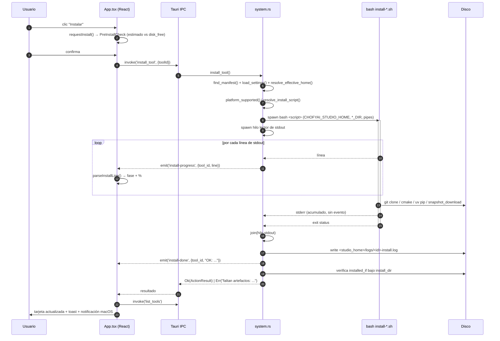

# 06 · Explicación profunda del código

> Estado: completo · Última revisión: 2026-08-27 · Versión analizada: 0.5.1 (commit f840055)

Este documento explica **cómo funciona por dentro** el código de ChofyAI Studio: qué decide
cada función, en qué orden, qué toca del disco, de la red o de la tabla de procesos, y dónde
están los casos límite. No es un catálogo de firmas — para eso está
[`05-technical-reference.md`](05-technical-reference.md); aquí se describe el **flujo interno**.

Convenciones de lectura:

- Cada afirmación apunta a un archivo y un símbolo concreto del repositorio.
- Cuando algo no se puede comprobar leyendo el código se marca como `Requiere validación`
  o `Inferencia basada en el código`.
- Los fragmentos de código son deliberadamente cortos: solo aparecen cuando la línea exacta
  es la información.

Índice de módulos cubiertos:

1. [Arranque del backend](#1-arranque-del-backend)
2. [Resolución de rutas](#2-resolución-de-rutas)
3. [Carga de manifests](#3-carga-de-manifests)
4. [Instalación](#4-instalación)
5. [Ciclo de vida de procesos](#5-ciclo-de-vida-de-procesos)
6. [Gestión de modelos](#6-gestión-de-modelos)
7. [Workflows y marketplace](#7-workflows-y-marketplace)
8. [Estadísticas del sistema](#8-estadísticas-del-sistema)
9. [Frontend: ciclo de vida de `App`](#9-frontend-ciclo-de-vida-de-app)
10. [`parseInstallLine`](#10-parseinstallline)
11. [`runWorkflowStep`](#11-runworkflowstep)
12. [Scripts de instalación](#12-scripts-de-instalación)
13. [Funciones triviales](#13-funciones-triviales-resumen)
14. [Comportamientos sorprendentes y riesgos](#14-comportamientos-sorprendentes-y-riesgos)

---

## 1. Arranque del backend

### 1.1 Objetivo y superficie

El binario nativo tiene un único punto de entrada, `src-tauri/src/main.rs`, de cinco líneas:

```rust
#![cfg_attr(not(debug_assertions), windows_subsystem = "windows")]

fn main() {
    chofyai_studio::run();
}
```

El atributo `cfg_attr` solo actúa en builds de release en Windows: evita que se abra una
consola detrás de la ventana. En macOS no tiene efecto. Toda la lógica de arranque vive en
`chofyai_studio::run()` (`src-tauri/src/lib.rs`), que es también el `mobile_entry_point`
declarado por `#[cfg_attr(mobile, tauri::mobile_entry_point)]` — un gancho que hoy no se usa
porque el proyecto no tiene targets móviles (`src-tauri/tauri.conf.json` solo declara
`"targets": ["app", "dmg"]`).

### 1.2 Flujo interno de `run()`

`run()` construye la aplicación Tauri en cuatro pasos encadenados sobre `tauri::Builder::default()`:

1. **`.manage(ProcessRegistry(Mutex::new(HashMap::new())))`** — inyecta en el contenedor de
   estado global de Tauri el registro de procesos, un `Mutex<HashMap<String, u32>>` que mapea
   `tool_id → PID` (definido en `src-tauri/src/system.rs`, símbolo `ProcessRegistry`). Es el
   único estado mutable compartido del backend. Cualquier comando que declare un parámetro
   `registry: tauri::State<'_, ProcessRegistry>` recibe una referencia a esta instancia.
   Arranca **vacío** a propósito: el contenido real llega en el paso siguiente.
2. **`.setup(...)`** — se ejecuta una sola vez, antes de que la ventana esté disponible para el
   usuario. Obtiene el `AppHandle`, recupera el estado recién registrado con `handle.state()` y
   llama a `system::restore_registry(handle, &registry)`. El closure devuelve `Ok(())`
   incondicionalmente: `restore_registry` no puede abortar el arranque (ver 1.3).
3. **`.invoke_handler(tauri::generate_handler![...])`** — registra los **35 comandos** que el
   frontend puede invocar por IPC. La macro genera en tiempo de compilación el dispatcher que
   deserializa los argumentos JSON a los tipos Rust y serializa el `Result` de vuelta. Un
   comando que no esté en esta lista no existe para el frontend, por muy `#[tauri::command]`
   que lleve encima.
4. **`.run(tauri::generate_context!())`** — arranca el event loop. El `.expect(...)` final
   convierte cualquier fallo de arranque en un panic: si la configuración o los recursos del
   bundle están rotos, la app muere de forma ruidosa en lugar de arrancar a medias.

Los 35 comandos registrados agrupan seis familias: sistema y rutas (`get_system_summary`,
`save_studio_home`, `save_path_settings`, `get_effective_paths`, `list_volume_candidates`,
`get_system_stats`, `run_doctor`, `notify_macos`), herramientas
(`list_tools`, `install_tool`, `update_tool`, `start_tool`, `stop_tool`, `restart_tool`,
`health_check_tool`, `open_tool_directory`, `open_tool_log`, `read_tool_log`,
`relocate_module`, `clear_module_override`), procesos (`list_running_pids`,
`list_orphan_ports`, `adopt_orphan`, `kill_orphan`), modelos (`list_tool_models`,
`delete_tool_model`, `list_declared_models`, `download_tool_model`), workflows y marketplace
(`list_workflows`, `save_workflow`, `delete_workflow`, `list_marketplace_tools`,
`import_marketplace_tool`) y diagnóstico (`append_crash_log`, `read_crash_log`).

### 1.3 `restore_registry`: por qué se restauran los PIDs al arrancar

`restore_registry` (`system.rs`) responde a un problema concreto: los servidores que lanza la
app (ComfyUI, whisper-server, FaceFusion…) son **procesos independientes del proceso Tauri**.
Si el usuario cierra la ventana de ChofyAI Studio, esos servidores siguen escuchando en sus
puertos. Al reabrir la app, el `HashMap` en memoria estaría vacío y la UI mostraría todo
"detenido" mientras los puertos siguen ocupados; el siguiente `start_tool` chocaría con el
proceso previo.

El flujo es defensivo de principio a fin — cada paso que puede fallar hace `return` silencioso
en lugar de propagar el error:

1. Resuelve `processes_state_path(app)`, que es `settings_path.parent()/processes.json`. Si
   `app_paths` falla, sale sin hacer nada.
2. Si el archivo no existe (primera ejecución), sale.
3. Lee el contenido; si falla la lectura, sale.
4. Deserializa a `HashMap<String, u32>` con `serde_json`; si el JSON está corrupto, sale
   (el archivo corrupto se queda tal cual y se sobrescribirá en el siguiente `persist_registry`).
5. **Filtra por PID vivo**: `prev.into_iter().filter(|(_, pid)| pid_is_alive(*pid))`. Aquí se
   resuelve la pregunta "¿y si el proceso murió mientras la app estaba cerrada?" — sencillamente
   no entra en el mapa restaurado. La comprobación es `kill -0 <pid>` (ver 5.6).
6. Inserta los supervivientes en el `Mutex` con `guard.insert(...)`. Nótese que **inserta, no
   reemplaza**: si el mapa ya tuviera entradas (no ocurre en el arranque, porque se crea vacío),
   se fusionarían.
7. Reescribe `processes.json` **solo con los vivos** vía `persist_registry`. El efecto lateral
   deseado es que el archivo se poda en cada arranque y no acumula PIDs fantasma.

Consecuencias operativas:

- Si el proceso murió, la tool aparece parada y su puerto libre: comportamiento correcto.
- Si el proceso sigue vivo, la app lo "readopta" y el usuario puede pararlo o reiniciarlo desde
  la UI aunque no fuera esta instancia de la app quien lo arrancó.
- **Riesgo de reutilización de PID**: `pid_is_alive` solo comprueba que *algún* proceso tenga
  ese PID, no que sea *el mismo* proceso. En un macOS que ha reciclado PIDs (reinicio del equipo
  entre sesiones), `restore_registry` puede adoptar un proceso ajeno. A partir de ahí,
  `stop_tool` le enviaría `SIGTERM`. El registro no guarda ningún discriminante adicional
  (hora de arranque, comando, `pgid`) que permitiera distinguirlo. `Inferencia basada en el código`.
- El complemento a este riesgo es `list_orphan_ports` (ver 5.7), que detecta el caso contrario:
  procesos que ocupan puertos declarados y **no** están en el registro.

---

## 2. Resolución de rutas

Este es el subsistema del que depende todo lo demás: si la ruta base se resuelve mal, ni los
manifests se leen, ni los scripts se encuentran, ni la instalación escribe donde debe.

### 2.1 `repo_root()` — el interruptor "dev vs empaquetado"

```rust
fn repo_root() -> Option<PathBuf> {
    let cwd = env::current_dir().ok()?;
    let root = if cwd.file_name().and_then(|n| n.to_str()) == Some("src-tauri") {
        cwd.parent()?.to_path_buf()
    } else { cwd };
    if root.join("apps").exists() && root.join("scripts").exists() && root.join("src-tauri").exists() {
        Some(root)
    } else { None }
}
```

`repo_root` decide, en tiempo de ejecución y a partir del **directorio de trabajo actual**, si
el binario está corriendo dentro del repositorio o no:

- Lee `env::current_dir()`. Con `cargo tauri dev` el cwd suele ser `src-tauri/`, así que si el
  último componente es exactamente `src-tauri` sube un nivel.
- Aplica una **triple verificación estructural**: solo devuelve `Some(root)` si existen a la vez
  `apps/`, `scripts/` y `src-tauri/`. No basta con que exista uno; esto evita falsos positivos
  cuando la app se lanza desde un directorio cualquiera que casualmente tenga una carpeta `apps`.
- Devuelve `None` en cualquier otro caso, incluido si `current_dir()` falla (proceso lanzado
  desde un directorio borrado).

Esta función **no cachea nada**: se reevalúa en cada llamada, y hay muchas. Si el proceso
cambiara de directorio de trabajo, el comportamiento cambiaría a mitad de sesión.
`Inferencia basada en el código`: ningún punto del backend llama a `set_current_dir`, así que
en la práctica el resultado es estable durante toda la vida del proceso.

### 2.2 `app_paths()`, `settings_path()`, `script_path()`

Las tres funciones son ramas del mismo `if let Some(root) = repo_root()`:

| Función | Modo repo (`repo_root() == Some`) | Modo empaquetado (`None`) |
| --- | --- | --- |
| `app_paths().apps_dir` | `<root>/apps` | `resolve("apps", BaseDirectory::Resource)` |
| `app_paths().settings_path` | `<root>/storage/state/settings.json` | `app_data_dir()/state/settings.json` |
| `script_path(rel)` | `<root>/<rel>` | `resolve(rel, BaseDirectory::Resource)` |

La asimetría importante está en `settings_path`: en modo repo los ajustes viven **dentro del
repositorio** (`storage/state/settings.json`, versionado en el árbol de trabajo), y en modo
empaquetado en el directorio de datos de la app del usuario
(`~/Library/Application Support/cl.vladimiracuna.chofyai.studio/state/settings.json`, derivado
del `identifier` de `tauri.conf.json`). Es decir: **desarrollar y usar el `.app` firmado no
comparten configuración**. Un `studio_home` configurado en dev no aparece en el `.app` y
viceversa.

`processes.json` y `crash.log` cuelgan del mismo directorio, porque ambos se calculan como
`settings_path.parent()`: ver `processes_state_path`, `append_crash_log` y `read_crash_log`.

Los recursos que se empaquetan están declarados en `src-tauri/tauri.conf.json`:

```json
"resources": ["../apps", "../docs", "../scripts/mac", "../marketplace", "../workflows", "../storage/state/settings.json"]
```

De ahí se derivan dos hechos con consecuencias:

- **`scripts/win` no está en la lista.** En un bundle de macOS eso no importa, pero significa
  que el mecanismo de recursos, tal como está escrito hoy, no lleva los `.ps1` a ningún lado.
  Un empaquetado para Windows requeriría añadirlos. `Requiere validación` en cuanto a si el
  pipeline de release de Windows usa otra configuración.
- **`apps/`, `workflows/` y `marketplace/` quedan dentro del bundle**, que es exactamente donde
  `import_marketplace_tool` y `save_workflow` intentan escribir cuando `repo_root()` es `None`
  (ver 7.2 y 7.4).

### 2.3 `path_is_usable()` e `is_writable_dir()`

`path_is_usable(path)` responde a "¿puedo usar esta ruta como raíz de trabajo?", que no es lo
mismo que "¿existe?":

1. Si el path **existe**, delega en `is_writable_dir(path)`.
2. Si **no existe**, sube por el árbol de padres (`while let Some(parent) = p.parent()`) hasta
   encontrar el primer ancestro que exista, y evalúa `is_writable_dir(parent)` sobre él. La
   lógica es "si el padre montado es escribible, podré crear el directorio".
3. Si agota los padres sin encontrar ninguno existente, devuelve `false`.

`is_writable_dir(path)` no consulta permisos POSIX ni ACLs — **prueba a escribir de verdad**:

```rust
let probe = path.join(".chofyai-write-probe");
match fs::write(&probe, b"") { Ok(_) => { let _ = fs::remove_file(&probe); true }, Err(_) => false }
```

Crea un archivo vacío llamado `.chofyai-write-probe`, y si lo consigue lo borra y devuelve
`true`. Esta decisión es deliberada y correcta para el caso de uso: en macOS un volumen puede
tener permisos de escritura aparentes y aun así rechazar la escritura (montaje de solo lectura,
volumen NTFS sin driver de escritura, cuota agotada, protección TCC del directorio). Solo la
escritura real lo demuestra.

Casos límite documentables:

- Si el path existe pero **es un archivo**, `is_writable_dir` devuelve `false` en la primera
  línea (`if !path.is_dir()`), sin intentar escribir.
- El borrado de la sonda usa `let _ =`: si el `remove_file` falla, el `.chofyai-write-probe`
  queda huérfano en el volumen. Con la app abierta, la sonda se ejecuta muchas veces por minuto
  (ver 2.4 y el intervalo de stats de 3 s en 9.3), así que el archivo se crea y borra
  constantemente en la raíz del `studio_home` y en cada volumen listado por
  `list_volume_candidates`.
- `list_volume_candidates` llama a `is_writable_dir` sobre **cada directorio de `/Volumes`**,
  lo que incluye volúmenes de red o de solo lectura ajenos al proyecto.

### 2.4 `resolve_effective_home()` — flujo por flujo

Esta es la función que decide dónde vive todo. Recibe `&AppSettings` y devuelve un `String`.

**Flujo A — camino feliz.** Construye `requested = PathBuf::from(settings.studio_home)` y
evalúa `path_is_usable(&requested)`. Si es usable: `fs::create_dir_all(&requested)` (con
`let _ =`, el error se ignora porque `path_is_usable` ya demostró que se puede escribir) y
devuelve `settings.studio_home.clone()` **sin normalizar** — el string sale tal cual lo guardó
el usuario.

**Flujo B — intento de montaje de sparsebundle.** Si el path no es usable, construye una lista
de candidatos en este orden de prioridad:

1. `settings.sparsebundle_path`, si está presente y no vacío.
2. La convención `format!("{}.sparsebundle", settings.studio_home)` — es decir, si el
   `studio_home` es `/Volumes/ChofyAIStudio`, prueba `/Volumes/ChofyAIStudio.sparsebundle`.

Filtra los candidatos con `.filter(|p| p.exists())` y, para cada superviviente, ejecuta:

```rust
Command::new("hdiutil").args(["attach", "-nobrowse", "-noverify"]).arg(sparsebundle).output()
```

`-nobrowse` evita que el volumen aparezca en el Finder y en el escritorio; `-noverify` salta la
verificación de checksum, que en imágenes grandes tarda minutos. El resultado del comando se
descarta con `let _ =`: **no se mira el código de salida ni el stderr de `hdiutil`**. Lo único
que decide el éxito es reevaluar `path_is_usable(&requested)` después del intento. Si ahora es
usable, crea el directorio y devuelve el `studio_home` solicitado.

La razón de existir de este mecanismo está documentada en `src-tauri/src/models.rs`, en el
comentario del campo `sparsebundle_path`: cuando el disco externo es ExFAT/FAT no soporta
symlinks ni permisos de ejecución, y los venvs de Python y los symlinks de ComfyUI se rompen.
Una imagen APFS montada encima del volumen ExFAT es la única vía. El helper manual equivalente
es `scripts/mac/mount-apfs.sh`, que hace lo mismo con `-mountpoint` explícito.

**Flujo C — fallback.** Si ningún candidato dejó la ruta usable, llama a
`fallback_home_for(settings)`, que devuelve `settings.fallback_home` si está presente y no en
blanco, y `default_studio_home()` (`$HOME/ChofyAIStudio`, con `USERPROFILE` como alternativa y
`"."` como último recurso en `home_dir()`) si no. Crea el directorio con `let _ =` y lo devuelve.

Efectos observables del flujo C:

- `get_system_summary` compara `effective != settings.studio_home` y expone `using_fallback:
  true`, que la UI muestra como el badge `⚠ Fallback` (clave i18n `topbar.fallback`).
- La app **no falla**: sigue funcionando contra el disco interno. Pero las herramientas
  instaladas en el volumen externo dejan de verse como instaladas, porque `list_tools`
  comprueba `installed_if` contra el nuevo `install_dir` derivado del fallback.
- El coste de `resolve_effective_home` no es despreciable: en el flujo A hace una escritura y
  un borrado reales, y en el flujo B lanza un proceso externo. Se llama desde prácticamente
  todos los comandos (`list_tools`, `get_system_stats`, `start_tool`, `read_tool_log`…), y
  `get_system_stats` se invoca cada 3 s desde el frontend.

### 2.5 El espejo en Bash y qué está duplicado

`scripts/mac/common.sh` reimplementa la misma lógica porque los scripts de instalación se
ejecutan como procesos hijos y **no comparten estado con Rust**, solo variables de entorno.

`_path_is_usable` es el espejo de `path_is_usable`:

```bash
_path_is_usable() {
  local p="$1"
  [ -z "$p" ] && return 1
  if [ -d "$p" ] && [ -w "$p" ]; then return 0; fi
  while [ -n "$p" ] && [ "$p" != "/" ]; do
    p="$(dirname "$p")"
    if [ -d "$p" ]; then [ -w "$p" ] && return 0; return 1; fi
  done
  return 1
}
```

`resolve_studio_home <default_home> <settings_file>` es el espejo parcial de
`resolve_effective_home`, con esta cascada de precedencia:

1. `$CHOFYAI_STUDIO_HOME` (que es exactamente la variable que inyecta Rust en `run_install_script`
   y `start_tool`).
2. `$STUDIO_HOME`, por compatibilidad con invocaciones manuales.
3. `read_studio_home_from_settings "$settings_file"` — lee `storage/state/settings.json`
   parseándolo con `python3` (heredoc `PYCODE`) y, si no hay `python3`, con `jq`. Si no hay
   ninguno de los dos, la función retorna sin imprimir nada.
4. `$default_home` si todo lo anterior quedó vacío o literalmente `"null"`.

Después aplica `_path_is_usable` y, si falla, cae a `$default_home`.

**Qué está duplicado entre Rust y Bash:**

| Concepto | Rust (`system.rs`) | Bash (`common.sh`) | ¿Equivalentes? |
| --- | --- | --- | --- |
| Comprobación de usabilidad | `path_is_usable` + `is_writable_dir` | `_path_is_usable` | No exactamente: Bash usa `[ -w ]` (permisos declarados), Rust escribe una sonda real |
| Resolución del home | `resolve_effective_home` | `resolve_studio_home` | No: **Bash no intenta montar el sparsebundle** |
| Fallback | `fallback_home` de settings, o `~/ChofyAIStudio` | solo `$default_home` (siempre `$HOME/ChofyAIStudio`) | No: Bash ignora `fallback_home` |
| Lectura de settings | `serde_json` sobre el path resuelto por `app_paths` | `python3`/`jq` sobre un path calculado desde `$SCRIPT_DIR/../..` | No en modo empaquetado: el script apunta al repo, no a `app_data_dir` |
| Subdirectorios | `effective_models_dir` / `_outputs_` / `_cache_` | `resolve_models_dir` / `resolve_outputs_dir` / `resolve_cache_dir` | Sí, y además Bash lee las env vars que Rust inyecta |

La divergencia más relevante es la de `[ -w ]` frente a la sonda: un volumen montado en solo
lectura puede pasar el test de Bash y fallar el de Rust, o al revés en directorios con ACL.
En la práctica el riesgo está acotado porque Rust siempre pasa `CHOFYAI_STUDIO_HOME` ya
resuelto, y esa variable tiene la máxima precedencia en `resolve_studio_home`. La ruta de Bash
"autónoma" solo se ejerce cuando el usuario ejecuta un script a mano desde el terminal.

La segunda divergencia — `SETTINGS_FILE="$REPO_ROOT/storage/state/settings.json"` en todos los
scripts de instalación — significa que un script lanzado a mano desde un `.app` desempaquetado
leería un `settings.json` que no es el que usa la app. Como Rust inyecta la variable de entorno,
el caso no se da al instalar desde la UI. `Inferencia basada en el código`.

---

## 3. Carga de manifests

### 3.1 `collect_manifests()`

Objetivo: convertir el directorio `apps/` en una lista ordenada de `(nombre_de_archivo,
RawManifest)`.

Flujo:

1. Obtiene `apps_dir` de `app_paths(app)?`. Si no existe el directorio, devuelve `Ok(vec![])`
   — un `apps/` ausente no es un error, simplemente no hay tools.
2. Recorre con `WalkDir::new(&apps_dir).min_depth(1).max_depth(1)`: **solo el primer nivel**,
   sin recursión. Los subdirectorios de `apps/` se ignoran por completo.
3. Filtra por extensión exacta `yaml`. Un archivo `.yml` **no se carga** (nótese la asimetría
   con `list_workflows`, que sí acepta ambas). Los archivos `._*` de AppleDouble que genera
   macOS en exFAT tampoco entran, porque su extensión sigue siendo `.yaml`… salvo que sí
   entran: `apps/._comfyui.yaml` tiene extensión `yaml` y **pasaría el filtro**, provocando un
   error de parseo YAML que aborta toda la función. `Requiere validación` sobre si esto se ha
   observado en la práctica; el repositorio incluye `scripts/mac/clean-appledouble.sh` y
   `.markdownlint-cli2.jsonc` ignora `**/._*`, lo que sugiere que el problema es conocido en
   otras capas.
4. Lee cada archivo y lo deserializa con `serde_yaml::from_str::<RawManifest>`. Cualquier error
   de lectura o de parseo se propaga con `?` — es decir, **un manifest roto rompe la lista
   entera**, no solo su propia entrada.
5. Ordena por `manifest.name` (no por `id` ni por nombre de archivo). Ese es el orden en que
   la UI pinta las tarjetas.

### 3.2 `find_manifest()`

Trivial en apariencia pero costoso: llama a `collect_manifests` completo y luego busca por
`m.id == tool_id`. Es decir, **cada comando que necesita un manifest relee y reparsea todos los
YAML del directorio**. `start_tool`, `health_check_tool`, `list_tool_models`,
`download_tool_model` y `resolve_models_dir` lo hacen. Con el health check corriendo cada 5 s
sobre cada tool con puerto (ver 9.4), esto son varias lecturas completas de `apps/` por segundo.
No hay caché en ningún nivel. El error si no hay coincidencia es literal:
`"No se encontro manifest para {tool_id}"`.

### 3.3 `RawManifest` y los campos que se ignoran

`RawManifest` es un `#[derive(Deserialize)]` con estos campos: `id`, `name`, `icon`, `category`,
`runtime`, `description`, `recommended`, `default_port`, `studio_home_subdir`, `install_script`,
`install_scripts`, `installed_if`, `run` (un `RawRun` con `command` y `commands`), `platforms`
y `models`.

`serde` ignora silenciosamente los campos desconocidos por defecto. Los manifests reales
declaran varios que **el backend nunca lee**:

| Campo presente en `apps/*.yaml` | ¿Lo usa el backend? |
| --- | --- |
| `python_manager: auto` | No. La elección uv/pip la hace `common.sh` (`detect_uv`) |
| `healthcheck: {type, url}` (en `qwen3-tts.yaml`) | No. `health_check_tool` usa `default_port` y un `TcpStream` |
| `install:` (lista de comandos, en `qwen3-tts.yaml`) | No. Solo se usa `install_script`/`install_scripts` |
| `notes:` | No |

Esto no es un fallo — son notas para el lector del YAML — pero conviene saberlo antes de
suponer que editar `healthcheck.url` cambia algo.

### 3.4 `manifest_install_dir()` y los overrides

Decide dónde vive físicamente una tool, con esta prioridad:

1. **Override en settings.** Si `settings.tool_overrides` contiene la clave `manifest.id`:
   - si el valor es una ruta **absoluta**, se devuelve tal cual;
   - si es **relativa**, se resuelve contra `studio_home`.
2. **Convención del manifest.** `studio_home_subdir` si está presente.
3. **Convención por defecto.** `format!("tools/{}", manifest.id)`.

Los overrides los escribe `relocate_module` (que además mueve los archivos, con `fs::rename` y
fallback a copia recursiva si el rename falla por cruzar volúmenes) y los borra
`clear_module_override` (que **no** mueve nada de vuelta: los archivos se quedan en el destino y
la tool aparece como no instalada). El campo `relocated` de `ToolSummary` es simplemente
`settings.tool_overrides.contains_key(&parsed.id)`.

### 3.5 Resolución por plataforma

Cuatro funciones cortas concentran toda la lógica multiplataforma:

- **`current_platform_key()`** devuelve una `&'static str` decidida en **tiempo de compilación**
  con `cfg!`: `"win-x64"` en Windows; en macOS, `"mac-arm64"` si `target_arch = "aarch64"` y
  `"mac-x64"` si no; `"linux-x64"` en Linux; `"unknown"` en cualquier otro caso. Nótese que
  `"mac-x64"` es un valor que puede producirse pero que **ningún manifest declara** y que
  `get_system_summary` clasifica como `"unsupported"`.
- **`resolve_install_script(manifest)`**: si existe el diccionario `install_scripts` y contiene
  la clave de la plataforma actual, gana. Si no, cae a `install_script` (el campo mono-plataforma
  legacy). Devuelve `Option<String>`; `None` significa "no hay forma de instalar esto aquí".
- **`resolve_run_command(run)`**: idéntica lógica sobre `run.commands` / `run.command`.
- **`platform_supported(manifest)`**: si `platforms` está **ausente**, devuelve
  `current_platform_key() == "mac-arm64"`. Si está presente, comprueba pertenencia a la lista.

La retrocompatibilidad "sin `platforms:` ⇒ mac-arm64" es explícita en el código y está
documentada en el comentario del campo. Su efecto real: un manifest antiguo, escrito antes de
que existiera el soporte Windows, no se instalará por accidente en Windows.

**Contradicción entre el comentario y el código.** El doc-comment del campo `platforms` dice
"si presente, la tool se oculta en plataformas no listadas". No se oculta: `list_tools` no
filtra por plataforma en ningún punto, y el frontend tampoco (`src/App.tsx` solo usa
`platform_key`/`platform_support` para pintar badges informativos en `OverviewModal`). La única
comprobación efectiva de `platform_supported` está en `run_install_script` (ver 4.1). Es decir,
la tool **aparece** en la lista y solo falla al pulsar "Instalar". `start_tool` ni siquiera
comprueba `platform_supported`: si un usuario tuviera la tool instalada por otra vía,
`resolve_run_command` devolvería `None` y el error sería `"{tool} no tiene run.command para
{plataforma}"`.

---

## 4. Instalación

### 4.1 `install_tool` → `run_install_script`

`install_tool` es un envoltorio de cuatro líneas: busca el manifest, carga settings, resuelve el
home efectivo y delega. `update_tool` hace lo mismo pero **antes** exige que la tool ya esté
instalada (`installed_if` no vacío **y** todos los checks presentes) y, al final, reescribe el
mensaje del `ActionResult` a "Actualización completada". Ambos comparten `run_install_script`,
así que actualizar es literalmente reejecutar el script de instalación — que es idempotente por
diseño (ver 12).

`run_install_script(app, tool_id, manifest, studio_home)` se lee mejor por bloques:

**Bloque 1 — Validación de plataforma.** `if !platform_supported(manifest)` devuelve `Err` con
un mensaje que incluye la plataforma actual y la lista soportada (usando `mac-arm64` como valor
por defecto en el mensaje cuando `platforms` está ausente, coherente con la retrocompatibilidad).
Este es el **único** punto del backend donde `platform_supported` decide algo.

**Bloque 2 — Resolución del script.** `resolve_install_script(manifest)` y, si es `None`, error
`"{tool} no declara install_script para {plataforma}"`. Después `script_path(app, &script_rel)`
convierte la ruta relativa del manifest (`scripts/mac/install-comfyui.sh`) en absoluta según el
modo repo/empaquetado (ver 2.2), y comprueba `script.exists()`. Se calcula también
`script_dir = script.parent()`, que se usará como `current_dir` del proceso hijo — es lo que
permite a los scripts hacer `source "$SCRIPT_DIR/common.sh"` sin conocer la ruta absoluta.

**Bloque 3 — Construcción del comando.** El binario es `script_shell()`: `"pwsh"` en Windows,
`"bash"` en el resto. Se pasa la ruta del script como primer argumento (sin `-lc`: aquí se
ejecuta un archivo, no una cadena inline). Se fija:

- `current_dir(script_dir)`,
- `env("CHOFYAI_STUDIO_HOME", studio_home)` — el contrato con `resolve_studio_home` de Bash,
- `stdout(Stdio::piped())` y `stderr(Stdio::piped())`,
- y `apply_path_env(&mut cmd, &settings, studio_home)`, que añade `CHOFYAI_MODELS_DIR`,
  `CHOFYAI_OUTPUTS_DIR` y `CHOFYAI_CACHE_DIR` calculadas por `effective_models_dir` y hermanas
  (override de settings, o `<studio_home>/{models,outputs,cache}`).

Detalle de robustez: la carga de settings usa `load_settings(app).unwrap_or(AppSettings { ... })`
con un `AppSettings` construido a mano. Si `settings.json` no se puede leer, la instalación
sigue con overrides vacíos en lugar de abortar.

**Bloque 4 — El hilo lector de stdout.** Este es el corazón del streaming de progreso:

```rust
let stdout = child.stdout.take().expect("stdout piped");
let stdout_thread = std::thread::spawn(move || {
    let mut buf = String::new();
    for line in BufReader::new(stdout).lines().map_while(Result::ok) {
        let _ = app_handle.emit("install-progress", InstallEvent { tool_id: tid.clone(), line: line.clone() });
        buf.push_str(&line); buf.push('\n');
    }
    buf
});
```

El hilo hace dos cosas a la vez: **emite** cada línea como evento Tauri `install-progress`
(payload `InstallEvent { tool_id, line }`) y la **acumula** en un `String` que devuelve al
hacer `join()`.

**Por qué existe el hilo, y qué pasaría sin él.** El proceso hijo escribe en un pipe con buffer
finito (en macOS, 64 KiB por defecto). Si nadie lo vacía, la siguiente escritura del hijo se
bloquea. El padre, mientras tanto, estaría bloqueado en `child.wait()` esperando a que el hijo
termine. Resultado: **deadlock clásico**. Una instalación de ComfyUI o whisper.cpp emite
fácilmente megabytes de salida de `cmake` y `pip`, así que el bloqueo sería inmediato, no
teórico. El hilo garantiza que el pipe se drena de forma continua mientras el hilo principal
espera. Como efecto secundario deseado, es lo que hace posible el progreso en vivo en la UI:
sin hilo, la salida solo estaría disponible al final.

**Bloque 5 — Lectura de stderr.** Se hace en el hilo principal, **antes** de `child.wait()`:

```rust
let stderr_output = child.stderr.take()
    .map(|s| BufReader::new(s).lines().map_while(Result::ok).collect::<Vec<_>>().join("\n"))
    .unwrap_or_default();
```

Este `collect()` bloquea hasta EOF del pipe de stderr, que ocurre cuando el hijo cierra el
descriptor (normalmente al terminar). El orden `stderr → wait → join(stdout)` es correcto
porque los dos pipes se están drenando en paralelo desde hilos distintos. **stderr no se emite
como evento**: solo aparece en el log final. Un script que escriba su diagnóstico por stderr no
produce progreso visible en la UI — de ahí que todos los scripts de `scripts/mac/` usen `echo`
a stdout para las líneas informativas y reserven stderr para errores duros.

**Bloque 6 — Log en disco.** `combined = format!("{}\n{}", stdout_output, stderr_output)` y se
escribe en `<studio_home>/logs/<tool_id>-install.log` con `fs::write`, es decir
**sobrescribiendo**: cada instalación pisa el log de la anterior. `fs::create_dir_all(&logs)`
antes, y los errores aquí sí se propagan con `?`.

**Bloque 7 — Evento `install-done`.** Se emite siempre, con éxito o sin él, reutilizando el
tipo `InstallEvent`: el campo `line` lleva `"OK: {name} instalado"` o
`"ERROR: instalacion fallo para {name}"`. El frontend distingue con
`line.startsWith('OK:')` — un contrato por prefijo de cadena, frágil pero funcional.

**Bloque 8 — Post-validación de `installed_if`.** Solo si `status.success()`. Recalcula el
`install_dir` (recargando settings otra vez) y comprueba que cada entrada de `installed_if`
exista bajo él. Si falta alguna, devuelve `Err` con la lista de artefactos ausentes y la ruta
del log. El comentario del código explica el escenario: `pip` falla a mitad, el venv parcial
existe, el script termina con código 0 y la instalación queda corrupta.

**Consecuencia importante y contraintuitiva:** en ese caso ya se emitió `install-done` con
`"OK: ..."` en el bloque 7. La UI marca la tool como instalada correctamente (verde, toast de
éxito, notificación nativa) **y además** recibe el `Err` del `invoke`, que `tauriInvoke`
convierte en un toast de error. El usuario ve las dos cosas a la vez. Es un desajuste de orden
entre la emisión del evento y la validación posterior.

### 4.2 Diagrama de secuencia del flujo completo

El diagrama recoge el camino desde el clic hasta el refresco de la lista. Los números
corresponden a los bloques descritos arriba.



El punto que el diagrama hace visible: `install-done` se emite **antes** de la verificación de
`installed_if`, y el `Err` viaja por un canal distinto (la respuesta del `invoke`) que el evento.

---

## 5. Ciclo de vida de procesos

### 5.1 `start_tool`

Entradas: `tool_id` y el `ProcessRegistry` inyectado. Salida: `ActionResult` con el PID en el
mensaje y `opened_url` a `http://127.0.0.1:<default_port>` si el manifest declara puerto.

Secuencia de decisiones:

1. `find_manifest` + `load_settings` + `resolve_effective_home` + `manifest_install_dir`.
2. `resolve_run_command(run)`; si es `None`, error inmediato — no hay forma de arrancar.
3. `if !install_dir.exists()` → error con la ruta. Cubre el caso "el volumen externo se
   desmontó desde la última instalación".
4. **Validación de `installed_if`.** Filtra los checks que no existen bajo `install_dir` y, si
   hay alguno, devuelve error pidiendo reinstalar. El comentario del código explica el porqué:
   sin esta guarda, `bash` arrancaría, fallaría al no encontrar el venv y moriría en
   milisegundos; el usuario vería el PID en la UI y luego "no abre", sin explicación. Con la
   guarda, el diagnóstico es explícito.
5. **Pre-flight de puerto.** Solo si `manifest.default_port` está presente:

   ```rust
   Command::new("lsof").args(["-ti", &format!(":{}", port), "-sTCP:LISTEN"]).output()
   ```

   `-t` produce solo PIDs, uno por línea; `-i :puerto` filtra por puerto y `-sTCP:LISTEN` por
   estado. Para cada PID parseado, si **no** está en el conjunto de PIDs del registro, se
   ejecuta `kill -9 <pid>`. La motivación (también en comentario) es que un residuo de una
   sesión anterior no deje al usuario con un botón que no hace nada.
6. **Redirección de salida.** Crea `<studio_home>/logs/<tool_id>-run.log` con `fs::File::create`
   (trunca el log previo) y clona el descriptor con `try_clone()` para tener dos handles: uno
   para stdout y otro para stderr. Ambos apuntan al **mismo archivo**, así que la salida queda
   intercalada en orden de escritura. Aquí no hay pipes ni hilo lector — el proceso escribe
   directo al archivo y el riesgo de deadlock no existe.
7. **Spawn.** `Command::new(script_shell())` + `shell_inline_command(&mut cmd, &run_command)`,
   que en macOS/Linux añade `-lc <cmd>` y en Windows `-NoProfile -Command <cmd>`. El `-l`
   (login shell) hace que `bash` cargue el perfil del usuario, lo que trae `PATH` con Homebrew
   y pyenv — necesario porque un proceso lanzado desde el `.app` hereda un entorno mínimo.
   `current_dir(&install_dir)`, `CHOFYAI_STUDIO_HOME` y las tres variables de `apply_path_env`.
8. **Registro del PID.** `child.id()`, insertado bajo el `tool_id` en el `Mutex` y persistido
   inmediatamente con `persist_registry`. El bloque está delimitado con llaves para que el
   `MutexGuard` se libere antes de construir la respuesta.

**Qué PID se registra exactamente.** Es el PID del shell lanzado (`bash -lc "..."`), no
necesariamente el del servidor final. Para whisper.cpp, cuyo `run.command` es un único comando
simple (`source/build/bin/whisper-server --host ...`), `bash` puede aplicar la optimización de
`exec` y el PID coincide con el del servidor. Para ComfyUI, AceForge o FaceFusion, cuyo comando
es una cadena con `&&`, el comportamiento depende de la versión de `bash`. `Requiere validación`
empírica. Si `bash` no hace `exec`, matar el PID registrado no mata al Python hijo — y ese es
precisamente el escenario que `list_orphan_ports` está diseñado para detectar.

### 5.2 `stop_tool`

Toma el lock, hace `pids.remove(&tool_id)` y, si había PID, ejecuta `kill -TERM <pid>`,
persiste el mapa ya sin la entrada y devuelve `ok: true`. Si no había PID registrado devuelve
`ok: false` con `"{tool} no tiene proceso activo registrado"` — **no es un `Err`**, así que el
frontend no muestra toast de error, solo el mensaje en la barra de estado.

Detalles: se usa `SIGTERM`, no `SIGKILL`, para que el proceso pueda cerrar limpiamente. No hay
espera ni verificación posterior: la entrada se borra del registro **antes** de saber si el
proceso murió. Si el proceso ignora `SIGTERM`, queda vivo y sin registrar, es decir, se
convierte en huérfano detectable por `list_orphan_ports`.

### 5.3 `restart_tool` y el `sleep(800 ms)`

Primer bloque, con el lock tomado: si hay PID registrado, `kill -TERM`, `persist_registry` y

```rust
std::thread::sleep(Duration::from_millis(800));
```

Los 800 ms dan margen a que el proceso libere el puerto TCP antes de que el nuevo lo reclame.
Sin la pausa, el `bind()` del proceso nuevo fallaría con "Address already in use". Es un valor
fijo, no una espera activa sobre el estado real del puerto: si el proceso tarda más de 800 ms
en cerrar (ComfyUI descargando modelos de la VRAM, por ejemplo), el reinicio falla igualmente.

**El sleep se ejecuta con el `MutexGuard` tomado.** El bloque `{ ... }` que delimita el guard
incluye la llamada a `sleep`, así que durante esos 800 ms cualquier otro comando que necesite
el registro (`health_check_tool`, `list_running_pids`, `start_tool`) queda bloqueado. Con el
health check corriendo cada 5 s, es un bloqueo observable pero corto.

El segundo bloque **duplica literalmente** el cuerpo de `start_tool` a partir del paso 6
(logs, spawn, registro), pero **omite** los pasos 3, 4 y 5: no comprueba `install_dir.exists()`,
no valida `installed_if` y no hace pre-flight de puerto. Un `restart_tool` sobre una instalación
corrupta arranca el proceso condenado que `start_tool` se negaría a arrancar.

### 5.4 `health_check_tool`

Devuelve un `HealthResult { tool_id, running, port_open, pid }` combinando dos señales
independientes:

- **`running`** — `pid.map(pid_is_alive).unwrap_or(false)`. Si había un PID registrado pero ya
  no está vivo, aprovecha para **limpiar el registro**: lo elimina y persiste. Es el mecanismo
  de autolimpieza cuando un servidor muere por su cuenta.
- **`port_open`** — solo si el manifest declara `default_port`:

  ```rust
  TcpStream::connect_timeout(&format!("127.0.0.1:{}", port).parse().unwrap(), Duration::from_secs(2)).is_ok()
  ```

  Es una conexión TCP real con timeout de 2 s. El `.unwrap()` sobre el `parse()` es seguro
  porque la cadena se construye a partir de un `u16`, así que siempre es una `SocketAddr` válida.

Las dos señales pueden discrepar legítimamente: un servidor puede estar `running` pero aún
cargando modelos (puerto cerrado), o el puerto puede estar abierto por un proceso ajeno con el
PID nuestro ya muerto. La UI trata cualquiera de las dos como "vivo"
(`if (result.running || result.port_open)`, ver 9.4).

**Coste**: cada llamada hace un `find_manifest` completo (relectura de todo `apps/`) y,
potencialmente, una espera de hasta 2 s en el intento de conexión. El frontend las lanza en
serie dentro de un bucle `for` cada 5 s (ver 9.4), así que con cuatro tools con puerto y todos
los puertos cerrados, un ciclo de sondeo podría tardar hasta 8 s — más que el propio intervalo.

### 5.5 `persist_registry` y el formato en disco

```rust
fn persist_registry(app: &AppHandle, map: &HashMap<String, u32>) {
    if let Ok(path) = processes_state_path(app) {
        let _ = fs::create_dir_all(path.parent().unwrap_or(Path::new(".")));
        if let Ok(json) = serde_json::to_string_pretty(map) { let _ = fs::write(&path, json); }
    }
}
```

Devuelve `()`: **todos los errores se descartan**. Un disco lleno o un volumen desmontado hacen
que el registro deje de persistirse sin ninguna señal. La escritura no es atómica (no hay
escritura a temporal + `rename`), así que un corte durante el `fs::write` puede dejar un JSON
truncado — que `restore_registry` descartará silenciosamente en el siguiente arranque, perdiendo
todas las asociaciones.

### 5.6 `pid_is_alive`

```rust
Command::new("kill").args(["-0", &pid.to_string()]).output().map(|o| o.status.success()).unwrap_or(false)
```

`kill -0` no envía señal: solo comprueba que el proceso exista y que el usuario tenga permiso
para señalizarlo. Es la comprobación estándar en Unix. Se implementa **lanzando un proceso
externo** en lugar de llamar a `libc::kill`, lo que evita una dependencia pero cuesta un `fork`,
más un `exec` por comprobación. `restore_registry` hace una por entrada, y `health_check_tool` una
por sondeo.

Limitaciones reales: si el proceso está en estado zombi (terminado pero sin `wait`), `kill -0`
sigue devolviendo éxito. Y si el proceso pertenece a otro usuario, falla con EPERM y se reporta
como muerto aunque esté vivo.

Los tests del módulo (`#[cfg(test)] mod tests` al final de `system.rs`) cubren esta función:
`pid_alive_for_self_is_true` comprueba el PID del propio proceso de test, y
`pid_alive_for_zero_is_false` usa `999_999_999` — el nombre del test menciona el PID 0, pero el
cuerpo prueba otro valor, con un comentario que explica que `kill -0 0` señalizaría todo el
grupo de procesos en Linux.

### 5.7 Detección y adopción de huérfanos

**`list_orphan_ports`** recorre todos los manifests, se salta los que no declaran
`default_port`, y por cada puerto ejecuta:

```text
lsof -nP -iTCP:<port> -sTCP:LISTEN -Fpc
```

`-n` evita resolución DNS y `-P` evita traducir números de puerto a nombres (ambos por
velocidad); `-F pc` produce la salida en formato de campos, una línea por campo, prefijada por
la letra del campo: `p<PID>` y `c<COMMAND>`. El parseo recorre las líneas con `strip_prefix('p')`
y `strip_prefix('c')` acumulando en dos `Option`.

Un PID se reporta como huérfano si **no** está en el conjunto de PIDs del registro. La entrada
`OrphanPort` incluye `tool_id` y `tool_name` del manifest cuyo puerto coincide — es decir, la
atribución es **por puerto, no por identidad del proceso**. Cualquier proceso que escuche en
8188 se reportará como "ComfyUI huérfano".

Casos límite del parseo:

- Si varios procesos escuchan en el mismo puerto, el bucle **sobrescribe** `pid` y `cmd` en cada
  iteración, así que solo se reporta el último. Es raro en TCP LISTEN pero posible con
  `SO_REUSEPORT`.
- Si `lsof` no encuentra nada sale con código distinto de cero, y el `match ... Ok(o) if
  o.status.success()` hace `continue`. Correcto.
- Si `lsof` no está instalado, el `Command` falla y también se hace `continue`: no hay error, la
  detección simplemente no funciona. `lsof` viene de serie en macOS.
- Dos manifests con el mismo `default_port` producirían dos entradas para el mismo proceso.

**`adopt_orphan(tool_id, pid)`** comprueba `pid_is_alive(pid)` — devuelve `Err` si no —, inserta
en el registro y persiste. A partir de ese momento el proceso ajeno se trata como propio:
`stop_tool` lo puede matar y `health_check_tool` lo monitoriza. No hay verificación de que el
PID corresponda realmente a esa tool.

**`kill_orphan(pid)`** ejecuta `kill -TERM <pid>` y **siempre devuelve `ok: true`**, incluso si
el proceso no existía o el `kill` falló (solo se propaga el error de lanzar el comando, no su
código de salida). El nombre sugiere terminación forzada, pero la señal es `SIGTERM`. El
frontend pide confirmación explícita antes de invocarlo (`OrphanBanner`, `confirm(...)`).

### 5.8 El riesgo del `kill -9` en el pre-flight

Merece su propio apartado porque es la operación más destructiva del backend.

En `start_tool`, cualquier proceso que escuche en el `default_port` de la tool y no esté en el
registro recibe `SIGKILL` **sin confirmación del usuario y sin ningún filtro por nombre de
comando o propietario**. Los puertos declarados son 7857 (AceForge), 7860 (Qwen3-TTS), 7862
(FaceFusion), 8178 (whisper.cpp) y 8188 (ComfyUI). Son puertos altos y poco convencionales,
pero no reservados: un servidor de desarrollo, un túnel SSH o cualquier proceso del usuario que
casualmente ocupe uno de ellos será terminado sin posibilidad de guardar estado, porque
`SIGKILL` no es capturable.

Contraste ilustrativo dentro del mismo código: `kill_orphan`, que actúa sobre procesos que la
UI ha mostrado explícitamente al usuario y que exige un `confirm()` en el frontend, usa
`SIGTERM`. El pre-flight, que es silencioso y automático, usa `SIGKILL`. La asimetría va en la
dirección contraria a la esperable.

Mitigaciones que existen hoy: la comprobación `!our_pids.contains(&pid)` evita matar procesos
propios, y `-sTCP:LISTEN` limita el alcance a procesos que estén escuchando, no a clientes
conectados. No hay lista blanca ni comprobación del comando devuelto por `lsof` (que sí se
recoge en `list_orphan_ports`, donde no se usa para matar).

---

## 6. Gestión de modelos

### 6.1 `resolve_models_dir`

```rust
fn resolve_models_dir(app: &AppHandle, tool_id: &str) -> Result<PathBuf, String> {
    let (_, manifest) = find_manifest(app, tool_id)?;
    let settings = load_settings(app)?;
    let effective = resolve_effective_home(&settings);
    let install_dir = manifest_install_dir(&manifest, &PathBuf::from(&effective), &settings.tool_overrides);
    Ok(install_dir.join("models"))
}
```

Devuelve **siempre** `<install_dir>/models`. Es la raíz de todos los comandos de modelos.

**Inconsistencia relevante:** esta función **ignora** `settings.models_dir`. Existen por tanto
dos nociones distintas de "directorio de modelos" en el mismo backend:

- `effective_models_dir(settings, studio_home)` → override de settings o
  `<studio_home>/models`. Es la que se exporta a los scripts como `CHOFYAI_MODELS_DIR` y la que
  devuelve `get_effective_paths` a la UI.
- `resolve_models_dir(app, tool_id)` → `<install_dir>/models`, por tool y sin override.

Si el usuario configura un `models_dir` personalizado desde Settings, los scripts escribirán ahí
pero `list_tool_models` seguirá mirando en `<install_dir>/models` y no verá nada. Los manifests
actuales refuerzan la segunda convención (`whispercpp.yaml` declara
`installed_if: models/ggml-base.en.bin`, relativo a `install_dir`), así que el caso solo se
rompe si se usa el override. `Inferencia basada en el código`; no hay test que cubra la
combinación.

### 6.2 `list_tool_models`

Objetivo: inventario de archivos de modelo en disco para el panel `ModelsPanel`.

1. Si el directorio no existe, devuelve lista vacía (no es error).
2. `WalkDir::new(&models_dir).max_depth(3)` — tres niveles de profundidad. Un modelo enterrado
   más hondo (por ejemplo, la estructura `snapshots/<hash>/...` de la caché de Hugging Face) no
   se listaría. Los errores de recorrido se descartan con `filter_map(|e| e.ok())`.
3. Se salta lo que no sea archivo regular.
4. **Filtra ruido de macOS**: `name.starts_with("._")` (archivos AppleDouble que aparecen al
   copiar a exFAT) y `name == ".DS_Store"`. Sin este filtro, la lista de modelos se llenaría de
   entradas de pocos bytes en cualquier volumen externo.
5. Calcula `relative_path` con `strip_prefix(&models_dir)`, cayendo al nombre suelto si falla.
6. Lee metadatos; si `path.metadata()` falla (enlace roto, permiso denegado), hace `continue`.
   La fecha de modificación se convierte a segundos desde la época, con `0` como valor por
   defecto.
7. **Ordena por tamaño descendente**: `out.sort_by(|a, b| b.size_bytes.cmp(&a.size_bytes))`. La
   decisión de producto es clara: lo que ocupa espacio va primero, porque el panel existe para
   liberar disco.

### 6.3 `delete_tool_model` y la defensa contra path traversal

Dos capas de defensa, en este orden:

**Capa 1 — sintáctica.** `if relative_path.is_empty() || relative_path.contains("..")` → error
`"relative_path inválido"`. Rechaza el vector obvio. Nótese que es una comprobación de subcadena:
un nombre de archivo legítimo que contenga `..` (por ejemplo `modelo..v2.bin`) también se
rechaza. Falso positivo aceptable.

**Capa 2 — semántica, la que realmente protege.**

```rust
let canonical_root = models_dir.canonicalize()?;
let canonical_target = target.canonicalize()?;
if !canonical_target.starts_with(&canonical_root) { return Err("path traversal bloqueado"); }
```

`canonicalize` resuelve **symlinks**, `.` y `..` contra el sistema de archivos real. Esto cubre
el caso que la capa 1 no ve: un symlink dentro de `models/` que apunte fuera del árbol. Sin
`canonicalize`, `models/enlace-a-etc/passwd` pasaría la comprobación textual.

**Efecto secundario de `canonicalize`:** requiere que el path **exista**. Un `relative_path`
inexistente produce `Err("target: No such file or directory")` en lugar de un mensaje de "no
encontrado". Funcionalmente correcto, diagnósticamente pobre.

**Capa 3 — tipo.** `if !canonical_target.is_file()` → `"solo se borran archivos"`. Impide
borrar directorios completos por accidente. Un modelo de Hugging Face descargado como directorio
(lo habitual con `snapshot_download`) **no se puede borrar** desde este comando; el usuario debe
borrar sus archivos uno a uno o usar el Finder.

El único test relacionado en `mod tests` (`delete_model_rejects_path_traversal`) es
testimonial: comprueba `"..".contains("..")` sin ejercitar la función, porque construir un
`AppHandle` en un test unitario requeriría levantar una app Tauri.

### 6.4 `list_declared_models`, `safe_model_name` y `dir_size`

`list_declared_models` cruza lo que el manifest **declara** con lo que hay **en disco**:

1. `manifest.models.clone().unwrap_or_default()` — un manifest sin `models:` produce lista vacía.
   Hoy solo `apps/qwen3-tts.yaml` declara modelos (tres repos `mlx-community/...`).
2. `fs::create_dir_all(&models_dir)` — **crea el directorio como efecto lateral de un comando de
   solo lectura**. Es intencional: garantiza que el panel pueda mostrar rutas válidas antes de
   la primera descarga.
3. Por cada repo declarado:
   - `local_name = safe_model_name(repo_id)`, que es `repo_id.rsplit('/').next()`, es decir el
     último segmento: `mlx-community/Qwen3-TTS-12Hz-0.6B-Base-8bit` → `Qwen3-TTS-12Hz-0.6B-Base-8bit`.
     El nombre "safe" viene de que elimina el `/` de la organización, que crearía un nivel de
     directorio no deseado. **No sanea nada más**: un `repo_id` terminado en `/..` produciría
     `local_name = ".."`. Como el `repo_id` debe coincidir con uno declarado en el manifest del
     repositorio (ver 6.5), el vector requiere control sobre `apps/*.yaml`.
   - `present` = el directorio existe **y** tiene al menos una entrada
     (`fs::read_dir(...).map(|mut it| it.next().is_some())`). Un directorio vacío cuenta como
     ausente, que es lo correcto tras una descarga abortada.
   - `size_bytes` = `dir_size(&local_path)` solo si está presente.

`dir_size` es una suma recursiva con `fs::read_dir` + `entry.metadata()`. Ignora errores
(`if let Ok(entries)`), no sigue symlinks explícitamente pero `p.is_dir()` **sí** los sigue, lo
que en un árbol con un symlink cíclico produciría recursión infinita y desbordamiento de pila.
`Inferencia basada en el código`: los directorios de Hugging Face descargados con
`--local-dir-use-symlinks False` no tienen symlinks, así que el caso no se da hoy.

### 6.5 `download_tool_model`

Es el gemelo de `run_install_script` para modelos, con la misma arquitectura de hilo lector.

**Validación contra el manifest.** Antes de nada:

```rust
if !declared.iter().any(|r| r == &repo_id) {
    return Err(format!("'{}' no está declarado en el manifest de {}", repo_id, tool_id));
}
```

Esta es la guarda de seguridad principal del comando: el frontend no puede pedir la descarga de
un repositorio arbitrario de Hugging Face. Solo se descargan repos que un `apps/*.yaml` del
repositorio declara explícitamente. Es una lista blanca efectiva.

**Ejecución.** Resuelve `scripts/mac/download-hf-model.sh` con `script_path`, comprueba que
exista, y lo lanza con `script_shell()` pasando dos argumentos: `repo_id` y el `target`
absoluto (`models_dir.join(safe_model_name(&repo_id))`). Mismo `current_dir(script_dir)`,
misma `CHOFYAI_STUDIO_HOME`, mismo `apply_path_env`, mismos pipes.

Nótese que el script está **codificado a `scripts/mac/`**, sin equivalente Windows y sin pasar
por `script_shell()` para elegir ruta: en Windows se intentaría ejecutar un `.sh` con `pwsh`.

**Eventos.** El hilo lector emite `model-download-progress` con un payload JSON construido a
mano (`serde_json::json!`) que lleva `tool_id`, `repo_id` y `line` — a diferencia de la
instalación, aquí el `repo_id` viaja en el evento, lo que permite al `ModelsPanel` mantener
varias descargas en curso separadas. Al final emite `model-download-done` con `tool_id`,
`repo_id` y `ok`.

**Log.** `<studio_home>/logs/<tool_id>-model-download.log`, sobrescrito en cada descarga. Como
el nombre no incluye el `repo_id`, dos descargas simultáneas del mismo tool pisan el mismo
archivo.

**Resultado.** A diferencia de la instalación, un fallo devuelve `Ok(ActionResult { ok: false })`,
no `Err`. El frontend distingue con `if (r?.ok)`.

---

## 7. Workflows y marketplace

### 7.1 `list_workflows`

`workflows_dir(app)` sigue el mismo patrón repo/recurso que `app_paths`. Si el directorio no
existe, devuelve lista vacía.

Recorre con `fs::read_dir` (un solo nivel, sin `WalkDir`), y por cada entrada:

- descarta lo que no sea archivo;
- exige extensión `.yaml` **o** `.yml` — más permisivo que `collect_manifests`, que solo acepta
  `.yaml`;
- descarta explícitamente los que empiezan por `._` — la protección AppleDouble que
  `collect_manifests` no tiene;
- lee y parsea a `serde_yaml::Value`; si falla la lectura o el parseo, `continue` — **un
  workflow roto no rompe la lista**, al contrario que un manifest roto;
- convierte a `serde_json::Value` con `serde_json::to_value` para que el frontend reciba JSON
  nativo sin conocer YAML.

Ordena por el campo `id` de cada documento (cadena vacía si falta), "para estabilidad" según el
comentario: sin orden explícito, `read_dir` devuelve los archivos en el orden del sistema de
archivos, que varía entre volúmenes.

El backend **no valida el esquema** al leer: cualquier YAML que parsee entra en la lista. La
validación de forma vive en `save_workflow` (escritura) y en el frontend (`WorkflowDef` en
`src/types.ts`, que es solo un tipo TypeScript, sin comprobación en runtime).

### 7.2 `save_workflow`

Dos validaciones antes de tocar el disco:

**`validate_workflow_id(id)`** — tres reglas acumulativas:

1. no vacío;
2. no contiene `/`, `\` ni `..` — bloqueo de path traversal, aquí puramente sintáctico porque no
   hay `canonicalize` (el archivo aún no existe);
3. todos los caracteres deben ser `[a-zA-Z0-9_-]` (`is_ascii_alphanumeric() || '-' || '_'`).

La tercera regla hace redundantes a la segunda, pero la segunda da mensajes de error más
concretos. El resultado es que el nombre de archivo final, `format!("{}.yaml", id)`, no puede
escapar del directorio.

**Validación del YAML:**

```rust
let parsed: serde_yaml::Value = serde_yaml::from_str(&yaml_content)?;
let mapping = parsed.as_mapping().ok_or("YAML root debe ser un mapping")?;
for k in &["id", "name", "description", "steps"] {
    if !mapping.contains_key(serde_yaml::Value::String(k.to_string())) {
        return Err(format!("falta campo obligatorio: {}", k));
    }
}
```

Solo se comprueba **presencia de cuatro claves de primer nivel**, no sus tipos ni su contenido.
Un `steps: "hola"` pasa la validación y luego rompe en el frontend. Tampoco se comprueba que el
`id` del YAML coincida con el `id` del parámetro: se puede guardar `workflows/a.yaml` con
`id: b` dentro, y `list_workflows` ordenaría por `b`.

Después: `fs::create_dir_all(&dir)` y `fs::write(&target, yaml_content)` — **sobrescribe sin
preguntar** si el workflow ya existe. Comportamiento opuesto al de `import_marketplace_tool`
(ver 7.4).

**Riesgo en modo empaquetado:** cuando `repo_root()` es `None`, `workflows_dir` apunta a
`Resources/workflows` dentro del `.app`. Escribir ahí modifica el bundle firmado, lo que en
macOS invalida la firma de código y puede fallar con permiso denegado según dónde esté instalada
la app (`/Applications` requiere privilegios). `Requiere validación` con un `.app` firmado real.

### 7.3 `delete_workflow`

Valida el id con la misma función, comprueba `target.exists()` (error `"workflows/{id}.yaml no
existe"` si no) y ejecuta `fs::remove_file`. Sin papelera, sin confirmación en el backend — la
confirmación la hace el frontend.

### 7.4 `list_marketplace_tools` e `import_marketplace_tool`

`list_marketplace_tools` construye una lista de rutas candidatas: `<repo_root>/marketplace/registry.yaml`
si estamos en el repo, o el recurso `marketplace/registry.yaml` del bundle si no. Recorre las
candidatas, y para la primera que exista lee y deserializa a `MarketplaceFile { tools:
Vec<MarketplaceEntry> }`. Si ninguna existe, devuelve lista vacía. Aquí sí, un `registry.yaml`
malformado propaga el error.

`import_marketplace_tool(id)` convierte una entrada del catálogo en un manifest de `apps/`:

1. Llama a `list_marketplace_tools` y busca por `id`; si no está, error.
2. Resuelve `apps_dir` (repo o recurso) y hace `create_dir_all`.
3. **No sobrescribe**: `if target.exists() { return Err("Ya existe apps/{id}.yaml — no se
   sobrescribe") }`. La razón es de protección de datos: el manifest destino puede haber sido
   editado a mano por el usuario para añadir `install_script`, `run`, `installed_if` reales. Una
   reimportación silenciosa perdería ese trabajo. Es la decisión opuesta a `save_workflow`,
   donde el usuario está editando explícitamente ese archivo desde el `WorkflowBuilder`.
4. **Genera el YAML por concatenación de cadenas**, no con `serde_yaml::to_string`. Emite `id`,
   `name`, `category`, `runtime`, `description` (con saltos de línea reemplazados por espacios
   para no romper el escalar plano), `recommended: false`, `default_port` si lo hay,
   `studio_home_subdir: tools/<id>`, `platforms:\n  - mac-arm64` e `installed_if:\n  - source/.git`.
   Después añade como comentarios `notes`, `install_hint` y `repo` de la entrada del catálogo.

   La generación manual tiene un punto frágil: si un `name` o `description` del catálogo
   contuviera `:` seguido de espacio, o empezara por un carácter especial de YAML, el manifest
   generado no parsearía y `collect_manifests` fallaría **para todas las tools**. Como
   `marketplace/registry.yaml` es un archivo curado del propio repositorio, el riesgo es de
   mantenimiento, no de entrada externa.
5. El `ActionResult` devuelto lleva `log_path` con la ruta del YAML creado (uso poco ortodoxo
   del campo) y `opened_url` con el `homepage` de la entrada.

El manifest generado es deliberadamente **incompleto**: no tiene `install_script` ni `run`. La
tool aparece en la lista como no instalada y sin acción de instalar posible; el mensaje de
retorno lo dice explícitamente ("añade install_script y run cuando esté listo"). Es un
"marcador de posición" para trabajo manual, tal y como declara el doc-comment del comando.

---

## 8. Estadísticas del sistema

### 8.1 Por qué comandos del sistema en lugar de `sysinfo`

El bloque está encabezado en el código por el comentario
`// ─── Stats del sistema (sin dependencias extra) ───`. La decisión es explícita: no añadir la
crate `sysinfo` (u otra equivalente) y leer los datos invocando las herramientas de línea de
comandos de macOS. El helper compartido es:

```rust
fn run_capture(cmd: &str, args: &[&str]) -> Option<String> {
    Command::new(cmd).args(args).output().ok().and_then(|o| String::from_utf8(o.stdout).ok())
}
```

Todo error — binario ausente, salida no UTF-8, código de salida distinto de cero (que
`run_capture` **no comprueba**) — se convierte en `None`, y cada lector cae a un valor por
defecto. Las estadísticas nunca hacen fallar un comando.

Ventajas de la decisión: cero dependencias nuevas, binario más pequeño, sin código `unsafe` ni
FFI. Coste: **seis procesos externos por llamada a `get_system_stats`** (`sysctl` ×4, `vm_stat`,
`top`, `df`), y el frontend la invoca cada 3 s (ver 9.3). Y una dependencia total de macOS: el
formato de salida de `vm_stat` y `top` es específico de Darwin.

### 8.2 `read_mem_used()`

Objetivo: bytes de memoria **en uso**. macOS no expone ese número directamente; expone páginas
por categoría, y hay que decidir cuáles cuentan como disponibles.

Flujo:

1. `total = read_mem_total()` — `sysctl -n hw.memsize`, bytes físicos instalados.
2. `vm_stat` sin argumentos. Si falla, devuelve `0`.
3. Recorre las líneas buscando cuatro cosas:
   - la cabecera `"Mach Virtual Memory Statistics: (page size of "`, de la que extrae el
     **tamaño de página** con `rest.split(' ').next()`. Valor por defecto si no aparece:
     `16384` — 16 KiB, que es el tamaño de página de Apple Silicon (en Intel serían 4096, de ahí
     el comentario `// default Apple Silicon`).
   - `"Pages free:"`, `"Pages inactive:"` y `"Pages speculative:"`, parseadas con `parse_pages`,
     que hace `trim()`, quita el punto final y elimina las comas de millares antes del `parse`.
     Sin ese saneado, `"Pages free:    123,456."` no parsearía.
4. `available = (free + inactive + speculative) * page_size`
5. `used = total.saturating_sub(available)` — el `saturating_sub` evita el desbordamiento si
   `available` saliera mayor que `total` (posible si `hw.memsize` falla y devuelve `0`).

**Qué significa esta fórmula.** Contar `free` es obvio. `inactive` son páginas que tuvieron
contenido y pueden reclamarse sin escribir a disco. `speculative` son páginas leídas por
adelantado por el prefetcher. Sumarlas da una aproximación razonable de "memoria que el sistema
puede entregar a una aplicación nueva".

**Qué no cuenta.** La categoría `Pages purgeable` no se suma, aunque también es reclamable.
Tampoco se resta la memoria comprimida (`Pages occupied by compressor`), que Activity Monitor sí
considera. El resultado **no coincidirá** con la "Memoria usada" de Activity Monitor, que usa
una fórmula distinta basada en `app memory + wired + compressed`. La diferencia típica es de
varios GB en un sistema con presión de memoria. `Requiere validación` cuantitativa.

### 8.3 `read_cpu_usage()`

Objetivo: porcentaje de CPU en uso, 0..100.

```rust
let out = run_capture("top", &["-l", "1", "-n", "0"])?;
// busca la línea "CPU usage: 5.12% user, 8.20% sys, 86.67% idle"
// toma el fragmento que contiene "idle" y devuelve 100.0 - idle, clampado a [0, 100]
```

El flujo es: ejecutar `top` en modo logging (`-l 1`, una muestra) sin listar procesos (`-n 0`),
localizar la línea que empieza por `"CPU usage:"`, partir por comas, quedarse con el fragmento
que contenga `"idle"`, extraer el número antes del `%` y devolver `100 - idle` acotado con
`.max(0.0).min(100.0)`.

**Discrepancia entre el comentario y el código.** El doc-comment dice
`Uso de CPU 0..100 leyendo 'top -l 2' (segunda muestra para que sea instantáneo real)`, pero el
código ejecuta `top -l 1`. La diferencia es sustancial: con una sola muestra, `top` reporta el
uso de CPU **acumulado desde el arranque del sistema**, no el instantáneo. Con dos muestras, la
segunda es el delta entre ambas, que es lo que el comentario describe y lo que el usuario espera
ver. En la práctica, la barra de CPU de la UI muestra un valor que apenas varía. Este es el
hallazgo más claro de "comentario que contradice el código" del módulo.

**Otras limitaciones:**

- El formato de la línea de `top` no está garantizado entre versiones de macOS; un cambio de
  literal rompe el parseo silenciosamente y devuelve `0.0`.
- Es un porcentaje agregado de todos los núcleos, no por núcleo. `read_cpu_cores` (`sysctl -n
  hw.ncpu`) se expone aparte para que la UI pueda dar contexto.
- El uso puede superar el 100% en la salida cruda de `top` para procesos individuales, pero la
  línea `CPU usage:` global no, y el clamp cubre el resto.

### 8.4 El resto de lectores

- **`read_load_avg`** — `sysctl -n vm.loadavg` devuelve `{ 1.50 1.20 0.95 }`; se toma el
  `nth(1)` de los tokens separados por espacios, que es el promedio de 1 minuto (el `nth(0)` es
  la llave `{`).
- **`read_uptime`** — `sysctl -n kern.boottime` devuelve algo como
  `{ sec = 1740000000, usec = 0 } ...`; se parte por `"sec = "`, se corta en la coma y se resta
  del tiempo actual con `saturating_sub`.
- **`read_disk_usage(path)`** — si el path no existe, cae a `home_dir()`. Ejecuta `df -k <path>`,
  toma la **última línea** de la salida (`lines().last()`), la parte en columnas y lee
  `cols[1]` (bloques de 1024 totales) y `cols[3]` (disponibles), multiplicando por 1024.
  Devuelve `(total, free)` en ese orden — orden documentado y verificado por el test
  `read_disk_usage_returns_two_values`. Tomar la última línea es lo correcto porque `df` con
  rutas largas parte la salida en dos líneas.
- **`list_external_volumes`** — `fs::read_dir("/Volumes")` filtrando directorios. Devuelve
  también el enlace al volumen de arranque que macOS coloca en `/Volumes`, así que
  `list_volume_candidates` puede ofrecer el disco de sistema dos veces con etiquetas distintas.

`get_system_stats` ensambla todo, usando `resolve_effective_home` para saber sobre qué volumen
medir el espacio — con el coste asociado (sonda de escritura) descrito en 2.3.

---

## 9. Frontend: ciclo de vida de `App`

`src/App.tsx` es un archivo de 2766 líneas con un componente principal (`App`) y una veintena de
subcomponentes en el mismo módulo. Todo el estado de la aplicación vive en `useState` dentro de
`App`; no hay Redux, Context ni store externo.

### 9.1 `tauriInvoke` y el modo web

```ts
const inTauri = typeof window !== 'undefined' && '__TAURI_INTERNALS__' in window;

async function tauriInvoke<T>(cmd, args?, opts?): Promise<T | null> {
  if (!inTauri) return null;
  try { return await invoke<T>(cmd, args); }
  catch (err) { if (!opts?.silent) notify('error', `${cmd} falló`, msg); return null; }
}
```

Toda comunicación con Rust pasa por aquí. Decisiones y consecuencias:

- `inTauri` se evalúa **una vez, al cargar el módulo**, comprobando la existencia de
  `__TAURI_INTERNALS__` en `window`. Es el marcador que inyecta Tauri 2 en el contexto de la
  webview.
- En modo web (`pnpm dev:web` en el navegador), devuelve `null` sin intentar nada. La app
  arranca, pinta la interfaz completa con `fallbackTools` y todos los botones son inertes. El
  mensaje inicial lo dice: `"Modo web (sin backend): los botones requieren npm run tauri:dev"`.
- **Un error del backend y "no hay backend" son indistinguibles**: ambos devuelven `null`. Los
  llamantes que necesitan distinguir usan `opts.silent` para suprimir el toast y tratan `null`
  como lista vacía.
- `fallbackTools` es un array de cinco `ToolManifest` codificados a mano con
  `installed: false`, rutas `~/ChofyAIStudio/tools/...` y `missing_checks` que **no siempre
  coinciden con los manifests reales**: el fallback de `comfyui` declara
  `['source/.git', 'venv']` mientras `apps/comfyui.yaml` declara `installed_if: [source/main.py]`.
  Solo afecta a la vista previa en modo web.
- `reloadTools` restaura `fallbackTools` cada vez que `list_tools` devuelve `null`, así que un
  fallo transitorio del backend hace que la UI "olvide" las tools reales y muestre las cinco
  de fábrica.

### 9.2 Carga inicial

Un `useEffect` con dependencias `[]` ejecuta en serie, con `await` entre cada paso:
`reloadSummary()` → `reloadTools()` → `reloadVolumes()` → `reloadStats()`. La secuencialidad
importa poco funcionalmente (los comandos son independientes), pero evita cuatro llamadas IPC
simultáneas en el arranque.

`reloadSummary` tiene un fallback elaborado para modo web: si `get_system_summary` devuelve
`null`, construye un `SystemSummary` sintético detectando la plataforma desde
`navigator.userAgent` (`windows` → `win-x64`/`experimental`, `linux` sin `android` →
`linux-x64`/`todo`, resto → `mac-arm64`/`validated`). Es la única lógica del frontend que
duplica una decisión del backend (`current_platform_key` + el `match` de `platform_support` en
`get_system_summary`).

Un segundo `useEffect` con `[]` llama a `list_running_pids` en modo silencioso y, si devuelve
entradas, siembra `runningIds` con sus claves y lanza un toast
`"Procesos restaurados · N servidor(es) sigue(n) vivo(s)"`. Es la contraparte visible de
`restore_registry` (ver 1.3).

### 9.3 Los intervalos

| Intervalo | Periodo | Dependencias del efecto | Guarda |
| --- | --- | --- | --- |
| `reloadOrphans` | 60 000 ms | `[]` | `if (!inTauri) return` |
| `reloadStats` | 3 000 ms | `[]` | `if (!inTauri) return` |
| `reloadTools` | 8 000 ms | `[]` | `if (!inTauri) return` |
| `setTick` (elapsed) | 1 000 ms | `[queue]` | solo si hay item `installing` |
| health `probe` | 5 000 ms | `[tools, startingTools]` | `if (!inTauri \|\| tools.length === 0) return` |
| `StatusBar` re-render | 30 000 ms | `[]` | ninguna |
| `LogsViewer` auto-refresh | 2 000 ms | `[toolId, kind, autoRefresh]` | `if (!autoRefresh) return` |

Notas sobre cada uno:

- **Huérfanos (60 s).** Escanea con `list_orphan_ports` en modo `silent`, para que un fallo no
  llene la pantalla de toasts cada minuto. El resultado alimenta el `OrphanBanner` y el badge del
  sidebar.
- **Stats (3 s).** El más frecuente y el más caro en el backend (seis procesos + una sonda de
  escritura por llamada, ver 8.1 y 2.3). Alimenta la barra inferior con CPU, RAM y disco.
- **Auto-refresh de tools (8 s).** Su motivo está en el comentario: *"para detectar instalaciones
  lanzadas desde CLI"*. Un usuario que ejecute `bash scripts/mac/install-comfyui.sh` desde el
  terminal ve la tarjeta cambiar a "instalada" sin tocar la UI.
- **Tick de 1 s durante instalaciones.** No refresca datos: solo fuerza un re-render
  (`setTick(n => n+1)`) para que `fmtElapsed(Date.now() - startedAt)` se recalcule y el
  cronómetro de la cola avance. El efecto depende de `[queue]`, y `queue` cambia con **cada
  línea de progreso** que llega por `install-progress`, así que el intervalo se destruye y se
  recrea constantemente durante una instalación ruidosa. Funciona, pero es trabajo desperdiciado.

### 9.4 El health check y la tolerancia de 60 s

El efecto más complejo del componente:

```ts
useEffect(() => {
  if (!inTauri || tools.length === 0) return;
  const probe = async () => {
    for (const t of tools) {
      if (!t.default_port) continue;
      const result = await tauriInvoke<HealthResult>('health_check_tool', { toolId: t.id }, { silent: true });
      ...
    }
  };
  void probe();
  const interval = setInterval(probe, 5000);
  return () => clearInterval(interval);
}, [tools, startingTools]);
```

Comportamiento:

1. Sondea **todas** las tools con puerto, no solo las que la UI cree corriendo. Así detecta
   servidores arrancados fuera de la app.
2. El bucle es **secuencial** (`await` dentro de `for`), no `Promise.all`. Con el timeout de 2 s
   de `TcpStream::connect_timeout` en el backend, un ciclo completo con todos los puertos
   cerrados puede exceder los 5 s del intervalo. El siguiente `probe` se solapa con el anterior.
3. Si `running || port_open`: añade a `runningIds` y **borra la entrada de `startingTools`**
   (el servidor ya respondió, la gracia se acabó).
4. Si ninguno de los dos: consulta `startingTools[t.id]`, que es el timestamp que `handleStart`
   y `handleRestart` escriben al iniciar. Si han pasado menos de `60_000` ms, hace `continue`
   sin marcar nada. **Esta es la tolerancia de 60 s**, y existe porque arrancar ComfyUI o
   FaceFusion implica cargar modelos: el proceso está vivo pero el puerto tarda decenas de
   segundos en abrir. Sin la gracia, la UI parpadearía a "caído" inmediatamente después de
   pulsar "Iniciar".
5. Pasados los 60 s sin respuesta, elimina de `runningIds` y de `startingTools`.

**El efecto depende de `startingTools`, y el propio efecto modifica `startingTools`.** Cada vez
que una tool sale del estado "starting", el efecto se desmonta, se recrea y dispara un `probe()`
inmediato. No es un bucle infinito porque las actualizaciones son idempotentes (los `setState`
devuelven el objeto anterior sin cambios cuando no hay nada que hacer, evitando el re-render),
pero sí produce sondeos extra fuera de cadencia.

### 9.5 La cola de instalación

Tres funciones y un `useRef`:

- **`addToQueue(tool)`** — comprueba duplicados por `toolId` y añade un `QueueItem` con
  `status: 'pending'` y `lines: []`. Hace visible el panel de cola.
- **`addAllPendingToQueue()`** — **reemplaza** la cola entera con todas las tools que cumplan
  `!t.installed && Boolean(t.install_script)`. Nótese que descarta silenciosamente lo que no
  tenga script para la plataforma actual, porque `install_script` en `ToolSummary` ya viene
  resuelto por `resolve_install_script`.
- **`runQueue()`** — el ejecutor:

  ```ts
  if (isQueueRunning) return;
  setIsQueueRunning(true);
  for (const item of queue) {
    if (item.status !== 'pending') continue;
    progressRef.current[item.toolId] = [];
    setQueue(...);  // marca 'installing', startedAt, progressPct 0
    const r = await tauriInvoke<ActionResult>('install_tool', { toolId: item.toolId });
    if (!r) setQueue(... 'failed', 'Sin backend');
    await reloadTools();
  }
  setIsQueueRunning(false);
  ```

  Es estrictamente **secuencial**: cada `install_tool` se espera antes de lanzar el siguiente.
  La razón es evidente para el dominio — dos `pip install` o dos `cmake -j 4` simultáneos
  compiten por CPU, disco y red, y pueden corromperse mutuamente la caché de `uv`.

  Dos limitaciones del bucle: itera sobre el **snapshot** de `queue` capturado al invocar, así
  que lo que se añada durante la ejecución no se procesa; y el guard `isQueueRunning` impide
  reentrada pero no cancela una cola en curso — no hay botón de cancelación, y `clearQueue`
  se niega a actuar mientras `isQueueRunning` sea `true`.

`progressRef` es un `useRef<Record<string, string[]>>` que acumula las líneas fuera del estado
de React, para no forzar un re-render por línea. El estado solo recibe `arr.slice(-30)` (las 30
últimas), y el ref se poda a 400 líneas (`if (arr.length > 400) arr.splice(0, arr.length - 400)`).

### 9.6 Los listeners de eventos

Un `useEffect` con `[]` registra dos escuchas de Tauri:

**`install-progress`** — por cada línea: la empuja al `progressRef`, poda a 400, y actualiza el
`QueueItem` correspondiente aplicando `parseInstallLine(estadoPrevio, line)` (ver sección 10).
El resultado del parser se mezcla con spread (`{ ...q, lines: arr.slice(-30), ...parsed }`), lo
que significa que los campos que el parser no toca conservan su valor previo. Si el `tool_id` no
está en la cola (instalación lanzada desde el botón directo o desde ⌘K), el `map` no encuentra
nada y **el progreso se pierde**: la UI no muestra barra para esas instalaciones.

**`install-done`** — decide éxito con `line.startsWith('OK:')`, marca el item como `done` o
`failed`, fija `progressPct: 100` y `phase: 'Listo'` en caso de éxito, recarga las tools y lanza
un toast más una notificación nativa vía `notify_macos` (que ejecuta `osascript -e 'display
notification ...'` en el backend, con las comillas escapadas).

**Bug de closure obsoleto:** el listener resuelve el nombre de la tool con
`const t = tools.find((x) => x.id === tool_id)`, pero el efecto tiene dependencias `[]`, así que
`tools` es el valor del **primer render** — es decir, `fallbackTools`. Para las cinco tools de
fábrica el nombre sale correcto por coincidencia; para una tool importada del marketplace, el
toast mostraría el `tool_id` en lugar del nombre (`t?.name ?? tool_id`). Impacto cosmético.

El cleanup de ambas escuchas es correcto: `listen()` devuelve una `Promise<UnlistenFn>` y el
`return` del efecto hace `void unP.then((fn) => fn())`.

### 9.7 Atajos de teclado

Un `useEffect` con dependencias `[lastTouchedToolId]` registra un `keydown` en `window`:

- **Sin modificador**, solo se atiende `Escape`, que cierra en cascada `showCmdK`,
  `showSettings`, `showHelp`, `viewingTool`, `viewingLogsFor`, `viewingModelsFor` y
  `preInstallTool`. No cierra `showMarket`, `showWorkflows`, `showBuilder`, `showOverview`,
  `showOrphans` ni `showDoctor`, que solo se cierran con su botón `✕` o clic en el overlay.
- **Con `metaKey` o `ctrlKey`**, todos con `preventDefault()`: `k` paleta de comandos, `,`
  settings, `/` ayuda, `r` refresco de tools y stats, `b` alterna claro/oscuro, `l` logs de la
  última tool tocada, `m` marketplace, `w` workflows.

Dos consecuencias del `preventDefault`: **⌘R deja de recargar la webview** y **⌘W deja de cerrar
la ventana**. En una app de escritorio es defendible; en el modo web del navegador es
sorprendente. El catálogo `SHORTCUTS` que muestra `HelpPanel` está mantenido a mano y es
independiente del handler: una divergencia entre ambos no la detecta nada.

El `⌘L` depende de `lastTouchedToolId`, que se fija en `requestInstall`, `handleInstall`,
`handleStart` y `handleOpenLog`. Si el usuario no ha tocado ninguna tool, el atajo no hace nada.

### 9.8 `AppErrorBoundary` y `crash.log`

Es la única clase de componente del archivo, porque los error boundaries de React requieren
`componentDidCatch`.

- `static getDerivedStateFromError(error)` guarda el error en estado, lo que sustituye todo el
  árbol por una pantalla `"💥 La interfaz se rompió"` con el mensaje y un botón que hace
  `setState({error: null})` seguido de `location.reload()`.
- `componentDidCatch(error, info)` hace tres cosas: `console.error`, un toast de error, y
  **persiste el fallo**:

  ```ts
  const stack = (error.stack ?? '') + '\n--- componentStack ---\n' + (info.componentStack ?? '');
  void tauriInvoke('append_crash_log', { message: `[UI] ${error.message}\n${stack.slice(0, 4000)}` }, { silent: true });
  ```

  El backend (`append_crash_log`) abre `<state_dir>/crash.log` en modo `append` y escribe
  `[<epoch_secs>] <mensaje>`. El truncado a 4000 caracteres evita que un stack enorme llene el
  archivo. El `{ silent: true }` es esencial: si el propio `notify` fallara, se entraría en un
  bucle de errores.

  `read_crash_log` devuelve las **últimas 200 líneas** del archivo. Como cada crash escribe
  varias líneas de stack, la ventana real es de unos pocos crashes. El archivo **nunca se rota
  ni se trunca** desde el código: crece sin límite.

`AppErrorBoundary` envuelve todo el árbol, incluido `<Toaster />`. Si el error se produjera
dentro del propio `Toaster`, el `notify` de `componentDidCatch` escribiría en un `pushToast` que
ya no tiene componente detrás; la llamada no falla (el módulo mantiene una función vacía por
defecto), simplemente no se ve nada.

### 9.9 Tema e idioma

**Tema.** Estado `theme: 'dark' | 'light' | 'system'`, inicializado desde
`localStorage['chofyai_theme']` con `'dark'` por defecto y `try/catch` alrededor (Safari en modo
privado puede lanzar al acceder a `localStorage`). Dos efectos:

1. `[theme]` → `applyTheme(theme)`, que escribe `document.documentElement.dataset.theme` con el
   valor **resuelto** (`system` se traduce consultando `matchMedia('(prefers-color-scheme:
   light)')`), y persiste en `localStorage`.
2. `[theme]` → solo si `theme === 'system'`, suscribe un listener `change` a la media query para
   repintar cuando el usuario cambie el tema del sistema. Se desuscribe en el cleanup.

El CSS consume `[data-theme]` desde `src/styles.css`.

**Idioma.** `src/i18n.ts` implementa un i18n mínimo sin dependencias: dos diccionarios planos
(`es`, `en`), `currentLang` como variable de módulo inicializada desde
`localStorage['chofyai_lang']`, y un `Set<() => void>` de listeners. `setLang` actualiza la
variable, persiste, fija `document.documentElement.lang` y notifica a todos los listeners. El
hook `useT()` se suscribe al `Set` y fuerza un re-render con `force(n => n+1)` cuando cambia el
idioma; devuelve la función `t` global.

`t(key, params)` busca en el diccionario actual, cae al diccionario por defecto (`es`) si la
clave falta, y **devuelve la propia clave** si tampoco está ahí — así una traducción olvidada se
ve como `sidebar.foo` en la interfaz en lugar de un hueco vacío. La interpolación reemplaza
`{param}` con una `RegExp` construida en cada llamada.

### 9.10 `UpdateChecker`

Un `useEffect` con `[]` hace `fetch` a la API pública de GitHub
(`repos/vladimiracunadev-create/chofyai-studio/releases/latest`). Es la **única salida a
internet del frontend** además de los `fetch` de los workflows. Todo el bloque está en un
`try/catch` vacío: sin red o sin releases, no pasa nada.

La comparación de versiones es la parte frágil:

```ts
const remote = data.tag_name.replace(/^v/, '');
const local = APP_VERSION.replace(/-dev$/, '');
if (remote !== local && remote > local) setLatest(data);
```

`remote > local` es una **comparación lexicográfica de cadenas**, no semántica. Con `0.9.0`
instalado y `0.10.0` publicado, `"0.10.0" > "0.9.0"` es `false` y el aviso nunca aparece.
Funciona por accidente mientras los números de versión sean de un solo dígito.

Además, `APP_VERSION` está codificado como `'0.5.0'` en `src/App.tsx` mientras `package.json` y
`src-tauri/Cargo.toml` declaran `0.5.1`. El backend expone la versión real de Cargo vía
`env!("CARGO_PKG_VERSION")` en `get_system_summary`, así que la UI y el backend pueden mostrar
versiones distintas simultáneamente.

---

## 10. `parseInstallLine`

`src/utils.ts`. Es una función **pura**, sin dependencias de React ni de Tauri — ese es
explícitamente el motivo de que viva en `utils.ts` y no en `App.tsx` (comentario de cabecera:
"Helpers puros — testables sin React ni Tauri"). Su suite de tests está en `src/utils.test.ts`.

**Contrato.** Recibe el estado previo (`prev: LineParse`) y una línea cruda, y devuelve un
`LineParse` nuevo. La primera línea del cuerpo es `const out: LineParse = { ...prev }`, lo que
implementa la propiedad más importante: **una línea que no coincide con ningún patrón conserva
el estado anterior**. Sin eso, el porcentaje de la barra parpadearía a cero en cada línea de
ruido. El test `preserva valores previos cuando no matchea` fija esta propiedad.

**Preprocesado.** `line.replace(/\x1b\[[0-9;]*m/g, '')` elimina los códigos de escape ANSI de
color. `cargo`, `pip` y `git` colorean su salida cuando creen estar en un TTY, y sin este
saneado los patrones anclados a principio de línea (`^Clonando`) nunca coincidirían. El test
`strip ANSI codes` cubre el caso.

**Cadena de patrones.** Es un `if / else if` — el **primer patrón que coincide gana** y el resto
no se evalúa. El orden es por tanto significativo:

| Orden | Patrón (regex) | Fase asignada | ¿Fija `progressPct`? |
| --- | --- | --- | --- |
| 1 | `^Clonando` o `^Cloning into` | `Clonando repositorio` | No |
| 2 | `Receiving objects:\s+(\d+)%` | `Descargando objetos git` | Sí, el capturado |
| 3 | `Resolving deltas:\s+(\d+)%` | `Resolviendo deltas` | Sí, el capturado |
| 4 | `Creating virtual environment` o `Creando venv` | `Creando entorno Python` | No |
| 5 | `Downloading .*\bmodel\b`, `Downloading ggml`, `saved in.*\.bin` | `Descargando modelo` | No |
| 6 | `Resolved \d+ packages`, `Installing collected`, `Downloading`, `Installed \d+ packages` | `Instalando dependencias Python` | No |
| 7 | `^\[\s*(\d+)%\]` | `Compilando (cmake/make)` | Sí, con `Math.min(x, 100)` |
| 8 | `Linking CXX` o `Linking C` seguido de espacio | `Enlazando binarios` | No |
| 9 | tabla de columnas de `curl` | — (no cambia fase) | Sí, más `speed` |
| 10 | `INSTALL_OK\b` | `Listo` | Sí, `100` |

Notas por patrón, con las decisiones que hay detrás:

- **1 · Clonado.** Acepta la salida en español (`Clonando en '/path'...`) y en inglés
  (`Cloning into 'foo'...`), porque `git` traduce sus mensajes según el locale del usuario. Es
  la única fase con soporte bilingüe explícito.
- **2 y 3 · Progreso de git.** `git clone` emite `Receiving objects` durante la transferencia y
  `Resolving deltas` después. Al ser fases consecutivas, el porcentaje "vuelve" de 100 a 0 al
  cambiar de una a otra; la fase mostrada explica al usuario por qué.
- **5 vs 6 · el conflicto de `Downloading`.** El patrón 5 exige `model` como palabra completa
  (`\b`), `ggml`, o el mensaje final de `download-ggml-model.sh` (`saved in '...bin'`). El
  patrón 6, más adelante, captura `Downloading` a secas. Por eso el orden es crítico: una línea
  `Downloading torch-2.4.0.whl` cae en el 6 (dependencias Python), pero
  `Downloading ggml model base.en` cae antes en el 5 (descarga de modelo). Ambos casos están
  cubiertos por los tests `detecta descarga de modelo` y `detecta dependencias Python`.
- **6 · `uv` y `pip`.** `Resolved N packages` e `Installed N packages` son mensajes de `uv`;
  `Installing collected` es de `pip`. La misma fase cubre los dos gestores, coherente con la
  estrategia dual de `common.sh`.
- **7 · cmake.** `cmake --build` prefija cada objetivo con `[ 12%]`. El `Math.min(+m[1], 100)`
  responde a un comportamiento real de `make -j`: con compilación paralela el contador puede
  pasar de 100. El test `clampea cmake > 100% a 100` usa `[198%] Built target whisper-server`,
  que es una línea observada, no inventada.
- **8 · Linking.** Nótese que este `else if` **no se alcanza nunca** para las líneas típicas de
  cmake: `[ 73%] Linking CXX shared library libfoo.dylib` coincide antes con el patrón 7, que
  está anclado a `^`. El test `detecta linking` lo documenta explícitamente esperando
  `'Compilando (cmake/make)'`, no `'Enlazando binarios'`. La fase `Enlazando binarios` solo
  aparecería con una línea de linking sin prefijo de porcentaje. Es código efectivamente muerto
  en el flujo actual, y el test lo consagra.
- **9 · La tabla de `curl`.** El patrón es el más críptico:

  ```text
  ^\s*(\d{1,3})\s+(\d+[KMG]?)\s+(\d{1,3})\s+(\d+[KMG]?)\s+\d+\s+\d+\s+(\d+[KMG]?)
  ```

  Corresponde a las columnas de la barra de progreso de `curl` (`% Total  % Received  % Xferd
  Average Speed ...`). Toma el grupo 1 como porcentaje y el grupo 5 como velocidad, formateándola
  como `` `${m[5]}B/s` ``. Es el único patrón que rellena `speed`. El campo `eta` está declarado
  en el tipo `LineParse` pero **ningún patrón lo asigna nunca**: es capacidad reservada sin
  implementar. Este patrón no tiene test propio.
- **10 · El marcador de fin.** `INSTALL_OK\b` coincide con los marcadores que emite cada script
  (`WHISPERCPP_INSTALL_OK`, `COMFYUI_INSTALL_OK`, `FACEFUSION_INSTALL_OK`,
  `ACEFORGE_INSTALL_OK`, `QWEN3_TTS_INSTALL_OK`, ver sección 12). Es el **contrato explícito
  entre los scripts Bash y la interfaz**: cualquier script nuevo que quiera que la barra llegue
  al 100% debe emitir una línea que contenga `INSTALL_OK`. Nótese que el patrón no está anclado,
  así que también coincidiría dentro de una línea mayor. El test `marca completado en
  INSTALL_OK` fija la fase `Listo` y el 100%.

**Caso límite general:** como la función solo añade información y nunca la borra, un
`progressPct` alto de una fase anterior persiste durante toda la fase siguiente hasta que un
patrón con porcentaje lo sobrescriba. Durante la instalación de dependencias Python (patrón 6,
sin porcentaje) la barra se queda congelada en el último valor de `git` o de `cmake`.

---

## 11. `runWorkflowStep`

`src/App.tsx`. Ejecuta **un** paso de un workflow desde el frontend, con `fetch` directo del
navegador contra los servidores locales. El backend Rust **no participa**: los workflows hablan
directamente con `http://127.0.0.1:<puerto>` de las tools. Esto es posible porque
`src-tauri/tauri.conf.json` fija `"csp": null`, desactivando la Content Security Policy de la
webview.

**Firma y contrato.** Recibe el `step`, un `Record<string, string>` de inputs y un
`Record<string, File>` de archivos; devuelve `{ ok, output?, error? }`. Nunca lanza: todos los
errores se devuelven en el campo `error`.

**Bloque 1 — Cortocircuitos.**

- `step.type === 'stub'` → devuelve `ok: true` con `"(stub) <note>"`. Los pasos stub son
  marcadores de posición documentados en el propio workflow, para pipelines que aún no tienen
  endpoint.
- `step.type !== 'http' || !step.url` → `{ ok: false, error: 'step inválido' }`. Es la única
  validación de esquema en runtime.

**Bloque 2 — Sustitución de variables.** `substituteVars` es una sola línea:

```ts
return template.replace(/\{\{\s*inputs\.(\w+)\s*\}\}/g, (_, k) => inputs[k] ?? '');
```

Solo reconoce el namespace `inputs.` y solo nombres `\w+` (letras, dígitos, guion bajo — **no
guiones**). Tolera espacios dentro de las llaves (`{{ inputs.texto }}`). Una variable no
definida se sustituye por **cadena vacía**, silenciosamente: no hay error ni aviso, así que un
error tipográfico en el nombre produce una petición con un campo vacío. Se aplica a `step.url`,
a cada valor de `step.fields` y a `step.body`. **No se aplica a `step.method`.**

Encadenamiento entre pasos: quien lo implementa no es `runWorkflowStep`, sino su llamante
`runAll` en `WorkflowRunner`. Si un paso declara `input_from: <clave>`, `runAll` construye
`{ ...effInputs, [step.input_from]: prevOutput ?? '' }`, inyectando la salida del paso anterior
como si fuera un input más. Así `{{inputs.transcripcion}}` en el paso 2 recibe la salida del
paso 1.

**Bloque 3 — Construcción de la petición.** Tres ramas mutuamente excluyentes según
`step.body_kind`:

- **`'multipart'`** — crea un `FormData` y recorre `step.fields`. Por cada valor, aplica
  `substituteVars` y comprueba el **marcador `__FILE__:`**:

  ```ts
  if (v.startsWith('__FILE__:')) {
    const fileKey = v.replace('__FILE__:', '');
    const f = files[fileKey];
    if (!f) return { ok: false, error: `archivo '${fileKey}' faltante` };
    form.append(k, f);
  } else { form.append(k, v); }
  ```

  El marcador existe porque los inputs viajan como `Record<string, string>` y un `File` no cabe
  ahí. `runAll` lo siembra antes de empezar: por cada input declarado con `type: 'file'` del que
  haya un archivo seleccionado, escribe `effInputs[i.id] = '__FILE__:' + i.id`. Así, cuando el
  YAML dice `file: "{{inputs.audio}}"`, `substituteVars` lo convierte en `__FILE__:audio` y esta
  rama lo resuelve al `File` real. Es un canal lateral: `runWorkflowStep` recibe `files` como
  tercer parámetro precisamente para poder deshacer el marcador.

  El método por defecto es `POST`. No se fija `Content-Type` a mano — es correcto, porque el
  navegador debe generar el `boundary` del multipart.
- **`'json'`** — sustituye variables sobre `step.body ?? '{}'` y envía con
  `Content-Type: application/json`. La sustitución se hace sobre el **texto** del JSON, no sobre
  un objeto ya parseado: si el valor sustituido contiene comillas o saltos de línea, el JSON
  resultante es inválido y el servidor responderá 400. No hay escapado. Es la fragilidad
  principal de esta rama.
- **cualquier otro valor (o ausente)** — petición sin cuerpo, con método por defecto `GET`.

Todo el bloque está en un `try/catch` que devuelve `{ ok: false, error: 'Network: <mensaje>' }`.
Esto captura fallos de DNS, conexión rechazada (la tool no está arrancada) y errores de CORS.

**Bloque 4 — Manejo de la respuesta.**

1. `if (!resp.ok)` → `{ ok: false, error: 'HTTP <status> <statusText>' }`. **El cuerpo de la
   respuesta de error se descarta**, así que el mensaje detallado que devuelva la API de la tool
   nunca llega al usuario. Es la mayor pérdida de diagnóstico del ejecutor.
2. Decide el formato por `content-type`: si incluye `application/json`, `resp.json()`; si no,
   `resp.text()`.
3. **Extracción por `output.from`:**

   ```ts
   if (fromKey && typeof raw === 'object' && raw !== null) {
     const val = (raw as Record<string, unknown>)[fromKey];
     extracted = typeof val === 'string' ? val : JSON.stringify(val, null, 2);
   } else {
     extracted = typeof raw === 'string' ? raw : JSON.stringify(raw, null, 2);
   }
   ```

   `output.from` es una **clave de primer nivel**, no una ruta: `from: "data.text"` busca
   literalmente la propiedad `"data.text"`, no navega. Si la clave no existe, `val` es
   `undefined` y `JSON.stringify(undefined, null, 2)` devuelve `undefined` (el valor, no la
   cadena), que acaba en `output` como `undefined`. No hay error: el paso se marca como exitoso
   con salida vacía.

**Errores que puede devolver, en resumen:**

| Condición | `error` devuelto |
| --- | --- |
| `type` no es `http`/`stub`, o falta `url` | `step inválido` |
| Marcador `__FILE__:` sin archivo cargado | `archivo '<clave>' faltante` |
| Excepción de `fetch` (red, CORS, conexión rechazada) | `Network: <mensaje>` |
| Respuesta con estado no 2xx | `HTTP <status> <statusText>` |

Todo lo demás devuelve `ok: true`, incluida una extracción vacía. En `runAll`, el primer paso
con `ok: false` provoca un `break` del bucle y un toast de error; los pasos restantes se quedan
en estado `pending` (nunca se marcan `skipped`, pese a que el tipo `StepResult` contempla ese
estado). Curiosamente, tras el `break` se ejecuta igualmente
`notify('success', 'Workflow terminado', wf.name)`, así que un workflow fallido produce un toast
de error **y** uno de éxito.

---

## 12. Scripts de instalación

Los cinco scripts de `scripts/mac/` comparten un esqueleto estricto. Todos son consumidos por
`run_install_script` (sección 4) y todos escriben su progreso a stdout, que es lo único que
llega a la interfaz.

### 12.1 El patrón común

**Cabecera de seguridad.**

```bash
#!/usr/bin/env bash
set -euo pipefail
```

`-e` aborta al primer comando que falle, `-u` convierte el uso de una variable no definida en
error, y `-o pipefail` hace que una tubería falle si falla cualquier etapa, no solo la última.
Con `-e`, el código de salida distinto de cero llega a `run_install_script`, que lo traduce a
`install-done` con prefijo `ERROR:`. Sin `-e`, un `git clone` fallido seguiría hasta el
`INSTALL_OK` final y la instalación se reportaría como exitosa.

**Resolución de rutas propias.**

```bash
SCRIPT_DIR="$(cd "$(dirname "${BASH_SOURCE[0]}")" && pwd)"
REPO_ROOT="$(cd "$SCRIPT_DIR/../.." && pwd)"
SETTINGS_FILE="$REPO_ROOT/storage/state/settings.json"
DEFAULT_HOME="$HOME/ChofyAIStudio"
source "$SCRIPT_DIR/common.sh"
```

`${BASH_SOURCE[0]}` funciona aunque el script se invoque por ruta relativa o mediante symlink
parcial. El `source` de `common.sh` es lo primero que hace posible todo lo demás; nótese que
`common.sh` exporta un `PATH` ampliado en su cabecera:

```bash
export PATH="/opt/homebrew/bin:/opt/homebrew/sbin:/usr/local/bin:$HOME/.local/bin:$PATH"
```

Esto es imprescindible: el proceso lanzado desde Tauri no hereda el `PATH` de un shell
interactivo, y sin esta línea `git`, `cmake`, `brew` y `uv` no se encontrarían.

**Resolución del studio home.** `STUDIO_HOME="$(resolve_studio_home "$DEFAULT_HOME"
"$SETTINGS_FILE")"` (ver 2.5). A partir de ahí, todos los scripts derivan las mismas rutas:
`INSTALL_DIR="$STUDIO_HOME/tools/<id>"`, `SOURCE_DIR="$INSTALL_DIR/source"` y un directorio de
entorno Python que **no tiene nombre uniforme**: `venv/` en ComfyUI, `env/` en FaceFusion,
AceForge y Qwen3-TTS. Esta inconsistencia se propaga a los `run.command` de los manifests.

**Creación de directorios.** Un único `mkdir -p` con todos los directorios necesarios, antes de
cualquier trabajo. Idempotente por definición.

**Verificación de binarios.** Bucle sobre los binarios requeridos:

```bash
for bin in git cmake curl; do
  if ! command -v "$bin" >/dev/null 2>&1; then echo "ERROR: $bin no está disponible"; exit 1; fi
done
```

Requisitos por script: whisper.cpp exige `git`, `cmake` y `curl`; ComfyUI exige `git` y
`python3`; FaceFusion y AceForge exigen `git` y, además, **intentan instalar `ffmpeg` con
Homebrew si falta** (`brew install ffmpeg`) y solo fallan si tampoco hay `brew`; Qwen3-TTS exige
`git` y, específicamente, `python3.10`.

**Clone o pull.** El patrón universal de idempotencia:

```bash
if [ ! -d "$SOURCE_DIR/.git" ]; then
  git clone <url> "$SOURCE_DIR"
else
  git -C "$SOURCE_DIR" pull --ff-only || true
fi
```

El `|| true` es deliberado: si el usuario tiene cambios locales o el repositorio ha reescrito su
historia, el `pull` falla, pero con `set -e` eso abortaría la instalación entera. Se prefiere
continuar con el código que ya está en disco. Es también lo que hace que `update_tool` (que
reejecuta el mismo script) sea seguro.

**Entorno Python.** `create_pyenv "$ENV_DIR" "$PYTHON_BIN"` de `common.sh`:

1. Si el directorio existe y contiene un `bin/python` ejecutable, lo reutiliza y sale.
2. Si `detect_uv` encuentra `uv` (y `CHOFYAI_DISABLE_UV` no vale `1`), ejecuta
   `uv venv --python <bin> <dir>` y deja un archivo marcador vacío `.chofyai-uv` dentro del venv.
3. Si no, `python -m venv <dir>`.

El marcador `.chofyai-uv` es el mecanismo que usan `pip_install`, `py_install_requirements`,
`pip_upgrade_base` y `log_python_manager` para saber con qué gestor operar después, sin
reejecutar la detección. Con `uv` se invoca `VIRTUAL_ENV=<dir> uv pip install ...`; sin él,
`<dir>/bin/python -m pip install ...`.

`detect_python` acepta una lista de candidatos por argumento y devuelve el primero disponible;
sin argumentos prueba `python3.11 python3.10 python3.12 python3` en ese orden. Cada script pasa
su propia preferencia.

**Marcador de fin.** Todos terminan con un bloque de eco:

```bash
echo
echo "<TOOL>_INSTALL_OK"
echo "Studio Home: $STUDIO_HOME"
echo "Tool Home: $INSTALL_DIR"
echo "Run: ..."
```

`<TOOL>_INSTALL_OK` es lo que `parseInstallLine` busca para llevar la barra al 100% (ver
sección 10). Las líneas siguientes son informativas y quedan en el log. La línea `Run:` documenta
el comando de arranque, que debería coincidir con el `run.command` del manifest — y en el caso
de FaceFusion **no coincide**: el script imprime `python facefusion.py run --open-browser`
mientras `apps/facefusion.yaml` ejecuta
`GRADIO_SERVER_PORT=7862 GRADIO_SERVER_NAME=127.0.0.1 python facefusion.py run`. El manifest es
el que manda; el eco es documentación desactualizada.

### 12.2 whisper.cpp — limpieza de `CMakeCache.txt`

`scripts/mac/install-whispercpp.sh` es el único script sin Python: clona
`ggml-org/whisper.cpp` y compila con `cmake -B build -DWHISPER_METAL=ON` y
`cmake --build build --config Release -j 4` (paralelismo fijo a 4, no derivado de `hw.ncpu`).

Antes de compilar hace una comprobación que no tiene ningún otro script:

```bash
if [ -f build/CMakeCache.txt ]; then
  CACHED_SRC=$(awk -F= '/CMAKE_HOME_DIRECTORY:INTERNAL/{print $2}' build/CMakeCache.txt | head -1)
  if [ -n "$CACHED_SRC" ] && [ "$CACHED_SRC" != "$SOURCE_DIR" ]; then
    echo "[clean] CMakeCache apunta a $CACHED_SRC, esperado $SOURCE_DIR — limpiando build/"
    rm -rf build
  fi
fi
```

El problema que resuelve está en el comentario del propio script: `CMakeCache.txt` almacena
**rutas absolutas**. Si el usuario instaló whisper.cpp en un volumen ExFAT y luego migró el
`studio_home` a un sparsebundle APFS (el flujo que describe `resolve_effective_home`, sección
2.4), la caché apunta a la ruta antigua y `cmake` falla con errores confusos. La solución es
detectar la discrepancia comparando `CMAKE_HOME_DIRECTORY` con `$SOURCE_DIR` y borrar `build/`
para forzar una reconfiguración limpia. Es la traza documental más clara de que la migración
entre volúmenes ocurrió de verdad en este proyecto.

Después descarga el modelo `ggml-base.en.bin` solo si no existe, preferentemente con el
`download-ggml-model.sh` del propio repositorio clonado y, si no es ejecutable, con `curl`
directo desde Hugging Face. Ese archivo es uno de los dos `installed_if` del manifest.

### 12.3 ComfyUI — los symlinks

`scripts/mac/install-comfyui.sh` resuelve un problema estructural: ComfyUI busca sus modelos,
entradas y salidas **dentro de su propio árbol de código** (`source/models`, `source/input`,
`source/output`, `source/custom_nodes`), pero el diseño de ChofyAI Studio quiere esos datos
**fuera** del clon de git, en `$INSTALL_DIR/`, para que sobrevivan a un `git pull` y se puedan
mover con `relocate_module`.

La solución es un bucle de symlinks al final del script:

```bash
for sub in models input output custom_nodes; do
  src="$SOURCE_DIR/$sub"; dst="$INSTALL_DIR/$sub"
  if [ -L "$src" ]; then [ "$(readlink "$src")" = "$dst" ] && continue; rm -f "$src"
  elif [ -d "$src" ]; then ... rm -rf "$src"; fi
  ln -s "$dst" "$src"
done
```

Tres casos:

1. **Ya es un symlink correcto** → `continue`, no se toca (idempotencia).
2. **Es un symlink incorrecto** (apunta a una ruta antigua tras una migración) → se borra y se
   rehace.
3. **Es un directorio real** (recién clonado, con los placeholders `put_checkpoints_here` que
   ComfyUI incluye) → se borra con `rm -rf` y se sustituye por el symlink. Para `custom_nodes`,
   **antes** de borrar se preservan los nodos del usuario: recorre las entradas, descarta la
   lista blanca de placeholders (`example_node.py.example`, `websocket_image_save.py`,
   `__pycache__`, `.gitkeep`) y mueve el resto al directorio externo, pero solo si no existe ya
   allí (`[ -e "$dst/$base" ] || mv ...`).

El comentario del script documenta el bug histórico que originó esto: los directorios externos
se creaban en plural (`inputs`, `outputs`) mientras ComfyUI usa el singular, así que nunca se
enlazaban y los modelos descargados no aparecían en la interfaz. El `mkdir -p` de la cabecera ya
crea las variantes singulares correctas, más los subdirectorios de modelos
(`checkpoints`, `loras`, `vae`, `controlnet`).

Riesgo residual: el `rm -rf "$src"` sobre `models` borra el directorio del clon **sin preservar
contenido**, a diferencia del tratamiento especial de `custom_nodes`. Si un usuario hubiera
colocado modelos dentro de `source/models` a mano, se perderían en la siguiente ejecución del
script — que es también la ruta de `update_tool`.

### 12.4 FaceFusion — `--skip-conda`

`scripts/mac/install-facefusion.sh` delega la instalación real en el instalador oficial del
proyecto. Antes activa el venv explícitamente:

```bash
source "$ENV_DIR/bin/activate"
cd "$SOURCE_DIR"
python install.py --onnxruntime default --skip-conda
```

El comentario explica ambas decisiones:

- Se hace `source activate` (en lugar de invocar `$ENV_DIR/bin/python`) porque `install.py`
  usa `pip` directamente y necesita ver el venv activo en el entorno.
- **`--skip-conda`** es obligatorio: sin él, `install.py` aborta con `"conda is not activated"`
  y deja la instalación a medias. FaceFusion asume conda como gestor de entornos por defecto y
  aquí se usa `venv`/`uv`.
- `--onnxruntime default` selecciona el backend de ONNX Runtime genérico. En Apple Silicon la
  aceleración llega por CoreML, como indica la descripción de `apps/facefusion.yaml`.

Un detalle relevante para el diagnóstico: la salida de `install.py` incluye barras de progreso
de `pip`, que `parseInstallLine` clasifica como "Instalando dependencias Python" sin porcentaje.
La instalación de FaceFusion aparece por tanto congelada en la barra durante varios minutos.

### 12.5 AceForge — el parche de puerto 5056 → 7857

`scripts/mac/install-aceforge.sh` es el único que **modifica el código fuente clonado**:

```bash
if [ -f "$SOURCE_DIR/music_forge_ui.py" ]; then
  sed -i.bak \
    -e 's/port=5056/port=7857/g' \
    -e "s/'127.0.0.1', 5056/'127.0.0.1', 7857/g" \
    -e 's|127\.0\.0\.1:5056|127.0.0.1:7857|g' \
    "$SOURCE_DIR/music_forge_ui.py"
  rm -f "$SOURCE_DIR/music_forge_ui.py.bak"
  echo "[port-patch] AceForge port set to 7857 (avoiding intecom-ps1 conflict)"
fi
```

El motivo, según el comentario: AceForge codifica el puerto 5056, que en macOS corresponde al
servicio registrado `intecom-ps1`; Chrome lo sondea agresivamente y satura los hilos de
`waitress` (el servidor WSGI que usa AceForge). El puerto 7857 está en un rango libre y coincide
con el `default_port` de `apps/aceforge.yaml`, que es lo que usan el pre-flight de `start_tool`
y el health check.

Las tres expresiones `sed` cubren los tres usos del literal en el archivo: el argumento `port=`,
la tupla de `sock.connect_ex(('127.0.0.1', 5056))` y las URL de log y de `webbrowser.open`. El
`-i.bak` crea un respaldo que se borra inmediatamente después — necesario porque el `sed` de
BSD/macOS exige un sufijo para `-i`.

**Fragilidad conocida:** el parche depende de que `music_forge_ui.py` siga conteniendo esos
literales exactos. Como el script hace `git pull --ff-only` en cada ejecución, un cambio upstream
en el nombre del archivo o en la forma de declarar el puerto haría que el parche no aplique — el
`if [ -f ... ]` evita el error, pero AceForge volvería a escuchar en 5056 y el health check en
7857 lo daría por caído para siempre. También significa que el árbol de trabajo de git queda
sucio, lo que puede hacer fallar futuros `pull` (mitigado por el `|| true`).

El script instala requisitos con preferencia `requirements_ace_macos.txt` →
`requirements_ace.txt` → error, y crea `training_datasets/` dentro del clon.

### 12.6 Qwen3-TTS — el pin de Python 3.10

`scripts/mac/install-qwen3-tts.sh` es el más rígido de los cinco y el único que **no usa
`create_pyenv`**:

```bash
if ! command -v python3.10 >/dev/null 2>&1; then
  echo "ERROR: python3.10 no está disponible. Instálalo antes de continuar."
  exit 1
fi
...
python3.10 -m venv "$APP_DIR/env"
```

No hay fallback a otras versiones ni a `detect_python`: si no hay `python3.10` exacto, la
instalación se detiene. La justificación está en `apps/qwen3-tts.yaml`, campo `notes`: *"Fijar
Python 3.10 en producción para evitar choques de dependencias en Apple Silicon"*. La pila
MLX + `mlx-audio` + `transformers` es sensible a la versión del intérprete.

Otras particularidades:

- Clona **dos** repositorios: `Qwen3-TTS-MLX-WebUI-Enhanced` en `launcher/` y
  `qwen3-tts-apple-silicon` en `app/`. Solo el segundo recibe un venv. `installed_if` del
  manifest comprueba los tres artefactos: `launcher/.git`, `app/env` y `app/models`.
- Instala `uv` **dentro** del venv con `pip` y luego lo usa desde ahí, en lugar de usar el `uv`
  del sistema. Es el único script que hace esto, y explica el comentario
  `python_manager: auto   # qwen3-tts ya provisiona uv dentro del venv` en el manifest.
- Exporta `UV_LINK_MODE=copy`, que fuerza a `uv` a copiar en vez de enlazar duro desde su caché.
  Es necesario cuando el venv y la caché están en volúmenes distintos — exactamente el escenario
  de un `studio_home` en disco externo.
- Exporta `HF_HOME="$STUDIO_HOME/cache/huggingface"` para que la caché de Hugging Face no acabe
  en `~/.cache`.
- Descarga los tres modelos declarados con un heredoc de Python que llama a `snapshot_download`
  con `local_dir="models/<nombre>"` **relativo al cwd** (`$APP_DIR`), que es lo que crea
  `app/models` y satisface el `installed_if`.
- Es el único script con modelos declarados en `models:`, y por tanto el único donde el panel de
  modelos (`download_tool_model`, sección 6.5) tiene contenido que ofrecer.

### 12.7 `download-hf-model.sh`

No es un instalador sino el helper que invoca `download_tool_model`. Recibe `<repo_id>` y
`<target_dir>`, valida que ambos estén presentes (`exit 2` si no), y aplica una estrategia en
cascada:

1. `huggingface-cli download <repo> --local-dir <target> --local-dir-use-symlinks False` si el
   CLI está disponible — es paralelo y resumible.
2. Si no, detecta un Python con `detect_python`, instala `huggingface_hub` con
   `pip install --quiet --user` si falta, y ejecuta `snapshot_download` por heredoc.
3. Si no hay ninguno de los dos, `exit 3`.

`--local-dir-use-symlinks False` fuerza copias reales en lugar de enlaces a la caché de HF: es
lo que hace que `dir_size` (sección 6.4) mida el tamaño correcto y que el directorio sea
autónomo si se mueve de volumen. Al final imprime el tamaño con `du -sh` y `[hf] OK`.

---

## 13. Funciones triviales (resumen)

Funciones cuyo cuerpo no requiere explicación de flujo, agrupadas para no romper el hilo:

| Símbolo | Archivo | Qué hace | Detalle no obvio |
| --- | --- | --- | --- |
| `home_dir()` | `system.rs` | `$HOME`, o `$USERPROFILE`, o `"."` | El fallback a `"."` puede producir rutas relativas |
| `default_studio_home()` | `system.rs` | `<home>/ChofyAIStudio` | — |
| `fallback_home_for()` | `system.rs` | `settings.fallback_home` o el default | Filtra cadenas en blanco con `trim().is_empty()` |
| `log_dir(home)` | `system.rs` | `<home>/logs` | — |
| `ensure_parent(path)` | `system.rs` | `create_dir_all` del padre | — |
| `script_shell()` | `system.rs` | `"pwsh"` o `"bash"` | Decidido con `cfg!`, en compilación |
| `shell_inline_command()` | `system.rs` | Añade `-lc` o `-NoProfile -Command` | El `-l` carga el perfil: es lo que da `PATH` con Homebrew |
| `open_in_system(path)` | `system.rs` | `open <path>` en macOS | En otros SO devuelve `Err` con mensaje explícito |
| `parse_pages(s)` | `system.rs` | Normaliza `"123,456."` a `123456` | Quita comas de millares y el punto final |
| `run_capture(cmd, args)` | `system.rs` | Ejecuta y captura stdout | **No** comprueba el código de salida |
| `copy_dir_recursive()` | `system.rs` | Copia recursiva preservando symlinks | El `symlink` solo se compila en `#[cfg(unix)]` |
| `notify_macos(title, body)` | `system.rs` | `osascript -e 'display notification'` | Escapa comillas y aplana saltos de línea |
| `read_tool_log()` | `system.rs` | Últimas N líneas (500 por defecto) | Solo acepta `kind` `"install"` o `"run"` |
| `open_tool_log()` | `system.rs` | Abre `-run.log`, o `-install.log` si no existe | Prioriza el log de ejecución |
| `run_doctor()` | `system.rs` | Ejecuta `scripts/mac/doctor.sh` | Concatena stderr bajo un separador `--- stderr ---` |
| `fmtBytes(b)` | `utils.ts` | Bytes a `B/KB/MB/GB/TB` | `1` decimal si el valor es < 10, `0` si no; `—` para nulo o ≤ 0 |
| `fmtElapsed(ms)` | `utils.ts` | `MM:SS` | No contempla horas: 90 min se muestran como `90:00` |
| `applyTheme(theme)` | `App.tsx` | Fija `data-theme` en `<html>` | Resuelve `'system'` con `matchMedia` |
| `substituteVars()` | `App.tsx` | Reemplaza `{{inputs.x}}` | Solo `\w+`, sin guiones; ausente ⇒ cadena vacía |
| `safe_model_name(repo)` | `system.rs` | Último segmento tras `/` | No sanea nada más que el separador |
| `validate_workflow_id()` | `system.rs` | Valida `[a-zA-Z0-9_-]+` | La regla de caracteres hace redundante la de `..` |

---

## 14. Comportamientos sorprendentes y riesgos

Recopilación de lo que un lector del código debería saber antes de modificarlo. Cada punto
remite a la sección donde se explica.

**Riesgos operativos:**

1. **`kill -9` automático en el pre-flight de `start_tool`** (5.8). Cualquier proceso ajeno que
   escuche en un puerto declarado se termina sin confirmación ni posibilidad de guardar estado.
2. **El PID registrado puede no ser el del servidor** (5.1). Con `run.command` compuestos por
   `&&`, `bash` puede no hacer `exec`, dejando al proceso Python fuera del control de
   `stop_tool`. `Requiere validación` empírica por tool.
3. **`restore_registry` puede adoptar un PID reciclado** (1.3). No hay discriminante más allá
   del número de PID.
4. **`restart_tool` omite validaciones que `start_tool` sí hace** (5.3): no comprueba que el
   directorio exista, ni `installed_if`, ni libera el puerto.
5. **El `sleep(800 ms)` de `restart_tool` se ejecuta con el mutex tomado** (5.3), bloqueando
   todos los demás comandos que usan el registro.
6. **`persist_registry` descarta todos los errores** (5.5) y no escribe de forma atómica.
7. **En modo empaquetado, `save_workflow` e `import_marketplace_tool` escriben dentro del
   `.app`** (7.2, 7.4), lo que invalida la firma de código. `Requiere validación`.
8. **`scripts/win` no está en `resources`** de `tauri.conf.json` (2.2): un bundle de Windows no
   llevaría sus propios scripts.

**Desajustes entre comentario y código:**

1. **`read_cpu_usage` documenta `top -l 2` pero ejecuta `top -l 1`** (8.3). El valor mostrado es
   el uso acumulado desde el arranque, no el instantáneo.
2. **El comentario de `platforms` dice que la tool "se oculta"** en plataformas no listadas
   (3.5), pero nada filtra la lista: solo falla la instalación.
3. **`kill_orphan` envía `SIGTERM`**, no `SIGKILL`, pese al nombre (5.7).

**Inconsistencias funcionales:**

1. **Dos nociones de "directorio de modelos"** que no se hablan entre sí (6.1):
   `effective_models_dir` (con override, exportada a los scripts) y `resolve_models_dir` (sin
   override, usada por todos los comandos de modelos).
2. **`install-done` se emite antes de validar `installed_if`** (4.1): en una instalación
   corrupta el usuario ve a la vez un toast de éxito y uno de error.
3. **`collect_manifests` aborta entero si un YAML está roto**, mientras `list_workflows` salta
   el archivo problemático (3.1, 7.1). Y `collect_manifests` no filtra los `._*` de AppleDouble
   que `list_workflows` sí descarta.
4. **`save_workflow` sobrescribe sin avisar; `import_marketplace_tool` se niega a sobrescribir**
   (7.2, 7.4). Las dos decisiones son defendibles por separado, pero la asimetría no está
   documentada en la interfaz.
5. **`delete_tool_model` no puede borrar modelos que sean directorios** (6.3), que es el formato
   habitual de una descarga de Hugging Face.
6. **La rama `Enlazando binarios` de `parseInstallLine` es inalcanzable** para las líneas
   típicas de cmake, y su propio test lo consagra esperando la fase `Compilando (cmake/make)`
   (10).
7. **La comparación de versiones de `UpdateChecker` es lexicográfica** (9.10): fallará al pasar
   de `0.9.x` a `0.10.x`.
8. **`APP_VERSION` en `src/App.tsx` (`0.5.0`) no coincide** con `package.json` ni con
   `Cargo.toml` (`0.5.1`), y el backend expone la de Cargo (9.10).
9. **El listener de `install-done` usa un `tools` obsoleto** por closure con dependencias `[]`
   (9.6). Impacto cosmético en el texto del toast.
10. **`runAll` lanza un toast de éxito incluso cuando un paso falló** y rompió el bucle (11).
11. **`handleStart` marca la tool como corriendo aunque `start_tool` haya devuelto error**
    (`setRunningIds` se llama antes de comprobar el resultado); el health check lo corrige a los
    60 s.

**Costes de rendimiento no evidentes:**

1. **`find_manifest` relee y reparsea todo `apps/` en cada llamada** (3.2), y el health check lo
   invoca por tool cada 5 s.
2. **`resolve_effective_home` escribe y borra un archivo real** en cada invocación (2.3), y se
   llama desde casi todos los comandos, incluido `get_system_stats` cada 3 s.
3. **`get_system_stats` lanza seis procesos externos por llamada** (8.1), cada 3 s.
4. **El sondeo de salud es secuencial con timeout de 2 s por tool** (5.4, 9.4): un ciclo puede
   durar más que su propio intervalo de 5 s.

---

## Referencias cruzadas

- Firmas, tipos y contratos de los 35 comandos: [`05-technical-reference.md`](05-technical-reference.md)
- Visión estructural y diagramas de componentes: [`03-architecture.md`](03-architecture.md)
- Esquema completo de los manifests `apps/*.yaml`: [`../MANIFEST_SPEC.md`](../MANIFEST_SPEC.md)
- Catálogo de scripts y sus contratos: [`../SCRIPTS_REFERENCE.md`](../SCRIPTS_REFERENCE.md)
- Síntomas conocidos y remedios: [`../TROUBLESHOOTING.md`](../TROUBLESHOOTING.md)

Archivos fuente analizados para este documento:

- [`../../src-tauri/src/main.rs`](../../src-tauri/src/main.rs)
- [`../../src-tauri/src/lib.rs`](../../src-tauri/src/lib.rs)
- [`../../src-tauri/src/system.rs`](../../src-tauri/src/system.rs)
- [`../../src-tauri/src/models.rs`](../../src-tauri/src/models.rs)
- [`../../src/App.tsx`](../../src/App.tsx)
- [`../../src/utils.ts`](../../src/utils.ts) y [`../../src/utils.test.ts`](../../src/utils.test.ts)
- [`../../src/i18n.ts`](../../src/i18n.ts) y [`../../src/types.ts`](../../src/types.ts)
- [`../../scripts/mac/common.sh`](../../scripts/mac/common.sh)
- [`../../scripts/mac/install-whispercpp.sh`](../../scripts/mac/install-whispercpp.sh)
- [`../../scripts/mac/install-comfyui.sh`](../../scripts/mac/install-comfyui.sh)
- [`../../scripts/mac/install-facefusion.sh`](../../scripts/mac/install-facefusion.sh)
- [`../../scripts/mac/install-aceforge.sh`](../../scripts/mac/install-aceforge.sh)
- [`../../scripts/mac/install-qwen3-tts.sh`](../../scripts/mac/install-qwen3-tts.sh)
- [`../../scripts/mac/download-hf-model.sh`](../../scripts/mac/download-hf-model.sh)
- [`../../apps/`](../../apps/) (cinco manifests) y [`../../src-tauri/tauri.conf.json`](../../src-tauri/tauri.conf.json)
