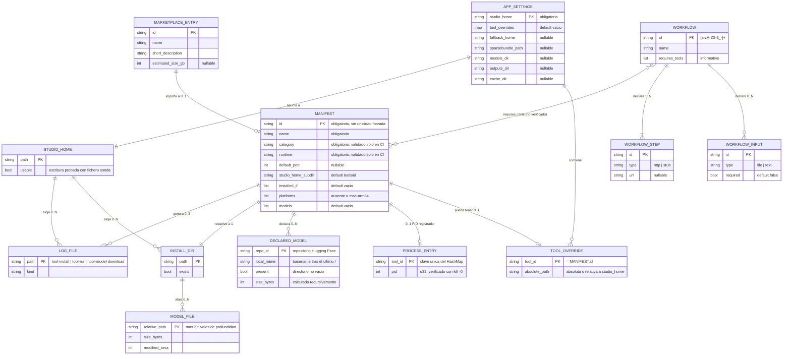

# 07 · Base de datos y persistencia

> Estado: completo · Última revisión: 2026-08-27 · Versión analizada: 0.5.1 (commit f840055)

## 1. Conclusión previa: no existe motor de base de datos

ChofyAI Studio **no incorpora ningún motor de base de datos**: ni relacional
(SQLite, PostgreSQL, MySQL), ni documental (MongoDB), ni clave-valor embebido
(sled, RocksDB, Redis), ni ORM/driver alguno. Toda la persistencia se resuelve con
**ficheros JSON**, **ficheros YAML**, **ficheros de log en texto plano**, el
**árbol de directorios** de `studio_home` y el **`localStorage`** del WebView.

Este documento trata esos almacenes con el mismo rigor con el que se documentaría
un esquema relacional: inventario, diccionario de datos campo a campo, relaciones,
cardinalidades, reglas de integridad, concurrencia y política de respaldo.

Documentos relacionados: [05 · Referencia técnica](05-technical-reference.md),
[06 · Explicación profunda del código](06-deep-code-explanation.md),
[08 · Flujo de datos](08-data-flow.md) y [11 · Seguridad](11-security.md).

### 1.1. Evidencia de la búsqueda

Las comprobaciones se ejecutaron sobre el árbol del repositorio excluyendo
`node_modules/` y `src-tauri/target/`. Comandos y resultados:

```bash
# 1) Dependencias Rust declaradas
grep -niE "sqlite|postgres|mysql|diesel|sqlx|rusqlite|sea-orm|mongodb|redis|surreal|duckdb|sled|rocksdb|tauri-plugin-sql" src-tauri/Cargo.toml
# → sin coincidencias

# 2) Dependencias Node declaradas
grep -niE "sqlite|postgres|mysql|prisma|typeorm|sequelize|knex|drizzle|mongoose|dexie|lowdb|pouchdb|indexeddb|sql" package.json
# → sin coincidencias

# 3) Uso en código fuente y datos
grep -rniE "sqlite|postgres|mysql|diesel|sqlx|rusqlite|indexedDB|\bSQL\b" src src-tauri/src apps workflows marketplace
# → sin coincidencias

# 4) Artefactos de base de datos en disco
find . -name "*.sql" -o -name "*.db" -o -name "*.sqlite*" -o -name "migrations"
# → sin resultados

# 5) Árbol de dependencias transitivas de Rust
grep -niE '^name = "(rusqlite|sqlx|diesel|libsqlite3-sys|postgres|mysql).*"' src-tauri/Cargo.lock
# → sin coincidencias
```

El bloque `[dependencies]` completo de
[`src-tauri/Cargo.toml`](../../src-tauri/Cargo.toml) es: `serde`, `serde_json`,
`serde_yaml`, `thiserror`, `tauri`, `walkdir`. Ninguna aporta acceso a base de
datos. Las dependencias de
[`package.json`](../../package.json) son `@tauri-apps/api`, `react` y `react-dom`.

Consecuencias directas de esta decisión: no hay migraciones, no hay transacciones,
no hay índices, no hay tipos fuertes en el almacén (la validación vive en `serde` y
en el código), y **no hay atomicidad** en las escrituras (ver
[sección 8](#8-concurrencia-y-transaccionalidad)).

## 2. Inventario de almacenes

| # | Almacén | Formato | Ubicación | Escrito por | Ciclo de vida |
|---|---------|---------|-----------|-------------|---------------|
| A1 | `settings.json` | JSON | `<repo>/storage/state/settings.json` o `<app_data_dir>/state/settings.json` | Backend Rust | Permanente |
| A2 | `processes.json` | JSON | Hermano de `settings.json` | Backend Rust | Volátil-persistente (PIDs) |
| A3 | `crash.log` | Texto (append) | Hermano de `settings.json` | Backend Rust (invocado por la UI) | Permanente, crece sin límite |
| A4 | Logs de instalación | Texto | `<studio_home>/logs/<tool>-install.log` | Backend Rust | Sobrescrito en cada instalación |
| A5 | Logs de ejecución | Texto | `<studio_home>/logs/<tool>-run.log` | Proceso hijo (stdout/stderr) | Truncado en cada arranque |
| A6 | Logs de descarga de modelos | Texto | `<studio_home>/logs/<tool>-model-download.log` | Backend Rust | Sobrescrito en cada descarga |
| A7 | Manifests de herramientas | YAML | `apps/*.yaml` | Repositorio + `import_marketplace_tool` | Versionado en git |
| A8 | Workflows | YAML | `workflows/*.yaml` | Repositorio + `save_workflow` / `delete_workflow` | Versionado en git |
| A9 | Catálogo de marketplace | YAML | `marketplace/registry.yaml` | Solo repositorio (sólo lectura en runtime) | Versionado en git |
| A10 | Árbol de `studio_home` | Sistema de ficheros | `<studio_home>/{tools,models,outputs,cache,logs,modules}` | Scripts de instalación y herramientas | Permanente |
| A11 | `localStorage` | Clave-valor del WebView | Perfil del WebView del usuario | Frontend React | Por usuario y por máquina |

### 2.1. Resolución de la ruta de `settings.json`

La función `app_paths()` en
[`src-tauri/src/system.rs`](../../src-tauri/src/system.rs) decide entre dos modos:

```rust
fn app_paths(app: &AppHandle) -> Result<AppPaths, String> {
    if let Some(root) = repo_root() {
        return Ok(AppPaths {
            apps_dir: root.join("apps"),
            settings_path: root.join("storage").join("state").join("settings.json"),
        });
    }
    let app_data_dir = app.path().app_data_dir().map_err(|e| e.to_string())?;
    Ok(AppPaths {
        apps_dir: resolve_resource_path(app, "apps")?,
        settings_path: app_data_dir.join("state").join("settings.json"),
    })
}
```

`repo_root()` devuelve `Some` sólo si el directorio de trabajo (o su padre, cuando
el `cwd` es `src-tauri`) contiene simultáneamente `apps/`, `scripts/` y
`src-tauri/`. Es decir: **en desarrollo el estado se escribe dentro del repositorio**
y en la app empaquetada se escribe en el directorio de datos de la aplicación
(en macOS, `~/Library/Application Support/cl.vladimiracuna.chofyai.studio/state/`,
derivado del `identifier` de [`tauri.conf.json`](../../src-tauri/tauri.conf.json)).

`processes.json` y `crash.log` se derivan siempre del **directorio padre** de
`settings_path`, vía `processes_state_path()`, así que los tres almacenes viven
juntos.

Observación relevante: `tauri.conf.json` lista `../storage/state/settings.json`
entre los `bundle.resources`, de modo que el `settings.json` del repositorio viaja
dentro del `.app`, pero el código empaquetado **no lo lee desde ahí** (usa
`app_data_dir`). El recurso empaquetado es, en la práctica, inerte. *Inferencia
basada en el código.*

## 3. Diccionario de datos

### 3.1. A1 — `settings.json` (`AppSettings`)

Definido en [`src-tauri/src/models.rs`](../../src-tauri/src/models.rs) y espejado
en [`src/types.ts`](../../src/types.ts). Serializado con
`serde_json::to_string_pretty`.

| Campo | Tipo | Obligatorio | Valor por defecto | Lo escribe | Lo lee | Si falta o es inválido |
|-------|------|-------------|-------------------|-----------|--------|------------------------|
| `studio_home` | `String` | Sí | `~/ChofyAIStudio` (`default_studio_home()`) | `save_studio_home` | `resolve_effective_home`, `get_system_summary`, `list_tools`, todos los comandos de tool | Su ausencia hace fallar el parseo del objeto completo; `load_settings` descarta el fichero entero y devuelve los defaults |
| `tool_overrides` | `HashMap<String, String>` | No (`#[serde(default)]`) | `{}` | `relocate_module` (inserta), `clear_module_override` (elimina) | `manifest_install_dir`, `list_tools` (`relocated`) | Se asume mapa vacío: todas las tools usan su ruta canónica |
| `fallback_home` | `Option<String>` | No | `null` → `~/ChofyAIStudio` | **Ningún comando Tauri lo escribe** (edición manual) | `fallback_home_for` dentro de `resolve_effective_home` | Se usa `~/ChofyAIStudio` |
| `sparsebundle_path` | `Option<String>` | No | `null` | **Ningún comando Tauri lo escribe** (edición manual) | `resolve_effective_home` (auto-montaje con `hdiutil attach`) | Sólo se prueba la convención `<studio_home>.sparsebundle` |
| `models_dir` | `Option<String>` | No | `null` → `<studio_home>/models` | `save_path_settings` | `effective_models_dir`, `apply_path_env` → `CHOFYAI_MODELS_DIR` | Se usa el default derivado de `studio_home` |
| `outputs_dir` | `Option<String>` | No | `null` → `<studio_home>/outputs` | `save_path_settings` | `effective_outputs_dir`, `apply_path_env` → `CHOFYAI_OUTPUTS_DIR` | Ídem |
| `cache_dir` | `Option<String>` | No | `null` → `<studio_home>/cache` | `save_path_settings` | `effective_cache_dir`, `apply_path_env` → `CHOFYAI_CACHE_DIR` | Ídem |

Notas de integridad:

1. `load_settings` es **deliberadamente tolerante**: envuelve lectura y parseo en
   `if let Ok(...)` y, ante cualquier error, devuelve un `AppSettings` por defecto
   sin avisar ni reescribir el fichero. Un `settings.json` corrupto se traduce en
   una app que aparentemente "olvidó" la configuración, con el fichero corrupto
   intacto en disco.
2. Los tres campos `models_dir` / `outputs_dir` / `cache_dir` se introdujeron
   después: el `settings.json` versionado en el repositorio sólo contiene cuatro
   claves y se parsea igual gracias a `#[serde(default)]`.
3. `save_path_settings` normaliza cadenas vacías a `None`, de modo que "vaciar el
   campo en la UI" equivale a "volver al valor por defecto".
4. `save_studio_home` normaliza cadena vacía a `default_studio_home()` y aplica
   `trim()`; **no valida** que la ruta sea absoluta, ni que exista, ni que sea
   escribible. La validación real ocurre después, en `resolve_effective_home`.

### 3.2. A1b — Mapa `tool_overrides`

| Aspecto | Valor |
|---------|-------|
| Clave | `tool_id` — debe coincidir con `RawManifest.id` |
| Valor | Ruta del directorio de instalación |
| Absoluta vs relativa | Si es absoluta se respeta tal cual; si es relativa se resuelve contra `studio_home` efectivo (`manifest_install_dir`) |
| Escritor | `relocate_module` tras mover físicamente el directorio |
| Borrado | `clear_module_override` (quita la entrada **sin mover ficheros**) |
| Efecto en la UI | `ToolSummary.relocated = tool_overrides.contains_key(id)` |
| Entrada huérfana | Una clave que no corresponde a ningún manifest se ignora silenciosamente; no hay recolección de basura |

### 3.3. A2 — `processes.json` (mapa `tool_id` → PID)

Serialización directa de `HashMap<String, u32>` con `serde_json::to_string_pretty`.
No hay struct intermedio.

| Campo | Tipo | Obligatorio | Defecto | Lo escribe | Lo lee | Si falta o es corrupto |
|-------|------|-------------|---------|-----------|--------|------------------------|
| clave | `String` (`tool_id`) | Sí | — | `persist_registry` | `restore_registry` | — |
| valor | `u32` (PID del sistema) | Sí | — | `start_tool`, `restart_tool`, `adopt_orphan` (inserción); `stop_tool`, `health_check_tool` (borrado) | `list_running_pids`, `list_orphan_ports`, `health_check_tool` | `restore_registry` hace `return` silencioso: el fichero se conserva y la app arranca con el registro en memoria vacío |

Ciclo de vida:

- **Arranque**: `restore_registry` (llamado desde el `setup` de
  [`src-tauri/src/lib.rs`](../../src-tauri/src/lib.rs)) lee el fichero, **filtra
  los PID muertos** con `pid_is_alive` (`kill -0`) y reescribe el fichero ya
  depurado.
- **Escritura**: cada mutación del registro llama a `persist_registry`, que hace
  `fs::create_dir_all` del padre y `fs::write` del JSON completo.
- **Errores ignorados**: `persist_registry` descarta todos los `Result` con `let _ =`.
  Si el volumen está lleno o de sólo lectura, el estado en memoria y el de disco
  divergen sin ninguna señal.

### 3.4. A3 — `crash.log`

Escrito por `append_crash_log` (comando Tauri) en modo `create(true).append(true)`.

| Campo | Formato | Origen |
|-------|---------|--------|
| Marca de tiempo | `[<segundos desde epoch UNIX>]` | `SystemTime::now()`; ante error se escribe `0` |
| Mensaje | Texto libre en una línea lógica (puede contener saltos, escritos tal cual) | Parámetro `message` |

El único emisor identificado en el frontend es `AppErrorBoundary.componentDidCatch`
en [`src/App.tsx`](../../src/App.tsx), que envía
`[UI] <mensaje>\n<stack>\n--- componentStack ---\n<componentStack>` **truncado a
4000 caracteres**. La lectura la hace `read_crash_log`, que devuelve sólo las
**últimas 200 líneas**. El fichero no rota ni se purga: crece indefinidamente.

### 3.5. A4/A5/A6 — Logs por herramienta

Todos viven en `log_dir(studio_home)` = `<studio_home>/logs/`.

| Fichero | Escritor | Modo | Contenido |
|---------|----------|------|-----------|
| `<tool_id>-install.log` | `run_install_script` | `fs::write` (sobrescribe) al **terminar** el proceso | `stdout` completo + `"\n"` + `stderr` completo |
| `<tool_id>-run.log` | El proceso hijo | `fs::File::create` (**trunca**) antes del `spawn`; el hijo escribe en vivo | `stdout` y `stderr` del servidor de la herramienta, mezclados (`try_clone` del mismo descriptor) |
| `<tool_id>-model-download.log` | `download_tool_model` | `fs::write` (sobrescribe) al terminar | Salida del helper `scripts/mac/download-hf-model.sh` |

Consecuencias operativas:

- El log de instalación **sólo existe cuando el proceso termina**. Si la app muere
  a mitad de una instalación no queda rastro en disco; el streaming en vivo
  (evento `install-progress`) se pierde con la ventana.
- El log de ejecución se **trunca en cada `start_tool` / `restart_tool`**: no hay
  histórico entre arranques.
- La lectura desde la UI usa `read_tool_log`, que acepta `kind` ∈ `{install, run}`
  (cualquier otro valor devuelve error) y devuelve las últimas `last_lines` líneas
  (500 por defecto). El log de descarga de modelos **no es legible por
  `read_tool_log`**: sólo se puede abrir con `open_tool_log`… que tampoco lo
  contempla, ya que sólo busca `-run.log` y `-install.log`. En la práctica, el
  `-model-download.log` únicamente es accesible por la ruta absoluta que devuelve
  `ActionResult.log_path`.

### 3.6. A7 — Manifests de herramientas (`apps/*.yaml` → `RawManifest`)

`RawManifest` (privado, en `system.rs`) es el **esquema real** que el backend lee.
Los campos `Option<...>` son opcionales de facto: `serde` deserializa su ausencia a
`None`. Los campos no opcionales son obligatorios y su ausencia aborta el parseo.

| Campo YAML | Tipo Rust | Obligatorio | Defecto | Lo lee | Si falta / es inválido |
|-----------|-----------|-------------|---------|--------|------------------------|
| `id` | `String` | **Sí** | — | `find_manifest`, `manifest_install_dir`, `tool_overrides` | Error de parseo → `collect_manifests` devuelve `Err` → **falla la lista completa de tools** |
| `name` | `String` | **Sí** | — | Orden de la lista, mensajes de la UI | Ídem |
| `icon` | `Option<String>` | No | `None` | `ToolSummary.icon`; la UI cae al emoji de categoría | Se usa `CATEGORY_EMOJI[category]` o `🧩` |
| `category` | `String` | **Sí** | — | Agrupación en la UI | Rust **no valida** el valor; TypeScript lo tipa como unión cerrada y el CI sí lo valida |
| `runtime` | `String` | **Sí** | — | Sólo informativo en la UI | Rust no valida; CI sí |
| `description` | `Option<String>` | No | `""` (`unwrap_or_default`) | Tarjeta de la tool | Descripción vacía |
| `recommended` | `Option<bool>` | No | `false` | Badge "recomendada" | Sin badge |
| `default_port` | `Option<u16>` | No | `None` | `health_check_tool`, `list_orphan_ports`, pre-flight de puerto, `opened_url`, iframe embebido | Sin health check por puerto, sin vista embebida, sin detección de huérfanos |
| `studio_home_subdir` | `Option<String>` | No | `tools/<id>` | `manifest_install_dir` | Se usa la convención `tools/<id>` |
| `install_script` | `Option<String>` | No | `None` | `resolve_install_script` (**fallback**) | Si tampoco hay `install_scripts` para la plataforma, `install_tool` devuelve error |
| `install_scripts` | `Option<HashMap<String,String>>` | No (`#[serde(default)]`) | `None` | `resolve_install_script` (**precedencia**) | Se cae a `install_script` |
| `installed_if` | `Option<Vec<String>>` | No | `[]` | `list_tools`, post-validación de instalación, pre-validación de `start_tool` y `update_tool` | Con lista vacía, `installed` es **siempre `false`** (ver 3.6.2) |
| `run.command` | `Option<String>` | No | `None` | `resolve_run_command` (fallback) | `start_tool` / `restart_tool` fallan |
| `run.commands` | `Option<HashMap<String,String>>` | No (`#[serde(default)]`) | `None` | `resolve_run_command` (precedencia) | Se cae a `run.command` |
| `platforms` | `Option<Vec<String>>` | No | `None` ⇒ **sólo `mac-arm64`** | `platform_supported` | Ausente equivale a declarar únicamente `mac-arm64` (retrocompatibilidad) |
| `models` | `Option<Vec<String>>` | No | `[]` | `list_declared_models`, `download_tool_model` | La tool no ofrece descargas de modelos declarados |

#### 3.6.1. Campos declarados en los YAML que el backend NO lee

`RawManifest` no declara `#[serde(deny_unknown_fields)]`, así que **cualquier clave
desconocida se ignora en silencio**. Confirmado contra el struct, estos campos
aparecen en los manifests del repositorio pero no tienen efecto en runtime:

| Campo | Presente en | ¿Lo lee `RawManifest`? | Consumidor real |
|-------|-------------|------------------------|-----------------|
| `python_manager` | `aceforge.yaml`, `comfyui.yaml`, `facefusion.yaml`, `qwen3-tts.yaml` | **No** | No identificado en el código Rust ni en el frontend; documentación de intención (`auto \| uv \| pip`) |
| `healthcheck` | `qwen3-tts.yaml` | **No** | El health check real es `health_check_tool`, que usa `default_port` y un `TcpStream::connect_timeout`; el bloque `type/url` es decorativo |
| `install` | `qwen3-tts.yaml` (lista de comandos git/venv) | **No** | La instalación real la hace `scripts/mac/install-qwen3-tts.sh` |
| `notes` | `qwen3-tts.yaml` | **No** | Sólo lectura humana |

También son inertes los comentarios YAML que `import_marketplace_tool` genera
(`# Notas del marketplace:`, `# Hint de instalación:`, `# Repo:`).

#### 3.6.2. Semántica exacta de `installed`

En `list_tools`:

```rust
installed: missing_checks.is_empty() && !installed_checks.is_empty(),
```

Es decir: una tool se considera instalada **sólo si declara al menos un
`installed_if` y todos los artefactos existen** bajo el directorio de instalación
resuelto. Un manifest sin `installed_if` aparecerá siempre como "no instalada",
aunque el directorio esté lleno. Es una regla de integridad deliberada: sin criterio
declarado, no hay verificación posible.

### 3.7. A8 — Workflows (`workflows/*.yaml`)

El backend **no tiene un struct tipado** para los workflows: `list_workflows` parsea
a `serde_yaml::Value` y lo reemite como `serde_json::Value`. El esquema efectivo lo
define TypeScript en [`src/types.ts`](../../src/types.ts).

`WorkflowDef`:

| Campo | Tipo TS | Obligatorio | Validado por | Consumidor |
|-------|---------|-------------|--------------|------------|
| `id` | `string` | Sí | `save_workflow` (presencia) y `validate_workflow_id` (formato del nombre de fichero) | Orden en `list_workflows`, nombre del `.yaml` |
| `name` | `string` | Sí | `save_workflow` (presencia) | Cabecera del `WorkflowRunner` |
| `category` | `string` | Sí en el tipo TS, **no** validado por Rust | — | Agrupación en el panel |
| `emoji` | `string?` | No | — | Icono; cae a `🔗` |
| `description` | `string` | Sí | `save_workflow` (presencia) | Texto del modal |
| `requires_tools` | `string[]?` | No | **Nadie lo valida ni lo aplica** | Informativo en la UI |
| `inputs` | `WorkflowInput[]?` | No | — | Formulario del runner |
| `steps` | `WorkflowStep[]` | Sí | `save_workflow` (presencia) | Bucle de ejecución |

`WorkflowInput`:

| Campo | Tipo | Obligatorio | Defecto | Efecto |
|-------|------|-------------|---------|--------|
| `id` | `string` | Sí | — | Clave en `inputs` / `files` y en `{{inputs.<id>}}` |
| `type` | `'file' \| 'text'` | Sí | — | Renderiza `<input type=file>` o `<input type=text>` |
| `label` | `string` | Sí | — | Etiqueta visible |
| `required` | `boolean?` | No | `false` | Alimenta `canRun` |
| `default` | `string?` | No | — | Valor inicial del estado `inputs` |
| `accept` | `string?` | No | — | Atributo `accept` del input de fichero |
| `placeholder` | `string?` | No | — | Placeholder del input de texto |

`WorkflowStep`:

| Campo | Tipo | Obligatorio | Efecto |
|-------|------|-------------|--------|
| `id` | `string` | Sí | Clave de `StepResult` |
| `label` | `string` | Sí | Texto del paso |
| `type` | `'http' \| 'stub'` | Sí | `stub` devuelve `ok` sin ejecutar nada |
| `method` | `'GET' \| 'POST'?` | No | Defecto: `POST` con cuerpo, `GET` sin él |
| `url` | `string?` | Requerido si `type: http` | Destino del `fetch`; admite `{{inputs.x}}` |
| `body_kind` | `'multipart' \| 'json'?` | No | Sin él, el paso es un `fetch` sin cuerpo |
| `fields` | `Record<string,string>?` | No | Campos del `FormData`; el marcador `__FILE__:<id>` inyecta el `File` real |
| `body` | `string?` | No | Cuerpo JSON en crudo, con sustitución de variables |
| `note` | `string?` | No | Texto devuelto por los pasos `stub` |
| `input_from` | `string?` | No | Inyecta la salida del paso anterior bajo esa clave |
| `output` | `{ kind, from?, label? }?` | No | `from` extrae una propiedad del JSON de respuesta |

Los tres workflows del repositorio (`transcribe-audio`, `comfyui-prompt`,
`audio-pipeline`) respetan este esquema. `audio-pipeline` contiene dos pasos `stub`
declarados como tales.

### 3.8. A9 — `marketplace/registry.yaml` (`MarketplaceEntry`)

Fichero con una única clave raíz `tools:` (struct `MarketplaceFile`). El backend lo
lee desde `<repo>/marketplace/registry.yaml` o, en modo empaquetado, desde el
recurso `marketplace/registry.yaml`. Es **sólo lectura**: ningún comando lo escribe.

| Campo | Tipo Rust | Obligatorio | Uso en `import_marketplace_tool` |
|-------|-----------|-------------|----------------------------------|
| `id` | `String` | **Sí** | Nombre del fichero `apps/<id>.yaml` y campo `id` |
| `name` | `String` | **Sí** | Campo `name` |
| `category` | `String` | **Sí** | Campo `category` |
| `runtime` | `String` | **Sí** | Campo `runtime` |
| `short_description` | `String` | **Sí** | Campo `description`, con `\n` reemplazados por espacios |
| `homepage` | `Option<String>` | No | Se devuelve en `ActionResult.opened_url` |
| `repo` | `Option<String>` | No | Comentario `# Repo:` (se omite si es cadena vacía) |
| `default_port` | `Option<u16>` | No | Campo `default_port` si está presente |
| `estimated_size_gb` | `Option<u32>` | No | Sólo informativo en la UI |
| `requires` | `Option<Vec<String>>` | No | Sólo informativo en la UI |
| `install_hint` | `Option<String>` | No | Comentario `# Hint de instalación:` |
| `notes` | `Option<String>` | No | Comentario `# Notas del marketplace:` |

El manifest generado siempre fija `recommended: false`,
`studio_home_subdir: tools/<id>`, `platforms: [mac-arm64]` e
`installed_if: [source/.git]`, **sin `install_script` ni `run`**: la tool importada
aparece en la lista pero no es instalable hasta que alguien edite el YAML a mano.

### 3.9. A10 — Árbol de `studio_home`

`studio_home` es el "tablespace" del sistema: el volumen donde vive todo lo pesado.

| Subdirectorio | Creado por | Contenido | Quién lo lee |
|---------------|-----------|-----------|--------------|
| `tools/<id>/` | Scripts de instalación (`mkdir -p "$INSTALL_DIR"`) | Clon del repositorio, venv, binarios compilados | `installed_if`, `start_tool` (`current_dir`), `open_tool_directory` |
| `tools/<id>/models/` | `resolve_models_dir` + scripts | Modelos por herramienta | `list_tool_models`, `list_declared_models`, `delete_tool_model`, `download_tool_model` |
| `models/` | `install-qwen3-tts.sh`, o el override `models_dir` | Modelos compartidos | Los scripts, vía `CHOFYAI_MODELS_DIR` |
| `outputs/` | Scripts de instalación | Salidas generadas por las herramientas | Los scripts, vía `CHOFYAI_OUTPUTS_DIR` |
| `cache/` | Scripts de instalación | Caché de descargas (p. ej. `HF_HOME`) | Los scripts, vía `CHOFYAI_CACHE_DIR` |
| `logs/` | `fs::create_dir_all(&logs)` en Rust | A4, A5, A6 | `read_tool_log`, `open_tool_log` |
| `modules/` | **`relocate_module`, indirectamente** | Herramientas reubicadas | Vía `tool_overrides` |
| `.chofyai-write-probe` | `is_writable_dir` | Fichero temporal de cero bytes | Se borra inmediatamente; si el proceso muere entre `write` y `remove_file`, queda residual |

Sobre `modules/`: no existe código que cree ese directorio por sí mismo. El
frontend propone `${studio_home_effective}/modules/${tool.id}` como destino por
defecto en `startRelocate`, y es `relocate_module` quien crea el padre con
`fs::create_dir_all`. Es una convención de la UI, no una estructura garantizada.

`resolve_models_dir` merece una aclaración importante: **ignora el override
`settings.models_dir`**. Devuelve siempre `manifest_install_dir(...)/models`, es
decir `<studio_home>/tools/<id>/models`. El override `models_dir` sólo llega a los
scripts como variable de entorno `CHOFYAI_MODELS_DIR`. Los comandos de gestión de
modelos de la UI y los scripts pueden, por tanto, apuntar a directorios distintos.
*Inferencia basada en el código; requiere validación funcional.*

### 3.10. A11 — `localStorage` del frontend

| Clave | Tipo | Valores | Defecto si falta o falla | Escritor | Lector |
|-------|------|---------|--------------------------|----------|--------|
| `chofyai_onboarding_done` | `string` | `'1'` | Ausente ⇒ se muestra el onboarding | `Onboarding.finish` en `src/App.tsx` | Inicializador de `showOnboarding` |
| `chofyai_theme` | `string` | `'dark'`, `'light'`, `'system'` | `'dark'` | Efecto de `theme` en `src/App.tsx` | Inicializador de `theme` |
| `chofyai_lang` | `string` | `'es'`, `'en'` (ver `src/i18n.ts`) | Detección por navegador y, en último término, `'es'` | `setLang` en `src/i18n.ts` | `getLang` en `src/i18n.ts` |

Los tres accesos están envueltos en `try/catch` con fallback silencioso, así que un
WebView con almacenamiento deshabilitado degrada correctamente. Ningún valor de
`localStorage` viaja al backend ni se sincroniza entre máquinas.

## 4. Relaciones entre entidades

Las relaciones no las impone ningún motor: las materializa el código, siempre por
**coincidencia de cadenas** (`tool_id`) o por **convención de rutas**.

| Origen | Destino | Clave | Cardinalidad | Dónde se resuelve |
|--------|---------|-------|--------------|-------------------|
| `AppSettings.tool_overrides` | `RawManifest.id` | `tool_id` | 0..1 override por manifest | `manifest_install_dir` |
| `processes.json` | `RawManifest.id` | `tool_id` | **Como máximo un PID por manifest** (es un `HashMap`, la clave es única) | `ProcessRegistry` |
| `RawManifest` | Modelos declarados | `models[]` (repo de Hugging Face) | 1 manifest → 0..N modelos | `list_declared_models` |
| `RawManifest` | Ficheros de log | `tool_id` en el nombre del fichero | 1 manifest → 0..3 logs | `log_dir` + formato `<tool>-<kind>.log` |
| `RawManifest` | Directorio de instalación | `studio_home_subdir` o `tools/<id>` | 1 → 1 | `manifest_install_dir` |
| `WorkflowDef.requires_tools[]` | `RawManifest.id` | `tool_id` | N a N, **declarativa y no verificada** | Sólo se muestra en la UI |
| `WorkflowStep.url` | Puerto de la herramienta | Puerto literal en la URL | Acoplamiento por convención | `runWorkflowStep` |
| `MarketplaceEntry.id` | `apps/<id>.yaml` | `id` | 1 → 0..1 | `import_marketplace_tool` |

El acoplamiento por puerto literal es frágil: `transcribe-audio.yaml` codifica
`http://127.0.0.1:8178/inference` y `comfyui-prompt.yaml` codifica
`http://127.0.0.1:8188/prompt`. Si alguien cambia `default_port` en el manifest, los
workflows no se enteran.

### 4.1. Diagrama entidad-relación



Lectura del diagrama, punto por punto:

- **`MANIFEST ||--o| PROCESS_ENTRY`**: la cardinalidad máxima de 1 no es una
  restricción declarada, sino una consecuencia de usar `HashMap<String, u32>`. Si
  un `start_tool` se ejecuta dos veces sin `stop_tool` intermedio, la segunda
  inserción **sobrescribe** el PID anterior y el primer proceso queda huérfano:
  sigue vivo, ocupa el puerto y sólo `list_orphan_ports` lo encuentra.
- **`MANIFEST ||--o{ DECLARED_MODEL`**: sólo `qwen3-tts.yaml` declara `models` hoy
  (tres repositorios `mlx-community/*`).
- **`WORKFLOW }o--o{ MANIFEST`**: relación puramente documental. Ejecutar un
  workflow cuyo `requires_tools` no esté instalado produce un error de red en el
  paso HTTP, no una validación previa.
- **`MARKETPLACE_ENTRY ||--o| MANIFEST`**: la importación es unidireccional y no
  deja traza del origen más allá de comentarios YAML.

## 5. Reglas de integridad implementadas

| Regla | Dónde | Qué garantiza | Qué NO garantiza |
|-------|-------|---------------|------------------|
| `installed_if` como criterio de instalación | `list_tools`, `run_install_script` (post-validación), `start_tool` (pre-validación), `update_tool` | Que no se arranque una instalación parcial ni se declare instalada una tool incompleta | Que los artefactos sean funcionales; sólo comprueba existencia de rutas |
| Post-validación tras instalación exitosa | `run_install_script` | Que un script que devuelve código 0 pero dejó el venv a medias se reporte como error | Nada sobre integridad de contenidos |
| `validate_workflow_id` | `save_workflow`, `delete_workflow` | `id` no vacío, sin `/`, `\` ni `..`, y limitado a `[a-zA-Z0-9_-]` | Que el `id` del YAML coincida con el nombre del fichero |
| Campos obligatorios del workflow | `save_workflow` | Presencia de `id`, `name`, `description`, `steps` en el mapping raíz | Tipos, forma de `steps`, validez de las URLs |
| Guarda de path traversal | `delete_tool_model` | Doble comprobación: rechazo léxico de `..` **y** `canonicalize()` + `starts_with(canonical_root)`; además exige que el objetivo sea un fichero | Nada sobre enlaces simbólicos creados *después* de la canonicalización (ventana TOCTOU teórica) |
| Modelo declarado antes de descargar | `download_tool_model` | Que sólo se descarguen repositorios listados en `manifest.models`; impide inyectar un `repo_id` arbitrario desde la UI | Que el repositorio exista en Hugging Face |
| No sobrescritura de manifests | `import_marketplace_tool` | Que `apps/<id>.yaml` existente aborte la importación con error | Unicidad del campo `id` **dentro** de los YAML |
| Plataforma soportada | `platform_supported` en `run_install_script` | Que no se lance un script de instalación en una plataforma no declarada | Nada en `start_tool`: **arrancar no revalida la plataforma** |
| Pre-flight de puerto | `start_tool` | Mata con `kill -9` a cualquier proceso ajeno que escuche en `default_port` | Es una medida agresiva: puede matar procesos legítimos del usuario que compartan puerto |
| Destino vacío al reubicar | `relocate_module` | Ruta absoluta obligatoria, destino distinto del origen, destino inexistente o vacío, padre escribible | Atomicidad del movimiento (ver sección 8) |
| Validación de manifests en CI | `validate-manifests` en [`.github/workflows/ci.yml`](../../.github/workflows/ci.yml) | Presencia de `id`, `name`, `category`, `runtime`, `description`, `platforms`, `installed_if`; regla condicional `install_script ⇒ run`; valores válidos de `category` y `runtime` | Nada en runtime: un YAML editado a mano tras la instalación no pasa por el CI |

### 5.1. Unicidad del `id` de manifest

**No está forzada en runtime.** `collect_manifests` recorre `apps/*.yaml`
(profundidad exactamente 1) y ordena por `name`; `find_manifest` devuelve el
**primer** manifest cuyo `id` coincide. Si dos ficheros declararan el mismo `id`,
el que gane dependería del orden alfabético de `name` y el otro quedaría
inaccesible sin ningún aviso. La única protección real es indirecta:
`import_marketplace_tool` nombra el fichero como `<id>.yaml` y rechaza sobrescribir,
lo que hace improbable la colisión por la vía de importación, pero no por edición
manual. El CI tampoco comprueba duplicados.

## 6. Modo de fallo por almacén

| Escenario | Efecto observado | Recuperación |
|-----------|------------------|--------------|
| `settings.json` corrupto o ilegible | `load_settings` devuelve defaults; el `studio_home` pasa a `~/ChofyAIStudio`; las tools instaladas en el volumen externo aparecen como no instaladas | Manual: reparar o borrar el fichero |
| `settings.json` inexistente | Igual que el anterior; se recrea en el primer `save_*` | Automática al guardar |
| `processes.json` corrupto | `restore_registry` retorna sin tocar el registro; los procesos vivos quedan como huérfanos | `list_orphan_ports` + `adopt_orphan` |
| PID reciclado por el sistema operativo | `pid_is_alive` da `true` para un proceso ajeno; `stop_tool` enviaría `SIGTERM` a un proceso que no es nuestro | No hay mitigación en el código |
| Un solo `apps/*.yaml` malformado | `collect_manifests` propaga el `Err`: **`list_tools` falla y la UI cae a `fallbackTools`** (las cinco tools hardcodeadas en `src/App.tsx`) | Corregir el YAML |
| `marketplace/registry.yaml` malformado | `list_marketplace_tools` devuelve `Err`; el panel muestra el error vía toast | Corregir el YAML |
| Un `workflows/*.yaml` malformado | `list_workflows` **lo salta en silencio** (`if let Ok(v)`) | El workflow simplemente no aparece |
| Log truncado o borrado en caliente | `read_tool_log` devuelve lo que haya; `open_tool_log` puede fallar con "No hay logs disponibles" | Reinstalar o rearrancar la tool |
| `studio_home` desmontado | `resolve_effective_home` intenta `hdiutil attach` del sparsebundle y, si falla, cae a `fallback_home`; `using_fallback` se marca `true` en `SystemSummary` | Remontar el volumen y refrescar |
| Disco lleno al persistir | `persist_registry` ignora el error; `save_settings_to_disk` sí devuelve `Err` y la UI muestra un toast | Liberar espacio |

## 7. Mapa de módulo/función por almacén

| Almacén | Funciones que escriben | Funciones que leen |
|---------|------------------------|--------------------|
| `settings.json` | `save_settings_to_disk` ← `save_studio_home`, `save_path_settings`, `relocate_module`, `clear_module_override` | `load_settings` ← `get_system_summary`, `get_effective_paths`, `list_tools`, `install_tool`, `update_tool`, `start_tool`, `restart_tool`, `open_tool_directory`, `open_tool_log`, `read_tool_log`, `get_system_stats`, `resolve_models_dir`, `download_tool_model` |
| `processes.json` | `persist_registry` ← `start_tool`, `restart_tool`, `stop_tool`, `adopt_orphan`, `health_check_tool`, `restore_registry` | `restore_registry` |
| `crash.log` | `append_crash_log` ← `AppErrorBoundary.componentDidCatch` | `read_crash_log` |
| `<tool>-install.log` | `run_install_script` | `read_tool_log`, `open_tool_log` |
| `<tool>-run.log` | Proceso hijo (descriptor creado en `start_tool` / `restart_tool`) | `read_tool_log`, `open_tool_log` |
| `<tool>-model-download.log` | `download_tool_model` | Sólo por ruta absoluta (`ActionResult.log_path`) |
| `apps/*.yaml` | `import_marketplace_tool` | `collect_manifests` ← `find_manifest`, `list_tools`, `list_orphan_ports` |
| `workflows/*.yaml` | `save_workflow`, `delete_workflow` | `list_workflows` |
| `marketplace/registry.yaml` | — (sólo lectura) | `list_marketplace_tools` |
| Árbol de `studio_home` | `resolve_effective_home` (`create_dir_all`), `run_install_script` (`logs/`), `start_tool` (`logs/`), `list_declared_models` (`models/`), `relocate_module` (mover/copiar), `delete_tool_model` (borrar), `open_tool_directory` (`create_dir_all`), scripts de `scripts/mac/` | `list_tools` (`installed_if`), `list_tool_models`, `dir_size`, `read_disk_usage` |
| `localStorage` | `Onboarding.finish`, efecto de `theme`, `setLang` | Inicializadores de `showOnboarding` y `theme`, `getLang` |

## 8. Concurrencia y transaccionalidad

### 8.1. Lo que sí está protegido

El único mecanismo de exclusión mutua del sistema es el `Mutex` del registro de
procesos, declarado en `system.rs` y gestionado por Tauri en `lib.rs`:

```rust
pub struct ProcessRegistry(pub Mutex<HashMap<String, u32>>);
```

```rust
.manage(ProcessRegistry(Mutex::new(HashMap::new())))
```

Todos los accesos hacen `registry.0.lock()` y propagan el envenenamiento del mutex
como `Err(String)` mediante `map_err(|e| e.to_string())`. Esto serializa las
mutaciones del mapa **dentro del proceso de la aplicación**.

Un detalle importante: en `start_tool`, `restart_tool` y `adopt_orphan`, la llamada
a `persist_registry` se hace **con el guard todavía tomado**, dentro del mismo
bloque. Eso impide que dos escrituras concurrentes del fichero se intercalen desde
hilos distintos del mismo proceso. En `stop_tool` ocurre lo mismo (el `MutexGuard`
`pids` sigue vivo cuando se llama a `persist_registry`).

### 8.2. Lo que NO está protegido

1. **Escritura no atómica de `settings.json`.** `save_settings_to_disk` hace
   `fs::write` directo sobre el fichero de destino: trunca y reescribe. No hay
   patrón *write-temp + fsync + rename*. Si el proceso muere, el volumen se
   desmonta o el disco se llena a mitad de la escritura, el fichero queda truncado
   o vacío. En el siguiente arranque, `load_settings` no distingue "corrupto" de
   "inexistente" y **silenciosamente vuelve a los valores por defecto**, incluido
   `studio_home = ~/ChofyAIStudio`. El usuario percibe una pérdida total de
   configuración.
2. **Escritura no atómica de `processes.json`.** Mismo patrón, con el agravante de
   que todos los errores se descartan con `let _ =`.
3. **Nada coordina múltiples instancias de la app.** No hay fichero de bloqueo, ni
   `flock`, ni comprobación de instancia única. Dos procesos de ChofyAI Studio
   apuntando al mismo `settings.json` se pisan mutuamente: el último en escribir
   gana y el registro de PIDs de uno borra el del otro.
4. **`apps/*.yaml`, `workflows/*.yaml` y `marketplace/registry.yaml` no tienen
   bloqueo alguno.** `save_workflow` sobrescribe sin comprobar si el fichero cambió
   desde que se leyó (no hay control de versiones optimista).
5. **`relocate_module` no es transaccional.** La secuencia es: intentar
   `fs::rename`; si falla (típicamente por ser *cross-device*), `copy_dir_recursive`
   seguido de `fs::remove_dir_all` del origen, y sólo después se persiste el
   override en `settings.json`. Una interrupción entre la copia y el borrado deja
   dos copias; entre el borrado y el guardado de settings, deja la tool en el nuevo
   sitio pero el sistema apuntando al viejo. No hay *rollback*.
6. **La escritura de los logs de ejecución es del proceso hijo**, fuera de todo
   control: dos herramientas con el mismo `tool_id` escribirían en el mismo fichero.
7. **`append_crash_log`** usa `O_APPEND`, lo que en POSIX hace atómicas las
   escrituras pequeñas frente a otros escritores; es el único almacén con una
   garantía de concurrencia razonable, y es incidental.

### 8.3. Resumen de garantías

| Propiedad ACID | Estado |
|----------------|--------|
| Atomicidad | **Ausente** en JSON y en el movimiento de módulos; incidental (`O_APPEND`) en `crash.log` |
| Consistencia | Parcial: la impone el código (`installed_if`, validaciones), no el almacén |
| Aislamiento | Sólo intra-proceso, y sólo para el registro de PIDs |
| Durabilidad | Sin `fsync` explícito: los datos quedan en la caché del sistema de ficheros hasta que el SO decida |

## 9. Datos personales y sensibles almacenados

| Dato | Dónde queda | Sensibilidad | Observaciones |
|------|-------------|--------------|---------------|
| Rutas absolutas del sistema de ficheros | `settings.json`, logs, `crash.log`, `ToolSummary.install_dir`, `SystemStats.disk_path` | Media: contienen el **nombre de usuario** del sistema (`/Users/<usuario>/…`) | Se muestran tal cual en la UI |
| Nombres de volúmenes externos | `settings.json`, `VolumeCandidate.label`, salida de `list_external_volumes` | Baja-media: revelan hardware conectado | `list_external_volumes` enumera **todo** `/Volumes`, no sólo los del usuario |
| Contenido de los logs de instalación | `<tool>-install.log` | Media: incluye URLs de repositorios, paquetes Python instalados, salidas de `pip`/`uv`, mensajes de error con rutas | Se sobrescriben en cada instalación |
| Contenido de los logs de ejecución | `<tool>-run.log` | **Alta según la herramienta**: un servidor de ASR o TTS puede volcar nombres de fichero de audio, prompts o transcripciones | ChofyAI Studio no controla qué imprime cada herramienta |
| Trazas de error de la UI | `crash.log` | Media: *stack traces* y `componentStack` de React, truncados a 4000 caracteres | Sin rotación: crece sin límite |
| Preferencias de interfaz | `localStorage` | Baja | Local al WebView |
| Credenciales | — | — | **No se almacena ninguna credencial**: no hay tokens, contraseñas ni claves de API en ningún almacén. El helper `download-hf-model.sh` delega en `huggingface-cli`/`huggingface_hub`, que gestionan su propio token fuera del árbol de la aplicación |

### 9.1. Hallazgo: `settings.json` está versionado en git

`storage/state/settings.json` **está bajo control de versiones** (aparece en
`git ls-files storage/`). El [`.gitignore`](../../.gitignore) excluye
`storage/state/settings.local.json` y `storage/state/runtime/`, pero no el
`settings.json` principal. En consecuencia, cada commit que lo toque publica el
`studio_home`, el `fallback_home` y la ruta del `.sparsebundle` reales de quien
haga el commit: rutas de volúmenes y, potencialmente, el nombre de usuario del
sistema. Ver [11 · Seguridad](11-security.md) para el tratamiento del riesgo.

## 10. Respaldo y recuperación

**No existe ninguna política de respaldo, ni automática ni asistida.** Verificado
por ausencia: no hay comandos Tauri de exportación/importación de configuración, no
hay copias `.bak` ni versionado de `settings.json`, no hay rotación de logs, no hay
snapshots del árbol de `studio_home` ni integración con Time Machine.

Lo más cercano a una recuperación son estos mecanismos, todos parciales:

1. **Auto-depuración de `processes.json`** en `restore_registry`: descarta los PID
   muertos al arrancar.
2. **Fallback de `studio_home`**: `resolve_effective_home` mantiene la app usable
   cuando el volumen principal no está, a costa de perder de vista lo instalado allí.
3. **Auto-montaje del sparsebundle** con `hdiutil attach -nobrowse -noverify`.
4. **`run_doctor`**, que ejecuta `scripts/mac/doctor.sh` y devuelve un diagnóstico
   textual (`stdout` + `stderr`), sin acción correctiva automática.
5. **Reinstalación**: la vía real de recuperación de una herramienta rota es
   volver a ejecutar su `install_script`.

Recomendación operativa mínima, dado que el estado crítico es diminuto: copiar
periódicamente el directorio que contiene `settings.json` y `processes.json`. El
contenido pesado (`tools/`, `models/`) es reconstruible desde los scripts y desde la
red, salvo `outputs/`, que contiene el trabajo generado por el usuario y **no tiene
ningún mecanismo de protección**.

## 11. Continuación

- El recorrido completo del dato —origen, validación, transformación, destino y
  salida hacia servicios externos— está en
  [08 · Flujo de datos](08-data-flow.md).
- Las firmas exactas de los 35 comandos Tauri que tocan estos almacenes están en
  [05 · Referencia técnica](05-technical-reference.md).
- El razonamiento línea a línea de `resolve_effective_home`, `run_install_script` y
  el registro de procesos está en
  [06 · Explicación profunda del código](06-deep-code-explanation.md).
- El análisis de riesgo de la escritura no atómica, del `kill -9` en el pre-flight
  de puerto y del `settings.json` versionado está en
  [11 · Seguridad](11-security.md).
