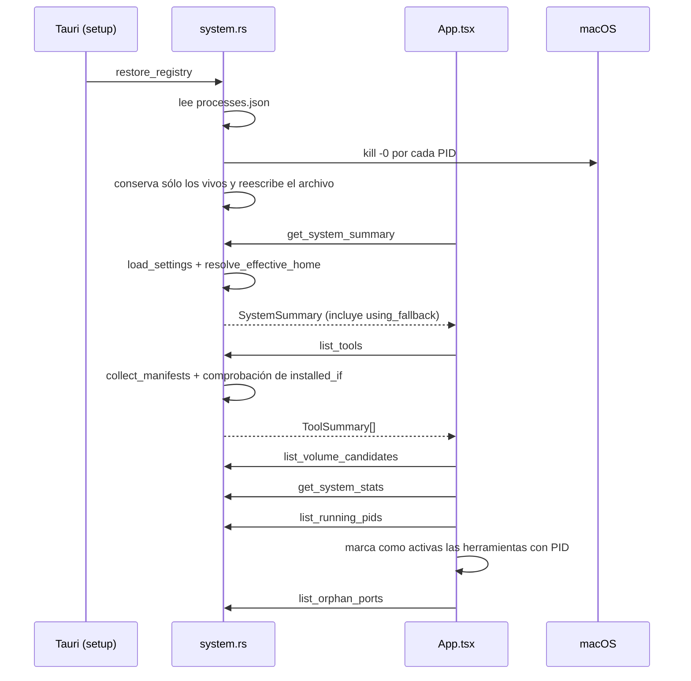
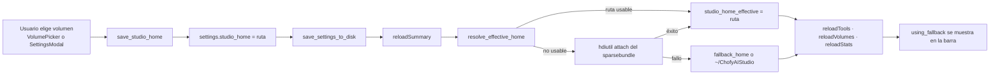
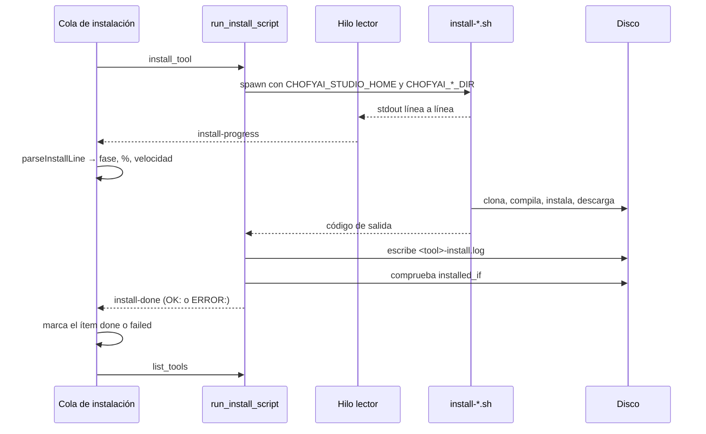
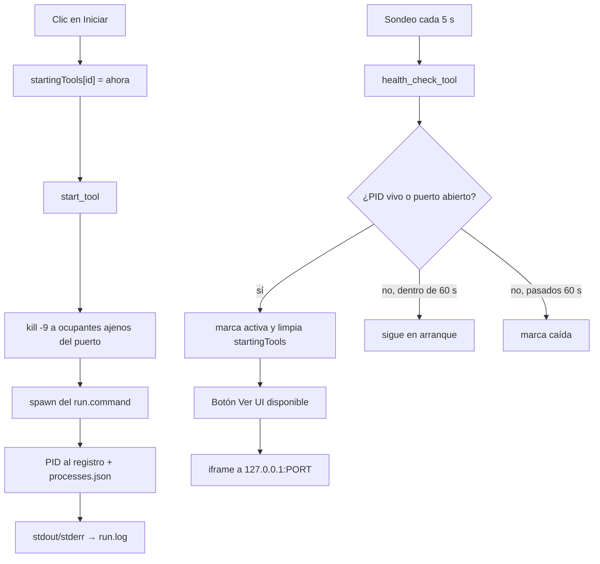
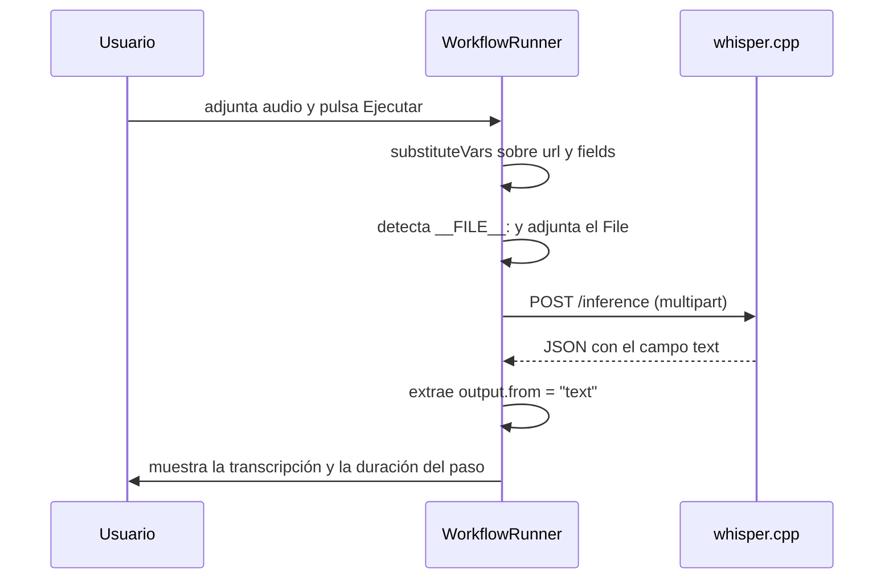

# 08 · Flujo de datos

> Estado: completo · Última revisión: 2026-08-27 · Versión analizada: 0.5.1 (commit f840055)

Este documento sigue el dato de punta a punta: de dónde entra, quién lo valida, en qué se
convierte, dónde se guarda, quién lo consume y dónde puede perderse. Complementa
[07 · Base de datos y persistencia](07-database.md), que describe los almacenes, y
[06 · Explicación profunda del código](06-deep-code-explanation.md), que describe la
mecánica interna.

## 1. Origen de los datos

| Origen | Qué aporta | Puerta de entrada |
|:---|:---|:---|
| Usuario | Ruta del Studio Home, rutas de modelos/salidas/caché, destino de reubicación, id y YAML de workflows, entradas de workflow, archivos adjuntos | Formularios de `src/App.tsx` |
| Manifiestos del repositorio o del bundle | Catálogo de herramientas, puertos, scripts, criterios de instalación, modelos declarados | `collect_manifests` |
| `settings.json` | Configuración persistida | `load_settings` |
| `processes.json` | PIDs de la sesión anterior | `restore_registry` |
| Sistema operativo | CPU, memoria, disco, volúmenes, puertos ocupados, vida de un PID | `sysctl`, `vm_stat`, `top`, `df`, `lsof`, `kill -0` |
| Salida de los scripts | Progreso de instalación línea a línea | stdout/stderr capturados en `run_install_script` |
| Internet | Código de las herramientas, modelos, paquetes Python, último release publicado | `git`, `huggingface-cli`, `pip`/`uv`, `fetch` en `UpdateChecker` |
| Herramientas locales | Respuestas HTTP de inferencia | `fetch` en `runWorkflowStep` y el `iframe` |

## 2. Validación: quién comprueba qué

| Punto de control | Dónde | Qué valida |
|:---|:---|:---|
| Formulario de workflow | `canRun` en `WorkflowRunner` | Que todas las entradas requeridas estén completas |
| Comprobación previa a instalar | `PreInstallCheck` | Espacio libre frente al tamaño estimado |
| Identificador de workflow | `validate_workflow_id` | No vacío, sin `/`, `\` ni `..`, sólo `[a-zA-Z0-9_-]` |
| Contenido de workflow | `save_workflow` | Que el YAML parsee, que la raíz sea un mapa y que existan `id`, `name`, `description`, `steps` |
| Ruta de modelo a borrar | `delete_tool_model` | Sin `..`, y tras `canonicalize` debe seguir dentro del directorio de modelos |
| Modelo a descargar | `download_tool_model` | Que el `repo_id` esté declarado en el manifiesto |
| Plataforma | `platform_supported` | Que la plataforma actual esté en `platforms:` |
| Integridad de la instalación | `installed_if` en `run_install_script` y en `start_tool` | Que existan los artefactos declarados |
| Destino de reubicación | `relocate_module` | Ruta absoluta, distinta del origen, destino vacío, padre escribible |
| Manifiestos | Job `validate-manifests` de `.github/workflows/ci.yml` | Campos obligatorios, categorías y runtimes válidos, `run` si hay `install_script` |

Puntos **sin** validación, verificados en el código:

- `save_studio_home` acepta cualquier cadena: no comprueba que exista, que sea absoluta ni
  que sea escribible. El error aparece más tarde, al instalar.
- `save_path_settings` tampoco valida las rutas.
- El `run.command` del manifiesto se interpola tal cual en una shell.
- `list_workflows` devuelve el YAML convertido a JSON sin validarlo contra `WorkflowDef`: un
  workflow malformado llega al frontend y puede romper el render.
- El `id` de una entrada del marketplace se usa para construir `apps/<id>.yaml` sin sanear.

## 3. Transformaciones

| Transformación | Función | De → A |
|:---|:---|:---|
| YAML a estructura | `serde_yaml::from_str` | `apps/*.yaml` → `RawManifest` |
| Manifiesto a resumen | Cuerpo de `list_tools` | `RawManifest` + `settings` + estado del disco → `ToolSummary` |
| Resumen a modelo de interfaz | Serialización de Tauri | `ToolSummary` → `ToolManifest` (TypeScript) |
| Línea de log a estado de progreso | `parseInstallLine` | `"Receiving objects: 47%…"` → `{ phase, progressPct }` |
| YAML a JSON | `list_workflows` | `serde_yaml::Value` → `serde_json::Value` |
| Bytes a texto legible | `fmtBytes`, `fmtElapsed` | `7516192768` → `7.0 GB` |
| Entrada de marketplace a manifiesto | `import_marketplace_tool` | `MarketplaceEntry` → `apps/<id>.yaml` mínimo |
| Formulario a YAML | `buildYaml` | Estado del constructor visual → texto YAML |
| Plantilla a valor | `substituteVars` | `{{ inputs.audio }}` → valor introducido |
| Páginas de memoria a bytes | `read_mem_used` + `parse_pages` | Salida de `vm_stat` → bytes usados |

Detalle importante de `list_tools`: el campo `installed` **no** se guarda en ninguna parte;
se calcula en cada llamada comprobando en disco cada entrada de `installed_if`. La verdad
sobre si una herramienta está instalada es siempre el sistema de archivos, nunca un registro.

## 4. Destino y consumo

| Dato | Se almacena en | Lo consume |
|:---|:---|:---|
| Configuración | `settings.json` | Todo el backend, en cada comando |
| PIDs | Memoria + `processes.json` | `health_check_tool`, `list_orphan_ports`, `stop_tool` |
| Salida de instalación | `<studio_home>/logs/<tool>-install.log` | `LogsViewer`, `open_tool_log` |
| Salida de ejecución | `<studio_home>/logs/<tool>-run.log` | `LogsViewer` |
| Descarga de modelos | `<studio_home>/logs/<tool>-model-download.log` | Lectura manual |
| Errores de interfaz | `storage/state/crash.log` | `read_crash_log` |
| Código y modelos | Árbol de `studio_home` | Las propias herramientas |
| Preferencias de interfaz | `localStorage` | `App` al montar |

## 5. Datos que salen del equipo

| Destino | Cuándo | Qué se envía | Qué **no** se envía |
|:---|:---|:---|:---|
| GitHub (git) | Instalar o actualizar una herramienta | Petición de clonado o `pull` de un repositorio público | Nada del usuario |
| API de GitHub | Al abrir la aplicación (`UpdateChecker`) | Petición HTTPS al endpoint de releases | Ni versión local, ni identificadores |
| Hugging Face | Descargar un modelo | El `repo_id` solicitado | Contenido local |
| PyPI | Instalar dependencias Python | Nombres y versiones de paquetes | — |
| Homebrew | Instalar `ffmpeg` si falta | Petición de fórmula | — |
| jsDelivr | Sólo al generar los PDF de esta documentación | Petición del archivo de mermaid | — |

Durante el **uso** de las herramientas no sale nada: la inferencia ocurre contra
`127.0.0.1`. Es la propiedad central del producto y se sostiene en el código: los
`run.command` de los manifiestos fijan `--host 127.0.0.1`, `--listen 127.0.0.1` o
`GRADIO_SERVER_NAME=127.0.0.1`.

## 6. Qué se muestra al usuario y por qué canal

| Canal | Contenido | Implementación |
|:---|:---|:---|
| Tarjetas de herramienta | Estado, ruta, puerto, salud | `tools` + `health` en `App` |
| Barra de estado | CPU, memoria, disco, uptime, aviso de fallback | `StatusBar` con `SystemStats` |
| Cola de instalación | Fase, porcentaje, velocidad, tiempo, últimas líneas | `QueueItem` + `parseInstallLine` |
| Toasts | Éxitos y errores | `Toaster` y `notify` |
| Notificación nativa | Fin de instalación | `notify_macos` vía `osascript` |
| Visor de logs | Cola del archivo con filtro | `LogsViewer` + `read_tool_log` |
| Interfaz embebida | La UI de la propia herramienta | `<iframe src="http://127.0.0.1:PORT/">` |
| Panel de modelos | Modelos en disco y declarados | `ModelsPanel` |
| Doctor | Salida cruda del script | `DoctorModal` + `run_doctor` |

## 7. Flujo A · Arranque de la aplicación

Si la aplicación se ejecuta sin backend (modo web), `tauriInvoke` devuelve `null` en todas
esas llamadas y la interfaz se rellena con `fallbackTools` y un resumen deducido del
`userAgent`. Es una simulación explícita, no un error.

## 8. Flujo B · Cambiar el Studio Home

Consecuencia práctica que conviene entender: cambiar el Studio Home **no mueve nada**. Las
herramientas instaladas en la ruta anterior siguen allí y desaparecen de la lista porque
`installed_if` ya no se cumple en la ruta nueva. Para mover una herramienta existe
`relocate_module`.

## 9. Flujo C · Instalación con progreso

El dato viaja por dos caminos a la vez: como **evento** para el progreso y como **valor de
retorno** al final. Si el frontend perdiera el evento `install-done`, el ítem quedaría en
`installing` para siempre aunque el comando hubiese retornado; es un acoplamiento a tener
presente.

## 10. Flujo D · Arranque, salud y vista embebida

La ventana de 60 segundos existe porque herramientas como ComfyUI o FaceFusion tardan en
abrir el puerto: sin ella, la interfaz declararía "caída" una herramienta que sólo estaba
cargando modelos.

## 11. Flujo E · Descarga de un modelo declarado

1. `ModelsPanel` llama a `list_declared_models`, que cruza `manifest.models` con el
   contenido de `<install_dir>/models`.
2. El usuario pulsa *Descargar* sobre uno ausente.
3. `download_tool_model` comprueba que ese `repo_id` esté declarado y ejecuta
   `scripts/mac/download-hf-model.sh <repo_id> <destino>`.
4. El script usa `huggingface-cli` si está disponible y, si no, `snapshot_download` de
   `huggingface_hub`, instalándolo en el Python detectado si hace falta.
5. Cada línea de salida se emite como `model-download-progress`.
6. Al terminar se escribe `<tool>-model-download.log` y se emite `model-download-done`.

Punto de fragilidad: el script se instala `huggingface_hub` con `pip --user` sobre el
Python detectado del sistema, no dentro del entorno virtual de la herramienta.

## 12. Flujo F · Ejecución de un workflow HTTP

Este flujo **no pasa por Rust**: el WebView habla directamente con el proceso local. Si la
herramienta no está arrancada, `fetch` falla y el paso se marca con
`Network: <mensaje>`. Los pasos con `type: stub` no ejecutan nada y devuelven su nota.

## 13. Flujo G · Detección y adopción de un huérfano

1. Cada 60 segundos, `list_orphan_ports` recorre los puertos declarados por los manifiestos.
2. Para cada uno ejecuta `lsof -nP -iTCP:<port> -sTCP:LISTEN -Fpc` y extrae PID y comando.
3. Si el PID no está en el registro, se reporta como huérfano.
4. La interfaz muestra un aviso; el usuario puede **adoptar** (el PID entra al registro y se
   persiste) o **matar** (`SIGTERM`).

Falso positivo posible y documentado: cualquier proceso ajeno que escuche en uno de esos
puertos aparecerá como huérfano de la herramienta correspondiente, porque la
identificación se hace **sólo por número de puerto**.

## 14. Dónde puede perderse o corromperse el dato

| Situación | Consecuencia | Mitigación existente |
|:---|:---|:---|
| El volumen se desmonta durante la instalación | Instalación a medias; el log puede no escribirse | Ninguna: se detecta después con `installed_if` |
| El proceso muere mientras se escribe `settings.json` | Archivo truncado | Ninguna; `load_settings` cae a los valores por defecto y se pierde la configuración |
| PID reciclado por el sistema | `health_check_tool` da por viva una herramienta que no lo está | Comprobación adicional del puerto |
| Otro proceso ocupa el puerto declarado | El pre-flight lo mata, o aparece como huérfano | Adoptar o matar desde la interfaz |
| `install-done` se pierde | El ítem de la cola queda en `installing` | Ninguna |
| Log muy grande | `read_tool_log` sólo devuelve la cola | Límite de 500 líneas por defecto |
| YAML de un manifiesto inválido | `collect_manifests` falla y **ninguna** herramienta aparece | Validación en CI, no en tiempo de ejecución |
| Descarga de modelo interrumpida | Directorio parcial que `list_declared_models` puede dar por presente | Ninguna: `present` sólo comprueba que el directorio no esté vacío |
| `iframe` apuntando a un puerto ocupado por otra aplicación | Se muestra contenido ajeno dentro de la ventana | Ninguna |

## 15. Datos personales y sensibles en tránsito

| Dato | Dónde aparece | Sale del equipo |
|:---|:---|:---|
| Nombre de usuario y rutas del home | `settings.json`, logs, `crash.log`, mensajes de error | No |
| Nombres de volúmenes externos | `list_volume_candidates`, barra de estado | No |
| Archivos que el usuario adjunta a un workflow | Petición multipart a `127.0.0.1` | No |
| Prompts y textos introducidos | Cuerpo de la petición a la herramienta local | No |
| Contenido generado (audio, imagen, texto) | `outputs/` y respuestas HTTP locales | No |
| Trazas de error de la interfaz | `crash.log`, con hasta 4000 caracteres de stack | No |

No se ha encontrado en el código analizado ningún envío de datos del usuario a un servicio
remoto. El análisis de esta superficie está en [11 · Seguridad](11-security.md).
