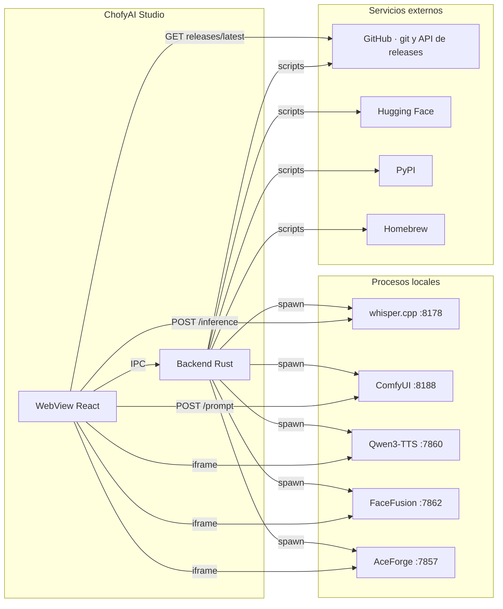

# 09 · APIs e integraciones

> Estado: completo · Última revisión: 2026-08-27 · Versión analizada: 0.5.1 (commit f840055)

ChofyAI Studio **no expone ningún servidor HTTP propio**. Lo que en otros proyectos sería
"la API" aquí se reparte en tres superficies distintas, con reglas y riesgos diferentes:

1. El **canal IPC de Tauri**, entre el WebView y el backend Rust.
2. Las **APIs HTTP de las herramientas locales** que la aplicación orquesta.
3. Los **servicios externos** que se usan durante la instalación y la descarga de modelos.

## 1. Superficie 1 · IPC de Tauri

### 1.1 Contrato de invocación

Desde TypeScript siempre se pasa por el envoltorio `tauriInvoke` de
[`src/App.tsx`](../../src/App.tsx), no por `invoke` directamente:

```ts
const result = await tauriInvoke<ActionResult>('start_tool', { toolId: tool.id });
if (result) setMessage(result.message);
```

Tres reglas del contrato, todas verificables en el código:

1. Los parámetros `snake_case` de Rust se invocan en `camelCase`: `tool_id` → `toolId`,
   `target_dir` → `targetDir`, `yaml_content` → `yamlContent`, `last_lines` → `lastLines`,
   `repo_id` → `repoId`, `relative_path` → `relativePath`, `studio_home` → `studioHome`,
   `models_dir` → `modelsDir`.
2. Los parámetros `app: AppHandle` y `registry: State<ProcessRegistry>` los inyecta Tauri:
   nunca se envían desde JavaScript.
3. Un `Err(String)` de Rust llega como excepción; `tauriInvoke` la convierte en un toast y
   devuelve `null`, salvo que se invoque con `{ silent: true }`.

### 1.2 Comandos por familia

| Familia | Comandos |
|:---|:---|
| Sistema y rutas | `get_system_summary`, `save_studio_home`, `save_path_settings`, `get_effective_paths`, `list_volume_candidates`, `get_system_stats` |
| Ciclo de vida de herramientas | `list_tools`, `install_tool`, `update_tool`, `start_tool`, `stop_tool`, `restart_tool`, `health_check_tool`, `list_running_pids` |
| Archivos y registros | `open_tool_directory`, `open_tool_log`, `read_tool_log`, `append_crash_log`, `read_crash_log` |
| Modelos | `list_tool_models`, `list_declared_models`, `download_tool_model`, `delete_tool_model` |
| Ubicación | `relocate_module`, `clear_module_override` |
| Procesos huérfanos | `list_orphan_ports`, `adopt_orphan`, `kill_orphan` |
| Workflows | `list_workflows`, `save_workflow`, `delete_workflow` |
| Marketplace | `list_marketplace_tools`, `import_marketplace_tool` |
| Diagnóstico y sistema operativo | `run_doctor`, `notify_macos` |

Son 35 en total. Las firmas completas, los errores literales y los efectos secundarios están
en [05 · Referencia técnica](05-technical-reference.md).

### 1.3 Ejemplos reales de invocación

Tomados literalmente de `src/App.tsx`:

```ts
await tauriInvoke<ToolManifest[]>('list_tools');
await tauriInvoke<AppSettings>('save_studio_home', { studioHome: target });
await tauriInvoke<ActionResult>('install_tool', { toolId: item.toolId });
await tauriInvoke<HealthResult>('health_check_tool', { toolId: t.id }, { silent: true });
await tauriInvoke<string>('read_tool_log', { toolId, kind, lastLines: 800 });
await tauriInvoke<ActionResult>('relocate_module', { toolId: tool.id, targetDir: relocateTarget.trim() });
await tauriInvoke<ActionResult>('download_tool_model', { toolId: tool.id, repoId: m.repo_id });
await tauriInvoke<OrphanPort[]>('list_orphan_ports', undefined, { silent: true });
await tauriInvoke<ActionResult>('save_workflow', { id, yamlContent: yaml });
await tauriInvoke<string>('run_doctor', { studioHome });
```

### 1.4 Eventos

| Evento | Payload | Emisor |
|:---|:---|:---|
| `install-progress` | `{ tool_id: string, line: string }` | Hilo lector de stdout de `run_install_script` |
| `install-done` | `{ tool_id: string, line: string }` | Final de `run_install_script` |
| `model-download-progress` | `{ tool_id: string, repo_id: string, line: string }` | `download_tool_model` |
| `model-download-done` | `{ tool_id: string, repo_id: string, ok: boolean }` | `download_tool_model` |

Suscripción en el frontend:

```ts
const unP = listen<InstallEvent>('install-progress', (event) => { /* … */ });
return () => { void unP.then((fn) => fn()); };
```

El resultado de la instalación se distingue por el **prefijo textual** de `line`: `OK:` para
éxito y `ERROR:` para fallo. Es un contrato basado en texto, no en tipos; cambiar esas
cadenas en Rust rompe la interfaz silenciosamente.

### 1.5 Modelo de permisos

[`src-tauri/capabilities/default.json`](../../src-tauri/capabilities/default.json) concede
únicamente `core:default` a la ventana `main`. No hay plugins de Tauri habilitados: todo
acceso a disco, procesos y red del backend ocurre dentro de los comandos propios, no a
través de las APIs de plugin del frontend. Además, `"csp": null` en
[`src-tauri/tauri.conf.json`](../../src-tauri/tauri.conf.json) deja el WebView sin política
de seguridad de contenido, lo que es necesario para embeber las UIs de terceros en un
`iframe` y a la vez es un riesgo analizado en [11 · Seguridad](11-security.md).

## 2. Superficie 2 · APIs HTTP de las herramientas locales

### 2.1 Puertos y direcciones

| Herramienta | Dirección | Origen del dato | Cómo se fija el bind |
|:---|:---|:---|:---|
| Qwen3-TTS | `http://127.0.0.1:7860` | `apps/qwen3-tts.yaml` | `uvicorn server:app --host 127.0.0.1 --port 7860` |
| whisper.cpp | `http://127.0.0.1:8178` | `apps/whispercpp.yaml` | `whisper-server --host 127.0.0.1 --port 8178` |
| FaceFusion | `http://127.0.0.1:7862` | `apps/facefusion.yaml` | `GRADIO_SERVER_NAME=127.0.0.1`, `GRADIO_SERVER_PORT=7862` |
| AceForge | `http://127.0.0.1:7857` | `apps/aceforge.yaml` | El script parchea el puerto 5056 → 7857 en `music_forge_ui.py` |
| ComfyUI | `http://127.0.0.1:8188` | `apps/comfyui.yaml` | `main.py --listen 127.0.0.1 --port 8188` |

Salvedad verificable: en AceForge el bind lo decide el propio `music_forge_ui.py` del
proyecto original; el script sólo sustituye el número de puerto. Que escuche exclusivamente
en `127.0.0.1` **requiere validación** en esa herramienta concreta.

### 2.2 Endpoints que el proyecto ejercita de verdad

Sólo dos endpoints externos se invocan desde el código del repositorio, ambos definidos en
los workflows y ejecutados por `runWorkflowStep`.

#### whisper.cpp · transcripción

```text
POST http://127.0.0.1:8178/inference
Content-Type: multipart/form-data

file=<archivo de audio>
response_format=json
temperature=0.0
```

Respuesta esperada: JSON con un campo `text`, del que el workflow extrae el resultado
mediante `output.from: text`. Definido en
[`workflows/transcribe-audio.yaml`](../../workflows/transcribe-audio.yaml) y reutilizado
como primer paso de [`workflows/audio-pipeline.yaml`](../../workflows/audio-pipeline.yaml).

#### ComfyUI · encolar un prompt

```text
POST http://127.0.0.1:8188/prompt
Content-Type: application/json

{ "prompt": { "3": { "class_type": "KSampler", … }, … } }
```

El grafo completo está en
[`workflows/comfyui-prompt.yaml`](../../workflows/comfyui-prompt.yaml) y requiere que exista
el checkpoint `sd_xl_base_1.0.safetensors`. La respuesta se lee por `output.from: prompt_id`.

#### Pasos no ejecutables

`workflows/audio-pipeline.yaml` incluye dos pasos con `type: stub` (resumen con un LLM local
y síntesis con Qwen3-TTS). No hacen ninguna petición: `runWorkflowStep` devuelve
`(stub) <nota>` sin tocar la red. Están declarados como plantilla documental, no como
funcionalidad.

#### Endpoints no ejercitados

Las APIs HTTP de Qwen3-TTS, FaceFusion y AceForge **no se invocan** desde el repositorio: la
aplicación sólo abre su interfaz en un `iframe`. Cualquier endpoint concreto de esas
herramientas queda como `Requiere validación`.

### 2.3 Cómo se construyen las peticiones

`runWorkflowStep` en [`src/App.tsx`](../../src/App.tsx) implementa tres modos según
`body_kind`:

| `body_kind` | Construcción | Detalle |
|:---|:---|:---|
| `multipart` | `FormData` con cada par de `fields` | Un valor que empiece por `__FILE__:` se sustituye por el `File` adjuntado; si falta, devuelve `archivo '<clave>' faltante` |
| `json` | `body` como texto, cabecera `Content-Type: application/json` | Se le aplica `substituteVars` antes de enviar |
| ausente | Petición simple con `method` (por defecto `GET`) | Sin cuerpo |

La URL también pasa por `substituteVars`, que reemplaza `{{ inputs.clave }}` por el valor del
formulario.

Manejo de la respuesta: si `Content-Type` incluye `application/json` se parsea; si no, se
lee como texto. Si el paso declara `output.from`, se extrae esa clave del objeto; si el valor
no es una cadena, se serializa con `JSON.stringify(valor, null, 2)`.

### 2.4 Errores y límites

| Situación | Resultado |
|:---|:---|
| La herramienta no está arrancada | `Network: <mensaje del navegador>` |
| Código HTTP distinto de 2xx | `HTTP <status> <statusText>` |
| Paso mal definido (sin `url` o tipo desconocido) | `step inválido` |
| Archivo requerido ausente | `archivo '<clave>' faltante` |

No hay reintentos, ni backoff, ni timeout en `runWorkflowStep`: una petición colgada queda
colgada hasta que el navegador la corte. El único timeout del sistema es el de
`health_check_tool`, con `TcpStream::connect_timeout` de 2 segundos.

## 3. Superficie 3 · Servicios externos

### 3.1 Repositorios clonados durante la instalación

| Herramienta | Repositorio | Script |
|:---|:---|:---|
| whisper.cpp | `github.com/ggml-org/whisper.cpp` | `scripts/mac/install-whispercpp.sh` |
| ComfyUI | `github.com/comfyanonymous/ComfyUI` | `scripts/mac/install-comfyui.sh` |
| FaceFusion | `github.com/facefusion/facefusion` | `scripts/mac/install-facefusion.sh` |
| AceForge | `github.com/audiohacking/AceForge` | `scripts/mac/install-aceforge.sh` |
| Qwen3-TTS (launcher) | `github.com/Blizaine/Qwen3-TTS-MLX-WebUI-Enhanced` | `scripts/mac/install-qwen3-tts.sh` |
| Qwen3-TTS (app) | `github.com/blizaine/qwen3-tts-apple-silicon` | `scripts/mac/install-qwen3-tts.sh` |
| mlx-audio | `github.com/Blaizzy/mlx-audio` (vía `uv pip install git+…`) | `scripts/mac/install-qwen3-tts.sh` |

Todos se clonan **sin fijar commit ni etiqueta**: se descarga la rama por defecto en el
momento de instalar, y en las actualizaciones se ejecuta `git pull --ff-only`. Es el punto
de mayor exposición de cadena de suministro del proyecto; se analiza en
[11 · Seguridad](11-security.md).

### 3.2 API de GitHub · comprobación de versión

```text
GET https://api.github.com/repos/vladimiracunadev-create/chofyai-studio/releases/latest
Accept: application/vnd.github+json
```

Implementado en el componente `UpdateChecker` de `src/App.tsx`. Campos que se usan de la
respuesta: `tag_name`, `html_url` y `published_at` (declarado en el tipo `ReleaseInfo`; sólo
los dos primeros se muestran). La comparación de versiones es una comparación de cadenas
tras quitar el prefijo `v` y el sufijo `-dev`, lo que funciona para `0.5.x` pero fallaría con
números de dos dígitos: `"0.10.0" > "0.9.0"` es falso en comparación lexicográfica. Está
registrado como hallazgo en [15 · Riesgos](15-risks-and-technical-debt.md).

Sin autenticación y sin cabecera `User-Agent` propia; ante cualquier fallo el `catch` es
silencioso y no se muestra nada al usuario. No se envía ninguna información local.

### 3.3 Hugging Face · descarga de modelos

[`scripts/mac/download-hf-model.sh`](../../scripts/mac/download-hf-model.sh) intenta en este
orden:

1. `huggingface-cli download <repo> --local-dir <destino> --local-dir-use-symlinks False`.
2. Si no está el CLI, `snapshot_download` de `huggingface_hub` con el Python detectado,
   instalando la librería con `pip --user` si falta.
3. Si no hay ninguno de los dos, sale con código 3 y el mensaje
   `ERROR: ni huggingface-cli ni python disponibles`.

Repositorios declarados hoy, todos en `apps/qwen3-tts.yaml`:

- `mlx-community/Qwen3-TTS-12Hz-0.6B-Base-8bit`
- `mlx-community/Qwen3-TTS-12Hz-0.6B-CustomVoice-8bit`
- `mlx-community/Qwen3-TTS-12Hz-1.7B-VoiceDesign-8bit`

Además, `install-whispercpp.sh` descarga el modelo `ggml-base.en.bin` desde
`huggingface.co/ggerganov/whisper.cpp` con `curl` si el script oficial de descarga no está
disponible.

### 3.4 Otros servicios

| Servicio | Uso | Dónde |
|:---|:---|:---|
| PyPI | `pip` o `uv pip install` de dependencias | `scripts/mac/common.sh` y cada instalador |
| Homebrew | `brew install ffmpeg` cuando falta | `install-facefusion.sh`, `install-aceforge.sh` |
| jsDelivr | Descarga y caché de `mermaid.min.js` | `scripts/docs/build-pdf.mjs`, sólo al generar los PDF |
| GitHub Pages | Publicación de `landing/` | `.github/workflows/pages.yml` |

## 4. Autenticación

No hay ninguna. Verificado por ausencia: no existen cabeceras `Authorization`, ni tokens, ni
claves de API en el código de la aplicación ni en los scripts. Todas las peticiones externas
van a recursos públicos. Los únicos secretos del proyecto son los de CI/CD para firma y
notarización, referenciados como `secrets.*` en los workflows de GitHub Actions y descritos
en [`../NOTARIZATION.md`](../NOTARIZATION.md).

## 5. Dependencia de proveedores externos

| Proveedor | Qué se rompe si cae | Gravedad |
|:---|:---|:---|
| GitHub (git) | No se puede instalar ni actualizar ninguna herramienta | Alta durante la instalación; nula después |
| Hugging Face | No se pueden descargar modelos nuevos | Media |
| PyPI | Fallan las instalaciones de herramientas Python | Alta durante la instalación |
| Homebrew | Falla la instalación automática de `ffmpeg` | Baja: se puede instalar a mano |
| API de GitHub | No se avisa de versiones nuevas | Nula: el `catch` es silencioso |
| jsDelivr | Los PDF salen con los diagramas como texto | Nula para la aplicación |

Una vez instaladas las herramientas, la aplicación funciona **completamente sin conexión**.

## 6. Diagrama de integraciones



El diagrama deja ver una asimetría deliberada: el backend habla con internet sólo a través
de los scripts de instalación, mientras que el WebView habla directamente tanto con las
herramientas locales como con la API de GitHub.

## 7. Ejemplos seguros

Petición de transcripción, con datos ficticios:

```bash
curl -s -X POST http://127.0.0.1:8178/inference \
  -F file=@/ruta/ejemplo/audio.wav \
  -F response_format=json \
  -F temperature=0.0
```

Respuesta simplificada:

```json
{
  "text": "esto es un ejemplo de transcripción"
}
```

Comprobación de versión publicada:

```bash
curl -s -H "Accept: application/vnd.github+json" \
  https://api.github.com/repos/vladimiracunadev-create/chofyai-studio/releases/latest
```

```json
{
  "tag_name": "v0.5.1",
  "html_url": "https://github.com/ejemplo/ejemplo/releases/tag/v0.5.1",
  "published_at": "2026-05-17T12:00:00Z"
}
```
