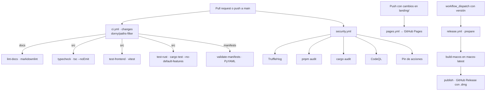

# 13 · Despliegue y operación

> Estado: completo · Última revisión: 2026-08-27 · Versión analizada: 0.5.1 (commit f840055)

Cómo se construye, se publica y se opera el sistema. Los pasos de instalación para un
usuario están en [02 · Instalación y ejecución](02-installation-and-execution.md); aquí se
describe el lado del mantenedor.

## 1. Entornos

| Entorno | Comando | Backend | Rutas | Para qué sirve |
|:---|:---|:---|:---|:---|
| Web puro | `pnpm dev:web` | No | — | Iterar sobre la interfaz sin compilar Rust |
| Escritorio en desarrollo | `pnpm tauri:dev` | Sí | `repo_root()` devuelve la raíz del repositorio | Desarrollo completo |
| Producción empaquetada | `.app` / `.dmg` | Sí | `repo_root()` devuelve `None`; recursos del bundle | Distribución |

En modo web, `inTauri` es `false`, `tauriInvoke` devuelve `null` en toda invocación y la
interfaz se rellena con `fallbackTools`: los botones se ven pero no hacen nada. No es un
fallo, es el comportamiento declarado en el mensaje inicial de la aplicación.

## 2. Construcción

### 2.1 Frontend

```bash
pnpm install --frozen-lockfile
pnpm build:web        # Vite → dist/
```

`tauri.conf.json` declara `build.frontendDist: "../dist"` y `beforeBuildCommand:
"pnpm build:web"`, de modo que empaquetar dispara la compilación del frontend
automáticamente.

### 2.2 Aplicación de escritorio

| Comando | Resultado |
|:---|:---|
| `pnpm tauri:build` | Empaquetado con la configuración base |
| `pnpm tauri:build:app` | Sólo el `.app` |
| `pnpm tauri:build:dmg` | Sólo el `.dmg` |
| `pnpm tauri:build:mac` | `.app` + `.dmg` con la sobrescritura `src-tauri/tauri.macos.conf.json` |
| `pnpm package:mac` | Pipeline completo: `scripts/mac/build-release.sh` |

`scripts/mac/build-release.sh` ejecuta, en este orden: `preflight-build.sh`,
`pnpm install --frozen-lockfile`, `pnpm build:web` y `pnpm tauri:build:mac`.

`scripts/mac/preflight-build.sh` comprueba que existan `node`, `pnpm`, `cargo` y las Xcode
Command Line Tools; si falta alguno, aborta con la lista de lo que falta.

### 2.3 Qué viaja dentro del `.app`

El bloque `bundle.resources` de `tauri.conf.json` copia dentro del paquete:

```text
../apps
../docs
../scripts/mac
../marketplace
../workflows
../storage/state/settings.json
```

Es lo que permite que la aplicación empaquetada encuentre manifiestos y scripts cuando
`repo_root()` devuelve `None` y todo se resuelve con `BaseDirectory::Resource`.

Dos consecuencias operativas que conviene no olvidar:

1. Un script nuevo fuera de `scripts/mac/` funcionará en desarrollo y fallará empaquetado.
2. El `settings.json` del repositorio se distribuye dentro de la aplicación, con las rutas
   que contenga en el momento del build.

### 2.4 El desvío de `target-dir`

[`.cargo/config.toml`](../../.cargo/config.toml) redirige el directorio de compilación a
`/tmp/chofyai-target`. Existe porque en volúmenes que no son APFS macOS crea archivos
AppleDouble (`._*`) que Cargo y Tauri intentan leer como TOML o UTF-8 y rompen la build.

Consecuencias: los artefactos **no** están en `src-tauri/target/`, y `/tmp` se limpia al
reiniciar, de modo que la primera compilación tras un reinicio es completa.
`scripts/mac/clean-appledouble.sh` borra los `._*` del árbol cuando aparecen.

En el runner de GitHub Actions este problema no existe, y por eso `release.yml` fija
explícitamente `CARGO_TARGET_DIR` al directorio del workspace.

## 3. Firma y notarización

Estado actual: **firma ad-hoc**, sin Apple Developer ID. El primer arranque en otro equipo
requiere abrir con clic derecho → Abrir.

[`src-tauri/Entitlements.plist`](../../src-tauri/Entitlements.plist) habilita `allow-jit`,
`allow-unsigned-executable-memory` y `disable-library-validation`, necesarios para ejecutar
intérpretes y librerías nativas de terceros.
[`src-tauri/Info.plist`](../../src-tauri/Info.plist) declara alta resolución, conmutación
automática de gráficos y la categoría `public.app-category.developer-tools`.

El procedimiento completo para pasar a firmado y notarizado, con los secretos que hay que
configurar, está en [`../NOTARIZATION.md`](../NOTARIZATION.md). Este documento no reproduce
ningún valor de secreto.

## 4. Integración y entrega continuas



### 4.1 `ci.yml`

Descrito trabajo a trabajo en [12 · Pruebas y calidad](12-testing-and-quality.md). Lo
esencial para operación: los trabajos son condicionales, de modo que un cambio sólo de
documentación ejecuta únicamente el lint de Markdown. Un CI en verde no significa siempre
que se hayan ejecutado las pruebas.

### 4.2 `security.yml`

Se dispara en push y pull request a `main`, los lunes a las 06:00 UTC, manualmente y por
`workflow_call` desde otros repositorios —esto último es lo que lo hace portable, según
[`../SECURITY_WORKFLOW.md`](../SECURITY_WORKFLOW.md)—.

| Trabajo | Comportamiento ante fallo |
|:---|:---|
| `secrets` (TruffleHog, `--only-verified`) | Falla si encuentra un secreto verificado |
| `pnpm-audit` | Falla si hay vulnerabilidades altas o críticas en dependencias de producción; se salta si no hay lockfile |
| `cargo-audit` | Recorre cada `Cargo.lock` y falla si alguno tiene vulnerabilidades |
| `codeql-js` | Análisis con `security-extended` y `security-and-quality` |
| `actions-pinning` | Sólo **avisa**: emite un `::warning::` si detecta acciones sin fijar, con una lista de excepciones conocidas |

### 4.3 `release.yml`

Se dispara manualmente con dos entradas: `version` (formato `vX.Y.Z`, validado con expresión
regular) y `prerelease`.

1. **`prepare`** (Ubuntu): valida el formato de versión, extrae las notas del `CHANGELOG.md`
   con `awk` buscando el encabezado de esa versión, y crea y empuja la etiqueta si no existe.
2. **`build-macos`** (`macos-latest`, Apple Silicon): instala pnpm, Node 20 y Rust con el
   target `aarch64-apple-darwin`, compila el frontend, ejecuta `pnpm tauri:build:mac` con
   `CARGO_TARGET_DIR` local, localiza el `.app` y el `.dmg` y sube el `.dmg` como artefacto
   con 14 días de retención.
3. **`publish`** (Ubuntu): descarga el artefacto y crea el GitHub Release con el `.dmg`
   adjunto y las notas extraídas.

Punto de atención operativo: el proceso **no actualiza** las versiones de `package.json`,
`Cargo.toml` ni `tauri.conf.json`. La etiqueta y el contenido del build pueden discrepar si
el mantenedor no las sube antes a mano. Es el origen de la discrepancia 0.5.1 / 0.5.0
observada hoy.

### 4.4 `pages.yml`

Publica `landing/` en GitHub Pages cuando cambia ese directorio o el propio workflow. El
sitio es estático y no tiene paso de compilación. Requiere haber configurado una vez
Settings → Pages → Source: GitHub Actions.

## 5. Infraestructura

No hay servidores propios. La única infraestructura del proyecto es GitHub: repositorio,
Actions, Releases y Pages. Todo lo demás corre en el equipo del usuario final.

La carpeta [`../cloud/`](../cloud/README.md) contiene un plan de migración a AWS con
arquitectura, servicios, costos y pasos. Es **documentación de diseño**: no hay ningún
recurso desplegado ni código de infraestructura en el repositorio, y no debe leerse como
estado actual.

## 6. Operación diaria de la aplicación

### 6.1 Registros

| Archivo | Contenido | Cómo se consulta |
|:---|:---|:---|
| `<studio_home>/logs/<tool>-install.log` | Salida completa de la instalación | `LogsViewer`, `read_tool_log` con `kind: "install"` |
| `<studio_home>/logs/<tool>-run.log` | stdout y stderr del proceso en ejecución | `LogsViewer` con `kind: "run"` |
| `<studio_home>/logs/<tool>-model-download.log` | Salida de la descarga de modelos | Lectura manual |
| `<estado>/crash.log` | Errores capturados por el `ErrorBoundary` de la interfaz | `read_crash_log` |

`read_tool_log` devuelve por defecto las últimas 500 líneas. `open_tool_log` abre en el
Finder el `run.log` o, si no existe, el `install.log`. No hay rotación: los archivos crecen
hasta que el usuario los borra, y `<tool>-run.log` se **recrea** en cada arranque, con lo que
se pierde el registro de la ejecución anterior.

### 6.2 Métricas

`get_system_stats` alimenta la barra inferior cada 3 segundos con CPU, memoria, disco,
tiempo de actividad y carga media. Es una vista instantánea: no se guarda histórico, no hay
series temporales y no hay exportación.

### 6.3 Monitorización y alertas

No existen. No hay comprobaciones automáticas más allá de los sondeos de la interfaz
(salud cada 5 s, herramientas cada 8 s, huérfanos cada 60 s), y esos sondeos sólo funcionan
mientras la ventana está abierta. Si una herramienta muere con la aplicación cerrada, nadie
se entera hasta que el usuario la vuelve a abrir.

### 6.4 Ciclo de vida de las herramientas

| Acción | Comando | Nota operativa |
|:---|:---|:---|
| Arrancar | `start_tool` | Mata cualquier proceso ajeno que ocupe el puerto declarado |
| Detener | `stop_tool` | `SIGTERM`; si el proceso lo ignora, queda vivo y aparecerá como huérfano |
| Reiniciar | `restart_tool` | `SIGTERM`, espera 800 ms y vuelve a lanzar |
| Actualizar | `update_tool` | Exige que ya esté instalada; reejecuta el script, que hace `git pull --ff-only` |
| Comprobar salud | `health_check_tool` | PID vivo y puerto abierto |
| Adoptar huérfano | `adopt_orphan` | Reincorpora un PID al registro |
| Matar huérfano | `kill_orphan` | `SIGTERM` |

Al cerrar la aplicación **los procesos hijos siguen vivos**. Es intencional, y por eso
`restore_registry` reconstruye el registro al arrancar descartando los PID muertos.

### 6.5 Diagnóstico

`run_doctor` ejecuta [`../../scripts/mac/doctor.sh`](../../scripts/mac/doctor.sh) sobre la
ruta indicada y muestra la salida cruda en un modal. El script informa del volumen, el
espacio libre y la presencia de `git`, `python3`, `ffmpeg`, `cmake`, las versiones de Python
disponibles, `uv` y `cargo`.

## 7. Migraciones

No hay base de datos, pero sí evolución de formatos. Todo lo que sigue está implementado y
verificado:

| Cambio de formato | Cómo se degrada |
|:---|:---|
| Campos nuevos en `AppSettings` | Llevan `#[serde(default)]`: un `settings.json` antiguo se lee sin error |
| `install_script` frente a `install_scripts` | El diccionario por plataforma tiene precedencia; el campo antiguo queda como respaldo |
| Manifiesto sin `platforms:` | Se interpreta como `mac-arm64`, que era el comportamiento original |
| Manifiesto sin `run:` | La herramienta se lista pero no puede arrancarse |
| `settings.json` ilegible | `load_settings` devuelve valores por defecto, **sin avisar**: el usuario pierde su configuración |

No existe un número de versión de esquema en `settings.json` ni en los manifiestos, así que
una migración incompatible en el futuro no tendría forma de detectarse.

## 8. Respaldo, recuperación y reversión

| Qué | Cómo |
|:---|:---|
| Configuración | Copiar `settings.json` (y `processes.json` si interesa) |
| Trabajo del usuario | Copiar `<studio_home>/outputs` y los modelos propios |
| Herramientas instaladas | Reinstalables desde la aplicación; no merece la pena respaldarlas |
| Herramienta corrupta | Reinstalar desde la interfaz, o `bash scripts/mac/cleanup-tool.sh <studio_home> <tool_id>` y volver a instalar |
| Reversión de la aplicación | Descargar el `.dmg` de un release anterior en GitHub |
| Reversión de una herramienta | `No documentado en el repositorio`: el script siempre trae la rama por defecto |

No hay respaldo automático de ningún tipo. Es una ausencia consciente que conviene declarar
al usuario.

## 9. Mantenimiento periódico

Lista verificable, ordenada por frecuencia:

1. **Semanal**: revisar los PR de Dependabot (npm, cargo y github-actions) y el resultado del
   escaneo de seguridad del lunes.
2. **Semanal**: comprobar que `main` está en verde.
3. **Mensual**: ejecutar `bash scripts/mac/doctor.sh <studio_home>` y revisar el espacio
   libre; los modelos crecen rápido.
4. **Mensual**: limpiar modelos no usados desde el panel de modelos y revisar el tamaño de
   `<studio_home>/logs`.
5. **Antes de cada release**: alinear las versiones de `package.json`, `src-tauri/Cargo.toml`,
   `src-tauri/tauri.conf.json` y `APP_VERSION` en `src/App.tsx`; actualizar `CHANGELOG.md`
   con el encabezado que `release.yml` espera; y ejecutar `pnpm package:mac` en local antes
   de disparar el workflow.
6. **Tras cada cambio de documentación**: regenerar los PDF con
   `node scripts/docs/build-pdf.mjs`.
7. **Ocasional**: `bash scripts/mac/clean-appledouble.sh` si se trabaja sobre un volumen que
   no es APFS.

## 10. Generación de la documentación en PDF

```bash
node scripts/docs/build-pdf.mjs          # todos los documentos
node scripts/docs/build-pdf.mjs 03       # sólo los que empiezan por "03"
```

Requisitos: Node 18 o superior; Google Chrome, Chromium, Edge o Brave instalado, o la
variable `CHOFYAI_CHROME` apuntando al binario; y conexión a internet **la primera vez**,
para cachear `mermaid.min.js` en el directorio temporal del sistema. A partir de ahí funciona
sin red. Con `CHOFYAI_SKIP_MERMAID=1` se generan los PDF sin renderizar los diagramas.

El script convierte cada Markdown a HTML con un renderizador propio, añade portada, índice y
pie de página con nombre del sistema, versión, commit y fecha, y lo imprime con Chrome en
modo headless. El Markdown es la única fuente: los PDF se derivan de él y nunca al revés.
