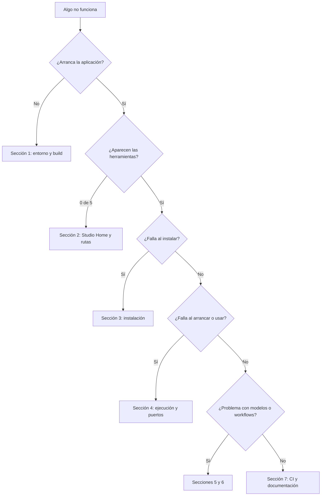

# 14 · Solución de problemas

> Estado: completo · Última revisión: 2026-08-27 · Versión analizada: 0.5.1 (commit f840055)

Guía por síntoma. Cada entrada indica cómo se ve el problema, qué lo causa, cómo
confirmarlo, cómo resolverlo, qué archivos intervienen y qué riesgo tiene la solución.

Todo lo que sigue está contrastado con el código actual. Cuando la documentación previa del
repositorio ([`../TROUBLESHOOTING.md`](../TROUBLESHOOTING.md),
[`../PORQUE-NO-FUNCIONABA.md`](../PORQUE-NO-FUNCIONABA.md),
[`../POSTMORTEM-2026-05-17.md`](../POSTMORTEM-2026-05-17.md)) describe un comportamiento que
el código ya no tiene, se indica expresamente.

## Árbol de decisión inicial

## 1. Entorno, dependencias y compilación

### 1.1 `pnpm: command not found`

- **Causa**: el proyecto usa pnpm fijado por Corepack, no npm.
- **Diagnóstico**: `node -v` funciona pero `pnpm -v` no.
- **Solución**: `corepack enable && corepack prepare pnpm@10 --activate`.
- **Archivos**: campo `packageManager` de [`../../package.json`](../../package.json),
  [`../PACKAGE_MANAGER.md`](../PACKAGE_MANAGER.md).
- **Riesgo**: ninguno. Usar `npm install` en su lugar sí lo tiene: rompe las garantías del
  lockfile y de `onlyBuiltDependencies`.

### 1.2 Falta Rust, cargo o las Xcode Command Line Tools

- **Síntoma**: `pnpm tauri:dev` falla antes de abrir ninguna ventana.
- **Diagnóstico**: `bash scripts/mac/preflight-build.sh` enumera exactamente lo que falta.
- **Solución**: instalar Rust con `rustup` y ejecutar `xcode-select --install`.
- **Archivos**: [`../../scripts/mac/preflight-build.sh`](../../scripts/mac/preflight-build.sh),
  [`../../scripts/mac/bootstrap.sh`](../../scripts/mac/bootstrap.sh).

### 1.3 Falta `cmake`, `ffmpeg` o `python3.10`

- **Síntoma**: la instalación de una herramienta concreta falla con `ERROR: <binario> no está
  disponible`.
- **Diagnóstico**: `bash scripts/mac/doctor.sh "<studio_home>"` marca con `[WARN]` lo que
  falta.
- **Solución**: `brew install cmake ffmpeg python@3.10`. Los instaladores de FaceFusion y
  AceForge intentan instalar `ffmpeg` con Homebrew por su cuenta si lo encuentran.
- **Nota específica**: `install-qwen3-tts.sh` exige **exactamente** `python3.10`; no acepta
  otra versión, a diferencia del resto de scripts, que usan `detect_python` con una lista de
  preferencias.

### 1.4 La compilación de Rust falla con errores de UTF-8 o TOML extraños

- **Causa**: archivos AppleDouble (`._*`) creados por macOS en volúmenes que no son APFS.
  Cargo y Tauri intentan leerlos como configuración.
- **Diagnóstico**: `find . -name "._*" -not -path "./node_modules/*" | head`.
- **Solución**: `bash scripts/mac/clean-appledouble.sh`. La prevención permanente ya está en
  el repositorio: [`../../.cargo/config.toml`](../../.cargo/config.toml) desvía el
  directorio de compilación a `/tmp/chofyai-target`.
- **Riesgo**: el script borra todos los `._*` del árbol excepto en `node_modules` y `.git`.
  En un volumen APFS no hay nada que borrar.

### 1.5 La ventana de `pnpm tauri:dev` aparece en blanco

- **Causa habitual**: el puerto 1420 está ocupado. `vite.config.ts` usa `strictPort: true`,
  así que Vite no se cambia de puerto: falla, y Tauri carga un `devUrl` que no responde.
- **Diagnóstico**: `lsof -nP -iTCP:1420 -sTCP:LISTEN`.
- **Solución**: liberar el puerto, o cambiarlo **a la vez** en `vite.config.ts` y en
  `build.devUrl` de `src-tauri/tauri.conf.json`.

## 2. Studio Home, volúmenes y rutas

### 2.1 "0 de 5 herramientas" o desaparecen las instaladas

- **Causa**: el `studio_home` configurado no está disponible (volumen desmontado, disco
  desconectado, permisos), y la aplicación está funcionando en la ruta de reserva.
- **Diagnóstico**: la barra inferior muestra el aviso de fallback; el panel Resumen enseña
  `studio_home` frente a `studio_home_effective`. En el código lo decide
  `resolve_effective_home` en [`../../src-tauri/src/system.rs`](../../src-tauri/src/system.rs).
- **Solución**: conectar el disco y reiniciar la aplicación; o configurar
  `sparsebundle_path` en `settings.json` para que la aplicación monte la imagen APFS sola con
  `hdiutil attach`.
- **Riesgo**: cambiar el `studio_home` **no mueve nada**. Las herramientas siguen donde
  estaban y volverán a aparecer al restaurar la ruta original.

### 2.2 La instalación falla por permisos de escritura

- **Causa**: el directorio de destino no es escribible. La aplicación lo comprueba escribiendo
  y borrando un archivo `.chofyai-write-probe` (`is_writable_dir`).
- **Diagnóstico**: `touch "<studio_home>/.prueba" && rm "<studio_home>/.prueba"`.
- **Solución**: corregir permisos o elegir otro volumen desde el selector.

### 2.3 Los entornos virtuales de Python fallan en un disco externo

- **Causa**: sistemas de archivos exFAT o FAT no soportan enlaces simbólicos ni permisos de
  ejecución, que `venv` necesita.
- **Diagnóstico**: `diskutil info "<volumen>" | grep "File System"`.
- **Solución**: crear un sparsebundle APFS
  (`bash scripts/mac/mount-apfs.sh <imagen.sparsebundle> <punto de montaje>`) y apuntar el
  `studio_home` dentro de él. El asistente inicial detecta el sistema de archivos y sugiere
  esta ruta.

### 2.4 Una herramienta reubicada aparece como no instalada

- **Causa**: hay un `tool_overrides` apuntando a un directorio que ya no existe.
- **Diagnóstico**: revisar `tool_overrides` en `settings.json`; la tarjeta muestra la
  etiqueta de reubicada y la ruta real.
- **Solución**: pulsar *Reset ruta* (`clear_module_override`) para volver a la ubicación por
  defecto, o volver a mover la carpeta a la ruta del override.
- **Riesgo**: `clear_module_override` **no mueve archivos**; sólo borra el override.

## 3. Instalación

### 3.1 La instalación dice que terminó pero la herramienta no queda instalada

- **Causa**: el script salió con código 0 pero no dejó todos los artefactos declarados en
  `installed_if`. Es exactamente el caso que la post-validación de `run_install_script`
  detecta.
- **Diagnóstico**: el mensaje de error nombra los artefactos que faltan y la ruta del log:
  `Instalación de <name> terminó pero faltan artefactos: <lista>. Revisa <log>`.
- **Solución**: abrir `<studio_home>/logs/<tool>-install.log` y buscar el primer error real,
  normalmente una dependencia de Python que no compiló.
- **Riesgo**: reinstalar es seguro; los scripts reutilizan el clon y el entorno existentes.

### 3.2 La barra de progreso no avanza

- **Causa**: la línea que emite el script no coincide con ningún patrón de
  `parseInstallLine`.
- **Diagnóstico**: la mini-terminal de la cola sí muestra líneas nuevas; sólo el porcentaje
  se queda quieto.
- **Solución**: no hay problema real. Si se quiere reflejar una fase nueva, hay que añadir el
  patrón en [`../../src/utils.ts`](../../src/utils.ts) y su prueba en `src/utils.test.ts`.

### 3.3 `No existe script: .../scripts/linux/install-<tool>.sh`

- **Causa**: los manifiestos declaran scripts de Linux que **no existen** en el repositorio;
  el propio YAML los marca con `# TODO: pendiente`.
- **Diagnóstico**: `ls scripts/` muestra sólo `mac`, `win` y `docs`.
- **Solución**: hoy no la hay. Linux no está soportado, pese a aparecer en `platforms:`.
  Registrado en [15 · Riesgos y deuda técnica](15-risks-and-technical-debt.md).

### 3.4 whisper.cpp falla al compilar tras mover la instalación

- **Causa**: `CMakeCache.txt` guarda rutas absolutas de la ubicación anterior.
- **Diagnóstico**: en el log aparece el aviso `[clean] CMakeCache apunta a … — limpiando
  build/`, o un error de cmake sobre directorios que no existen.
- **Solución**: ya está automatizada: `install-whispercpp.sh` compara
  `CMAKE_HOME_DIRECTORY` con el directorio actual y borra `build/` si no coinciden. Si aun
  así falla, borrar `build/` a mano y reinstalar.

### 3.5 FaceFusion aborta con un mensaje sobre conda

- **Causa**: el instalador oficial de FaceFusion exige conda salvo que se le pase
  `--skip-conda`.
- **Estado**: ya resuelto en el repositorio. `install-facefusion.sh` invoca
  `python install.py --onnxruntime default --skip-conda`. Si el error aparece, la instalación
  no está usando ese script.

### 3.6 ComfyUI no ve los modelos descargados

- **Causa histórica**: los directorios externos y los internos de ComfyUI no estaban
  enlazados, y además se usaban nombres en plural (`inputs`, `outputs`) donde ComfyUI usa
  singular.
- **Estado**: resuelto. `install-comfyui.sh` fuerza enlaces simbólicos de `models`, `input`,
  `output` y `custom_nodes` hacia los directorios externos, preservando los nodos propios del
  usuario y descartando los archivos de ejemplo.
- **Diagnóstico si reaparece**: `ls -la "<install_dir>/source"` debe mostrar esos cuatro
  nombres como enlaces simbólicos.

### 3.7 AceForge y el puerto 5056

- **Causa**: AceForge fija 5056 en `music_forge_ui.py`, puerto que en macOS entra en
  conflicto con un servicio que Chrome sondea de forma agresiva.
- **Estado**: resuelto. `install-aceforge.sh` sustituye con `sed` todas las referencias a
  5056 por 7857, coherente con `default_port` del manifiesto.
- **Riesgo del parche**: es una sustitución textual sobre código de terceros. Si el proyecto
  original cambia la forma de declarar el puerto, el parche deja de aplicarse en silencio y
  la herramienta volverá a escuchar en 5056.

### 3.8 Qwen3-TTS no se puede instalar

- **Causa**: depende de MLX, que sólo existe en Apple Silicon. Su manifiesto declara
  únicamente `platforms: [mac-arm64]`.
- **Diagnóstico**: en otra plataforma, `platform_supported` devuelve `false` y el error lo
  dice explícitamente.
- **Solución**: no hay alternativa dentro del proyecto. Ver
  [`../PORTING_GUIDE.md`](../PORTING_GUIDE.md).

## 4. Ejecución, puertos y salud

### 4.1 Pulso *Iniciar* y no pasa nada

- **Causas posibles**, en orden de frecuencia:
  1. El proceso arrancó y murió enseguida: mirar `<studio_home>/logs/<tool>-run.log`.
  2. La instalación está incompleta: `start_tool` valida `installed_if` antes del arranque y
     devuelve un mensaje explícito.
  3. El manifiesto no define `run.command` para esta plataforma.
- **Diagnóstico**: botón 📋 de la tarjeta, o
  `tail -50 "<studio_home>/logs/<tool>-run.log"`.
- **Nota**: el `run.log` se **recrea** en cada arranque; si la herramienta muere al instante,
  el log puede quedar casi vacío pero suele contener la traza de Python.

### 4.2 Otra aplicación se cerró sola al arrancar una herramienta

- **Causa**: el pre-flight de puertos de `start_tool` envía `kill -9` a cualquier proceso
  ajeno al registro que esté escuchando en el puerto declarado.
- **Diagnóstico**: comprobar si esa aplicación usaba 7860, 7857, 7862, 8178 o 8188.
- **Solución**: cambiar el `default_port` en el manifiesto de la herramienta y ajustar su
  `run.command` para que coincidan.
- **Riesgo**: cambiar sólo uno de los dos deja la salud siempre en rojo y la vista embebida
  apuntando al puerto equivocado.

### 4.3 La herramienta aparece en rojo aunque está arrancando

- **Causa**: tarda más de lo que dura un ciclo de sondeo en abrir el puerto.
- **Comportamiento real**: la interfaz tolera 60 segundos desde el arranque
  (`startingTools`) antes de declararla caída. Herramientas que cargan modelos grandes pueden
  superar ese margen.
- **Solución**: esperar y pulsar *Refrescar estado*. Si sigue en rojo pasados un par de
  minutos, mirar el `run.log`.

### 4.4 Aparecen procesos huérfanos

- **Causa**: la aplicación se cerró sin detener las herramientas, que siguen vivas por
  diseño.
- **Diagnóstico**: el aviso de la interfaz, o
  `lsof -nP -iTCP:8188 -sTCP:LISTEN`.
- **Solución**: *Adoptar* para recuperar el control, o *Matar* para cerrarlo.
- **Falso positivo conocido**: la identificación es **sólo por número de puerto**. Cualquier
  proceso ajeno que escuche en uno de esos puertos aparecerá como huérfano de esa
  herramienta.

### 4.5 *Ver UI* muestra una pantalla en blanco

- **Causas**: la herramienta aún no terminó de arrancar; o sirve en una ruta distinta de `/`;
  o envía cabeceras que impiden ser embebida en un `iframe`.
- **Diagnóstico**: abrir `http://127.0.0.1:<puerto>/` en un navegador normal con el botón ↗.
- **Solución**: usar el botón *Reload UI*, o trabajar en el navegador externo.

### 4.6 Los botones no hacen nada

- **Causa**: la aplicación se está ejecutando en modo web (`pnpm dev:web`), sin backend.
- **Diagnóstico**: el mensaje inicial lo dice; las herramientas listadas son las cinco de
  `fallbackTools`.
- **Solución**: usar `pnpm tauri:dev` o el `.app` empaquetado.

## 5. Modelos

### 5.1 La descarga de un modelo falla

- **Causa**: no hay `huggingface-cli` ni `huggingface_hub` disponibles, o se cortó la red.
- **Diagnóstico**: `<studio_home>/logs/<tool>-model-download.log`; el script indica qué vía
  eligió.
- **Solución**: instalar el cliente (`pip install huggingface_hub`) y reintentar. La descarga
  es reanudable.

### 5.2 Un modelo figura como presente pero la herramienta no lo encuentra

- **Causa**: `list_declared_models` marca `present: true` con que el directorio **no esté
  vacío**; una descarga interrumpida lo satisface.
- **Diagnóstico**: comparar el tamaño en disco con el tamaño esperado del repositorio.
- **Solución**: borrar el directorio del modelo y volver a descargarlo.

### 5.3 No se puede borrar un modelo

- **Mensajes posibles**: `relative_path inválido` (la ruta contiene `..`),
  `path traversal bloqueado` (el destino queda fuera del directorio de modelos) o
  `solo se borran archivos` (el destino es un directorio).
- **Solución**: borrar directorios completos desde el Finder con el botón 📁.

## 6. Workflows

### 6.1 Un paso falla con `Network: …`

- **Causa**: la herramienta destino no está arrancada.
- **Solución**: arrancarla y reintentar. No hay reintentos automáticos.

### 6.2 Un paso devuelve `HTTP 404` o `HTTP 500`

- **Causa**: el endpoint declarado no existe en la versión instalada de la herramienta, o
  falta un requisito. El workflow de ComfyUI, por ejemplo, necesita el checkpoint
  `sd_xl_base_1.0.safetensors`.
- **Solución**: revisar el `url` del paso en el YAML y los requisitos indicados en el propio
  archivo.

### 6.3 Un paso devuelve `(stub) …`

- **No es un error**: los pasos con `type: stub` de
  [`../../workflows/audio-pipeline.yaml`](../../workflows/audio-pipeline.yaml) son plantillas
  documentales y no ejecutan nada.

### 6.4 No se puede guardar un workflow

- **Mensajes**: `id vacío`, `id no puede contener / \ ni ..`,
  `id solo permite [a-zA-Z0-9_-]`, `YAML inválido: …`, `YAML root debe ser un mapping` o
  `falta campo obligatorio: <campo>` (obligatorios: `id`, `name`, `description`, `steps`).

## 7. Integración continua y documentación

### 7.1 Falla el trabajo de markdownlint

- **Causa**: reglas de formato. Las más frecuentes: MD032 (listas sin línea en blanco
  alrededor), MD031 (bloques de código sin línea en blanco), MD040 (bloque cercado sin
  lenguaje), MD041 (el archivo no empieza por un `# H1`), MD047 (falta el salto final).
- **Diagnóstico y solución**: `pnpm dlx markdownlint-cli2 "**/*.md"`, y con `--fix` para lo
  corregible automáticamente.
- **Configuración**: [`../../.markdownlint.json`](../../.markdownlint.json) — MD013, MD012 y
  MD060 están desactivadas en este repositorio.

### 7.2 Falla `typecheck`, `vitest` o `cargo test`

- **Reproducción local**: `pnpm exec tsc --noEmit`, `pnpm test`,
  `cd src-tauri && cargo test --no-default-features`.
- **Detalle**: CI usa `--no-default-features`; el script `pnpm test:rust` no. Un fallo que
  sólo aparece en CI puede deberse a esa diferencia.

### 7.3 Falla `validate-manifests`

- **Causa**: un YAML de `apps/` sin alguno de los campos obligatorios (`id`, `name`,
  `category`, `runtime`, `description`, `platforms`, `installed_if`), con `install_script`
  pero sin `run`, o con una categoría o runtime fuera de las listas permitidas.
- **Solución**: el propio job imprime el archivo y el campo exacto.

### 7.4 El generador de PDF falla

| Mensaje | Causa | Solución |
|:---|:---|:---|
| `No encontré Chrome/Chromium…` | No hay navegador en las rutas conocidas | Instalar Chrome o exportar `CHOFYAI_CHROME=/ruta/al/binario` |
| `AVISO: no pude obtener mermaid …` | Sin red y sin caché | Ejecutar una vez con conexión, o usar `CHOFYAI_SKIP_MERMAID=1` |
| `Chrome no generó <archivo> a tiempo` | El navegador no terminó en 60 segundos | Reintentar; si persiste, generar ese documento solo pasando su prefijo |

### 7.5 `settings.json` corrupto

- **Síntoma**: la configuración vuelve a los valores por defecto sin explicación.
- **Causa**: `load_settings` no distingue entre "no existe" y "no parsea": ante cualquier
  fallo devuelve valores por defecto en silencio.
- **Diagnóstico**: `python3 -m json.tool "<ruta>/settings.json"`.
- **Solución**: corregir el JSON a mano o reconfigurar desde la interfaz.
- **Riesgo**: mientras el archivo esté corrupto, cualquier guardado desde la interfaz lo
  sobrescribe con los valores por defecto más el cambio realizado.

## 8. Índice por síntoma

| Síntoma | Sección |
|:---|:---|
| `pnpm` no existe | 1.1 |
| Falla `tauri:dev` antes de abrir | 1.2 |
| `ERROR: <binario> no está disponible` | 1.3 |
| Errores raros de TOML o UTF-8 al compilar | 1.4 |
| Ventana en blanco en desarrollo | 1.5 |
| 0 de 5 herramientas | 2.1 |
| Permisos de escritura | 2.2 |
| Falla el entorno virtual en disco externo | 2.3 |
| Herramienta reubicada figura como no instalada | 2.4 |
| Instalación "exitosa" sin resultado | 3.1 |
| Progreso congelado | 3.2 |
| Script de Linux inexistente | 3.3 |
| whisper.cpp y CMakeCache | 3.4 |
| FaceFusion y conda | 3.5 |
| ComfyUI no ve los modelos | 3.6 |
| AceForge y el puerto 5056 | 3.7 |
| Qwen3-TTS fuera de Apple Silicon | 3.8 |
| *Iniciar* sin efecto | 4.1 |
| Otra aplicación cerrada de golpe | 4.2 |
| Salud en rojo durante el arranque | 4.3 |
| Procesos huérfanos | 4.4 |
| *Ver UI* en blanco | 4.5 |
| Botones inertes | 4.6 |
| Falla la descarga de un modelo | 5.1 |
| Modelo presente pero inservible | 5.2 |
| No se puede borrar un modelo | 5.3 |
| Workflow con error de red | 6.1 |
| Workflow con error HTTP | 6.2 |
| Paso stub | 6.3 |
| No se guarda el workflow | 6.4 |
| Falla markdownlint | 7.1 |
| Falla typecheck o pruebas | 7.2 |
| Falla la validación de manifiestos | 7.3 |
| Falla el generador de PDF | 7.4 |
| Configuración perdida | 7.5 |
