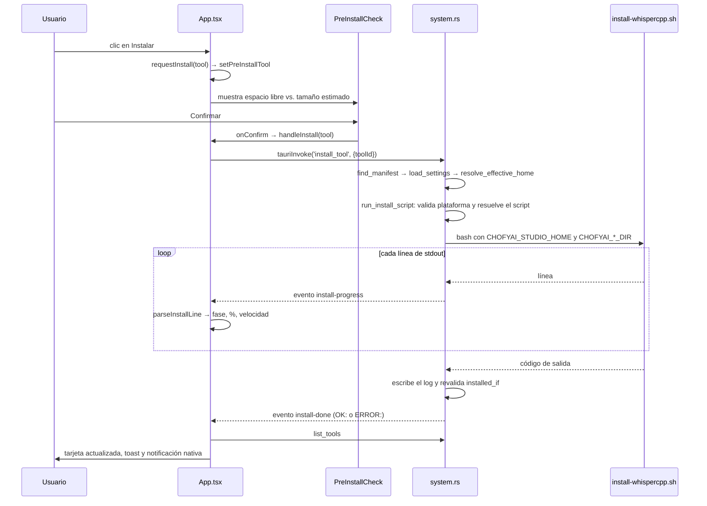

# 18 · Guía para un nuevo desarrollador

> Estado: completo · Última revisión: 2026-08-27 · Versión analizada: 0.5.1 (commit f840055)

Guía de incorporación. Supone que sabes programar pero que nunca has visto este repositorio.
El objetivo es que en tres sesiones de trabajo puedas hacer un cambio con criterio.

## 1. Itinerario de lectura

### Bloque 1 · Entender qué es esto (1-2 horas)

1. [01 · Descripción general del sistema](01-system-overview.md) — qué hace y para quién.
   Empieza por la sección "El sistema explicado para una persona no técnica": es la que mejor
   fija el modelo mental.
2. [`../../README.md`](../../README.md) — el estado que el proyecto comunica hacia fuera.
3. [03 · Arquitectura](03-architecture.md) — las capas, la frontera IPC y los diagramas de
   secuencia. Si sólo lees un documento técnico, que sea éste.

### Bloque 2 · Ponerlo en marcha (2-3 horas)

1. [02 · Instalación y ejecución](02-installation-and-execution.md), y ejecuta los pasos.
2. Arranca la aplicación e instala **whisper.cpp**: es la más rápida y ejercita el flujo
   completo (clonado, compilación, descarga de modelo, arranque, salud, vista embebida).
3. Mientras instala, mira el log en vivo: `tail -f "<studio_home>/logs/whispercpp-install.log"`.

### Bloque 3 · Entender el código (4-6 horas)

1. [04 · Mapa del código](04-code-map.md) — para saber dónde está cada cosa.
2. [06 · Explicación profunda del código](06-deep-code-explanation.md) — secciones de
   resolución de rutas, instalación y ciclo de vida de procesos.
3. Lee `src-tauri/src/system.rs` de principio a fin. Son 2029 líneas, pero es **el** archivo
   del proyecto: quien lo entiende, entiende el sistema.
4. [05 · Referencia técnica](05-technical-reference.md) — no de corrido, sino como consulta.

### Bloque 4 · Antes de tocar nada

1. [15 · Riesgos y deuda técnica](15-risks-and-technical-debt.md) — para no "arreglar" algo
   que es deliberado, y para saber qué está roto de verdad.
2. [14 · Solución de problemas](14-troubleshooting.md) — te ahorrará horas la primera vez que
   algo falle.
3. [12 · Pruebas y calidad](12-testing-and-quality.md) — qué está cubierto y qué no.

## 2. Preparación del entorno

```bash
# 1. Herramientas base
brew install node cmake ffmpeg python@3.10 python@3.11 git
brew install uv                 # opcional pero recomendado
xcode-select --install

# 2. Rust
curl --proto '=https' --tlsv1.2 -sSf https://sh.rustup.rs | sh

# 3. pnpm (este proyecto NO usa npm)
corepack enable && corepack prepare pnpm@10 --activate

# 4. Verificación
bash scripts/mac/bootstrap.sh          # entorno general
bash scripts/mac/preflight-build.sh    # requisitos de compilación
bash scripts/mac/doctor.sh "$HOME/ChofyAIStudio"
```

`bootstrap.sh` distingue lo crítico (git, python3) de lo recomendable (Rust, node, pnpm, uv,
ffmpeg, cmake) y sólo aborta con lo primero.

## 3. Ejecutar el sistema

```bash
pnpm install --frozen-lockfile
pnpm tauri:dev     # aplicación completa, con backend
pnpm dev:web       # sólo interfaz, sin backend
```

En modo web, `inTauri` es `false` en `src/App.tsx`, `tauriInvoke` devuelve `null` en toda
invocación y la lista de herramientas viene de la constante `fallbackTools`. **Ningún botón
que toque el sistema funciona**, y eso es lo esperado: sirve para iterar sobre estilos y
maquetación sin recompilar Rust.

## 4. Dónde está cada cosa

| Si quieres tocar… | Ve a |
|:---|:---|
| Cualquier cosa de la interfaz | `src/App.tsx` |
| Los tipos que cruzan la frontera IPC | `src/types.ts` y `src-tauri/src/models.rs`, **los dos** |
| Formateo o parser de progreso | `src/utils.ts` (tiene pruebas: úsalas) |
| Textos de la interfaz | `src/i18n.ts` |
| Lógica de negocio del backend | `src-tauri/src/system.rs` |
| Registrar un comando nuevo | `src-tauri/src/lib.rs` |
| Cómo se instala una herramienta | `scripts/mac/install-<tool>.sh` |
| Utilidades compartidas de los scripts | `scripts/mac/common.sh` |
| Declarar una herramienta | `apps/<id>.yaml` |
| Catálogo del marketplace | `marketplace/registry.yaml` |
| Pipelines entre herramientas | `workflows/*.yaml` |
| Comprobaciones de CI | `.github/workflows/ci.yml` |
| Empaquetado y ventana | `src-tauri/tauri.conf.json` |
| Esta documentación | `docs/system-documentation/` |

## 5. Recorrido guiado: qué pasa al pulsar *Instalar*



Sigue este recorrido con el código abierto en paralelo. Los puntos que conviene entender
bien:

1. **`requestInstall` no instala**: abre la comprobación previa. Instalar es `handleInstall`.
2. **El nombre del parámetro cambia**: `toolId` en JavaScript, `tool_id` en Rust.
3. **El progreso y el resultado viajan por caminos distintos**: eventos y valor de retorno.
4. **La instalación puede "fallar" después de que el script diga que fue bien**: es la
   post-validación de `installed_if`, y es intencional.

## 6. Añadir una herramienta nueva

### 6.1 El manifiesto

Crea `apps/<id>.yaml`. El validador de CI exige `id`, `name`, `category`, `runtime`,
`description`, `platforms` e `installed_if`; y si declaras `install_script`, también `run`.

```yaml
id: mi-herramienta
name: Mi Herramienta
icon: "🧪"
category: image          # voice | asr | video | image | music | system
runtime: python          # python | binary | node | mlx | mixed
description: Qué hace, en una línea.
platforms:
  - mac-arm64            # NO declares linux-x64 si no existe el script
recommended: false
default_port: 7870       # elige uno libre; habilita salud, Ver UI y huérfanos
studio_home_subdir: tools/mi-herramienta

install_script: scripts/mac/install-mi-herramienta.sh
install_scripts:
  mac-arm64: scripts/mac/install-mi-herramienta.sh

run:
  command: source env/bin/activate && cd source && python app.py --port 7870

installed_if:
  - source/.git
  - env
```

Cuidados que ahorran depuración:

- `installed_if` debe listar artefactos que **sólo existen si la instalación terminó bien**.
  Si pones únicamente `source/.git`, un clonado exitoso con dependencias fallidas se dará por
  instalado.
- El puerto del manifiesto y el del `run.command` deben coincidir; si no, la salud queda
  siempre en rojo y *Ver UI* apunta a la nada.
- No declares una plataforma cuyo script no exista: es exactamente el error que hoy tiene
  Linux en este repositorio.

### 6.2 El script de instalación

Copia el patrón de un script existente:

```bash
#!/usr/bin/env bash
set -euo pipefail

SCRIPT_DIR="$(cd "$(dirname "${BASH_SOURCE[0]}")" && pwd)"
REPO_ROOT="$(cd "$SCRIPT_DIR/../.." && pwd)"
SETTINGS_FILE="$REPO_ROOT/storage/state/settings.json"
DEFAULT_HOME="$HOME/ChofyAIStudio"
source "$SCRIPT_DIR/common.sh"

STUDIO_HOME="$(resolve_studio_home "$DEFAULT_HOME" "$SETTINGS_FILE")"
INSTALL_DIR="$STUDIO_HOME/tools/mi-herramienta"
mkdir -p "$INSTALL_DIR" "$STUDIO_HOME/logs"

for bin in git python3; do
  command -v "$bin" >/dev/null 2>&1 || { echo "ERROR: $bin no está disponible"; exit 1; }
done

PYTHON_BIN="$(detect_python python3.11 python3.10 python3)"
create_pyenv "$INSTALL_DIR/env" "$PYTHON_BIN"
pip_upgrade_base "$INSTALL_DIR/env"

echo
echo "MI_HERRAMIENTA_INSTALL_OK"
```

Reglas del patrón, todas con motivo:

- `set -euo pipefail` para que un fallo intermedio aborte de verdad.
- `source common.sh` para reutilizar la detección de Python y la creación de entornos, y para
  heredar el `PATH` con Homebrew que los scripts necesitan cuando los lanza Tauri.
- El marcador `<TOOL>_INSTALL_OK` al final: `parseInstallLine` lo reconoce y pone la barra al
  100 %.
- Usa `resolve_models_dir`, `resolve_outputs_dir` y `resolve_cache_dir` en lugar de componer
  rutas a mano: así respetas los overrides del usuario.

Prueba el script **a mano antes** de probarlo desde la interfaz:

```bash
CHOFYAI_STUDIO_HOME="$HOME/ChofyAIStudio" bash scripts/mac/install-mi-herramienta.sh
```

Si tu script vive fuera de `scripts/mac/`, funcionará en desarrollo y fallará en la
aplicación empaquetada: sólo `scripts/mac` está en `bundle.resources`.

## 7. Añadir un comando Tauri

Cuatro archivos, siempre en este orden:

1. **`src-tauri/src/system.rs`** — la función:

   ```rust
   #[tauri::command]
   pub fn mi_comando(app: AppHandle, tool_id: String) -> Result<ActionResult, String> {
       let (_, manifest) = find_manifest(&app, &tool_id)?;
       // …
   }
   ```

2. **`src-tauri/src/lib.rs`** — añádelo a `tauri::generate_handler![…]`. Si lo olvidas, la
   compilación pasa y el error aparece en tiempo de ejecución.
3. **`src/types.ts`** — el tipo de retorno, si es nuevo.
4. **`src/App.tsx`** — la llamada, recordando el `camelCase`:

   ```ts
   const r = await tauriInvoke<ActionResult>('mi_comando', { toolId: tool.id });
   ```

Y documenta el comando en [05 · Referencia técnica](05-technical-reference.md).

## 8. Añadir un texto traducible

En `src/i18n.ts` hay dos diccionarios. **Añade la clave en los dos**: la prueba
`todas las keys del default existen en EN` de `src/i18n.test.ts` falla si sólo la pones en
español. Después úsala con `t('mi.clave')`, o con `t('mi.clave', { n: 3 })` si lleva
parámetros.

## 9. Escribir pruebas

**Frontend** — Vitest. Coloca el archivo junto al código, con sufijo `.test.ts`. Si necesitas
DOM, añade la primera línea `// @vitest-environment jsdom`.

```bash
pnpm test
pnpm test:watch
```

**Backend** — módulo de pruebas al final del archivo:

```rust
#[cfg(test)]
mod tests {
    use super::*;

    #[test]
    fn manifest_install_dir_respeta_override_absoluto() {
        // …
    }
}
```

```bash
cd src-tauri && cargo test --no-default-features
```

Consejo práctico: las funciones fáciles de probar en este proyecto son las puras de
`system.rs` (`manifest_install_dir`, `validate_workflow_id`, `resolve_install_script`,
`safe_model_name`, `current_platform_key`). Empieza por ahí.

## 10. Convenciones observadas

| Aspecto | Convención |
|:---|:---|
| Idioma del código | Identificadores en inglés, comentarios y textos de usuario en español |
| Comentarios | Explican **por qué**, no qué. Varios documentan el incidente que motivó el código |
| Errores del backend | `Result<_, String>` con mensaje en español, orientado al usuario, con la ruta del log cuando aplica |
| Mensajes de commit | Conventional commits en español: `fix(security): …`, `chore(deps): …`, `feat(ui): …` |
| Gestor de paquetes | pnpm siempre; nunca npm |
| Markdown | markdownlint con la configuración del repositorio |
| Estilo del frontend | Componentes de función con hooks; sin gestor de estado global |
| Nombres de archivo | `kebab-case` en scripts y manifiestos; `PascalCase` para componentes dentro de `App.tsx` |

## 11. Zonas de cuidado especial

| Zona | Por qué |
|:---|:---|
| `resolve_effective_home` y `path_is_usable` | Si te equivocas, el usuario pierde de vista todas sus herramientas. Sin pruebas |
| Pre-flight de puertos en `start_tool` | Manda `kill -9` a procesos ajenos. Cualquier cambio puede afectar a otras aplicaciones del usuario |
| `save_settings_to_disk` | Escritura no atómica: un fallo a mitad corrompe la configuración |
| Interpolación del `run.command` | Va a `bash -lc`: no metas ahí nada que provenga de una fuente externa |
| Intervalos del frontend | Ya hay cuatro simultáneos; añadir otro tiene coste real en batería |
| Prefijos `OK:` / `ERROR:` de `install-done` | Contrato de texto entre Rust y la interfaz; cambiarlo no da error de compilación |
| `collect_manifests` | Un YAML inválido deja la lista de herramientas vacía por completo |

## 12. Primeras tareas apropiadas

Tomadas de la deuda real registrada en
[15 · Riesgos y deuda técnica](15-risks-and-technical-debt.md):

1. Unificar los cuatro números de versión y añadir una comprobación en CI (R-01).
2. Retirar `linux-x64` de los manifiestos que no tienen script, o añadir al validador de CI
   una comprobación de que el script referenciado exista (R-02).
3. Escribir pruebas para `manifest_install_dir`, `validate_workflow_id` y
   `resolve_install_script` (R-03).
4. Sustituir la prueba vacía `delete_model_rejects_path_traversal` por una real (R-04).
5. Corregir la comparación de versiones de `UpdateChecker` para que use componentes
   numéricos (R-13).
6. Hacer atómica la escritura de `settings.json` mediante temporal y renombrado (R-07).
7. Añadir un campo booleano al payload de `install-done` en lugar de depender del prefijo
   (R-18).

Lo que conviene **no** tocar todavía: el pre-flight de puertos, la resolución del Studio Home
y cualquier reorganización grande de `App.tsx`. Son las tres zonas con más consecuencias y
menos red de seguridad.

## 13. Lista de comprobación antes de un pull request

Alineada con lo que verifica `.github/workflows/ci.yml`:

1. `pnpm exec tsc --noEmit` sin errores.
2. `pnpm test` en verde.
3. `cd src-tauri && cargo test --no-default-features` en verde.
4. Si tocaste documentación: `pnpm dlx markdownlint-cli2 "**/*.md"` limpio.
5. Si tocaste `apps/`: el manifiesto cumple los campos obligatorios del validador.
6. Si añadiste un comando: está registrado en `lib.rs`, tipado en `types.ts` y documentado en
   [05 · Referencia técnica](05-technical-reference.md).
7. Si añadiste un texto: existe en los dos idiomas.
8. Si cambiaste comportamiento documentado: actualiza el documento correspondiente de
   `docs/system-documentation/` y regenera su PDF con
   `node scripts/docs/build-pdf.mjs <prefijo>`.
9. Mensaje de commit siguiendo la convención del repositorio.
10. Probado en la aplicación real (`pnpm tauri:dev`), no sólo en modo web.
